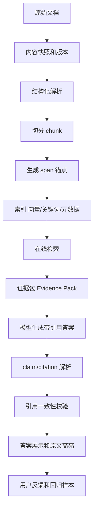

# RAG 回答如何保留引用链

## 问题背景

RAG 最常被介绍成“先检索，再生成”，但上线后真正让用户信任的往往不是生成能力，而是引用链。用户问一个问题，系统给出一段自然语言回答，如果回答里没有来源，用户很难判断它是来自公司文档、个人笔记、模型常识，还是模型临时补出来的推断。对于技术选型、事故复盘、法律条款、医疗资料、财务分析、内部政策这类场景，没有引用的流畅回答反而危险，因为它看起来很确定，却无法被检查。

很多团队在第一版 RAG 里会给答案末尾加几个文档链接，认为这就是引用。实际使用时很快会发现问题：链接指向整篇文档，用户打开后找不到支撑句；答案里的多个结论共用同一个引用，无法判断哪句话来自哪里；被引用文档后来更新，答案回放时已经不是当时那段内容；引用的是摘要而不是原文，用户无法确认摘要是否忠实；模型把两个来源拼成一句结论，却只标了其中一个来源。这些问题都会削弱 RAG 的可验证性。

引用链的目标不是装饰答案，而是建立一条从回答句到原始证据的可追踪路径。理想情况下，答案中的每个关键 claim 都能映射到一个或多个 evidence span；每个 evidence span 都有稳定 source id、文档版本、标题路径、字符偏移或段落锚点；用户点击引用能看到原文高亮；系统回放历史回答时能取到当时的证据版本；评测任务能检查答案是否真的被引用支撑。做到这一步，RAG 才不只是“会说”，而是“说了能查”。

引用链还改变工程团队排查问题的方式。没有引用时，用户说“答案不对”，工程师只能看最终 prompt 和模型输出，猜测检索是否错了。带引用后，可以把错误拆得更细：引用没命中、引用支持不了 claim、引用过期、引用无权限、claim 混合了多个来源、模型漏标引用、引用 UI 展示不清。每一种错误对应不同修复路径。引用链是产品信任机制，也是调试接口。

我更倾向于从第一天就把引用当成数据模型，而不是等 RAG 能回答以后再补。因为引用会反向影响切分、索引、上下文组装和生成提示。如果 chunk 没有稳定锚点，引用就会漂；如果上下文没有 citation id，模型就很难标；如果答案没有 claim 结构，后处理就难以校验；如果文档更新没有版本，历史引用就无法回放。引用不是最后一层 UI，它贯穿整个 RAG 链路。

## 核心概念

引用链至少包含六个核心概念：source、version、chunk、span、claim 和 citation。source 是知识来源，可以是一篇 Markdown、一页网页、一份 PDF、一条工单或一个数据库记录。version 是来源在某个时间点的内容快照。chunk 是索引和检索的片段。span 是 chunk 里真正支撑某个事实的最小文本范围。claim 是答案中的可判断陈述。citation 是 claim 与 span 之间的连接。

| 概念 | 责任 | 常见字段 | 常见错误 |
| --- | --- | --- | --- |
| Source | 标识原始来源 | source_id、path、url、owner、visibility | 文件移动后身份丢失 |
| Version | 固定历史内容 | version_id、content_hash、created_at | 文档更新导致引用漂移 |
| Chunk | 检索窗口 | chunk_id、heading_path、text、token_count | 太大导致引用不精确 |
| Span | 最小证据范围 | start_offset、end_offset、quote_hash | OCR 或重排后偏移失效 |
| Claim | 答案里的事实句 | claim_id、text、answer_offset | 一个句子混合多个事实 |
| Citation | 连接 claim 和证据 | claim_id、span_id、support_type | 引用不支持结论 |

claim 是很多系统缺失的对象。答案不是一个不可分割的字符串，它由多个陈述组成。比如“迁移后首字延迟上升，主要原因是缓存命中率下降，团队在 5 月 12 日通过预热任务缓解了问题。”这句话至少有三个 claim：首字延迟上升、原因是缓存命中率下降、5 月 12 日通过预热任务缓解。每个 claim 需要的证据可能不同。如果只在句尾放一个引用，用户无法知道这个引用支撑了哪一部分。

span 也很重要。chunk 是为了检索，span 是为了证明。一个 800 token 的 chunk 可能包含背景、决策、例外、待办和引用链接，真正支撑 claim 的只有其中两句话。引用 UI 应该尽量高亮 span，而不是只打开 chunk。工程上可以先用 chunk 级引用启动，但数据模型里要预留 span，因为后续提高可信度一定会走向更细粒度。

support_type 用来表达引用和 claim 的关系。不是所有引用都同等支撑。有些 span 直接说明 claim，可以标为 direct；有些 span 提供背景，可以标为 background；有些 span 与另一个来源共同支撑，需要 combined；有些 span 表示冲突或反例，可以标为 contradicts。把这些关系记录下来，答案就能更诚实地表达“根据 A 和 B 可以推断”“C 中存在相反说法”“这里只找到背景证据，没有直接证据”。

引用链还需要时间语义。文档会变，政策会废弃，事故会关闭，指标会更新。一个引用在 2026 年 5 月 15 日有效，不代表 2026 年 8 月仍然有效。source version 和 citation created_at 必须保存。回答历史如果需要审计，就应该回放当时的证据版本；新提问则应优先使用当前版本。不要让历史答案引用一个已经被改写的段落，那会让审计变得混乱。

## 架构/流程图解说明

带引用链的 RAG 架构，需要在离线索引和在线生成之间传递 citation-aware context。离线阶段负责给来源、版本、chunk、span 建稳定身份；在线阶段负责把候选证据包装成带 citation id 的上下文；生成阶段要求模型在 claim 后标注引用；校验阶段检查引用是否支持 claim；展示阶段让用户能回跳原文。



Evidence Pack 是这条链路里的关键中间格式。它不是简单把 chunk 文本拼进 prompt，而是给每段证据分配稳定引用编号，携带来源标题、时间、状态、可见性和高亮范围。模型在生成时只能引用 Evidence Pack 中提供的编号。这样可以降低模型编造引用的概率，也方便后处理检查引用编号是否存在。

一个 Evidence Pack 可以长这样：

```text
[E1]
source: 事故复盘/2026-05-12-search-latency.md
version: 7f3a91
heading: Root Cause > Cache
date: 2026-05-12
span: 缓存键在结算服务迁移后发生变化，导致客服知识库检索缓存命中率从 91% 降至 63%。

[E2]
source: ADR/2026-05-billing-migration.md
version: a18c20
heading: Decision
date: 2026-05-08
span: 迁移方案保留旧接口兼容层，但缓存预热任务延后到第二阶段。
```

生成提示不应该只说“请给出引用”，而要明确规则：每个事实性 claim 必须带引用；没有证据不要回答；不要引用没有出现在证据包里的编号；如果多个证据共同支撑一个 claim，要同时标注；如果证据互相冲突，要说明冲突。模型仍然可能漏标或错标，所以后处理不能省。

后处理阶段可以先做形式校验：引用编号是否存在，引用是否在允许范围内，同一段答案是否存在没有引用的事实句。再做语义校验：claim 与引用 span 是否一致。这一步可以用轻量 NLI 模型、LLM judge 或规则组合。比如 claim 里出现了数字、日期、服务名、负责人，引用 span 里完全没有对应信息，就应该标记为 weak citation。高风险场景下，weak citation 不能直接上线，需要降级或要求模型重写。

展示阶段同样重要。用户点击引用时，应该看到原文高亮、所在标题、文档时间和状态。如果引用来自过期资料，要显示状态；如果答案用了多个来源共同推断，要把多个来源都展示。引用 UI 不是越多越好，而是要让用户快速判断“这句话是否被这段原文支撑”。过多无关引用会让用户失去检查意愿。

## 工程实现

引用链实现的第一步是 source identity。文件路径不能单独作为 source id，因为文件会移动，标题会修改，网页 URL 会重定向。可以为每个进入知识库的来源生成稳定 source_id，并保存 path、url、title、created_at、content_hash、current_version。文件移动只更新 path，不改变 source_id。对网页和 PDF，最好保存快照或抽取后的纯文本版本，否则引用会依赖外部页面的未来状态。

第二步是版本化。每次 source 内容发生实质变化，生成新的 version_id。version_id 可以来自内容 hash，也可以是递增版本。chunk 和 span 都属于某个 version。线上回答保存 citation 时，要记录 version_id，而不是只记录 source_id。这样历史答案可以回到当时文本。当前查询则可以根据 source_id 找最新 version，并按文档状态决定是否使用旧版本。

第三步是稳定锚点。Markdown 可以用 heading path、block index、content hash 和字符偏移组合。PDF 可以用 page number、text block id、OCR hash 和偏移。网页快照可以用 DOM path、文本 hash 和偏移。没有任何锚点是永久完美的，所以系统要保存多种定位信息。首选精确 offset，失效时用 quote_hash 重新定位，再失效时退回 chunk。

```go
type CitationSpan struct {
    SpanID       string
    SourceID     string
    VersionID    string
    ChunkID      string
    HeadingPath  []string
    StartOffset  int
    EndOffset    int
    QuoteHash    string
    QuotePreview string
    Status       string
}

type AnswerClaim struct {
    ClaimID      string
    Text         string
    AnswerStart  int
    AnswerEnd    int
    CitationIDs  []string
    SupportState string // supported, weak, contradicted, missing
}
```

第四步是上下文格式。不要把原文直接拼成一大段，让模型自己猜引用。每个证据块应该有短编号，例如 E1、E2、E3。编号在一次回答中唯一，不需要全局唯一。上下文里要明确写出来源标题和日期，但不要塞太多元数据，避免浪费 token。证据块的顺序也有讲究：先放最直接证据，再放背景证据；同一来源的片段可以合并展示，但引用编号仍然独立。

第五步是答案格式约束。可以要求模型输出 Markdown，并在每个关键句末尾使用 `[E1]` 这样的引用；也可以要求输出 JSON，包含 claims 数组和 final_answer。JSON 更容易校验，但对用户展示不够自然；Markdown 更易读，但解析复杂。一个折中方案是让模型先输出结构化 claims，再由服务端渲染成 Markdown。高风险场景建议走结构化，普通知识库可以先用 Markdown 加解析器。

第六步是引用校验。校验不应该只靠模型自觉。可以做三层检查：格式层、词项层、语义层。格式层检查引用编号是否存在。词项层检查数字、日期、实体名是否能在引用 span 或相邻上下文中找到。语义层用 judge 判断 claim 是否被引用支持。任何一层失败，都可以触发重写：把 weak claim 和对应证据发给模型，要求它删掉、改弱或补充引用。

一个具体例子：用户问“为什么客服知识库在结算迁移后变慢？”模型初稿写道：“主要原因是缓存预热任务没有及时执行，导致缓存命中率下降到 63% [E1]。”格式层通过，词项层检查到“63%”在 E1 里，“缓存预热任务”却只在 E2 里出现。语义层判断 E1 只能支撑命中率下降，不能单独支撑预热任务原因。系统可以要求模型改写为：“迁移后缓存键变化使命中率降到 63% [E1]；另一个相关因素是预热任务被安排到第二阶段 [E2]。”这样 claim 和引用关系更清楚。

第七步是引用反馈。用户看到答案后，可能发现某个引用不支持结论。反馈系统不应只保存差评，而要保存 claim_id、citation_id、原因和用户建议。如果多次出现同一 source 的引用错误，可能是切分太大、OCR 质量差或摘要污染。如果某类 claim 经常缺引用，可能是提示词或后处理需要调整。引用反馈是 RAG 质量迭代的高价值数据。

## 引用粒度和产品体验

引用越细，验证越准，但成本越高。全文档级引用最便宜，却几乎没有验证价值；chunk 级引用容易实现，适合第一版；句子或 span 级引用更精确，但需要稳定偏移和更复杂 UI；claim 级引用最可靠，因为它把答案陈述和证据明确绑定。工程上可以分阶段做：第一版必须做到 chunk 级引用，第二版增加 span 高亮，第三版再做 claim 级校验和反馈闭环。

产品体验上，要避免“引用噪声”。有些系统每句话后面塞五个引用，看起来严谨，实际用户无法阅读。更好的方式是关键 claim 带引用，背景性过渡句不强制引用；多个连续句子共用同一证据时，可以合并展示；答案末尾提供“证据列表”，用户展开后看到完整来源。对技术用户，可以展示 trace；对普通用户，默认只展示干净引用。

引用还要表达不确定性。不是所有问题都有明确证据。系统可以说：“我找到了两个相关来源，但没有直接证据说明 A 导致 B。”这句话本身也应该引用相关来源，并明确它们只是背景。很多 RAG 幻觉来自不愿承认缺证据。引用链设计得好，反而能让拒答更自然：不是“我不知道”，而是“当前知识库里没有找到能直接支撑这个结论的材料”。

在团队知识库里，引用 UI 还要处理权限。用户可能有权看答案中某个公开结论，但无权看支撑它的敏感文档。这种情况不能展示隐藏引用，也不能让模型使用无权证据生成答案。更稳的策略是检索阶段就排除无权证据。如果某个结论只存在无权来源中，对当前用户就应该视为不可回答。不要把引用链做成权限绕过通道。

引用和摘要的关系也要说清楚。摘要可以被引用吗？可以，但要区分。机器生成摘要可以作为导航材料，帮助用户理解一组证据；但如果答案里的事实只由摘要支撑，而摘要没有原文引用，这条链是不完整的。高可信回答应该引用原始 source 或人工确认的笔记。自动摘要最好带自己的 citation map，说明每个摘要句来自哪些原文 span。

## 校验工作台和人工审核

引用链上线后，团队很快会遇到一个现实问题：自动校验能抓住一部分错误，但不能替代人工判断。尤其是原因分析、政策解释、技术取舍这类问题，claim 和 evidence 之间常常不是简单包含关系，而是需要理解上下文。一个实用做法是建设轻量校验工作台，把高风险或低置信回答送给人看，让审核结果反哺评测集和规则。

校验工作台不需要一开始很复杂。它至少展示四块信息：用户问题、最终答案、claim 列表、每个 claim 对应的引用证据。审核者可以逐条标记 supported、weak、wrong、missing、overstated。supported 表示引用直接支撑；weak 表示相关但不够；wrong 表示引用和结论相反或无关；missing 表示答案有事实但没有引用；overstated 表示证据只支持较弱说法，模型说得太满。这个分类比单纯“好/坏”更能指导修复。

| 审核标记 | 含义 | 常见修复 |
| --- | --- | --- |
| supported | claim 被引用直接支撑 | 保留样本作为正例 |
| weak | 引用相关但支撑不足 | 改写 claim 或补证据 |
| wrong | 引用不支持或相反 | 修复检索、删除 claim |
| missing | 事实句缺少引用 | 重新生成或要求拒答 |
| overstated | 证据较弱，措辞过强 | 降低确定性，增加限定 |

审核结果要能落回系统。若某个 claim 被标记 weak，系统可以保存 claim 文本、引用 span、问题类型、检索 trace 和正确处理建议。下次离线评测时，这个样本用于检查模型是否还会过度推断。若某个 source 经常出现 wrong citation，说明这篇文档的切分、OCR 或摘要可能有问题。若某类问题经常 missing citation，说明提示词或答案格式需要调整。人工审核不是独立流程，而是引用系统的质量数据入口。

高风险场景还可以设置发布门槛。比如内部政策问答、合规解释和事故结论，答案生成后先做自动校验；若所有关键 claim 都是 supported，直接返回；若出现 weak 或 missing，系统降级为“找到以下相关材料，但无法形成确定结论”；若出现 wrong 或 contradicted，则拒答并提示人工查看。这样引用链不仅用于展示，也参与生成控制。

另一个实用能力是证据对比。很多问题不是缺引用，而是引用之间冲突。工作台应该把同一 claim 的多个证据并排展示，显示来源时间、状态和版本。审核者可以标记哪个来源更新、哪个来源权威、哪个来源只是历史背景。系统随后把这个判断写成 source priority 或 conflict note。下一次回答类似问题时，模型不需要重新猜测哪个来源更可靠。

校验工作台也适合训练内容作者。作者看到自己的文档经常被引用错位，可能会发现标题太含糊、段落混合多个结论、表格缺少单位、日期没有写明。引用质量不是 RAG 工程单方面的事，文档写作方式会直接影响引用准确度。把引用错误展示给作者，往往能推动文档本身变得更清楚。

## 引用和文档写作规范

想让 RAG 保留可靠引用，文档本身要可引用。很多团队文档对人读勉强够，对机器引用很不友好：长段落里混合背景、结论、例外和待办；标题只写“方案一”“方案二”；表格没有单位；日期写“下周”；负责人写昵称；旧内容不标废弃。模型再强，也很难从这种材料里抽出稳定证据。

可引用文档有几个简单原则。第一，关键事实单独成句，不要把多个因果塞进一句。第二，标题要表达主题，不要只写“补充说明”。第三，列表项尽量保持同一语义层级。第四，时间、数字、状态和负责人写全。第五，废弃内容明确标记，不要只在段落末尾写一句“后来不用了”。第六，重要结论最好带来源或上下文。这样的写法对人也更友好，不只是为了机器。

在 Markdown 知识库里，可以约定几种块标记。例如 `Decision:` 表示已确认决策，`Evidence:` 表示原始证据，`Assumption:` 表示假设，`Open question:` 表示未决问题，`Deprecated:` 表示废弃内容。索引器读取这些标记后，可以给 span 不同可信度。模型回答时优先引用 Decision 和 Evidence，对 Assumption 使用更谨慎的措辞，对 Deprecated 只在历史问题中使用。

引用链最终会反向塑造写作习惯。过去写文档只考虑读者能否看懂，现在还要考虑未来系统能否准确引用。这个变化不是负担，而是让知识更可维护。一个能被准确引用的段落，通常也更清楚、更短、更少歧义。RAG 做得越深入，越会发现内容工程和检索工程是同一件事的两面。

## 测试评测

引用链的评测要比普通 RAG 更细。最终答案看起来对，不代表引用对。可以把评测拆成四层：引用存在率、引用有效率、引用支撑度和引用可用性。引用存在率看关键 claim 是否都有引用。引用有效率看引用编号是否能打开到正确来源版本。引用支撑度看引用文本是否真的支持 claim。引用可用性看用户点击后是否能快速定位证据。

| 指标 | 计算方式 | 合格信号 | 风险信号 |
| --- | --- | --- | --- |
| Claim Citation Coverage | 有引用 claim / 关键 claim | 大多数事实句有来源 | 结论句无引用 |
| Citation Link Validity | 可打开引用 / 全部引用 | source、version、offset 可用 | 文件移动后失效 |
| Support Precision | 支持 claim 的引用比例 | 引用和句子一一对应 | 引用只相关不支撑 |
| Quote Drift Rate | 文档更新后引用漂移比例 | 旧回答可回放 | 引用指向新内容 |
| User Verify Time | 用户定位证据所需时间 | 点击即高亮 | 打开整篇文档 |

评测集要人工标注 claim 和证据。可以从真实问答里挑 50 到 100 个问题，人工写出理想答案的关键 claim，并标注每个 claim 应该引用哪些 source span。每次改切分、重排、提示词、引用解析器或后处理，都跑这组样本。不要只让 LLM judge 判断答案是否好，因为 judge 也可能忽略引用错位。

负例特别重要。比如给模型一段相关但不直接支撑的证据，看它是否会过度引用；给两个冲突来源，看它是否会说明冲突；给一个没有证据的问题，看它是否拒答；给一个文档更新后的历史答案，看引用是否仍能回到旧版本。引用系统的价值在这些边界场景里最明显。

线上可以记录 citation_bad 事件：用户点击引用后马上返回并点“不支持结论”，或者用户手动标记引用错误。这些反馈要进入引用评测。还可以观察引用点击率，但点击率不是越高越好。对于简单问题，用户可能不点引用；对于高风险问题，引用点击率高反而说明用户在认真检查。指标要结合场景解释。

## 失败模式

第一种失败模式是引用到文档而不是证据。答案末尾列出三篇文档，用户打开后要自己搜索。这种引用只能说明“相关”，不能说明“支撑”。解决方式是至少做到 chunk 级引用，并在 UI 中高亮支撑文本。

第二种失败模式是模型编造引用编号。上下文里只有 E1 到 E5，答案里出现 E9，或者引用了没有提供给模型的文档名。这可以通过格式校验直接拦截。不要把模型输出的引用当成可信数据，必须服务端验证。

第三种失败模式是 claim 和引用错配。引用文本和 claim 主题相近，但不支持结论。比如引用说“缓存命中率下降”，claim 却说“根因是预热失败”。这种错配最隐蔽，因为答案看起来有引用。需要 claim 级校验和用户反馈来抓。

第四种失败模式是引用漂移。文档更新后，旧引用的 offset 指向了另一段文本，历史答案看起来仍有链接，但证据已经变了。解决方式是保存 version_id 和 quote_hash，历史答案回放旧版本，当前答案使用新版本。

第五种失败模式是引用自动摘要。系统引用的是 LLM 生成的社区摘要，而摘要本身没有原文链路。短期看答案很顺，长期会让错误被压缩和传播。摘要可以参与召回，但关键事实要落回原文或人工确认笔记。

第六种失败模式是引用过载。每个短句都带多个引用，用户读不下去，也不会检查。引用设计要围绕关键 claim，不要把所有相关材料都堆到答案里。证据列表可以完整，正文引用要克制。

第七种失败模式是权限引用泄漏。答案对用户可见，但引用指向用户无权访问的材料，或者模型基于无权材料生成了可见结论。权限过滤必须前置，引用展示也要二次校验。没有可见证据，就不要给当前用户输出强结论。

## 上线 checklist

- 每个 source 有稳定 source_id，文件移动、标题修改和 URL 重定向不会改变身份。
- 每次内容实质变化都会生成 version_id，历史回答保存引用时记录 source_id 和 version_id。
- chunk 至少有 heading_path、offset、content_hash 和 splitter_version，能支持回跳。
- 数据模型预留 span，即使第一版只展示 chunk，也不要把引用设计死在文档级。
- Evidence Pack 中的每段证据都有唯一编号，模型只能引用这些编号。
- 生成输出经过格式校验，引用编号不存在、越权或重复异常时会重写或降级。
- claim 和 citation 有结构化映射，关键事实句没有引用时会被标记。
- 引用支撑度有自动校验和人工反馈入口，citation_bad 能进入回归集。
- UI 点击引用能打开原文高亮，并展示标题、时间、状态和版本信息。
- 自动摘要不能单独支撑高置信事实，摘要引用必须能继续追到原文。
- 权限过滤在检索和证据包生成前完成，无权证据不能参与排序和生成。
- 文档删除或废弃后，历史引用仍可审计，当前回答会避开废弃来源。

## 总结

RAG 的引用链不是答案末尾的几个链接，而是一套从来源、版本、chunk、span、claim 到 citation 的数据契约。它让用户能检查模型说了什么，也让工程团队能定位错误发生在哪一层。没有引用链的 RAG 更像一个会搜索的聊天框；有引用链的 RAG 才开始具备知识系统的可信度。

工程实现上，最重要的是尽早把引用纳入架构：文档要版本化，切分要有稳定锚点，上下文要有证据编号，答案要有 claim 映射，后处理要校验支撑关系，UI 要能高亮原文。任何一层偷懒，最后都会表现为“答案看起来有引用，但用户仍然不信”。

好的引用链也会改变产品气质。它鼓励系统承认不确定，鼓励用户回到原文，鼓励团队把错误反馈沉淀为评测样本。RAG 的目标不是让模型显得无所不知，而是让它在已有知识范围内尽量诚实、可查、可修正。引用链就是这件事的工程基础。
