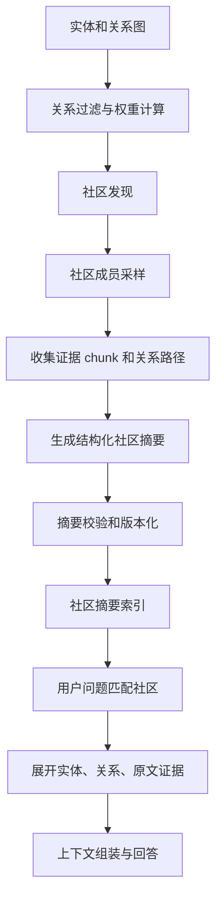

# 社区摘要在 GraphRAG 中的作用

## 问题背景

GraphRAG 里最容易被低估的组件是社区摘要。很多人理解图谱检索，会想到实体节点和关系路径：用户问到某个服务，就沿着依赖、负责人、决策文档扩展几跳。但真实问题常常不是从一个明确实体开始，而是从高层意图开始：“我们最近在本地优先方向上有哪些风险”“知识库发布链路为什么越来越复杂”“哪些工作同时影响了隐私、成本和浏览器自动化”。这些问题没有一个简单节点能直接承接。

向量检索面对这类全局问题时，会召回一些语义相近的段落，但很难覆盖所有相关材料。图谱路径检索如果没有种子实体，也不知道从哪里走。社区摘要提供的是第三种入口：先把图上密集连接的局部子图压缩成高层语义，让系统知道“这一片节点和边整体在讲什么”。用户的问题可以先匹配社区，再从社区展开到关键实体、关系和原文证据。

社区摘要不是普通文档摘要。普通摘要通常围绕一篇文档，目标是压缩文本。社区摘要围绕一组实体和关系，目标是压缩结构。它要说清楚这个社区的主题、核心对象、关键关系、时间范围、代表性证据、内部冲突和适合回答的问题。好的社区摘要像一张局部地图，帮助检索系统找到入口；坏的社区摘要像一段漂亮宣传语，会把模型带偏。

在工程上，社区摘要还能降低上下文成本。对于一个包含几百个 chunk、几十个实体的主题，在线回答不可能把所有材料都塞给模型。社区摘要先给模型一个全局轮廓，再按问题展开少量关键证据。这种“先地图，后证据”的方式，尤其适合架构决策、事故复盘、产品路线和团队知识库。它不是替代原文，而是把原文组织得更容易被召回和解释。

## 核心概念

社区是图中的一组密集连接节点。它可能对应一个项目、模块、议题、客户场景、事故簇或一段时间内的工作流。社区发现算法可以用 Leiden、Louvain、标签传播，也可以用业务规则先分组。GraphRAG 早期不必迷信复杂算法，很多时候“文档来源 + 实体类型 + 关系强度 + 时间窗口”的混合规则，比黑箱社区发现更容易解释。

社区摘要要分层。底层摘要描述小社区，例如某个服务迁移、某次事故、某个功能迭代。上层摘要描述多个小社区之间的共同主题，例如“本地优先架构”“RAG 质量评测”“Agent 工具权限”。分层摘要能支持不同粒度的问题：用户问具体事故时进入底层，问季度方向时进入上层。没有层次，社区摘要会要么太碎，要么太泛。

摘要内容应结构化，而不是自由散文。我会要求每个社区摘要包含这些字段：title、scope、core_entities、key_relations、timeline、representative_sources、known_conflicts、open_questions、retrieval_hints。自由文本可以有，但结构字段更适合检索和评测。比如 retrieval_hints 可以告诉系统“这个社区适合回答影响范围、历史原因和上线风险，不适合回答 API 参数细节”。

| 字段 | 作用 | 示例 |
| --- | --- | --- |
| scope | 说明社区边界 | 本地 RAG 权限与浏览器自动化 |
| core_entities | 给检索种子 | 本地知识库、权限过滤、浏览器 Agent |
| key_relations | 压缩关系模式 | 权限过滤约束工具调用 |
| timeline | 保留时间语境 | 2026 年 5 月前后形成 |
| representative_sources | 回到证据 | ADR、复盘、实现说明 |
| known_conflicts | 防止过度确定 | 旧方案与新方案并存 |
| retrieval_hints | 指导在线召回 | 适合风险分析和影响分析 |

社区摘要的可信度来自可追溯。摘要中的每个关键点，都应该能回到成员实体、关系和原文 chunk。摘要本身可以由模型生成，但不能成为唯一证据。在线回答时，摘要用于定位和组织上下文，最终事实仍然要引用原文。这个原则能防止“摘要幻觉”被多次复用后变成系统事实。

## 架构/流程图解说明

社区摘要的构建一般在图谱基本稳定之后运行。先根据实体和关系生成社区，再为每个社区收集代表性材料，生成结构化摘要，最后把摘要写回索引，供在线检索使用。下面的流程图把社区摘要放在离线和在线之间：它既是离线产物，也是在线召回入口。



关系过滤很关键。不是所有边都适合参与社区发现。`mentions` 这种弱关系容易制造噪声，`depends_on`、`owned_by`、`decided_in`、`affected_by` 这类强关系更能表达真实结构。可以给不同关系类型设置权重，也可以按时间衰减。比如一年以前的讨论关系权重降低，但正式决策和事故关系保留。

成员采样决定摘要质量。社区里可能有上百个节点，不能全部塞给模型。采样时应优先核心节点、高权重关系、代表性文档、最新变化和冲突材料。只采样最中心节点会让摘要忽略边缘风险；只采样最新文档会丢掉历史原因。比较稳的是组合采样：中心性 top-k、时间最近 top-k、关系类型覆盖、人工标记重要来源。

在线阶段，社区摘要可以作为向量索引和图索引的桥。用户问题先和社区摘要做语义匹配，找到候选社区；再在候选社区内部做实体匹配和路径扩展；最后从代表性来源和关键关系里选 evidence。这样即使用户没有说出准确实体名，系统也能通过社区主题进入正确知识区域。

## 工程实现

实现社区摘要前，先确保图谱有基本质量。实体大量重复、关系没有证据、弱关系泛滥时，社区发现会把噪声聚成噪声。早期可以只对高置信实体和强关系做社区摘要，不要急着覆盖全部知识。每个 community 记录 community_id、level、algorithm、member_entity_ids、member_relation_ids、created_at、graph_version、summary_version。

社区发现算法可以先从规则版本开始。比如按 category、source、项目标签、文档目录和强关系连通分量形成初始社区，再对过大的社区按关系密度拆分，对过小的社区合并到父主题。算法复杂度不是重点，可解释性和可回放更重要。等数据规模上来，再引入 Leiden 这类算法，并把参数写入版本。

摘要生成 prompt 要明确要求“不知道就写未知，不要补全”。输入给模型的不是全部原文，而是结构化材料：社区成员列表、关键关系路径、代表性 chunk、时间分布、冲突候选。输出要求 JSON 加一段自然语言摘要。结构字段用于检索和 UI，自然语言用于模型理解。摘要里的每个 claim 最好关联 source_ids。

```json
{
  "title": "本地 RAG 权限与工具调用边界",
  "scope": "围绕本地知识库、权限过滤和浏览器自动化形成的工程主题",
  "core_entities": ["local-rag", "permission-filter", "browser-agent"],
  "key_claims": [
    {
      "text": "浏览器自动化必须使用权限过滤后的知识上下文",
      "source_ids": ["chunk-privacy-012", "rel-8842"]
    }
  ],
  "known_conflicts": ["旧文档允许全量本地文件检索，新设计要求按 workspace 过滤"],
  "retrieval_hints": ["risk_analysis", "tool_boundary", "privacy_review"]
}
```

版本化不能省。社区成员变化、关系权重变化、摘要模型变化、prompt 变化都会影响摘要。community_summary 表应保存 graph_version、prompt_version、model、input_hash、output_hash、status。底层成员变化超过阈值时摘要失效；核心关系被删除时摘要必须重建；只有边缘成员变化时可以延迟刷新。这样能控制成本，也能解释线上答案为什么变化。

社区摘要还可以做成调试界面。点开一个社区，能看到标题、摘要、核心实体、关系路径、代表性来源、最近变化、已知冲突和适合问题。这个界面对工程和内容运营都重要：工程师可以发现图谱噪声，内容作者可以补文档，产品同学可以理解系统为什么把某些材料放在一起。

## 实战补充：社区摘要如何进入线上链路

社区摘要上线时，最好先把它当成召回入口，而不是答案材料。一次用户查询进来后，系统可以并行做三件事：用原问题检索 chunk，用实体识别找 canonical entity，用问题 embedding 匹配 community summary。三路召回合并后，社区摘要只负责告诉系统“可能在哪一片知识区域”，随后还要展开社区里的核心实体、强关系和代表性 chunk。这样即使摘要文字不完美，也不会直接变成事实来源。

社区匹配要有阈值和退路。全局问题可以给社区摘要更高权重，例如“本地优先方向有哪些风险”；具体事实问题则降低社区权重，例如“某个接口参数叫什么”。如果社区匹配分数低，系统应该回到普通向量和实体检索，不要强行选一个社区。很多误答来自“总要匹配一个主题”的冲动，结果用户问具体 API，系统却进入一个宽泛架构社区。

上下文组装时，我会把社区摘要放在最前面，但只放简短结构化版本：范围、核心实体、已知冲突和检索提示。接着放从社区展开得到的原文证据。这样模型先获得地图，再看到材料。社区摘要里的 key claim 如果没有对应 source_ids，就不能作为最终答案依据。生成提示也要明确：摘要用于定位，不足以支持事实断言；事实句必须来自后面的 evidence。

有一次线上问题很典型。用户问“哪些工作同时影响隐私和浏览器自动化”，系统召回了“本地 RAG 权限边界”社区，摘要说这个社区包含权限过滤、浏览器 Agent、工作区隔离。第一版回答直接复述摘要，没有列出具体工作项。后来我们改成社区展开：先在社区内按 `constrains`、`uses`、`validated_by` 查强关系，再按代表性来源拉取 ADR、测试记录和事故复盘。回答从一句泛泛风险总结，变成了三项具体工作，每项都有原文引用和状态。

社区摘要还需要运营机制。内容团队新增一批文档后，不一定要立刻重建全部摘要，但要能看到哪些社区受影响。可以把影响分成三档：核心成员变化、强关系变化、边缘来源变化。核心成员变化立即重建；强关系变化进入高优先级队列；边缘来源变化可以批量夜间刷新。这样成本可控，摘要也不会长期陈旧。

从 Go 服务角度看，社区摘要适合做成独立索引表和缓存层。在线请求只读取 active summary，后台任务负责生成 candidate summary、校验 source_ids、运行小评测，再把状态切成 active。不要让在线请求触发长时间摘要生成，否则延迟和失败模式都会变复杂。trace 里要记录命中的 community_id、summary_version、展开的实体和最终使用的 chunk，方便判断一次回答到底依赖了哪层信息。

## 实战补充：摘要质量的人工评审

社区摘要的人工评审不能只问“写得好不好”。更实用的评审表应包含四个问题。第一，这个社区边界是否清楚，标题能否让人预期里面有哪些实体。第二，摘要有没有保留限制条件和冲突，例如旧方案、新方案、未决事项、只适用某个时间段。第三，key claim 是否都有可打开的来源。第四，retrieval_hints 是否真的对应用户会问的问题。

评审时可以让 reviewer 带着问题看摘要，而不是单独读摘要。给每个社区准备三类问题：它应该能回答的问题、它不该回答的问题、需要展开证据才能回答的问题。一个摘要如果对第一类问题没有入口，说明主题没写清；如果会吸走第二类问题，说明边界太宽；如果让模型直接回答第三类问题，说明摘要过度断言。这个评审方法比打一个主观分更容易指导修改。

还要抽查负面样本。比如一个社区标题含有“权限”，系统是否把所有含“权限”的文档都吸进来；一个社区含“评测”，是否混合了模型评测、检索评测和上线验收。负面样本能暴露 retrieval_hints 写得太泛的问题。社区摘要不是标签系统，不能只靠关键词扩展，它必须和图上的实体、关系、时间和证据共同决定边界。

评审结果要回写到社区层。审核者可以固定某些成员必须属于社区，也可以标记某些实体不应进入社区，还可以要求摘要下次生成时必须包含某个冲突或来源。人工判断如果只改当前文本，下一次重建又会丢失。把这些判断存成 community constraints，摘要系统才会越用越稳定。

社区摘要还适合做发布前验收。一次图谱重建完成后，先抽取高流量社区和最近变化社区，让 reviewer 看摘要标题、核心实体和冲突字段是否仍然准确。只有这些社区通过后，再放量到线上检索。这个流程比等用户反馈更主动，尤其适合权限、成本、事故和路线图这类高影响主题。

验收记录也应进入回归样本，避免同类边界反复漂移。

## 测试评测

社区摘要的评测要看它是否改善复杂问题，而不是看摘要文字是否优美。第一类评测是社区匹配：给定一个全局问题，系统是否能召回正确社区。第二类是证据展开：召回社区后，是否能找到回答所需实体、关系和 chunk。第三类是摘要忠实度：摘要里的 claim 是否有来源，是否遗漏关键冲突。第四类是成本收益：使用社区摘要后，上下文 token 是否下降，答案质量是否提升。

评测样本应包含无明确实体的问题。比如“最近哪些 RAG 改动会影响上线风险”“本地优先策略和 MCP 工具权限有什么共同边界”“知识库文章生成链路里最容易失效的环节是什么”。这些问题如果只靠实体匹配，可能没有入口；如果社区摘要做得好，系统会先定位到“RAG 生产检查”“权限边界”“静态知识库发布”这类主题。

| 评测项 | 目标 | 检查方法 | 风险信号 |
| --- | --- | --- | --- |
| 社区召回 | 找到正确主题 | 标注问题到社区 | 问题只能靠关键词命中 |
| 展开质量 | 找到关键证据 | 社区内路径和 chunk 命中 | 摘要命中但证据缺失 |
| 忠实度 | 摘要不编造 | claim 到 source_ids 校验 | 摘要没有来源 |
| 冲突保留 | 不掩盖分歧 | 人工检查 known_conflicts | 摘要过度统一口径 |
| 成本收益 | 降低上下文成本 | token 与质量对比 | 摘要增加噪声 |

自动评测可以先做引用覆盖。摘要中的 key_claims 必须带 source_ids，source_ids 必须有效，引用文本必须能支持 claim。再做社区稳定性评估：同一图版本多次生成摘要，标题和核心实体不应大幅漂移；图变化很小时，社区边界不应频繁抖动。社区抖动会导致线上回答不稳定，也会让缓存失效。

人工评审重点看“摘要有没有保留边界”。好的社区摘要会明确哪些问题它能回答，哪些问题不能回答；会记录时间范围和冲突；会指出代表性来源而不是泛泛总结。评审时可以让审核者回答三个问题：这个社区标题是否准确？摘要是否遗漏关键风险？如果用户只看这段摘要，会不会误解系统事实？

## 失败模式

第一个失败模式是摘要替代证据。上线后为了省 token，只把社区摘要塞给模型，不再展开原文 chunk。这样答案会变快，但可信度下降。社区摘要只能作为地图和压缩层，关键事实仍然要从原文证据里来。没有证据展开的摘要回答，应该标为低置信或只用于探索。

第二个失败模式是社区过大。一个大社区里有太多项目和议题，摘要只能写成“本社区涉及 RAG、评测、权限、成本等多个方面”，这对检索没有帮助。社区过大时要按时间、关系类型或子主题拆分。摘要标题如果出现“多个方面”“相关内容”“综合讨论”这类泛词，通常说明社区边界不清。

第三个失败模式是社区过碎。每篇文档都形成一个社区，摘要就退化成文档摘要，无法支持全局问题。过碎通常来自关系太少、实体消歧差或关系权重太低。解决方式不是强行合并摘要，而是回到实体和关系层，补充关键连接。

第四个失败模式是忽略冲突。社区摘要生成器喜欢把材料说成一致结论，但真实知识库里常有旧方案、新方案、争议和未决事项。如果摘要不保留 known_conflicts，模型回答时会过度确定。尤其是架构演进、策略变更、事故根因这类主题，冲突字段非常重要。

第五个失败模式是版本失效。底层文档更新后，旧社区摘要仍然被在线召回。用户问最新情况，模型却基于旧摘要回答。社区摘要必须绑定 graph_version 和成员 hash；检索时如果摘要 stale，要么触发重建，要么降低权重并提示使用原文。

## 上线 checklist

- 社区发现只使用经过过滤的高置信实体和关系，弱关系不等权参与。
- community 记录算法、参数、graph_version、成员集合和层级关系。
- 摘要输出包含 scope、core_entities、key_relations、timeline、sources、conflicts 和 retrieval_hints。
- 摘要中的关键 claim 能回到 source_ids，在线回答关键事实仍引用原文 chunk。
- 社区过大和过小都有检测规则，支持拆分、合并和人工固定边界。
- 社区摘要有 prompt_version、model、input_hash、summary_version 和 stale 状态。
- 用户问题匹配社区后，还要展开实体、关系和证据，不把摘要当最终上下文。
- 评测覆盖无明确实体的全局问题、冲突问题、时间敏感问题和成本对比。
- 调试界面能查看社区成员、关系路径、代表性来源、最近变化和摘要版本。
- 底层图谱重大更新后，受影响社区摘要进入重建队列，并在 trace 中可见。

## 总结

社区摘要是 GraphRAG 处理复杂问题的导航层。实体和关系让系统知道局部事实，社区摘要让系统知道一片事实共同构成什么主题。它能帮助无明确实体的问题找到入口，也能用高层语义降低上下文成本。但它必须保持工程纪律：可追溯、可版本化、可评测、可失效。

把社区摘要做好，不是让模型写更漂亮的总结，而是让知识图谱多一层可操作的索引。先过滤可靠关系，再形成可解释社区；先生成结构化摘要，再把关键 claim 绑定证据；先用评测证明它改善全局问题，再扩大覆盖范围。GraphRAG 的复杂能力往往不是来自某个神奇 prompt，而是来自这些中间层把知识组织得足够清楚。
