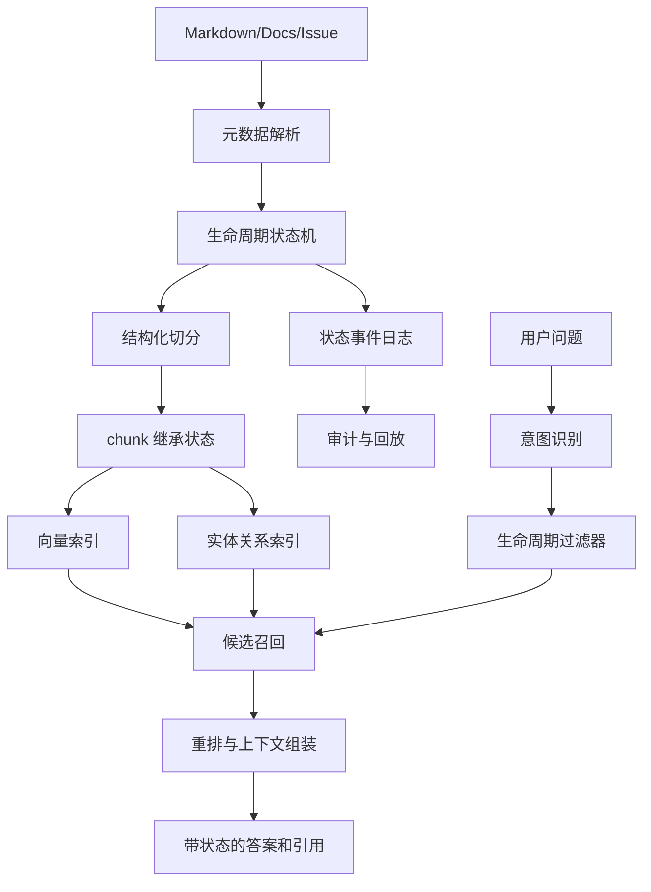

# 文档生命周期治理

## 问题背景

很多团队做知识库时，第一步会把所有文档统一丢进索引：草稿、设计评审、线上事故复盘、会议纪要、旧方案、废弃 API 说明，都按同一种方式切分、向量化、召回、引用。系统很快能回答问题，但回答质量会出现一种隐蔽的退化：它不是完全胡说，而是把不同阶段的知识混在一起。用户问“当前支付回调的重试策略是什么”，模型可能引用三个月前的草案；用户问“为什么现在禁用某个模型供应商”，系统可能找到已经归档的评估记录；用户问“这个接口还能不能用”，答案同时给出旧参数和新参数。

这类问题不能只靠更好的 embedding 或更强的模型解决。根因是知识系统没有把“文档处于什么状态”当成一等公民。人读文档时会自然判断：这是草稿还是已采纳决策，是当前事实还是历史背景，是被废弃还是只是过期未维护。RAG 系统如果没有这层状态，所有文本在检索阶段就被压平成相似片段，模型只能在上下文里猜哪个更可信。猜对了是运气，猜错了会在工程决策里制造很具体的损失。

文档生命周期治理要解决的是：一篇文档从创建、评审、发布、维护、废弃到归档，每个状态如何影响索引、召回、排序、引用、评测和审计。它不是内容管理系统的装饰字段，而是 RAG 系统的检索约束。文档状态应该进入 chunk 元数据、实体关系、社区摘要、重排特征和答案引用。只有这样，系统才能在回答时区分“当前可执行事实”“历史决策依据”“待评审建议”和“不应再用于操作的旧信息”。

这里还牵涉团队协作。内容作者常常认为写完文档就结束了，平台工程认为索引任务只要定时跑，模型工程认为回答错了就调 prompt。但实际闭环是：作者要声明状态和 owner，索引层要按状态做差异处理，检索层要尊重生命周期，回答层要展示状态，评测层要覆盖过期和冲突样本。文档生命周期不是文档库自己的事情，而是整个知识系统的可信边界。

## 核心概念

我会把文档生命周期拆成六个基础状态：draft、reviewing、active、stale、deprecated、archived。draft 是未完成材料，可以被作者自己搜索，但不应该默认进入团队问答；reviewing 是等待评审的候选事实，可以用于“有什么方案”类问题，但不能作为当前规则；active 是当前有效事实，应该是默认召回的主来源；stale 是超过维护窗口、未确认仍有效的材料，召回时需要降权和提示；deprecated 是明确被替代的材料，适合回答历史原因，不适合指导当前操作；archived 是保留审计和背景价值的旧材料，默认只在用户明确要求历史上下文时出现。

这些状态不能只写在人类可读的标题里，例如“已废弃”“草案 v2”。它们必须成为结构化元数据，并且要有转换规则。文档从 draft 到 active 需要评审记录；active 到 stale 可以由时间策略触发；stale 回到 active 需要 owner 确认；active 到 deprecated 需要 replacement 或 reason；deprecated 到 archived 可以由保留期触发。生命周期的价值在于约束行为，而不是给文档贴漂亮标签。

| 状态 | 默认检索行为 | 允许回答的问题 | 必要元数据 | 风险 |
| --- | --- | --- | --- | --- |
| draft | 仅作者或小范围可见 | 方案探索、个人草稿搜索 | owner、created_at、visibility | 未评审内容被当成事实 |
| reviewing | 可召回但低权重 | 评审进展、候选方案对比 | reviewers、review_due、proposal_id | 方案被误认为已生效 |
| active | 默认高权重 | 当前规则、接口、架构事实 | owner、valid_from、reviewed_at | 过期后仍高权重 |
| stale | 降权并提示 | 需要确认的旧材料 | stale_reason、last_verified_at | 被模型忽略状态说明 |
| deprecated | 仅历史和迁移问题 | 为什么替换、旧系统兼容 | replacement、deprecated_at | 旧流程误导操作 |
| archived | 默认不召回 | 审计、背景、时间线 | archive_reason、retention | 噪声污染当前问答 |

生命周期治理还需要区分文档状态和事实状态。一篇 active 文档里可能包含“历史上我们曾经使用方案 A”，这句话不是当前事实；一篇 deprecated 文档里也可能有仍然有效的背景解释。工程上不能只按整篇文档做绝对过滤，而要让 chunk、实体、关系也继承并可局部覆盖状态。最小粒度可以先做到 chunk 级：chunk_status 默认继承 document_status，但允许某些引用、表格行、决策块有自己的 valid_from、valid_to 和 replacement。

另外一个概念是“生命周期事件”。状态本身描述当前结果，事件描述为什么变化。比如文档从 active 变成 deprecated，事件应该记录操作者、时间、原因、替代文档、关联 issue 或 PR、影响范围。这些事件对 RAG 很重要，因为用户常问“为什么改”“什么时候改”“旧方案还能不能看”。没有事件日志，系统只能看到最终状态，无法解释状态变化背后的工程决策。

## 架构/流程图解说明

一套可落地的生命周期治理，可以放在文档摄取链路和在线检索链路中间。它不是单独的后台页面，而是影响每个检索阶段的控制面。下面的流程强调两条线：文档状态如何进入索引，用户问题如何使用状态约束。



离线链路第一步是解析 front matter、路径、提交信息、评审状态和人工维护字段。很多知识库一开始只相信文档里的 YAML，这是不够的。文档 owner 可能来自 CODEOWNERS，评审状态可能来自 PR，最后验证时间可能来自定时任务，归档原因可能来自 issue。生命周期控制面要把这些来源合并成一个规范化的 DocumentLifecycle 记录，并保存来源优先级。否则同一个字段在多处出现冲突时，索引会变得不可解释。

在线链路的关键是生命周期过滤器。用户问“现在应该怎么配置”，默认只允许 active，加少量近期 stale 并提示需要确认；用户问“这个策略怎么演变的”，则允许 active、deprecated、archived，但排序要按时间线组织；用户问“有哪些正在评审的方案”，reviewing 应该被提升；用户明确说“草稿里有没有提过”，才进入 draft 范围。检索系统要从问题意图推导状态集合，而不是把所有状态丢给模型。

答案展示也要带状态。引用旁边只显示文档标题是不够的，至少要展示状态、更新时间、owner、是否有替代文档。对于 stale 和 deprecated 来源，回答正文应该明确说“以下是历史资料”或“该材料已被某文档替代”。这不是啰嗦，而是把知识系统的不确定性公开给用户。工程系统越诚实，用户越能判断下一步该执行还是继续确认。

## 工程实现

数据模型可以从一个小表开始，不需要一上来做完整工作流平台。核心是把 document、chunk、lifecycle_event、replacement 四类对象建起来。document 保存当前状态，chunk 保存继承后的可检索状态，event 保存状态变化历史，replacement 保存替代关系。对于 Markdown 仓库，slug 或 path 可以做初始 stable id，但最好再加 content_root 和 logical_id，避免文件移动导致历史断开。

```go
type LifecycleStatus string

const (
    StatusDraft      LifecycleStatus = "draft"
    StatusReviewing  LifecycleStatus = "reviewing"
    StatusActive     LifecycleStatus = "active"
    StatusStale      LifecycleStatus = "stale"
    StatusDeprecated LifecycleStatus = "deprecated"
    StatusArchived   LifecycleStatus = "archived"
)

type DocumentLifecycle struct {
    DocumentID     string
    Path           string
    Status         LifecycleStatus
    Owner          string
    ValidFrom      time.Time
    LastVerifiedAt *time.Time
    ReviewDueAt    *time.Time
    ReplacementID  *string
    StatusReason   string
    SourceVersion  string
}

type LifecycleEvent struct {
    EventID     string
    DocumentID  string
    FromStatus  LifecycleStatus
    ToStatus    LifecycleStatus
    Actor       string
    Reason      string
    RelatedURL  string
    CreatedAt   time.Time
}
```

状态机要写成明确的 transition policy，而不是散落在后台按钮和脚本里。比如 draft 可以到 reviewing，reviewing 可以回到 draft 或到 active，active 可以到 stale 或 deprecated，stale 可以回到 active 或到 deprecated，deprecated 可以到 archived。任何状态都不应该无理由直接变 active。自动任务只能把 active 标成 stale，不能自动确认 active，因为“仍然有效”是业务判断。归档可以自动触发，但要遵守保留期和审计策略。

索引实现上，每个 chunk 都要带这些字段：document_status、chunk_status、valid_from、valid_to、owner、last_verified_at、replacement_id、lifecycle_version。重建索引时，生命周期变化不一定需要重新 embedding。文档内容没变、只是 active 变 deprecated，可以只更新元数据和图关系权重。这个细节能显著降低成本，也能减少索引抖动。向量库要支持 metadata update；如果不支持，就把生命周期过滤放在候选召回后的二级过滤，但要记录可能的召回浪费。

重排层需要把状态变成特征。一个简单版本可以这样打分：active 乘以 1.0，reviewing 乘以 0.55，stale 乘以 0.35，deprecated 在当前问题里乘以 0.15、在历史问题里乘以 0.8，archived 默认为 0。再叠加时间新鲜度、owner 可信度、来源类型和用户权限。注意这里的分数不是绝对真理，而是可调政策。关键是每次回答的 trace 要展示“某文档为何被过滤、为何被降权、为何仍然进入上下文”。

一个具体流程例子：团队有一篇《检索服务缓存策略 v1》是 active，后来新文档《检索服务缓存策略 v2》通过评审。发布 v2 时，系统创建一条事件：v1 从 active 到 deprecated，replacement 指向 v2；v2 从 reviewing 到 active，valid_from 是发布时间。索引任务不重算 v1 embedding，只更新 v1 的 metadata 和关系边权重。用户问“现在缓存 TTL 怎么配”，召回可能仍命中 v1，但生命周期过滤器会降权并优先使用 v2；如果用户问“为什么从 v1 迁到 v2”，系统会同时召回 v1、v2 和状态事件，并按时间线回答。

工程里还要处理局部失效。一篇 active 文档里，某个小节可能因为接口参数变更而过期，但其余内容仍然有效。如果只能整篇 deprecated，维护成本会很高。可以用 block-level override：在 Markdown 中为小节添加状态注释，或在外部维护 path plus heading anchor 的 override 表。chunk 生成时根据 heading_path 匹配 override。这样“认证流程”小节可以标 stale，而“错误码说明”仍然 active。局部状态要谨慎使用，数量多了会增加作者负担，适合高价值文档。

## 具体治理样例

假设一个团队用 `content/articles/` 管理 RAG 文章，用 `js/articles.js` 暴露站点元数据。文章发布流程里，Markdown 是内容源，JS 是页面索引，SVG 是标题图。没有生命周期治理时，只要 Markdown 存在，构建脚本就认为文章可发布；只要 JS 中有 metadata，页面就可能展示链接。后来团队希望支持草稿预览和归档历史文，于是引入 lifecycle 字段。

第一版不要改太多系统，只在内容元数据旁边维护一份 `lifecycle.yaml`。每条记录包含 slug、status、owner、valid_from、last_verified_at、replacement。构建站点时只展示 active 和 reviewing 中允许公开的文章；RAG 索引时默认只把 active 作为当前事实；归档页面可以展示 deprecated 和 archived。这样页面展示、搜索和问答使用同一份生命周期数据，避免“页面已经隐藏但问答还能引用”的分裂。

```yaml
document-lifecycle:
  status: active
  owner: astaxie
  valid_from: 2026-05-09
  last_verified_at: 2026-05-22
  replacement: null

old-rag-note:
  status: deprecated
  owner: astaxie
  valid_from: 2025-12-01
  deprecated_at: 2026-05-01
  replacement: graphrag-mental-model
  reason: "GraphRAG 系列文章已替代旧版检索说明"
```

在线回答里，用户问“RAG 文章发布要注意什么”，系统只把 active 文档作为主证据；如果 deprecated 文档被向量召回，会进入候选但被过滤，并在 trace 里记录。用户问“旧版 RAG 笔记和新版有什么差别”，意图识别把问题标成 history_compare，过滤器允许 deprecated，重排把 replacement 关系提升，最终上下文包含旧文、替代文和状态事件。这样的行为比简单按时间排序稳定，因为“新”不一定代表“当前有效”，而“旧”也不一定没有解释价值。

这个样例的重点是小步落地。不要等到所有文档都有完美元数据再上线生命周期治理。先给最容易出错的文档加状态：决策类、接口类、流程类、事故类。再让索引 trace 暴露状态使用情况，逐步找出哪些文档缺 owner、哪些 active 太久未验证、哪些 deprecated 没有 replacement。治理的第一目标不是字段完整，而是减少错误引用。

## 运维与协作机制

生命周期治理真正难的地方不是建字段，而是让状态在团队日常里持续正确。一个文档刚发布时通常有人关心，三个月后 owner 换项目、接口改了两轮、评审链接失效，状态就开始漂移。工程系统要承认维护会断档，所以需要把生命周期变成轻量运维机制，而不是依赖某个人定期翻文档。最小机制包括 owner 提醒、过期批处理、变更订阅、索引差异报告和失败样本回流。

owner 提醒要有节奏。不是所有 active 文档都每周提醒，那会制造噪声。可以按文档类型设置验证周期：接口和部署手册 30 到 60 天，架构原则 180 天，历史复盘只在引用异常时提醒。提醒内容也要具体：最近有多少次问答引用了这篇文档，是否出现了 stale 候选，是否有用户反馈引用不准，是否有替代文档缺失。这样的提醒才像工程信号，而不是行政任务。

索引差异报告也很有价值。每次生命周期批处理后，系统应该产出一份简短 diff：哪些文档从 active 变 stale，哪些 deprecated 文档仍被高频召回，哪些 active 文档没有 owner，哪些归档文档仍参与当前事实回答。RAG 工程师看这份报告，可以判断过滤策略是否太松；内容 owner 看这份报告，可以知道该补哪篇文档；产品负责人看这份报告，可以理解知识质量债务在哪里。

| 协作对象 | 关注点 | 系统应提供的信号 | 推荐动作 |
| --- | --- | --- | --- |
| 文档作者 | 内容是否仍有效 | 引用次数、反馈、过期提醒 | 更新、确认、废弃 |
| RAG 工程 | 状态是否影响检索 | 过滤比例、降权原因、trace | 调整策略和评测 |
| 平台工程 | 构建和索引是否一致 | 文档变更事件、索引版本 | 修复管线和缓存 |
| 管理者 | 知识债务 | 无 owner、长期 stale、冲突数 | 分配维护责任 |

状态变更最好绑定变更来源。比如一个接口 schema 改了，CI 可以自动发现相关文档引用了旧字段，并给 owner 发起验证任务；一个 ADR 被新 ADR 替代，发布流程可以要求填写 replacement；一个用户连续反馈某篇文档引用无效，系统可以把它从 active 候选降为 review_needed，而不是等人工发现。这样生命周期治理和研发流程结合起来，文档状态才不会变成孤立表格。

还要注意权限和责任的边界。不是每个人都应该把 active 文档标为 deprecated。状态变更需要权限模型：作者可以把 draft 提交 reviewing，owner 或 reviewer 可以激活，文档管理员可以归档，自动任务可以标记 stale。每次变更都要留下事件和理由。这样当系统回答因某次状态变化而不同，团队能追溯是谁、为什么、在什么上下文下做了这个决定。

最后，生命周期治理要有“低摩擦修复入口”。用户看到答案引用过期文档时，应该能直接点“这不是当前规则”，系统自动带上 query、引用、文档状态和候选 replacement，生成一条维护任务。维护任务解决后，相关评测样本也要更新。否则用户反馈只停留在聊天记录里，知识系统不会真的变好。

还有一个经常被低估的点是发布原子性。文档状态、站点索引、向量索引和图谱摘要不能各自异步到不可控。假设新文档已经 active，但向量索引还没完成，旧文档又被标 deprecated，用户在这段窗口里可能查不到当前事实。更稳的做法是引入发布批次：同一批次里先构建新索引，校验 replacement 和引用，再切换生命周期可见性。批次失败时保持旧状态，不让问答链路进入半更新状态。对小仓库可以用简单 manifest 记录批次号，对大系统则需要索引别名和蓝绿切换。生命周期治理最终要服务稳定发布，而不是只在内容表里更新字段。

## 测试评测

生命周期治理的评测要覆盖“该召回”和“不该召回”。很多 RAG 评测只问标准答案，结果 active 文档命中就算通过，但系统是否错误使用 deprecated 材料没有被发现。这里建议准备三类样本：当前事实问题、历史演变问题、状态边界问题。当前事实问题要求只引用 active 或允许的 stale；历史演变问题要求引用 deprecated 和 archived，但不能把它们说成现状；状态边界问题故意放入草稿、评审中方案、过期小节，检查系统是否正确提示不确定性。

| 评测项 | 示例问题 | 通过标准 | 主要观测 |
| --- | --- | --- | --- |
| 当前事实 | 现在缓存 TTL 是多少 | 引用 active 文档，排除 deprecated | lifecycle filter trace |
| 历史原因 | 为什么弃用 v1 策略 | 同时引用旧文、新文、事件 | replacement path |
| 草稿隔离 | 草稿方案能不能作为上线依据 | 明确拒绝或提示未评审 | visibility policy |
| stale 提醒 | 这份手册还有效吗 | 展示 last_verified_at 和 owner | freshness score |
| 局部失效 | 某小节参数是否仍可用 | 命中 chunk override | heading anchor |

自动化测试可以直接校验检索候选。给定 query 和用户权限，断言候选里不包含 draft，或 deprecated 的 rank 不高于 active replacement。答案评测则检查生成文本有没有把状态说清楚。比如上下文包含 stale 文档时，回答里应该出现“需要确认”“最后验证时间”或等价表达；上下文包含 deprecated 文档时，回答不能使用“当前应该”这类强操作语气。

还要做时间回放测试。知识系统今天的答案和三个月前的答案可能都正确，只是有效时间不同。如果业务需要审计，检索接口应该支持 as_of 参数：在某个时间点，哪些文档是 active，哪些 replacement 尚未生效。评测时用固定 as_of 回放旧问题，可以发现生命周期事件是否丢失、valid_from 是否错误、归档是否破坏历史引用。没有时间回放，文档治理很难服务合规和事故复盘。

线上观测建议至少记录四个指标：被生命周期过滤的候选比例、stale 来源进入最终上下文比例、deprecated 来源被用户点击比例、缺 owner 或缺 last_verified_at 的 active 文档数量。第一个指标太高说明索引里历史噪声太多；第二个太高说明维护不及时；第三个可以帮助判断旧文是否仍有价值；第四个是治理债务。指标要按 source、owner、category 拆分，不然只看到总数没有行动方向。

## 失败模式

第一个失败模式是状态字段形同虚设。文档写了 `status: deprecated`，但索引和检索完全不读取。用户界面看起来有治理，RAG 仍然照样引用旧文。这比没有状态更危险，因为团队会误以为系统已经受控。解决方式是把生命周期作为校验项写进索引测试：每个状态至少有一个样本，确保过滤器和重排确实生效。

第二个失败模式是状态过粗。整篇文档 active，但其中半数章节已经过时；或者整篇 deprecated，但历史背景仍然有价值。过粗状态会导致两个坏结果：要么系统引用错误小节，要么团队不敢废弃旧文。可以先对高风险文档启用 chunk 级状态覆盖，不必全站推广。局部治理应该服务关键流程，而不是制造维护负担。

第三个失败模式是自动过期策略太激进。按 90 天自动把所有文档标 stale，听起来合理，但不同知识的半衰期不同。API 鉴权说明可能一个月就过期，数学背景或设计原则可能两年仍有效。过期策略要按文档类型配置，并允许 owner 延长验证周期。系统应该提醒和降权，但不要用机械时间代替业务判断。

第四个失败模式是替代关系缺失。deprecated 文档没有 replacement，用户和模型都不知道该看哪里。结果旧文虽然被降权，但当前答案也找不到新来源。弃用动作应该强制填写 replacement 或明确说明“无替代，仅停止支持”。如果新文尚未完成，旧文可以先进入 reviewing replacement 状态，而不是直接断链。

第五个失败模式是权限和生命周期混淆。draft 可能是生命周期状态，也可能是权限范围。某些 draft 对作者可见，对团队不可见；某些 archived 对合规团队可见，对普通用户不可见。工程上要把 visibility 和 status 分开建模，检索时先做权限过滤，再做生命周期排序。不能因为文档 archived 就绕过权限，也不能因为用户有权限就忽略状态。

第六个失败模式是社区摘要没有随生命周期更新。GraphRAG 中社区摘要可能由多篇文档生成，如果底层 active 文档被废弃，摘要仍然说旧方案是当前方案，就会继续污染回答。社区摘要必须记录成员文档状态和生成版本。只要关键成员状态变化，就触发摘要失效或降权。摘要不是永恒知识，它也有生命周期。

## 上线 checklist

- 每篇文档有 stable id、status、owner、valid_from、last_verified_at，状态缺失时不能默认当 active。
- 状态转换由统一 policy 控制，自动任务只能标记 stale 或 archived，不能自动确认 active。
- chunk 继承文档状态，并支持少量高价值小节的状态覆盖。
- 检索接口支持按问题意图选择状态集合，当前事实问题默认排除 draft、deprecated、archived。
- 重排分数显式包含生命周期特征，trace 展示候选被过滤或降权的原因。
- deprecated 文档必须有 replacement 或明确 no replacement reason。
- 答案引用展示状态、更新时间、owner；使用 stale 或 deprecated 资料时正文明确提示。
- 评测集覆盖当前事实、历史演变、草稿隔离、stale 提醒、局部失效。
- 社区摘要、实体关系和缓存结果记录 lifecycle_version，底层状态变化时能失效重建。
- 线上指标按 source 和 owner 统计过期文档、无 owner 文档、历史来源进入答案的比例。

## 总结

文档生命周期治理的核心不是给内容加一个状态标签，而是让状态影响 RAG 的每个环节。草稿不能默认成为事实，评审中方案不能指导上线，过期材料需要提示，废弃文档要连接替代文，归档资料只在历史问题里发挥作用。只有把这些约束写进索引、检索、重排、生成和评测，知识库才会从“能搜到很多东西”走向“能负责任地回答问题”。

实践上可以从小处开始：为关键文档补 owner 和状态；让 chunk 继承生命周期；在检索 trace 中显示过滤原因；给 deprecated 文档建立 replacement；用几组当前事实和历史问题做回归。治理不需要一次到位，但必须进入工程路径。只要生命周期仍停留在人类约定里，RAG 系统就会不断把旧事实、新草稿和当前规则混在一起。把状态变成可执行的检索政策，是知识系统可靠性的基础设施。
