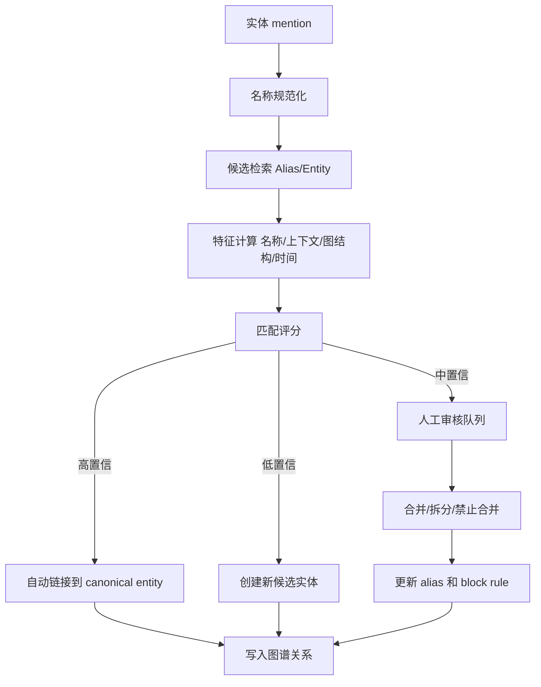

# GraphRAG 里的实体消歧

## 问题背景

GraphRAG 的图谱质量，很大一部分取决于实体是否稳定。抽取器从文档里看到“DeepChat”“Deep Chat”“桌面助手”“本地 AI 助手”，它们可能指向同一个产品；看到“RAG”“检索增强”“知识库问答”，有时是同一类能力，有时是不同模块；看到“API”“接口层”“网关”，上下文不同就可能完全不是一个对象。实体消歧做不好，图谱会出现两种相反的问题：同一个实体被拆成多个节点，或者不同实体被错误合并。

被拆散的问题会让关系召回不足。用户问某项目的历史决策，系统只找到“旧名称”下的一部分文档，看不到“新名称”下的复盘和实现记录。错误合并的问题更危险，会把两个对象的关系混在一起，模型最终给出看似有证据、实际张冠李戴的答案。前者是漏召回，后者是误导。生产环境里，误导通常比漏答更难发现，也更伤信任。

实体消歧不是简单字符串归一化。大小写、空格、全半角、繁简转换、英文缩写当然要处理，但真正难的是语境。一个缩写在不同团队里可能代表不同服务；一个人名可能对应多个同事；一个仓库改名后历史路径和新路径都要指向同一实体；一个概念在产品文档和工程文档里可能粒度不同。GraphRAG 需要的是“稳定身份”，不是“相似名称”。

我把实体消歧看成一条数据治理管线：候选实体进入后，系统先做规范化和规则匹配，再做上下文相似度判断，再结合图结构和来源证据，最后给出合并、拆分或人工审核决策。早期不要追求完全自动化。对高价值实体类型，例如服务、仓库、团队、客户、策略，宁可让系统保守一点，也不要让错误合并进入正式图谱。

## 核心概念

实体消歧首先要区分 mention、candidate 和 canonical entity。mention 是原文里出现的一次实体提及，例如某个 chunk 里的“GraphRAG”。candidate 是抽取器根据 mention 生成的候选对象，带有类型、上下文、来源和置信度。canonical entity 是知识图谱里的稳定节点，有 stable_id、canonical_name、aliases、type、description 和生命周期。不要把 mention 直接写成 canonical entity，否则每篇文档都会制造一堆重复节点。

第二个概念是别名。别名不只是名字列表，还要有来源和有效期。一个服务可能从 `search-api` 改名为 `retrieval-service`，旧文档仍然使用旧名；一个产品在中文材料里叫“桌面 AI 助手”，英文材料里叫“DeepChat”；一个团队的缩写可能在 2025 年后不再使用。alias 表应包含 alias_text、normalized_alias、source_document、valid_from、valid_to、confidence 和 created_by。这样系统能解释为什么把某个 mention 归到某个实体。

第三个概念是负样本或禁止合并规则。很多消歧系统只保存“这些名字相同”，却不保存“这些名字相似但不能合并”。例如 “MCP server” 和 “MCP client” 常一起出现，但它们不应合并；“GraphRAG evals” 和 “RAG eval matrix” 都和评测相关，但粒度不同。把禁止合并写入规则，能防止模型在后续批处理中反复犯同样错误。

| 层次 | 说明 | 是否稳定 | 工程动作 |
| --- | --- | --- | --- |
| Mention | 原文一次提及 | 不稳定 | 记录 chunk、offset、上下文 |
| Candidate | 抽取出的候选实体 | 半稳定 | 计算特征、匹配候选 |
| Canonical Entity | 图谱稳定节点 | 稳定 | 分配 ID、维护别名和关系 |
| Alias | 名称变体 | 有时间范围 | 支持匹配和解释 |
| Block Rule | 禁止合并规则 | 稳定 | 防止重复误合并 |

实体消歧需要多种信号。名称相似度是第一层，包括规范化字符串、编辑距离、拼音或英文缩写。上下文相似度是第二层，包括 mention 周围的句子、标题路径、文档类型、标签。结构信号是第三层，包括共同邻居、共同来源、相同 owner、相同仓库路径。时间信号是第四层，改名前后是否连续，两个实体是否在同一时间段同时存在。权限信号也不能忽略，不同租户或团队的同名对象不能跨边界合并。

## 架构/流程图解说明

一个可控的实体消歧流程应该把自动判断和人工审核分层。低风险、高确定性的合并自动完成；高风险、低置信度的候选进入队列；明确冲突的候选被拒绝并生成 block rule。下面的流程图描述了从 mention 到 canonical entity 的路径。



候选检索不要全库扫描。可以按实体类型、normalized name、alias 前缀、embedding 近邻、同文档实体共同出现来找候选。比如一个 mention 被识别为 Service，就只在 Service、ExternalSystem、Repository 的相关集合里找，不要和 Policy、Metric 混在一起。类型约束能大幅减少误合并。

匹配评分最好拆开记录，而不是只保存一个总分。名称分、上下文分、结构分、时间分、权限分分别是多少，要写进 trace。人工审核时能看到系统为什么推荐合并，也能反馈哪一类信号不可靠。比如名称分高但结构分低，可能是同名不同对象；上下文分高但时间冲突，可能是改名或迁移；权限边界不同，则直接禁止合并。

人工审核队列也要产品化。审核人员需要看到 mention 原文、上下文 chunk、候选实体卡片、已有别名、相关关系、来源文档和系统推荐理由。只给两个名字让人判断，很容易误判。审核动作要少而明确：链接到已有实体、创建新实体、合并两个实体、拆分实体、添加别名、添加禁止合并。每个动作都要记录审计日志。

## 工程实现

实现第一步是名称规范化。中文和英文混杂的技术知识库里，要处理大小写、空白、标点、全半角、连字符、下划线、版本后缀和常见停用词。比如 `Retrieval Service`、`retrieval-service`、`retrieval_service` 可以归一到同一个 normalized key；但不要把 `service` 这类泛词作为主要匹配依据。规范化函数要可测试，并记录版本，因为规则变化会影响大量候选。

第二步是候选生成。一个 mention 可以通过多路召回找候选：精确 alias 命中、normalized key 命中、编辑距离近邻、embedding 近邻、同文档共同出现、同仓库路径、同 owner。多路召回的结果合并后进入 scorer。召回宁可宽一点，评分和阈值负责保守决策。没有候选时也不要直接创建正式实体，可以先创建 pending entity，等后续更多证据出现再确认。

第三步是评分。早期可以用规则加权，不必训练模型。示例权重：同类型加分，精确 alias 加分，同文档标题路径加分，共同 owner 加分，时间连续加分；类型冲突扣分，权限边界不同直接拒绝，block rule 命中直接拒绝，两个实体在同一时间段以不同 owner 同时活跃则扣分。权重配置要能按实体类型调整，因为 Person、Service、Project 的消歧信号不一样。

```go
type MatchSignals struct {
    NameScore      float64
    ContextScore   float64
    StructureScore float64
    TimeScore      float64
    PermissionOK   bool
    Blocked        bool
}

func DecideEntityMatch(s MatchSignals) Decision {
    if s.Blocked || !s.PermissionOK {
        return DecisionReject
    }
    score := 0.35*s.NameScore + 0.25*s.ContextScore + 0.25*s.StructureScore + 0.15*s.TimeScore
    if score >= 0.88 {
        return DecisionAutoLink
    }
    if score >= 0.68 {
        return DecisionReview
    }
    return DecisionCreatePending
}
```

第四步是合并和拆分。合并不是把两个节点简单删除一个。需要迁移 aliases、mentions、relations、community_members 和历史引用；保留 redirect，从 old_entity_id 指向 new_entity_id；重新计算受影响社区摘要；把合并动作写入审计日志。拆分更难，需要把 mentions 和 relations 按证据重新分配。生产系统里，一定要先支持“软合并”和“可回滚”，不要直接物理改写所有历史数据。

第五步是把消歧结果反馈到抽取和检索。抽取器下一次看到别名时，可以优先链接到已有实体；检索器展示上下文时，可以把同一 canonical entity 下的多个名称合并展示；评测系统可以统计每类实体的自动链接率、审核通过率和误合并率。实体消歧不是离线清洗任务，而是 GraphRAG 的基础服务。

## 审核工作流和数据产品

实体消歧一旦进入真实知识库，就会变成一个小型数据产品，而不是后台批处理。原因是模糊样本会持续出现：新项目启动、新仓库改名、团队缩写变化、外部客户名称变化、历史文档被迁移。没有审核工作流，系统只能把这些不确定性藏在自动决策里。等用户发现答案串了对象，图谱里可能已经有几十条关系受到污染。

审核队列要按风险排序。不是所有候选都值得人工看。高风险样本包括：强关系两端的实体匹配、影响权限或客户边界的实体、即将进入社区摘要的核心实体、名称相同但类型或 owner 不同的候选、模型评分接近阈值的候选。低风险样本，例如普通 mention 链接到已有低权重主题，可以延迟处理。这样人工成本会用在会影响回答质量的位置。

审核界面要让人快速判断身份，而不是只显示两个名字。一个好的审核卡片应该包含：mention 原文和前后句、标题路径、文档来源、候选实体的 canonical name、别名历史、现有关系列表、最近一次出现时间、owner、系统评分拆解、相似但曾被禁止合并的实体。审核者看到这些上下文，才能判断“这是同一个服务改名”还是“只是两个相关概念”。

审核动作要转化为可复用规则。用户点击“合并”后，系统不仅要链接当前 mention，还要新增 alias、记录合并理由，并触发相同 normalized alias 的待处理候选重新评分。用户点击“禁止合并”后，要生成 block rule，下次同类候选直接降权或拒绝。用户点击“创建新实体”后，要检查是否需要补充类型说明或 schema 反例。审核如果只改一条数据，没有回写规则，队列会永远处理不完。

| 审核动作 | 数据影响 | 后续自动化 |
| --- | --- | --- |
| 链接到已有实体 | mention 指向 canonical entity | 相同 alias 提升候选分 |
| 创建新实体 | pending 变 canonical | 建立初始别名和类型说明 |
| 合并实体 | 迁移别名、关系、社区成员 | 触发摘要重建和回归样本 |
| 拆分实体 | 重新分配 mentions 和 evidence | 生成禁止合并规则 |
| 添加别名 | alias 表新增记录 | 后续精确匹配 |
| 禁止合并 | block rule 生效 | 相似候选直接拒绝或审核 |

实体质量还需要看板。最有用的不是图谱总节点数，而是按类型拆开的健康度：每周新增 canonical entity 数、pending 数、孤立节点比例、平均 alias 数、强关系关联率、审核 backlog、误合并回滚次数。比如 Service 类型的孤立节点突然上升，可能是仓库路径解析坏了；Policy 类型 pending 很多，可能是 schema 不够清楚；Person 类型误合并高，可能需要加邮箱或团队作为匹配信号。

把消歧做成数据产品，还有一个好处：它能让内容治理变得可见。很多时候实体混乱不是模型问题，而是文档命名混乱。审核队列会暴露哪些项目经常改名不留迁移记录，哪些文档标题过于泛化，哪些团队缩写没有说明。GraphRAG 反过来推动知识库写作规范，这是很实际的收益。

## 实战补充：Go 服务里的消歧边界

实体消歧服务最好不要和抽取任务绑死。抽取任务负责从 chunk 里提出 mention 和候选类型，消歧服务负责把 mention 链接到 canonical entity 或返回 pending。这样做的好处是所有来源都能复用同一套身份判断：Markdown 文档、工单、代码仓库、会议纪要、人工录入都走同一个接口。接口输入应包含 mention 文本、实体类型、上下文窗口、文档元数据、权限 scope 和调用场景，输出则包含 decision、entity_id、score breakdown、需要审核的原因和 trace_id。

Go 实现时我会把消歧接口设计成幂等。相同 mention、相同上下文 hash、相同 schema 版本和同一权限 scope，多次调用应得到同一结果，除非 alias、block rule 或 canonical entity 版本发生变化。幂等很重要，因为离线重跑、失败重试和增量索引都会重复请求。如果消歧结果随机漂移，关系写入也会漂移，最后评测无法复现。

权限边界是另一个容易被低估的点。很多团队会先做全局实体表，等出问题再加权限过滤。实体消歧不应该先把所有同名对象合并，再指望回答阶段过滤，因为关系和社区摘要已经在合并后被污染。更稳的设计是把 tenant、workspace、repository 或知识域作为候选召回和评分的硬条件。跨边界合并必须有明确的全局实体类型，例如公开开源项目、通用协议、外部标准；否则同名项目默认不合并。

消歧服务还要能解释“为什么不合并”。生产排查里，拒绝理由和合并理由同样重要。一个候选被拒绝，可能是 block rule 命中，可能是类型冲突，可能是时间重叠，可能是权限 scope 不同。把这些理由写清楚，审核者才能决定是规则正确、schema 太窄，还是文档元数据缺失。否则大家只看到一个低分，很难把反馈转化为改进。

最后，消歧和实体生命周期要一起设计。一个服务下线后，它的 entity 不应该被删除，而是状态变为 retired；一个项目拆分后，旧 entity 可以保留并指向两个 successor；一个仓库改名后，alias 要记录有效期。GraphRAG 回答历史问题时需要旧身份，回答当前问题时需要新身份。没有生命周期字段，系统会把历史和现状混在一起，特别容易在事故复盘、迁移计划和责任归属问题上出错。

实际协作中，消歧规则也要有 owner。服务名和仓库名通常由平台或工程负责人确认，客户名可能需要运营或销售确认，人员身份需要遵守隐私和权限规则。不要让一个通用审核队列处理所有类型，否则 reviewer 会在不了解上下文时做决定。按实体类型分配审核责任，才能把人工判断变成稳定的数据资产。

这个责任边界越早明确，后续误合并越容易快速止损。

## 测试评测

实体消歧的评测要覆盖 precision 和 recall。precision 是系统合并的实体是否真的相同；recall 是同一实体的不同提及是否都被链接起来。GraphRAG 场景下，precision 更重要，因为错误合并会污染关系路径。早期阈值应偏保守，让更多中置信样本进入人工审核，而不是追求自动合并率。

评测集可以分成五类：同名不同对象、同对象不同别名、缩写冲突、改名迁移、跨语言名称。每类都要有原文上下文，而不是只给名称对。比如 “LLM cache” 和 “cache strategy” 是否相同，要看它们是否指向同一篇设计文档、同一套实现、同一组指标。没有上下文的名称匹配评测，会把系统引向错误优化方向。

| 样本类型 | 例子 | 期望结果 | 主要信号 |
| --- | --- | --- | --- |
| 同对象别名 | DeepChat / 桌面 AI 助手 | 合并 | alias、上下文、来源 |
| 同名不同对象 | API 网关 / 浏览器 API | 拒绝 | 类型、标题路径 |
| 缩写冲突 | ER 表示 Entity Resolution 或 Error Rate | 进入审核 | 上下文、指标单位 |
| 改名迁移 | search-api / retrieval-service | 合并并记录时间 | 事件、仓库、owner |
| 粒度不同 | RAG 评测 / GraphRAG evals | 不直接合并 | schema、社区关系 |

线上指标要看四个数：自动链接率、人工审核通过率、误合并发现率、孤立实体增长率。自动链接率太低说明规则过于保守或 alias 不够；审核通过率太低说明候选召回噪声大；误合并发现率上升要立即降阈值；孤立实体增长过快说明抽取器在制造低价值节点。每周看趋势，比单次准确率更有用。

回归测试还要覆盖合并后的问答质量。选一批依赖实体连接的问题，分别在消歧前后运行 GraphRAG，检查关键文档召回、关系路径、引用和答案是否改善。有时实体合并的离线指标变好了，但线上回答变差，原因可能是合并后某个超级节点连接太多，图扩展噪声上升。这说明还需要关系权重和社区划分配合调整。

## 失败模式

第一个失败模式是只靠 embedding。名称和上下文向量相似可以帮助找候选，但不能决定身份。同一个主题下的不同实体向量很像，尤其是技术文档里服务、模块、功能常一起出现。只靠 embedding 容易把相关对象合并成同一对象。必须结合类型、结构、时间、权限和负规则。

第二个失败模式是过度规范化。把所有标点、版本号、环境后缀都删掉，看似提高匹配率，实际可能把 `api-v1` 和 `api-v2`、`prod-index` 和 `dev-index` 合并。规范化应该保留能区分身份的 token，并按实体类型配置。服务名里的版本和环境可能重要，文章标题里的标点可能不重要。

第三个失败模式是没有人工闭环。实体消歧永远会遇到模糊样本，尤其是组织内部缩写和历史改名。如果没有审核队列，系统只能在自动合并和创建新节点之间摇摆。审核结果也不能只改当次数据，要写回 alias、block rule、样本集和评分配置。

第四个失败模式是合并不可回滚。线上发现两个实体误合并后，如果没有 redirect、审计日志和关系迁移记录，就很难拆开。所有合并都要保留原始 mention 到旧实体的历史，正式图谱可以指向新实体，但底层证据不能丢。可回滚不是运维奢侈品，而是消歧系统的基础能力。

第五个失败模式是跨权限合并。同一个客户名、项目名或团队名在不同权限域里可能代表不同对象。消歧服务必须接收 tenant、workspace、repository scope 等边界信息。没有权限边界的全局合并，会让 GraphRAG 在回答时意外把不该混合的材料放到一起。

## 上线 checklist

- mention、candidate、canonical entity 三层数据分开存储，不把抽取结果直接变成稳定节点。
- alias 表保存来源、有效期、置信度和创建方式，支持解释与回放。
- 消歧评分包含名称、上下文、图结构、时间和权限信号，并分项写入 trace。
- 高风险实体类型采用保守阈值，中置信样本进入人工审核队列。
- block rule 支持“相似但禁止合并”的负样本，审核结果会写回规则。
- 合并操作有 redirect、审计日志、关系迁移和社区摘要重建策略。
- 拆分操作能重新分配 mentions、relations 和 evidence，不依赖手工改数据库。
- 评测集覆盖同名、别名、缩写、改名、跨语言和权限边界样本。
- 每周监控自动链接率、审核通过率、误合并率和孤立实体增长率。
- GraphRAG 检索层使用 canonical entity，同时在引用中保留原文 mention。

## 总结

实体消歧是 GraphRAG 从 demo 走向生产的分水岭。没有稳定实体，关系边、社区摘要和路径检索都会建立在松动地基上。消歧也不是单个算法能解决的问题，它需要名称规则、上下文理解、图结构信号、时间建模、权限边界和人工反馈一起工作。

务实落地时，先保护 precision，避免错误合并污染图谱；再通过 alias 积累、审核闭环和评测样本逐步提高 recall。每一次合并都要可解释、可审计、可回滚。GraphRAG 的回答之所以值得信任，不只是因为模型会总结，而是因为系统知道“这些不同名字背后到底是不是同一个对象”。
