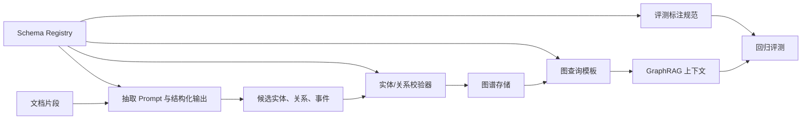

# GraphRAG 的实体、关系和事件怎么建模

## 问题背景

GraphRAG 项目做到第二周，经常会遇到一个看起来很技术、实际上很组织化的问题：到底什么东西应该成为图谱里的节点？文档里有服务名、团队名、客户名、功能名、指标名、错误码、会议、事故、决策、代码仓库和人名。LLM 抽取器很勤快，几乎能把每个名词都抽成实体；产品同学希望什么都能问；工程同学担心图谱越建越乱。schema 设计如果没有边界，GraphRAG 很快会从“关系推理”变成“关系噪音放大器”。

传统知识图谱常从领域本体开始，先定义上百个类和谓词，再约束数据进入。GraphRAG 的节奏通常相反：我们先有一堆半结构化文档，问题来自真实工作流，抽取还带模型不确定性。过度学术化的 schema 会让团队难以下手，完全无 schema 又会让图谱失控。比较务实的方式是设计一套“可演进的窄 schema”：先覆盖高频问题需要的实体和关系，给扩展留口子，但每次扩展都能解释为什么。

实体、关系和事件是最容易混淆的三类对象。实体是相对稳定的对象，例如某个服务、项目、团队、客户、仓库、接口。关系是实体之间相对持续或可验证的连接，例如“服务 A 依赖服务 B”“团队 X 维护仓库 Y”。事件是发生在某个时间点或时间段、会改变实体状态或关系的事情，例如一次事故、一次迁移、一条发布、一场评审。很多图谱混乱，都来自把事件当关系，或者把短期状态当实体。

一个可维护的 GraphRAG schema 要回答四个问题：哪些对象值得有稳定 ID？哪些连接必须有证据？哪些事实有时间范围？哪些内容只适合留在原文 chunk 里，不应该抽到图谱？这四个问题比“用什么图数据库”更早，也更重要。数据库能换，schema 的脏数据一旦进入问答链路，后面每个答案都会付利息。

## 核心概念

实体建模的第一原则是稳定性。一个节点应该代表在一段时间内可以被多篇文档重复引用的对象，而不是一句话里的临时概念。比如“DeepChat 插件架构”适合作为项目或主题实体，因为它会出现在设计文档、实现说明、评测记录中；“更好的用户体验”不适合作为实体，它更像摘要里的描述。判断标准很简单：这个对象未来会不会被别的文档引用？用户会不会直接问它？它有没有别名、负责人、生命周期？

第二个原则是类型少而准。早期我会把实体类型控制在十个以内，例如 Project、Service、Team、Person、Document、Repository、Feature、Metric、Policy、ExternalSystem。类型越多，抽取越不稳定，消歧越困难，查询越难写。抽象概念类要慎用，因为它们容易成为“万能垃圾桶”。如果一个类型没有专属字段、没有专属关系、没有专属问题，就先不要加。

关系建模的重点是谓词语义。`related_to` 这种关系看似方便，实际会毁掉图谱，因为它没有推理价值。关系应该能回答具体问题：`depends_on` 支持影响分析，`owned_by` 支持责任归属，`replaced_by` 支持迁移历史，`caused_by` 支持事故分析，`mentions` 支持弱引用。每种关系都要写清方向、证据要求、时间属性和是否可传递。比如 `depends_on` 可以沿着路径扩展，但 `mentions` 不应该作为强关系扩展两跳。

事件节点解决的是时间和变化。假设“检索服务从方案 A 切到方案 B”，如果只建一条 `replaced_by` 边，系统很难回答“什么时候切的”“为什么切”“谁批准”“影响了哪些指标”。更好的模型是建一个 MigrationEvent：它连接旧方案、新方案、决策文档、负责人、时间窗口和影响指标。事件不是所有场景都要建，但只要问题涉及因果、版本、审批、事故和发布，事件节点通常比关系边更稳。

| 建模对象 | 适合表达 | 不适合表达 | 核心约束 |
| --- | --- | --- | --- |
| 实体节点 | 稳定对象、可重复引用对象 | 临时形容词、一次性观点 | canonical name、type、aliases |
| 关系边 | 持续连接、可证据验证连接 | 复杂过程、含多方参与的动作 | direction、predicate、evidence |
| 事件节点 | 时间点、状态变化、因果链 | 长期归属关系、模糊主题 | occurred_at、participants、outcome |
| Chunk | 原文证据、细节语境 | 跨文档高层连接 | document_id、offset、section |
| Community | 一组密集关系的摘要 | 单条事实来源 | members、summary_version |

## 架构/流程图解说明

schema 设计最好进入数据管线，而不是停留在文档里。每次抽取、校验、写库、查询、评测都要引用同一份 schema 定义。下面这条流程强调的是“schema 作为契约”的位置：它约束 LLM 输出，也约束后续图谱写入和检索。



Schema Registry 不一定要做成复杂服务，早期可以是一组 YAML 或 Go struct。关键是它要包含机器可读的信息：实体类型枚举、字段定义、关系谓词、关系方向、允许的 from/to 类型、证据规则、时间字段和弃用状态。抽取 prompt 从它生成约束说明，校验器用它拒绝非法边，查询模板用它选择扩展路径，评测人员用它统一标注口径。

一个关系定义可以长这样：

```yaml
predicate: depends_on
label: 依赖
from_types: [Service, Feature, Project]
to_types: [Service, ExternalSystem, Repository]
direction: outbound
strength: strong
transitive: true
requires_evidence: true
time_bound: optional
query_intents:
  - impact_analysis
  - migration_planning
blocked_with:
  - mentions
```

事件定义则要强调参与者和结果，而不是只保存标题。以事故为例，IncidentEvent 至少需要时间、影响对象、检测信号、缓解动作、根因候选、复盘文档。它和实体的边可以包括 `affected`、`detected_by`、`mitigated_by`、`documented_in`。这样用户问“某次延迟抖动为什么影响了检索质量”时，系统能沿着事件找到指标、服务、缓解策略和复盘原文。

## 工程实现

落地时可以先写一份小 schema，然后把它贯穿到抽取和查询。不要让 prompt 自由发挥“请抽取所有实体关系”。我会把实体类型和关系类型作为配置传给抽取器，并要求模型返回 `type` 必须来自枚举，`predicate` 必须来自枚举，`evidence_text` 必须是原文中的连续片段。校验器再检查 from/to 类型是否合法、证据是否出现在 chunk、置信度是否低于阈值、是否存在重复候选。

实体 ID 的生成要慎重。最简单的 `type + normalized_name` 可以启动，但会遇到同名服务、同名团队、缩写冲突。更稳的做法是 canonical identity 分两层：候选阶段用 normalized key，确认阶段分配 stable_id。stable_id 不随改名变化，别名表记录历史名称和来源。GraphRAG 最怕的不是少一个节点，而是一个节点今天叫 A 明天叫 B，引用和关系全部断掉。

关系写入建议走候选表。LLM 抽出的关系先进入 `relation_candidates`，包含 evidence、模型版本、抽取时间、source chunk、置信度。通过规则或人工审核后再进入 `relations`。对强关系，例如 depends_on、owned_by、replaced_by，要求证据明确；对弱关系，例如 mentions、discussed_with，可以自动入库但降低扩展权重。这样图谱既能快速增长，又不会让高风险关系直接影响答案。

事件抽取可以从文档类型入手。ADR、事故复盘、发布说明、会议纪要各有固定结构。与其让 LLM 从任意 chunk 猜事件，不如先识别文档模板：ADR 通常产生 DecisionEvent，事故复盘产生 IncidentEvent，发布说明产生 ReleaseEvent，迁移方案产生 MigrationEvent。模板识别后再抽字段，稳定性会高很多。

```go
type RelationPredicate string

const (
    DependsOn  RelationPredicate = "depends_on"
    OwnedBy    RelationPredicate = "owned_by"
    ReplacedBy RelationPredicate = "replaced_by"
    Mentions   RelationPredicate = "mentions"
)

type RelationCandidate struct {
    FromEntityID string
    ToEntityID   string
    Predicate    RelationPredicate
    EvidenceText string
    ChunkID      string
    Confidence   float64
    Extractor    string
}
```

检索时也要尊重 schema。假设用户问影响范围，查询计划应该优先使用 `depends_on`、`used_by`、`affected_by`，弱化 `mentions`。用户问责任归属，优先 `owned_by`、`maintained_by`、`approved_by`。用户问历史原因，优先事件节点和 `caused_by`、`decided_in`、`replaced_by`。如果 schema 没有 query intent 映射，GraphRAG 会退化成“所有边都一样”的图搜索，结果噪音非常大。

## Schema 演进治理

schema 一旦进入生产，就不只是技术配置，而是团队知识治理的一部分。任何新增实体类型、关系谓词或事件模板，都应该像改 API 一样有变更说明。原因很直接：GraphRAG 的输出依赖这些定义，schema 改了，抽取结果、社区划分、检索路径和评测样本都会变化。如果没有治理，今天为了一个 demo 加了 `related_to`，明天为了另一个需求加了 `influences`，几周后没人能解释两者差异，查询层只能把它们都当弱关系处理。

我会把 schema 变更分成三类。第一类是兼容新增，例如给 Service 加一个可选字段 `runtime`，这通常只影响展示和过滤。第二类是语义新增，例如加入 `mitigated_by` 关系，它会影响事故类问题的路径检索，需要补评测样本。第三类是破坏性变更，例如把 `owner` 从字段改成 `owned_by` 关系，或者废弃某个实体类型，这类变更必须有迁移计划和回滚方案。不同变更等级对应不同审批和测试，不要把所有 schema 调整都当成小配置。

schema 文档也要面向抽取器、查询器和人三类读者。给抽取器看的部分要明确枚举、字段类型、证据要求和反例；给查询器看的部分要明确关系权重、可扩展方向和 query intent；给人看的部分要解释为什么需要这个类型，以及哪些看似相关的东西不应该归到这里。特别是反例很重要。比如 Feature 类型的反例可以写“不要把‘更稳定’‘体验优化’抽成 Feature，除非文档里有明确功能名或发布项”。这些反例会显著降低抽取噪声。

schema registry 可以很轻，但一定要可审计。每个版本保存 diff、作者、原因、受影响评测集和上线时间。离线抽取任务读取指定 schema 版本，在线检索 trace 里也记录 schema 版本。用户反馈某个回答错误时，团队才能知道它是基于哪一套类型和关系生成的。没有版本记录，schema 就会变成隐式 prompt，所有变化都混在模型表现里，后续排查会非常痛苦。

| 变更类型 | 示例 | 必需动作 | 回滚关注点 |
| --- | --- | --- | --- |
| 兼容新增 | 新增可选字段 runtime | 字段校验、展示更新 | 字段缺失默认值 |
| 语义新增 | 新增 mitigated_by 关系 | 补抽取样本、补查询 intent | 新关系是否造成噪声扩展 |
| 语义收窄 | 限制 depends_on 的 from/to 类型 | 重跑非法边检查 | 旧边如何降级 |
| 破坏迁移 | Concept 拆成 Topic 与 Policy | 数据迁移、评测对比 | 历史引用和社区摘要 |
| 弃用 | 废弃 related_to | 查询降权、停止写入 | 旧答案回放 |

治理不是为了拖慢迭代，而是为了让迭代可持续。GraphRAG 的 schema 早期一定会变，甚至应该快速变，但每次变化都要留下理由和效果。好的 schema 演进会越来越窄、越来越贴近问题；坏的演进会越来越宽、越来越像同义词词典。判断标准不是图谱看起来多丰富，而是线上问题是否更容易召回证据，失败是否更容易定位，团队是否敢基于图谱输出做决策。

## 实战补充：一次 schema 迁移怎么做

假设第一版系统把所有抽象对象都放进 `Topic`，几周后发现里面混着功能模块、治理策略、评测指标和写作主题。短期看 `Topic` 很灵活，长期看它会让查询层失去语义。用户问“哪些策略会影响权限边界”，系统可能召回一堆普通技术主题；用户问“哪些指标证明 GraphRAG 变好了”，系统又找不到真正的 Metric。这个时候不要直接把 `Topic` 删除，而要做一次可回放迁移。

迁移第一步是冻结写入。新的抽取任务停止写 `Topic`，只允许读旧数据，同时把旧 `Topic` 节点按名称、来源文档、关系类型和被问到的 query intent 导出成候选清单。第二步是设计目标类型，例如把旧 `Topic` 拆成 `Feature`、`Policy`、`Metric`、`ResearchTheme`。每个目标类型都要写反例，尤其说明哪些名称应该继续留在原文，不进入图谱。第三步是跑离线分类，把每个旧节点标成迁移目标、保留、废弃或需要人工判断。

数据迁移不能只改实体表，还要处理边和摘要。一个旧 `Topic` 如果变成 `Metric`，它原来的 `discusses` 关系可能不再适合参与影响分析；如果变成 `Policy`，它可能需要补 `applies_to` 和 `constrains` 关系。社区摘要也要重新生成，因为成员类型变化会影响社区标题和 retrieval hints。迁移完成后，旧 entity_id 最好保留 redirect，历史引用还能打开，但在线检索使用新 stable_id。

评测上要做新旧对比，而不是只看迁移脚本是否成功。选一组依赖旧 `Topic` 的真实问题，在迁移前后分别运行，比较关键实体召回、关系路径、上下文 token、引用数量和拒答率。一次好的 schema 收窄，通常会让节点总数下降或持平，强关系比例上升，弱相关上下文减少。如果节点数暴涨、答案更长、引用更散，说明拆分粒度可能过细。

团队流程也要清楚。schema owner 负责定义目标语义，数据工程负责迁移和回放，业务 reviewer 负责抽样判断分类结果，应用工程负责查询 intent 和展示层同步更新。所有角色都看同一份迁移报告：改了多少节点、多少边被降级、多少社区摘要重建、哪些评测样本退步。GraphRAG 的 schema 迁移不是数据库清理，而是一次知识契约变更，必须让使用方知道系统现在如何理解世界。

还有一个容易忽略的小动作：迁移完成后要更新写作规范。很多 schema 混乱来自原文表达不稳定，例如同一篇文档里把功能、策略和指标混着叫“主题”。如果内容模板里明确写出“功能名”“策略名”“指标名”“决策事件”，抽取器会更容易遵守 schema，人工审核也会少很多。

## 测试评测

schema 的评测不是看图谱有多少节点，而是看它能否支持稳定问题。第一类测试是抽取契约测试：给定一批标注文档，检查模型输出是否只使用允许类型，证据是否来自原文，非法 from/to 是否被校验器拒绝。第二类测试是消歧测试：同名、别名、缩写、改名后是否合并到正确实体。第三类测试是查询意图测试：不同问题是否选择了合适关系集合。

可以为每个实体类型准备“黄金样本”。例如 Service 类型包含服务名、仓库路径、owner、运行环境；Policy 类型包含策略名称、适用范围、版本、状态；Metric 类型包含单位、采集系统、阈值。抽取器输出如果缺少关键字段，不一定拒绝，但要降低置信度，并在后台标出“字段不完整”。这比简单通过/失败更适合真实知识库，因为很多历史文档本来就不完整。

| 测试项 | 样本来源 | 通过标准 | 失败说明 |
| --- | --- | --- | --- |
| 类型约束 | 人工构造 chunk | 不出现 schema 外类型 | prompt 或校验器松 |
| 方向约束 | 依赖和归属文档 | from/to 不反向 | 谓词定义不清 |
| 证据约束 | ADR、复盘原文 | evidence 可定位 | 模型在推断 |
| 事件字段 | 发布和事故记录 | 时间、参与者、结果齐全 | 模板识别不足 |
| 查询意图 | 真实用户问题 | 关系集合匹配意图 | intent 映射缺失 |

线上评测要关注 schema 演进带来的回归。新增一个实体类型后，旧问题的实体召回可能下降，因为模型开始把原本的 Feature 抽成 Concept；新增一个关系谓词后，图扩展可能召回更多弱相关路径。每次 schema 变更都应该跑固定回归集，并比较节点数、边数、候选上下文 token、答案引用数量和拒答率。如果图谱规模涨了很多，但答案质量不涨，基本说明 schema 扩展太宽。

还需要做人工抽样审计。每周随机抽取新入库的强关系和事件节点，让熟悉业务的人判断是否成立。审计不是为了追求百分百正确，而是找系统性偏差：某类文档总是漏掉 owner，某个模型总把“讨论过”抽成“决定了”，某个团队的缩写总是合并错。把这些偏差写回 schema 说明、抽取 prompt 和评测样本，图谱才会越用越稳。

## 失败模式

最典型的失败是把概念当实体。比如“可观测性”“安全性”“用户体验”这些词确实重要，但在很多知识库里它们更适合作为标签或社区摘要，不适合成为高权重实体。否则所有文档都会连到这些大词，图谱出现超级节点，检索时到处扩散。只有当团队确实围绕某个概念有明确负责人、路线图、评测和文档集合时，它才值得升级为实体。

第二个失败是关系谓词太细。有人会为每种细微语义建一个谓词：`soft_depends_on`、`runtime_depends_on`、`build_time_depends_on`、`operationally_related_to`。如果查询和评测用不上这些差异，就会增加抽取难度。早期可以用少数谓词加属性表达细节，例如 predicate 是 depends_on，dependency_kind 是 runtime 或 build_time。等真实问题证明需要分开，再提升为谓词。

第三个失败是没有时间建模。知识库里很多事实有生命周期：某团队曾经维护某服务，某方案在某版本后被替代，某策略只对试点客户生效。如果关系没有 valid_from、valid_to 或 source_date，GraphRAG 会把旧事实当新事实。对于技术文档，时间不是装饰字段，而是回答可信度的一部分。

第四个失败是 schema 只给抽取用，不给查询用。很多团队写了漂亮的抽取类型，但在线检索仍然从所有边里做 BFS。这样 schema 只在入库时存在，回答时没有发挥约束作用。每个关系谓词都应该关联 query intent、扩展权重和上下文展示方式。比如 owned_by 适合展示为实体卡片，caused_by 适合展示为事件链，mentions 只适合作为补充证据。

第五个失败是没有弃用机制。schema 一旦上线，就会有旧字段、旧关系、旧类型。直接删除会破坏历史引用，不删除会污染新检索。做法是给类型和谓词加 status：active、deprecated、blocked。deprecated 仍可读但不再写入，查询时降低权重；blocked 只保留历史，不参与上下文组装。迁移脚本和评测报告要记录每次 schema 变更的影响。

## 上线 checklist

- 实体类型少而明确，每个类型都有字段、问题场景和示例，不保留“万能概念”类型。
- 关系谓词有方向、允许的 from/to 类型、证据要求、时间属性和查询意图映射。
- 事件节点用于表达时间、状态变化、多方参与和因果过程，不用单条边硬塞复杂动作。
- LLM 抽取输出使用 schema 枚举，校验器拒绝非法类型、非法方向和无原文证据的强关系。
- 强关系进入正式表前经过规则或人工审核，弱关系可自动入库但降低扩展权重。
- stable_id 独立于名称，别名和改名进入 alias 表，消歧过程可回放。
- schema 变更有版本、评审、迁移说明和回归评测结果。
- 查询计划按 intent 选择关系集合，不允许在线检索把所有边等权扩展。
- 每周抽样审计新实体、强关系和事件节点，偏差写回 schema 和评测集。
- deprecated 类型和谓词有降权策略，历史数据可读，新数据不再写入。

## 总结

GraphRAG 的 schema 不是为了画一张漂亮本体图，而是为了让检索、推理、引用和维护都有稳定边界。实体表示稳定对象，关系表示可证据验证的连接，事件表示带时间和结果的变化过程。把这三者分清，图谱才不会在真实文档的复杂性面前散掉。

务实的做法是从窄 schema 起步：少数实体类型、少数强谓词、清楚的事件模板、严格的证据链和可回归的查询意图。每次扩展都要回答“它解决了哪个真实问题”“它如何被评测”“它会不会污染旧答案”。GraphRAG 能否长期可靠，很大程度取决于 schema 能否在增长和约束之间保持平衡。
