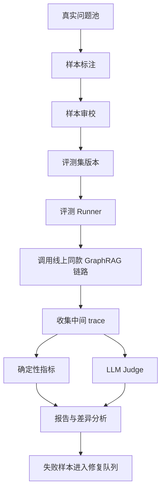

# GraphRAG 的评测样本怎么设计

## 问题背景

GraphRAG 的难点不只是“能不能回答对”，而是“回答对的时候系统到底做对了哪些事”。传统 RAG 评测常常围绕最终答案打分：答案是否覆盖要点、是否忠实、引用是否存在。这些指标仍然重要，但它们不足以评估 GraphRAG。因为 GraphRAG 在生成答案之前多了一层结构化检索：实体识别、实体消歧、关系扩展、社区摘要、路径排序、证据组装。最终答案错了，可能是模型写错，也可能是关键实体没召回；答案看起来对了，也可能是模型凭常识猜中，图谱检索链路其实没有工作。

如果评测只盯最终文本，团队会进入一种危险状态：每次失败都去调 prompt 或换模型，而不是修正图谱数据和检索流程。比如用户问“某次权限变更为什么影响了同步任务”，答案漏掉“服务账号轮换”这个节点。最终答案评测只能说“遗漏原因”，但工程上真正要知道的是：问题解析有没有识别权限变更和同步任务；图谱里有没有服务账号轮换；关系路径是否存在；存在的话为什么没进入上下文；进入上下文后模型为什么没采用。GraphRAG 的评测样本必须能把这些问题拆开。

另一个常见误区是拿通用问答集评估企业或个人知识库 GraphRAG。通用样本可以测模型的语言能力，却很难测你自己的实体、关系、权限、时间和引用规则。GraphRAG 的价值通常出现在本地知识密度高、跨文档关系多、时间状态复杂的场景，例如架构决策、项目复盘、客户影响面、依赖链分析、知识库治理。评测样本如果不来自这些真实问题，线上质量会很虚。

所以，GraphRAG 评测不是简单准备一批 question-answer 对。它更像给知识系统做体检：样本要描述问题、意图、关键实体、必要关系、证据文档、不能使用的过期材料、期望答案要点、引用要求和拒答条件。这样的样本制作成本比普通问答高，但它能帮团队找到真正的工程短板。评测不是为了给系统一个好看的分数，而是为了让每次改抽取、改 schema、改图扩展、改摘要策略时都有回归保护。

## 核心概念

GraphRAG 评测样本的最小单位不是答案，而是一个可复盘的检索任务。一个样本至少包含五层信息：用户问题、检索目标、黄金证据、期望推理路径、答案判定标准。用户问题保持真实口吻，不要写成适合搜索引擎的关键词。检索目标说明这个问题需要哪些实体和关系。黄金证据列出必须命中的原文片段、实体节点或关系路径。期望推理路径描述这些材料如何组合成答案。答案判定标准说明哪些要点必须出现，哪些推断不能出现。

这里的“推理路径”不需要变成形式逻辑证明，但要足够具体。比如问题是“为什么 A 服务迁移会影响 B 项目的数据导入”，样本可以标注：A 服务与数据导入任务存在 `provides_api_for` 关系，B 项目依赖该导入任务，迁移决策文档提到接口字段变更，事故复盘提到任务失败。系统如果只召回迁移文档，没有召回 B 项目的依赖关系，就不算 GraphRAG 检索成功。最终答案即使说“因为接口字段变更”，也应该被标为路径不完整。

样本还要区分事实证据和推断证据。事实证据来自原文明确陈述，例如 ADR 写着“方案 B 替代方案 A”。推断证据来自关系组合，例如 A 影响 B，B 影响 C，所以 A 可能影响 C。GraphRAG 可以支持这类多跳解释，但评测必须要求系统展示中间路径，不能只输出结论。否则多跳能力会变成不可检查的幻觉渠道。

| 样本字段 | 作用 | 示例 |
| --- | --- | --- |
| query | 保留真实提问 | “这次权限调整会不会影响回放测试？” |
| intent | 标注回答类型 | impact_analysis |
| entities | 必须识别的实体 | 权限调整、回放测试、服务账号 |
| required_paths | 必须找到的关系路径 | 权限调整 -> 服务账号 -> 回放测试 |
| gold_chunks | 必须引用的原文 | ADR、测试复盘、变更记录 |
| forbidden_sources | 不应采用的材料 | 过期草案、无权限文档 |
| expected_points | 答案要点 | 影响条件、风险、缓解措施 |
| refusal_rule | 何时拒答 | 缺少权限或证据不足 |

GraphRAG 的指标也要分层。实体召回率看关键实体是否命中正确 canonical node。关系路径召回率看系统是否找到标注路径。证据覆盖率看最终上下文是否包含必要原文。引用完整性看答案要点是否能回跳证据。答案稳定性看同一问题在小扰动下是否保持相同结论。拒答准确率看证据不足或权限不足时系统是否克制。这些指标合起来，才接近真实质量。

## 架构/流程图解说明

评测系统应该独立于线上问答服务，但复用同一条检索链路。不要为评测写一套“简化版检索”，否则分数没有意义。推荐架构如下：



真实问题池来自线上日志、内部支持、架构评审、事故复盘和文档搜索记录。样本标注需要熟悉业务的人参与，因为只有他们知道哪些实体和关系是必需的。样本审校要处理歧义：一个问题如果有多个合理答案，要么拆成多个样本，要么在 expected_points 里明确可接受范围。评测集版本很重要，知识库更新后样本也可能失效，不能把过期标准继续当真理。

评测 Runner 的职责不是生成答案后打一个总分，而是收集完整 trace。一次运行至少保存 query parse、entity candidates、resolved entities、retrieved chunks、graph paths、community summaries、assembled context、final answer、citations、latency 和 token usage。确定性指标从这些结构化数据里算，LLM Judge 只负责人类难以硬编码的部分，例如答案是否覆盖要点、是否把冲突解释清楚。

差异分析是评测系统最有价值的输出。一次改动之后，报告应该能回答：哪些样本从通过变成失败，失败在哪一层；哪些样本指标提升，是否来自真实修复；平均延迟和上下文长度是否变化；新增的关系类型是否引入误召回。没有差异分析，评测报告只是一张分数表，很难指导工程行动。

## 工程实现

样本最好用结构化文件保存，而不是散落在表格和文档里。下面是一个简化 YAML 例子，实际项目可以放在 Git 仓库里评审，也可以存入数据库，但字段语义要稳定。

```yaml
id: impact-permission-replay-001
query: 这次权限调整会不会影响浏览器回放测试？
intent: impact_analysis
difficulty: multi_hop
required_entities:
  - name: 权限调整
    type: decision
  - name: 浏览器回放测试
    type: workflow
  - name: 服务账号轮换
    type: change
required_paths:
  - from: 权限调整
    predicates: [changes, constrains]
    to: 服务账号轮换
  - from: 服务账号轮换
    predicates: [affects]
    to: 浏览器回放测试
gold_chunks:
  - doc: adr-2026-05-permission
    section: 影响范围
  - doc: replay-test-runbook
    section: 认证前置条件
expected_points:
  - 影响存在，但只发生在使用旧服务账号的回放任务上
  - 缓解措施是更新凭据并补充权限回归样本
forbidden_sources:
  - draft-permission-plan-2026-04
```

这个样本不是为了让评测代码读起来漂亮，而是为了支持分层检查。required_entities 用来算实体召回；required_paths 用来算路径召回；gold_chunks 用来算证据覆盖；expected_points 给答案 judge；forbidden_sources 用来检查过期或无效材料是否污染答案。difficulty 可以帮助报告分组，避免整体平均分掩盖多跳问题。

评测 Runner 可以设计成一个小型批处理服务。输入是样本集版本和系统配置版本，输出是运行结果目录。每条样本单独执行，失败不影响其他样本。结果目录保存结构化 JSON、最终答案文本、上下文快照和指标。这样一次评测可以在 CI 里跑小集合，也可以在夜间跑完整集合。

```go
type EvalSample struct {
    ID               string
    Query            string
    Intent           string
    Difficulty       string
    RequiredEntities []EntityExpectation
    RequiredPaths    []PathExpectation
    GoldChunks       []ChunkExpectation
    ExpectedPoints   []string
    ForbiddenSources []string
}

type EvalResult struct {
    SampleID        string
    EntityRecall    float64
    PathRecall      float64
    EvidenceRecall  float64
    CitationOK      bool
    ForbiddenHit    bool
    AnswerScore     float64
    FailureStage    string
}
```

确定性指标要优先做，因为它们稳定、便宜、可解释。实体召回可以按 canonical ID 算，不要按字符串算，否则别名会误判。路径召回可以允许谓词集合匹配，比如 `affects` 和 `constrains` 在某类问题里都可接受，但这种等价关系必须由 schema 配置定义，不能临时手写。证据覆盖要检查最终上下文，而不是只检查召回候选，因为候选进来了但组装时被丢掉，对模型仍然没用。

LLM Judge 要谨慎使用。它适合判断答案是否表达了 expected_points，是否有无来源推断，是否把风险和限制讲清楚。它不适合替代路径检查，也不适合根据最终答案猜测系统内部是否命中了实体。Judge 的输入应该包括用户问题、期望要点、系统答案、引用列表和可见证据，不要把完整黄金答案直接给得太详细，否则 judge 容易根据黄金答案做文本相似判断，而不是判断忠实度。

一个实用的 judge 输出可以是：

```json
{
  "covers_expected_points": true,
  "missing_points": [],
  "unsupported_claims": [
    "声称所有回放任务都会失败，但证据只支持旧服务账号路径"
  ],
  "citation_quality": "partial",
  "score": 0.72,
  "reason": "答案覆盖主要影响和缓解措施，但扩大了影响范围。"
}
```

评测数据本身也要版本化。GraphRAG 的知识库是活的，文档会更新，实体会合并，关系会改名。样本里的 gold_chunks 如果依赖某个文档版本，就要记录版本号或内容 hash。否则半年后文档被重写，系统答当前知识是对的，评测却按旧标准扣分。对于状态类问题，可以给样本加 valid_from 和 valid_to；对于历史类问题，明确要求按某个时间点回答。

权限是评测里经常被遗漏的维度。GraphRAG 特别容易沿关系路径跨到用户无权访问的文档。评测样本应该带 user_scope，Runner 用不同权限身份执行同一问题，检查系统是否只使用可见证据。有些问题在管理员视角可以回答，在普通成员视角应该拒答或给出不完整说明。这个能力不评测，上线后很容易出安全事故。

## 样本设计分层

我建议把 GraphRAG 评测样本分成六类，而不是混在一个集合里算平均分。

| 类别 | 目标 | 样本特征 | 主要指标 |
| --- | --- | --- | --- |
| 实体定位 | 测实体识别和消歧 | 问题含别名、缩写、同名对象 | entity recall |
| 单跳关系 | 测基本图连接 | 一个实体关系即可回答 | path recall |
| 多跳影响 | 测路径组合 | 两到三跳，含中间节点 | path recall、evidence |
| 社区摘要 | 测全局主题召回 | 问题不点名具体文档 | community coverage |
| 冲突版本 | 测时间和状态 | 草案、旧决策、新决策并存 | forbidden hit、citation |
| 权限边界 | 测安全过滤 | 不同用户看到不同证据 | refusal、leakage |

实体定位样本看似简单，但非常关键。图谱质量很多时候输在实体层：同一个服务被拆成三个节点，或者两个同名项目被合并。样本要故意包含别名、英文缩写、旧名称和上下文限定词。例如“网关”在不同团队可能指 API Gateway，也可能指支付网关。评测要检查系统是否根据问题上下文选对实体，而不是命中第一个高频节点。

单跳关系样本用于保护基本关系抽取和查询。比如“谁负责 X 服务”“X 依赖哪个数据库”“哪篇 ADR 决定了 Y”。这类样本应该大量存在，因为它们能快速发现 schema 变更和索引损坏。多跳影响样本数量不必特别多，但每条都要精心标注中间路径。它们是 GraphRAG 区别于普通 RAG 的核心证明。

社区摘要样本适合测试“用户问一个宽问题时系统能否找到正确知识区域”。例如“我们过去在本地知识库权限上踩过哪些坑”。这个问题不一定有单一实体入口，需要系统找到相关社区、代表性实体和复盘文档。评测时不应要求固定路径，但要要求覆盖若干主题和证据来源。

冲突版本样本是上线前必须有的。知识库里经常存在旧 runbook、草案、会议讨论和最终决策。GraphRAG 如果只按连接数量排序，热门旧文档可能压过新决策。样本要明确 forbidden_sources，并要求答案解释为什么采用某个版本。状态类问题尤其要测试这一点。

权限边界样本要用真实权限模型，不要只在样本字段里写“不可见”。Runner 应该以不同用户身份调用检索服务，确认召回、图扩展、摘要和引用都遵守权限。很多系统只在文档召回阶段做权限过滤，却忘了社区摘要和关系路径也可能泄漏信息。评测必须覆盖这些派生数据。

## 标注协作和样本治理

GraphRAG 样本标注不能完全交给一个人。理想流程是领域同学先写真实问题和期望答案要点，工程同学补充 required_entities、required_paths 和 gold_chunks，最后由另一个人审校是否存在歧义。这样做不是为了增加流程，而是因为 GraphRAG 评测同时涉及业务事实和系统结构。领域同学知道答案对不对，工程同学知道链路应该命中哪些对象，两者缺一都会让样本变形。

标注时要保留“为什么需要这条路径”的说明。很多样本过几个月后会变得难以理解，尤其是依赖历史事故或旧项目名的样本。可以在样本里加 `annotation_note` 字段，记录标注者为什么认为某个中间实体必需，为什么某份文档是权威来源，为什么某份草案不能用。这些备注不进入评测输入，但对维护样本很重要。

样本也要有生命周期。active 样本用于常规回归，candidate 样本表示刚从线上失败转入还未审校，deprecated 样本表示知识背景已变化但保留历史。不要直接删除旧样本，因为旧样本能解释过去某次修复为什么存在。可以给样本加 owner 和 review_after，每隔一段时间检查依赖文档是否还有效。没有 owner 的评测集很快会变成没人敢改的资产。

难度分布要有意识地控制。一个评测集如果全是困难多跳问题，会让系统早期看起来很差，也无法发现基础实体问题；如果全是简单单跳问题，GraphRAG 能力又被高估。我通常会让基础实体和单跳样本占一半，冲突版本、权限边界和多跳影响占另一半。随着系统成熟，再逐步提高多跳和权限样本比例。评测集应该像训练计划，而不是一次性大考。

还有一个细节是负样本。GraphRAG 不只要知道什么时候回答，也要知道什么时候不回答。负样本包括图谱中没有关系、用户无权限、证据互相冲突、问题实体不存在、时间范围超出材料。负样本的期望结果不是空答案，而是明确说明缺少哪些证据或需要什么权限。没有负样本，系统会为了提高覆盖率而学会乱猜。

评测集还应该保留一小部分近邻干扰样本。这类样本会故意放入名称相似、关系相似但结论不同的问题，用来测试系统是否真的理解实体边界。比如两个项目都叫“同步平台”，一个属于数据团队，一个属于工具团队；两篇 ADR 都讨论“权限收敛”，一篇针对服务账号，一篇针对用户组。如果系统只靠关键词和局部相似，很容易混淆。近邻干扰样本能暴露实体消歧和关系过滤的薄弱点。

多人标注时，分歧本身也有价值。两个标注者如果对 required_paths 看法不同，不要急着投票通过，而要追问问题是否过宽、文档是否缺少明确证据、关系 schema 是否表达不了真实语义。有些分歧说明样本写得不好，有些分歧说明知识库本身存在冲突。把这些分歧记录下来，往往比强行得到一个答案更能改进系统。

## 测试评测

GraphRAG 评测体系本身也需要测试。第一类测试是样本格式校验：必填字段、实体 ID 是否存在、gold chunk 是否可访问、forbidden source 是否仍在索引里。样本坏了，评测结果会误导团队。第二类测试是指标计算单元测试：给定一份假的 trace，entity recall、path recall、evidence recall 应该算出确定结果。不要等线上系统变化时才发现评测代码本身有 bug。

第三类测试是 Runner 的可重复性。同一份样本、同一份索引、同一套模型配置，应在可接受范围内产生一致结果。如果 LLM Judge 有随机性，要固定 temperature，并保存 judge 输入输出。对于仍然波动的分数，报告里要显示置信区间或多次运行平均，不要把小数点后两位当成绝对真理。

评测报告建议分三层呈现。第一层是整体门禁，例如核心样本通过率、权限泄漏数、引用失效率。第二层是分组指标，例如实体定位、多跳影响、冲突版本各自表现。第三层是失败样本列表，按 failure_stage 聚合。工程团队真正看的通常是第三层，因为它能直接生成修复任务。

| failure_stage | 含义 | 常见修复 |
| --- | --- | --- |
| query_parse | 问题解析缺实体或意图 | 增加别名、改解析提示词 |
| entity_resolution | 实体命中但消歧错 | 调 canonical 规则和人工合并 |
| graph_expansion | 路径存在但没查到 | 改关系类型映射和跳数限制 |
| evidence_selection | 证据召回但没进上下文 | 调重排、配额、去重 |
| answer_generation | 上下文正确但答案错 | 调生成提示词、引用约束 |
| knowledge_gap | 图谱或文档缺失 | 补文档、补关系、重建索引 |

CI 门禁不要一开始设得过严。早期评测集小，系统变化大，应该先让报告可见，再逐步设核心样本门禁。比如主分支要求权限泄漏为零、引用链接全部有效、核心十条样本不退化；完整多跳分数可以作为观察指标。等系统稳定后，再把更多指标加入门禁。评测的目标是帮助迭代，不是让团队害怕改动。

线上 A/B 也可以纳入评测。离线样本能保护回归，线上真实流量能发现样本没覆盖的模式。对不同检索策略，可以比较用户追问率、引用点击率、人工反馈、拒答率和平均成本。但线上指标容易受问题分布影响，必须和离线样本结合。离线告诉你具体哪条能力坏了，线上告诉你真实用户是否受益。

## 失败模式

第一个失败模式是样本太像考试题。标注者为了让系统容易通过，把问题写成文档标题或关键词组合。这样的样本会高估检索能力。真实用户会用模糊口吻提问，会省略项目名，会把旧名称和新名称混用。样本应该保留这种不工整。

第二个失败模式是只标答案不标证据。没有 gold_chunks 和 required_paths，系统可以靠语言模型猜中答案，评测却显示通过。GraphRAG 评测必须奖励正确证据链，而不只是正确表述。

第三个失败模式是 judge 泄漏。把标准答案写得太完整给 LLM Judge，judge 会做语义相似比较，而不是判断系统答案是否由证据支持。更好的输入是 expected_points、可见证据和系统引用，让 judge 检查覆盖和忠实。

第四个失败模式是平均分掩盖严重问题。一个系统在单跳样本上表现很好，在权限样本上泄漏一次，平均分可能仍然不错。但权限泄漏不是“低分”，而是上线阻断项。报告要把安全、引用有效、拒答这类指标单独设红线。

第五个失败模式是过拟合评测集。团队反复看失败样本后，可能把规则写死到这些问题上。解决方式是保留隐藏集，定期从线上新增样本，并用 failure_stage 而不是具体 query 做修复。修系统能力，不修题目答案。

第六个失败模式是忽略知识库版本。文档更新后，旧样本不再成立，系统被错误扣分。样本要记录有效时间和依赖文档版本，评测报告要区分系统退化和样本过期。对快速变化的知识库，这是基础治理。

第七个失败模式是把社区摘要当黄金证据。社区摘要可以帮助定位主题，但它是派生文本。关键事实仍应由原始 chunk 支撑。评测如果只要求命中摘要，会鼓励系统绕过原文证据，长期会降低可信度。

## 上线 checklist

- 评测样本包含 query、intent、required_entities、required_paths、gold_chunks、expected_points、forbidden_sources。
- 样本来自真实问题池，覆盖实体定位、单跳关系、多跳影响、社区摘要、冲突版本和权限边界。
- 样本记录知识库版本、文档 hash 或有效时间，避免文档更新后误判。
- 评测 Runner 复用线上同款 GraphRAG 链路，不维护另一套简化检索逻辑。
- 每次评测保存完整 trace，包括解析、实体、路径、证据、上下文、答案、引用、耗时和 token。
- 确定性指标优先，包括实体召回、路径召回、证据覆盖、引用有效、禁止来源命中。
- LLM Judge 只评估覆盖、忠实和表达，不替代实体和路径的硬检查。
- 权限样本以真实用户身份运行，覆盖文档、关系、社区摘要和引用链的过滤。
- 报告按 failure_stage 聚合失败，能直接转化为修复任务。
- CI 至少设置权限泄漏、引用失效和核心样本退化的红线。

## 总结

GraphRAG 的评测样本要比普通问答样本更厚，因为它评估的是一条结构化知识链路，而不是一段最终文本。一个好样本会告诉系统：需要识别哪些实体，找到哪些关系路径，引用哪些原文，避开哪些过期或无权材料，最后答案应该覆盖哪些要点。这样的样本制作成本高，但它能把失败定位到具体层级。

工程上要先把评测数据结构和 trace 做好，再谈复杂指标。实体召回、路径召回、证据覆盖、引用有效和权限安全都是可以确定性检查的，不应该完全交给 LLM Judge。Judge 有价值，但它应该站在硬指标之后，负责判断答案表达和忠实度。

GraphRAG 评测的最终目标不是拿到一个漂亮分数，而是建立迭代信心。每次改抽取、改 schema、改图扩展、改上下文组装，都能知道哪些能力变好，哪些样本退化，哪些失败属于知识缺口。只有评测样本能描述证据链，GraphRAG 才能从“看起来聪明”变成“可以维护的知识系统”。
