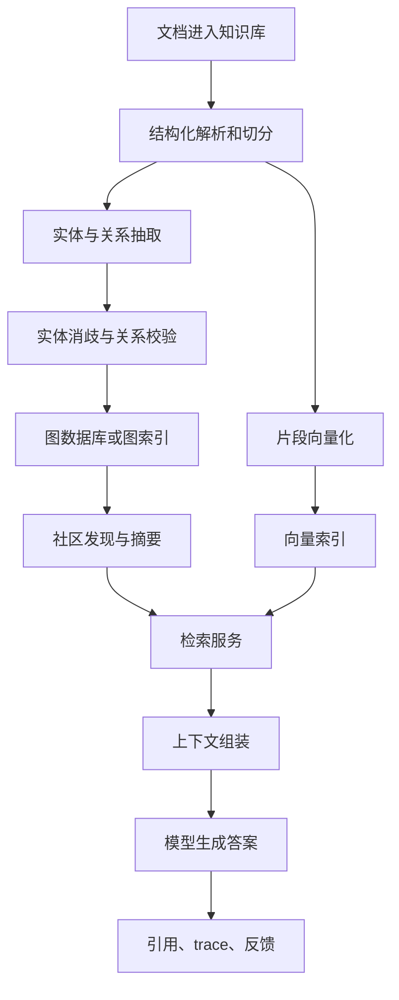

# GraphRAG 入门：从向量检索到关系推理

## 问题背景

很多团队第一次做 RAG，会从向量检索开始：把文档切成 chunk，做 embedding，用户提问时相似度搜索，取前几段塞进模型。这个方案在 FAQ、接口说明、单篇文档问答里很好用，因为问题和答案通常共享词面或语义邻近关系。问题一旦变成“某个项目为什么从 A 方案切到 B 方案”“哪些客户同时受到了权限变更和计费策略的影响”“这次事故和上季度的架构调整有什么关系”，单纯向量召回就开始吃力。

向量空间擅长找相似文本，却不擅长表达“谁影响了谁”“谁属于哪个组织”“哪个事件发生在另一个事件之后”。它可以召回几段看似相关的材料，但这些材料之间的连接关系常常隐含在标题、会议纪要、代码提交、ADR 和聊天记录里。模型如果只能看到孤立片段，就会用自己的语言把它们拼起来，拼得顺时还像分析，拼错时就是幻觉。GraphRAG 的核心价值不是把知识图谱这个词放进架构图，而是让检索系统在回答前拥有一层可检查的关系结构。

我更愿意把 GraphRAG 看成 RAG 的第二条腿：向量检索负责“找相似材料”，图谱检索负责“找相关对象和路径”。一个工程系统需要同时知道用户问题提到了哪些实体、这些实体在知识库里有哪些别名和来源、它们之间通过哪些关系相连、哪些局部社区能解释高层语义。这样上下文组装不是简单 top-k，而是围绕问题构造一组证据：原文片段、实体卡片、关系路径、社区摘要和时间线。

这个心智模型能帮团队避开两个常见误区。第一个误区是以为 GraphRAG 必须先建设一张完美大图谱，结果项目在 schema 讨论和抽取质量争论里停住。实际落地应从高价值问题开始，给这些问题需要的实体、关系和摘要建最小闭环。第二个误区是把图谱当成向量库的替代品，完全放弃语义召回。真实系统里，两者应该互相补位：向量先帮你找到入口材料，图谱再沿着实体关系扩展，最后由重排和生成层组合证据。

## 核心概念

GraphRAG 的基础对象可以拆成五类：文档、片段、实体、关系和社区。文档是知识来源，例如一篇 ADR、一份会议纪要、一张事故复盘。片段是可引用的原文窗口，负责保留证据。实体是系统关心的对象，例如项目、服务、团队、用户群、指标、策略、模型、接口。关系表达实体之间的语义连接，例如“依赖”“替代”“由谁负责”“在某事件中被影响”“引用了某决策”。社区是图上密集连接的一组实体和关系，通常能对应一个项目、模块、议题或阶段性工作。

这几个概念各自承担不同责任，不能混在一起。片段回答“证据在哪里”，实体回答“问题里的对象是谁”，关系回答“对象之间如何连接”，社区摘要回答“这一片知识整体讲什么”。GraphRAG 的稳定性来自职责分离：抽取错误可以回到片段，实体合并可以单独修正，关系权重可以重新计算，社区摘要可以按版本重建，而不是把所有内容塞进一段不可解释的长摘要。

| 对象 | 工程责任 | 常见字段 | 出错后果 |
| --- | --- | --- | --- |
| Document | 来源和生命周期 | path、owner、status、updated_at | 引用失效，权限混乱 |
| Chunk | 原文证据窗口 | text、section、offset、token_count | 答案不可回跳 |
| Entity | 稳定知识节点 | type、name、aliases、source_count | 同一对象被拆散 |
| Relation | 可推理连接 | predicate、from、to、confidence | 关系路径误导回答 |
| Community | 高层语义压缩 | member_ids、summary、version | 全局问题召回不足 |

GraphRAG 的“推理”也要说清楚。这里不是让系统做严格逻辑证明，而是让检索阶段有能力沿着显式关系组织材料。例如用户问“为什么本地 RAG 的权限设计影响了浏览器自动化验证”，系统可以先识别“本地 RAG”“权限设计”“浏览器自动化验证”三个实体，然后查找它们是否同属于“桌面 AI 助手安全边界”社区，是否有“约束工具调用”“限制文件读取”“需要人工确认”之类关系。模型最终仍然负责自然语言回答，但它看到的是经过结构化筛选的证据，而不是一堆相似文本。

实体和关系不必一开始就追求全自动。早期可以用 LLM 抽取候选，再用规则、白名单和人工审核处理核心实体。比如技术知识库里，服务名、仓库名、接口名、会议标题、ADR 编号都可以通过规则先稳定下来；LLM 更适合抽取“导致”“替代”“缓解”“依赖”这类语义关系。这个分工很重要，因为图谱里最难修的不是漏掉一条边，而是把本来不同的对象错误合并，或者把推测关系当成事实关系写进去。

## 架构/流程图解说明

一套可落地的 GraphRAG 链路可以分成离线构建和在线问答两部分。离线链路把原始资料转成可检索的多层索引；在线链路把用户问题转成检索计划，再组装上下文。下面这张图描述的是最小可用版本，不包含复杂的数据治理平台，但已经覆盖了工程上最容易漏掉的关键节点。



离线阶段最重要的是保留来源链。每个实体和关系都要能追溯到原文片段，否则图谱会慢慢变成“看起来很对但没人敢信”的黑箱。实践中我会给每条关系保存 evidence 数组，里面包含 chunk_id、原文句子、抽取模型版本、置信度和审核状态。这样线上回答展示一条关系路径时，可以把路径下的证据片段也带出来，用户可以点回原文检查。

在线阶段可以按四步走。第一步是 query understanding，识别问题里的实体候选、时间限制、关系意图和回答类型。第二步是 seed retrieval，用向量检索和关键词检索找到入口片段，同时在实体索引里找匹配节点。第三步是 graph expansion，从种子实体向外扩展一到三跳，按关系类型、时间、权限、置信度过滤。第四步是 context assembly，把片段、实体说明、关系路径和社区摘要排成模型容易读的顺序。

这里有个细节：不要把图谱路径直接丢给模型。模型需要的是“带证据的可读上下文”，不是数据库返回的边列表。比较稳定的格式是先给问题相关的高层社区摘要，再给关键实体卡片，然后给按时间或因果顺序排列的证据片段，最后附上关系路径。这样模型既能看到全局，也能落回具体材料。

## 工程实现

最小实现可以不急着上复杂图数据库。对于中小型知识库，PostgreSQL 加 pgvector、几张关系表和一个离线批处理任务就足够启动。等到图规模、路径查询和社区发现需求上来，再把关系层迁到 Neo4j、Kuzu、AGE 或独立图服务。关键不是数据库名字，而是数据契约是否稳定。

我通常会先定义这些表：documents、chunks、entities、entity_aliases、relations、relation_evidence、communities、community_members、community_summaries。chunks 里保存原文、section、offset 和 embedding；entities 里保存 canonical_name、type、description、confidence；relations 里保存 from_entity_id、to_entity_id、predicate、weight、valid_from、valid_to；evidence 表连接 relation 和 chunk。这样的结构能支持增量更新，也能支持失败回放。

抽取流程不要写成“一次 prompt 得到所有东西”。更稳的做法是多阶段、小输出、可校验。第一阶段从 chunk 中抽实体候选，只要名称、类型、上下文句子。第二阶段对相邻片段或同一节下的实体对抽关系。第三阶段做实体消歧，把别名、缩写、大小写、中文英文名对齐。第四阶段对高价值关系做校验，要求模型只基于 evidence 判断关系是否成立。每阶段输出都用结构化 schema，失败时能重试单个 chunk，而不是重跑整篇文档。

```json
{
  "relation": {
    "from": "Local RAG",
    "predicate": "requires_boundary_for",
    "to": "browser automation",
    "confidence": 0.82,
    "evidence": [
      {
        "chunk_id": "doc-2026-05-privacy-003",
        "quote": "浏览器自动化必须遵守本地知识库的权限过滤结果"
      }
    ]
  }
}
```

在线检索服务可以暴露一个统一接口，而不是让业务层分别调用向量库和图数据库。接口输入是 query、user_context、permission_scope、debug flag，输出是 assembled_context、citations、trace_id 和候选证据。这样前端、评测任务和调试工具都能复用同一条链路。Go 实现时可以把每个阶段做成小接口：QueryParser、SeedRetriever、GraphExpander、ContextAssembler、AnswerGenerator。每个接口都接收 context.Context，记录耗时和输入输出摘要，便于压测和定位。

重排层也值得认真做。GraphRAG 很容易召回太多材料，尤其是实体节点连接很多时。可以给候选上下文打四类分：文本相似度、图距离、关系置信度、来源新鲜度。一个事故复盘问题应该提高时间相关性和因果关系权重；一个架构背景问题应该提高社区摘要和 ADR 来源权重。权重先用配置文件，不必一开始训练模型，但要把每次排序结果写进 trace，后面才能根据失败样本调整。

## 一个小型落地样例

假设团队要给个人技术知识库做 GraphRAG，第一批材料只有五十篇 Markdown：RAG 笔记、Agent 设计、MCP 工具、评测复盘和本地工具流。不要一开始就设计企业级本体。更务实的切口是选十个真实问题，例如“哪些文章讨论了权限边界”“GraphRAG 的评测和普通 RAG 评测有什么差异”“哪些内容适合进入上线 checklist”。这些问题会反推出第一版实体和关系：Article、Topic、Tool、Metric、ChecklistItem，以及 discusses、depends_on、evaluated_by、has_risk、has_checklist。

离线构建时，每篇文章先按标题切分，二级标题成为结构节点，段落成为证据 chunk。抽取器只允许从标题和正文里抽受控实体，不允许自由创造抽象大词。比如“引用链”“实体消歧”“社区摘要”可以成为 Topic，“更可靠”“更稳定”不能成为实体。关系抽取只在同一小节和相邻小节内进行，避免把整篇文章里相距很远的概念硬连起来。这样第一版图谱不会很大，但每条边都能说清楚来源。

在线回答时，如果用户问“我应该先做实体消歧还是社区摘要”，系统会先用向量召回找到两篇相关材料，再识别出 Entity Resolution 和 Community Summary 两个 Topic，沿着关系查到它们共同依赖 Schema、Chunk Evidence 和 Evaluation。上下文组装时先给出一段社区摘要：“这一组内容围绕 GraphRAG 数据质量展开，实体稳定性决定关系可靠性，社区摘要依赖较干净的关系图。”随后给出两三段原文证据。模型最后回答的重点就不会是泛泛比较，而是能说出工程顺序：先保证实体稳定，再做关系质量，再生成社区摘要。

这个样例里最有价值的不是算法复杂度，而是闭环短。新增一篇文章后，系统能显示新增了哪些实体、哪些关系、哪些社区摘要失效。回答失败后，能看到是问题没识别出 Topic，还是图扩展没找到关系，还是上下文组装漏了原文。小知识库的好处是每个错误都能人工检查，团队可以在低成本环境里把抽取、消歧、重排和引用链路打磨清楚，再迁移到更大的团队知识库。

## 实战补充：把 GraphRAG 当成检索编排系统

真实上线时，GraphRAG 最容易被误解成“先建图，再问图”。这个说法会让工程实现走偏，因为问答链路里最难的部分不是单次图查询，而是检索编排。一个可靠回答通常需要多种入口同时工作：向量召回找到问题措辞相近的原文，实体匹配找到稳定对象，图扩展找到对象之间的连接，社区摘要找到高层主题，最后重排层决定哪些证据真的进入上下文。把这些步骤当成可观测的编排流程，系统才有调试空间。

我在做 Go 服务时会把一次问答拆成明确的 stage，每个 stage 都写入 trace。第一段记录 query parse 的结果，包括识别出的实体、时间范围、关系意图和不确定项。第二段记录 seed retrieval，区分向量命中的 chunk、关键词命中的标题、实体索引命中的 canonical entity。第三段记录 graph expansion，保留每条路径的关系类型、跳数、置信度和被过滤原因。第四段记录 context assembly，说明为什么某段 evidence 被放进最终上下文，为什么另一些候选被丢弃。

这种设计在排查事故时很有用。比如某次用户问“新权限策略会不会影响浏览器自动化回放”，系统回答只谈权限，漏掉浏览器自动化。看最终答案很难判断原因，但 trace 显示 query parse 已识别出浏览器自动化，seed retrieval 也召回了相关 chunk，问题出在 graph expansion 阶段只允许 `depends_on` 和 `owned_by`，没有放行 `constrained_by`。修复就不是盲目调 prompt，而是给风险分析类问题补关系类型映射，并把这个样本加入回归集。

另一个常见事故是“图谱证据压过了原文证据”。某些核心实体连接很多，图扩展分数很高，结果上下文里塞满关系路径，真正解释条件和例外的原文片段被挤掉。我的处理方式是给最终上下文设置配额：社区摘要最多一段，实体卡片最多若干条，关系路径只保留能连接关键实体的路径，剩余预算优先给原文 chunk。GraphRAG 的强项是组织证据，不是用结构化信息取代证据。

团队协作上，GraphRAG 还需要一套失败分类语言。一次错误不要只写“回答不准”，而要标成实体未命中、实体误合并、关系缺失、弱关系污染、社区摘要过期、重排丢证据、生成过度推断等类别。产品、工程和内容同学用同一套分类复盘，改进才会落到正确层级。否则每个问题都会被推给模型，最后变成不断更换模型和 prompt，却没有提升知识系统本身的可靠性。

## 测试评测

GraphRAG 的评测不能只看最终回答像不像。至少要拆成实体召回、关系召回、证据覆盖、答案忠实度和引用可用性五层。实体召回看问题里的关键对象有没有命中正确节点；关系召回看系统是否找到了必要路径；证据覆盖看上下文里有没有足够原文；答案忠实度看回答是否只基于证据；引用可用性看用户能否从答案回到具体文档位置。

评测集最好来自真实问题。可以从团队周会、事故复盘、客户支持、架构评审里抽样，人工标注“这个问题至少需要哪些实体、哪些文档、哪些关系”。例如“为什么 2026 年 5 月的知识库首页改版会影响 RAG 文章发布流程”，标准答案可能需要命中“首页索引”“文章元数据”“静态生成脚本”“内容源 Markdown”几个实体，并引用具体提交或文档。这样的样本比通用问答更能反映系统是否真的解决业务问题。

| 评测层 | 指标 | 检查方式 | 失败时优先看 |
| --- | --- | --- | --- |
| 实体召回 | key entity recall | 标注实体是否命中 | 别名、切分、抽取 prompt |
| 关系召回 | path recall | 标注路径是否出现 | 图扩展深度、关系过滤 |
| 证据覆盖 | evidence coverage | 原文片段是否足够 | chunk 粒度、权限过滤 |
| 忠实度 | groundedness | 回答句是否有来源 | 上下文组装、生成提示 |
| 引用可用 | citation validity | 链接能否回跳 | offset、文档生命周期 |

自动评测可以先做硬指标，再加 LLM judge。硬指标包括命中率、引用链接有效率、无答案时拒答率、平均图扩展节点数、上下文 token 分布。LLM judge 适合评估答案是否覆盖关键点、是否过度推断，但 judge 自身也要固定版本和提示词。重要的是每次改抽取模型、切分策略、图扩展策略、重排权重，都跑同一套回归集，并保存新旧差异。

线上还要做观测。每个回答应该有 trace：query parse 结果、seed chunks、seed entities、graph paths、community summaries、rerank scores、final context、citations、model output。用户点“答案不对”时，不要只保存最后文本，要保存整条检索链路。很多 GraphRAG 问题不是模型生成错，而是早在实体消歧或图扩展时走偏了。

## 失败模式

第一个失败模式是实体爆炸。系统把“RAG”“GraphRAG”“知识系统”“项目知识库”全部当成独立实体，结果图上出现大量近义节点，关系被稀释。解决方式是把实体类型收窄，先只抽团队真正会问的对象，给别名表和 canonical name 做人工入口。不要让模型无限创造抽象概念节点。

第二个失败模式是关系污染。LLM 会把同一段里的两个实体推断成“影响”“导致”“依赖”，但原文并没有明确证据。关系一旦进入图谱，后续社区摘要会继续引用它，错误会被放大。工程上要区分 observed relation 和 inferred relation，前者来自明确文本，后者只能作为候选，不能直接用于高置信回答。

第三个失败模式是社区摘要过度压缩。社区摘要本来是为了让系统理解全局，但如果摘要写得像宣传文案，没有保留争议点、时间范围和证据来源，就会诱导模型给出漂亮但空的答案。社区摘要要有结构：范围、核心实体、主要关系、时间边界、已知冲突、代表性来源。摘要还要带版本，因为底层文档更新后旧摘要可能失效。

第四个失败模式是图扩展失控。一个热门实体可能连接几百条边，扩展两跳就把上下文撑爆。需要按问题意图限制关系类型，例如问“谁负责”时优先 owner、maintainer、team；问“为什么”时优先 cause、decision、tradeoff；问“影响范围”时优先 depends_on、used_by、affected_by。扩展深度和候选数量必须有上限，并在 trace 中暴露。

第五个失败模式是引用链断裂。图谱节点和社区摘要很容易脱离原文，如果最终答案引用的是摘要而不是原始片段，用户无法判断真实性。更稳的做法是摘要可以帮助召回和排序，但最终关键事实必须引用 chunk。没有 chunk 证据的句子，要么降级成“系统推断”，要么不输出。

## 上线 checklist

- 文档、片段、实体、关系、社区都有稳定 ID，并能跨增量更新保持一致。
- 每个实体和关系都能回到原始 chunk，关系 evidence 保存抽取模型版本和审核状态。
- 实体类型和关系类型有白名单，新增类型需要评审，不允许线上自动扩散 schema。
- 图扩展有深度、节点数、关系类型、权限范围和时间范围限制。
- 上下文组装同时包含社区摘要、实体卡片、关系路径和原文片段，但关键事实以原文为准。
- 评测集覆盖实体召回、关系路径、引用有效、拒答和冲突知识场景。
- trace 能展示 query parse、召回候选、图扩展、重排分数、最终上下文和引用。
- 增量索引能处理文档新增、删除、移动、重命名和权限变化。
- 社区摘要有版本号、生成时间、底层成员集合和失效重建策略。
- 线上有人工反馈入口，失败样本能进入回归评测，而不是只进入客服记录。

## 总结

GraphRAG 不是给 RAG 加一个复杂名词，而是把“文本相似”之外的知识关系显式化。向量检索告诉我们哪些片段语义接近，图谱告诉我们哪些对象互相连接，社区摘要帮助系统理解局部网络的高层含义。三者组合起来，模型才更容易回答跨文档、跨时间、跨团队的问题。

真正的工程重点是边界：实体要稳定，关系要有证据，摘要要可重建，扩展要有限制，答案要能引用。不要从宏大的企业知识图谱开始，而要从一组真实问题开始，找出这些问题需要哪些对象和路径，再逐步补齐抽取、消歧、评测和观测。GraphRAG 的价值不在于把所有知识一次性结构化，而在于让每次回答都能沿着可检查的证据链往回走。
