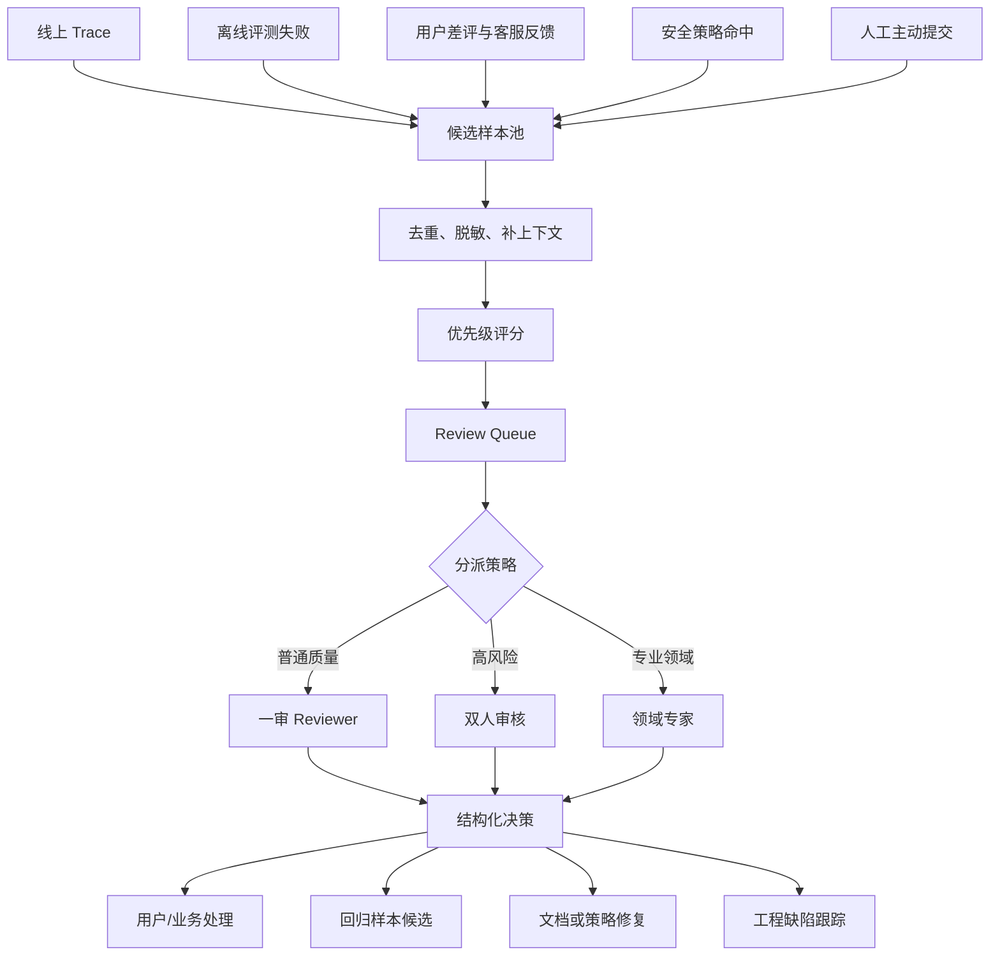
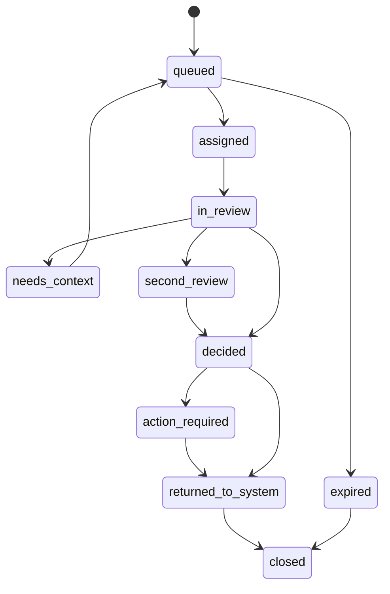

# 人工 review 队列

## 问题背景

AI 应用上线后，迟早会遇到自动化判断处理不了的样本。模型回答看起来合理，但证据是否足够需要领域专家确认；工具调用没有报错，但执行这个动作是否符合业务规则需要运营判断；用户给了差评，但到底是答案错、期望不一致、界面误导，还是用户本身问得含糊，需要人看完整上下文。这个时候如果没有人工 review 队列，团队通常会用临时表格、聊天群截图和口头同步来处理，结果是问题分散、优先级混乱、结论不可追溯。

人工 review 最常见的失败，不是没人愿意看，而是所有样本都被当成同等重要。线上每天产生几百条低置信回答、几十条用户差评、十几条工具失败、若干条安全策略命中，如果全部丢给 reviewer，队列会很快堆满。审核人员会先看容易判断的，复杂高风险样本反而滞留；产品同学会追自己关心的客户，工程师会盯自己刚改的功能，最后队列不再是质量系统，而是一个人工焦虑收集器。

AI 应用里的人工 review 队列，应该优先处理三类样本：高风险、高价值和模型低置信。高风险是指可能造成权限泄露、错误决策、财务损失、合规问题或生产事故；高价值是指关键客户、关键业务流程、重要转化和高频场景；低置信是指自动评分器、模型自评、检索证据和运行时信号都显示不稳定。队列的意义不是把所有机器不确定的东西都交给人，而是把最值得人判断的东西排到前面。

这里的 review 也不只是“看一眼对不对”。一个有工程价值的人工 review，要产出结构化结论：样本是否正确、错误类型是什么、证据是否充分、应该怎么修、是否需要进入回归集、是否需要更新文档或策略、是否需要触发事故流程。没有结构化结论，人工审核只是临时救火；有了结构化结论，审核结果才能回流到评测集、prompt、检索、工具 schema、产品策略和运营流程。

我在做 AI 工程系统时，会把人工 review 队列放在评测和观测之间。线上 trace、自动评测、用户反馈和策略引擎把候选样本送进队列；reviewer 依据统一 rubric 做判断；判断结果一方面用于处理当前用户或业务问题，另一方面进入样本治理和系统修复。这样人工判断不再是自动化失败后的补丁，而是持续改进闭环的一部分。

人工 review 的另一个价值，是给团队校准质量语言。工程师说“模型幻觉”，业务同学说“答非所问”，客服说“客户不满意”，安全同学说“边界不稳”，这些描述都可能指向不同问题。通过统一的审核任务、错误分类和判定协议，团队会逐渐形成同一套语言：缺证据、证据冲突、引用不支持结论、工具参数错误、拒答过度、拒答不足、格式不可用、用户意图不清、业务规则缺失。语言一致以后，修复才会快。

## 核心概念

第一个核心概念是“审核单元”。不要让 reviewer 审核一整段混乱日志，也不要只给最终答案。一个审核单元应该包含用户输入、必要上下文、模型输出、关键 trace、候选证据、工具调用、自动评分结果、风险标签和需要回答的问题。审核单元越清楚，reviewer 越能稳定判断；审核单元越含糊，审核结果越依赖个人经验，后续也难以复盘。

第二个概念是“优先级分数”。队列不能先进先出。先进先出适合普通工单，不适合 AI 风险处理。一个样本如果涉及高风险动作、关键客户和低置信输出，应该立刻排到前面；一个普通问答虽然也低置信，但没有业务影响，可以延后或抽样。优先级分数通常由风险、业务价值、置信度、等待时间、重复次数和时效性共同决定。

第三个概念是“判定协议”。人工 review 不能只给自由文本意见。每个任务类型都应该有 rubric：什么算通过，什么算失败，什么算证据不足，什么情况需要升级，什么情况需要补充信息。rubric 不需要写成法律条文，但要让两个 reviewer 在同一个样本上大体给出一致结论。没有判定协议，队列会变成主观评价池。

第四个概念是“队列状态机”。一个样本从进入队列到关闭，中间可能经历待分派、审核中、需要二审、需要领域专家、已决策、已回流、已关闭、已废弃。状态机清楚，才能做 SLA、权限、审计和报表。没有状态机，样本会在聊天群和表格里丢失，最后没人知道某个高风险问题有没有处理完。

第五个概念是“反馈回流”。review 的结果必须回到系统里。错误样本应该进入回归候选；缺失证据应该进入文档维护；工具参数错误应该进入工具 schema 或 planner 修复；低价值噪声样本应该更新采样策略；业务规则争议应该形成产品决策。只把 review 当作人工兜底，会让同类问题反复进入队列，人的时间被重复消耗。

| 概念 | 队列里的表现 | 工程要求 | 典型反例 |
| --- | --- | --- | --- |
| 审核单元 | 一条可判断任务 | 带输入、输出、trace、证据和问题 | 只贴一段模型回答让人评价 |
| 优先级分数 | 决定谁先被看 | 风险、价值、置信度和等待时间共同计算 | 所有样本先进先出 |
| 判定协议 | 保证结论一致 | 结构化 rubric 和错误分类 | reviewer 各写各的感受 |
| 状态机 | 管理任务生命周期 | 明确流转、SLA、owner 和审计 | 表格里改颜色表示状态 |
| 反馈回流 | 让审核变成质量资产 | 进入评测、文档、策略和修复流程 | 看完就关闭，没有沉淀 |

人工 review 还要区分“生产兜底”和“质量标注”。生产兜底关注当前用户是否需要立刻修正、是否需要人工接管、是否需要阻断动作；质量标注关注这个样本能不能用于评测、错误归因是否准确、系统应该如何长期修复。同一个队列可以承载两种任务，但界面和 SLA 要区分。生产兜底要求快，质量标注要求准；混在一起会互相伤害。

## 架构/流程图解说明

一个人工 review 队列可以画成三段：候选进入、队列调度、结果回流。候选进入来自线上运行时、离线评测、用户反馈、策略引擎和人工主动提交。队列调度根据优先级、技能标签、权限和 SLA 分派给 reviewer。结果回流把结构化结论写入样本库、事故系统、产品 backlog、文档任务和模型改进流程。



这张图里，“去重、脱敏、补上下文”是非常关键的一步。原始 trace 可能包含隐私数据、客户名称、订单号、内部链接和大量无关事件。直接暴露给所有 reviewer 不安全，也会降低判断效率。系统应该根据任务类型生成最小必要上下文：保留判断所需的事实和证据，隐藏不必要的敏感字段，同时保留可审计的原始引用。对于权限敏感任务，reviewer 只能看到自己有权限查看的内容。

队列调度不应该只按人手空闲分配。不同 reviewer 有不同能力标签：产品政策、法律合规、数据分析、工具调用、代码生成、客服话术、行业知识。样本也应该有技能标签和风险标签。高风险样本需要双人审核或专家审核；普通低风险样本可以抽样；明显重复样本可以合并成一个簇，只审核代表样本。这样才能把有限的人力用在最需要判断的地方。



状态机设计要支持两种超时。第一种是业务 SLA 超时，例如高风险客户问题必须十五分钟内有人接手；第二种是样本时效超时，例如某些实时问题过了二十四小时就没有生产处理价值，但仍可能保留为质量样本。超时不是简单关闭，而是触发升级或降级：高风险超时要通知值班，低风险超时可以转为抽样池，重复样本可以合并。

审核结果回流时，需要把“当前处理”和“长期修复”分开。当前处理可能是给用户重新生成答案、转人工客服、撤回高风险动作、补发说明。长期修复可能是新增回归样本、修改 prompt、调整检索、补文档、改工具 schema、增加策略规则。如果系统只记录当前处理，下一次同类问题还会进队列；如果只记录长期修复，当前用户体验会被忽略。

## 工程实现

队列的数据结构要从一开始就支持审计和演进。下面是一个简化的 Go 结构，表达审核任务、优先级、上下文、决策和回流动作之间的关系：

```go
type ReviewTask struct {
    TaskID        string            `json:"task_id"`
    Source        string            `json:"source"` // online_trace, eval_failure, user_feedback, policy_hit
    SourceID      string            `json:"source_id"`
    TaskType      string            `json:"task_type"`
    RiskLevel     string            `json:"risk_level"`
    BusinessValue string            `json:"business_value"`
    Confidence    float64           `json:"confidence"`
    PriorityScore float64           `json:"priority_score"`
    Status        string            `json:"status"`
    SkillTags     []string          `json:"skill_tags"`
    CreatedAt     time.Time         `json:"created_at"`
    DueAt         time.Time         `json:"due_at"`
    AssignedTo    string            `json:"assigned_to,omitempty"`
    ContextRef    string            `json:"context_ref"`
    RedactionPlan string            `json:"redaction_plan"`
    Metadata      map[string]string `json:"metadata"`
}

type ReviewDecision struct {
    TaskID          string    `json:"task_id"`
    ReviewerID      string    `json:"reviewer_id"`
    Verdict         string    `json:"verdict"` // correct, incorrect, insufficient_evidence, unclear_intent
    ErrorCategory   string    `json:"error_category,omitempty"`
    EvidenceQuality string    `json:"evidence_quality"`
    Severity        string    `json:"severity"`
    NeedsSecondPass bool      `json:"needs_second_pass"`
    ActionItems     []Action  `json:"action_items"`
    Notes           string    `json:"notes"`
    DecidedAt       time.Time `json:"decided_at"`
}
```

优先级分数可以先用可解释规则，不要一开始就训练复杂模型。一个实用公式是：

```text
priority =
  risk_weight(risk_level) * 0.40 +
  value_weight(business_value) * 0.25 +
  uncertainty_weight(1 - confidence) * 0.20 +
  age_weight(waiting_minutes) * 0.10 +
  recurrence_weight(similar_count) * 0.05
```

这个公式不是为了精确，而是为了让调度逻辑透明。高风险样本天然靠前，高价值客户靠前，低置信靠前，等待太久会逐渐上升，重复出现的问题也会被抬高。权重应该能配置，并且要在报表里展示“为什么这条排第一”。如果 reviewer 不理解排序，就会绕过系统，用私聊和手工置顶恢复旧流程。

审核上下文建议分层展示。第一屏只放判断必需的信息：用户问题、模型答案、自动评分、风险标签、候选证据、需要 reviewer 回答的问题。第二屏放 trace 摘要：检索命中、上下文片段、工具调用、模型版本、prompt 版本、成本和延迟。第三屏放原始材料链接和审计信息。这样 reviewer 可以快速处理简单样本，也能深入调查复杂样本。

一个具体审核单元可以长这样：

```yaml
task_id: rv_20260307_1832
source: online_trace
task_type: rag_answer_quality
risk_level: high
business_value: strategic_customer
confidence: 0.42
review_question: "判断模型关于合同续费折扣的回答是否被证据支持，是否需要人工接管。"
user_input: "我们去年签的企业合同，今年续费还能按旧折扣吗？"
model_answer_summary: "模型回答可以沿用旧折扣，并建议直接联系客户成功经理执行。"
auto_findings:
  - citation_missing: "回答中的旧折扣结论没有引用合同条款"
  - policy_conflict: "当前政策要求超过 15% 折扣必须审批"
evidence_snippets:
  - doc_id: renewal-policy-2026
    text: "企业合同续费折扣超过 15% 时，需要区域负责人审批。"
  - doc_id: account-note-2025
    text: "该客户去年享受 20% 首年折扣，不自动延续。"
required_decision:
  verdict:
    - correct
    - incorrect
    - insufficient_evidence
    - unclear_intent
  error_category:
    - unsupported_claim
    - policy_violation
    - missing_context
    - bad_tone
```

这个任务不是让 reviewer 自由发挥，而是让他回答明确问题。reviewer 如果判定 incorrect，可以选择 `unsupported_claim` 和 `policy_violation`，并添加动作：当前回答需要撤回，样本进入回归集，续费政策文档需要加入检索白名单，客服助手 prompt 需要强调折扣审批。这样的结构化结果才能驱动后续自动化。

去重和聚类要尽早做。线上可能一天出现几十个类似问题，如果每条都单独审核，队列会被重复样本淹没。可以用三层去重：先按 source_id 防重复入队，再按相同 trace 或相同用户反馈合并，最后按语义相似和错误类别聚类。聚类后只审核代表样本，其他样本继承结论但保留差异。对于高风险样本，不建议完全自动合并，至少要保留人工确认入口。

权限和隐私是 review 队列的底线。reviewer 看到的内容要经过 redaction plan 控制：订单号脱敏、个人身份信息哈希化、客户名称按权限显示、内部密钥和凭证永不展示。系统要记录谁看过什么、谁做了什么决定、依据是什么。对于合规场景，review 决策本身也是审计材料，不能只存在聊天记录里。

分派策略可以从简单规则开始：高风险样本进入值班池并要求双人审核；有明确技能标签的样本分给对应组；低风险样本进入批量标注池；超过 SLA 的样本升级给值班负责人。后续可以引入负载均衡和 reviewer 准确率，但不要让算法分派变成黑盒。人工审核系统越需要信任，越要解释清楚任务为什么被分给某个人。

结果回流最好用 action item 表达，而不是让 reviewer 写一大段建议。常见 action 包括：

- `create_regression_sample`：把当前样本转成回归候选，补齐期望行为和证据。
- `open_bug`：创建工程缺陷，绑定 trace 和错误类别。
- `update_policy`：需要产品或合规更新策略文档。
- `improve_retrieval`：证据未召回或排序错误。
- `adjust_prompt`：输出策略、语气或拒答边界需要修改。
- `contact_user`：当前用户需要人工回复或补救。
- `no_action_noise`：样本是噪声，只用于采样策略调整。

这些 action item 要进入对应系统，而不是停留在 review 页面。否则 reviewer 以为已经处理，工程师却没有看到；工程师修了 bug，样本却没有进入回归；文档 owner 不知道证据缺失，下一次仍然答错。队列的价值在于连接，不在于页面本身。

## 测试评测

人工 review 队列也需要评测。第一类指标是队列运行指标：入队量、出队量、积压量、P50/P95 等待时间、SLA 命中率、超时升级次数、每类任务处理耗时。它们回答“队列是否健康”。如果积压持续上涨，说明采样策略、优先级或人力配置有问题；如果高风险 SLA 频繁超时，说明值班机制不够；如果低风险任务占用大量时间，说明自动过滤不足。

第二类指标是审核质量指标：双人一致率、专家复核通过率、自动评分器与人工结论一致率、错误分类稳定性、reviewer 之间的偏差。人工判断不是天然正确，也会漂移。要定期抽样复核，尤其是高风险和边界样本。如果两个 reviewer 对同类样本经常分歧，不要简单判某个人错，先检查 rubric 是否含糊、上下文是否不足、业务规则是否不明确。

第三类指标是回流效果：多少 review 样本进入回归集，多少触发工程修复，多少触发文档更新，多少同类问题在修复后下降。这个指标最能判断队列是否有价值。一个队列如果每天处理很多任务，但同类错误没有减少，它只是人工缓冲层，不是改进系统。真正好的队列应该让重复问题越来越少，让 reviewer 花更多时间处理新边界，而不是反复处理旧错误。

| 指标类别 | 具体指标 | 代表问题 | 目标方向 |
| --- | --- | --- | --- |
| 运行效率 | 积压量、等待时间、SLA 命中 | 队列是否堵塞 | 高风险快、低风险可控 |
| 审核质量 | 一致率、复核推翻率、分类稳定性 | 人工判断是否可信 | 分歧可解释、口径稳定 |
| 回流效果 | 回归样本转化、bug 修复、文档更新 | 审核是否产生工程价值 | 同类问题减少 |
| 成本投入 | 每条审核耗时、专家占用、重复样本率 | 人力是否浪费 | 人看高价值样本 |
| 风险控制 | 高风险漏审、越权查看、审计缺失 | 队列本身是否安全 | 零严重漏审 |

测试队列调度，可以做历史流量回放。拿一周真实候选样本，使用新的优先级规则重放，看高风险样本是否更早被处理，普通样本积压是否可接受，某些技能组是否被过度分配。不要等规则上线后才发现所有合规样本都挤到一个专家名下。队列系统和调度系统一样，需要容量规划。

测试判定协议，可以做标注校准会。选二十条典型样本，隐藏历史结论，让多个 reviewer 独立判断，然后比较差异。差异大的样本拿出来讨论：是证据不足、rubric 不清、业务规则冲突，还是界面没有展示关键信息。校准会的产出应该是更新 rubric、补充例子、调整错误分类，而不是要求 reviewer “以后注意”。

测试回流链路，要从一个 review 决策一路追到结果。比如 reviewer 选择 `create_regression_sample`，系统是否真的创建候选样本，是否带上 trace、证据和期望，是否有人负责补全，是否在下次发布评测中出现。reviewer 选择 `open_bug`，缺陷是否绑定任务，修复后是否自动回填状态。没有这些闭环测试，队列会出现大量“已决策但未落地”的幽灵任务。

## 失败模式

第一个失败模式是队列变成垃圾桶。所有自动化不敢判的东西都丢进来，reviewer 很快被噪声淹没。解决办法是设置入队门槛和采样策略：低风险低价值样本抽样，高重复样本聚类，明显无效样本自动丢弃，高风险样本强制入队。队列容量是有限资源，不能让它承接所有不确定性。

第二个失败模式是优先级不可解释。系统说某条样本优先级高，但 reviewer 不知道原因，于是按个人判断重排。久而久之，队列排序失效。优先级应该展示构成：风险分多少、业务价值多少、置信度多少、等待时间多少、重复次数多少。可解释不等于完美，但能让人知道什么时候应该信系统，什么时候应该反馈规则问题。

第三个失败模式是审核结论只有自由文本。自由文本对理解细节有帮助，但不能驱动系统。没有结构化 verdict、error_category 和 action item，就无法统计错误类型，无法自动创建回归样本，也无法衡量修复效果。自由文本应该作为补充说明，而不是主要结果。

第四个失败模式是 reviewer 口径漂移。今天某个回答被判“证据不足”，下周类似回答被判“可以接受”。可能是业务规则变了，也可能是 reviewer 疲劳或新人未校准。需要双人一致率、专家抽检和定期校准。高风险任务不要依赖单人判断。

第五个失败模式是过度依赖专家。所有复杂样本都找同一个领域专家，短期准确，长期不可扩展。专家应该参与 rubric 设计、典型样本沉淀和二审，而不是承担所有一审。系统要把专家知识转成可执行规则、审核指南和训练样本，让普通 reviewer 能处理大部分场景。

第六个失败模式是隐私边界失守。为了方便审核，把完整用户输入、内部文档和工具返回都展示出来，最后 review 队列本身成为数据泄露面。必须做最小必要展示、权限控制、脱敏、访问审计和保留周期管理。质量系统不能以牺牲安全为代价。

第七个失败模式是审核不回流。任务关闭了，但没有回归样本、没有 bug、没有文档更新、没有策略变化。下一次同类问题再次入队，人继续重复判断。每个错误 verdict 都应该要求至少一个 action item，除非明确标记为噪声或无法行动。队列要对“同类问题减少”负责，而不只是对“任务关闭”负责。

第八个失败模式是 SLA 设计单一。所有任务都要求二十四小时内处理，结果高风险样本不够快，低风险样本又造成压力。SLA 要按风险和用途分层：生产高风险可能分钟级，关键客户小时级，质量标注天级，探索样本周级。不同 SLA 对应不同升级机制和人员配置。

## 上线 checklist

- 入队来源已经明确：线上 trace、评测失败、用户反馈、策略命中和人工提交分别有入口和去重规则。
- 每个审核任务都有最小必要上下文，包括输入、输出、关键 trace、证据、自动评分和 review question。
- 优先级分数可解释，至少包含风险、业务价值、置信度、等待时间和重复次数。
- 队列状态机已经实现，支持分派、审核中、需要补上下文、二审、已决策、回流、关闭和超时。
- 高风险样本有双人审核或专家审核策略，SLA 超时会自动升级。
- 审核协议结构化，verdict、error_category、severity、evidence_quality 和 action_items 都有枚举。
- reviewer 权限、脱敏策略、访问审计和数据保留周期已经配置。
- review 结果能自动回流到回归样本候选、缺陷跟踪、文档任务、策略更新或用户补救流程。
- 队列报表覆盖积压、SLA、审核一致率、回流效果、重复样本率和高风险漏审。
- 已经用历史样本回放过优先级和容量，确认不会把关键任务压在低价值噪声后面。
- reviewer 有校准样本和 rubric 示例，新人加入时能通过训练集对齐口径。

## 总结

人工 review 队列不是 AI 系统的退路，而是质量闭环的一部分。自动评测适合处理确定规则和大规模趋势，人工 review 适合处理高风险、高价值、低置信和业务语义含糊的场景。队列设计得好，人的判断会变成样本、规则、文档和产品决策；队列设计得差，人的判断会被淹没在重复噪声里。

真正有用的人工 review 队列，要把有限的人力投入到最值得判断的样本上。它需要可解释的优先级、清晰的审核单元、结构化判定协议、可审计状态机、分层 SLA 和稳定的回流机制。最后衡量它的指标，不是审核了多少条，而是高风险问题有没有及时处理，同类错误有没有减少，系统有没有因为人的判断变得更可靠。
