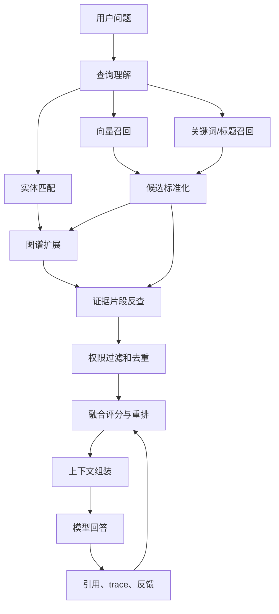

# 图谱检索和向量检索如何融合

## 问题背景

很多 RAG 系统的第一版都是向量检索：把文档切块，计算 embedding，用户提问时取相似度最高的若干片段，再把这些片段交给模型生成答案。这个方案容易启动，也能解决大量“问法和原文接近”的问题。比如用户问某个配置项怎么写，原文里也有配置项名称；用户问某个接口返回什么，接口文档里有同样的参数名。向量空间在这些场景里很高效，因为它擅长把不同表达映射到邻近区域。

问题出现在跨文档、跨时间、跨实体的询问上。用户问“为什么结算服务迁移后客服知识库回答变慢”，相关材料可能分散在迁移 ADR、搜索服务压测记录、客服反馈、缓存改造周报和一次事故复盘里。向量检索可能命中“结算服务迁移”的文档，也可能命中“知识库回答变慢”的复盘，但它不天然知道这两组材料之间是否存在依赖、因果、时间先后和共同负责人。模型如果只看到相似文本，就会自己补连接，补对了像推理，补错了就是幻觉。

图谱检索正好补这块短板。它把文档里的服务、团队、接口、指标、决策、事件抽成实体，把“依赖”“替代”“导致”“被谁维护”“发生在某个时间窗口内”抽成关系。用户问题命中一个实体后，系统可以沿着关系找上下游、找决策链、找影响范围。图谱检索不依赖词面相似度，因此能发现一些“文本不相似但结构相关”的证据。

但只用图谱也不够。图谱抽取有延迟，有漏边，有消歧错误；很多个人知识库和团队文档里的关键信息还停留在自然语言段落中，尚未形成稳定实体关系。图谱适合表达结构，向量适合承接开放表达。工程上真正稳定的方案，是把两条检索链路融合起来：向量负责找到语义入口，图谱负责沿实体和关系扩展，关键词和结构过滤负责兜底，重排层负责把候选证据收敛到模型能消费的上下文。

我不太赞成把融合检索理解成“向量 top-k 加图谱 top-k 拼接”。那只是并排调用两个系统。融合的关键在于编排：什么时候先向量再图谱，什么时候先实体再向量，哪些候选能互相增强，哪些候选应该被去重，哪些关系只能作为召回线索不能进入答案，哪些证据必须受权限过滤约束。检索层如果没有这些决策，最终答案会被更多噪声淹没，而不是变得更可靠。

## 核心概念

融合检索至少要区分五类对象：查询意图、入口候选、实体关系、证据片段和最终上下文。查询意图描述用户到底在问什么，是找定义、找原因、找差异、找影响范围，还是找操作步骤。入口候选是第一轮召回出来的材料，可以来自向量、关键词、标题、最近访问记录或用户指定范围。实体关系是图谱层的结构线索。证据片段是可以引用回原文的文本窗口。最终上下文则是经过排序、压缩、去重和格式化后交给模型的材料包。

| 概念 | 在融合检索里的责任 | 常见数据 | 风险 |
| --- | --- | --- | --- |
| Query Intent | 决定检索策略 | 问题类型、时间范围、实体候选、回答形态 | 意图识别错会走错链路 |
| Dense Hit | 找语义相近文本 | chunk_id、score、section、embedding_version | 相似但不回答问题 |
| Graph Hit | 找结构相关对象 | entity_id、relation_path、hop、confidence | 关系噪声扩散 |
| Evidence | 支撑回答的原文 | text、offset、source、permission_scope | 引用不准或无权限 |
| Assembly | 组织模型上下文 | 排序、分组、压缩、引用映射 | token 被低价值材料占满 |

融合检索里的“融合”可以发生在三个位置。第一是早期融合，也就是在查询理解阶段就把问题转成多个检索计划。例如同一个问题同时生成向量查询、实体查询、关键词查询和时间过滤条件。第二是中期融合，也就是候选生成后互相增强：向量命中的 chunk 里出现了某个实体，就把这个实体作为图扩展种子；图扩展发现某个相关实体，再反查这个实体出现在哪些片段里。第三是晚期融合，也就是把多路候选汇总后统一重排，按证据价值而不是按来源决定顺序。

这里有一个工程上很重要的原则：图谱节点不能代替原文证据。图谱路径可以解释“为什么这几个片段应该放在一起”，但最终回答里的关键事实最好仍然绑定到 chunk。比如关系表里有一条 `billing-service depends_on search-cache`，这条边可以帮助系统召回缓存改造材料，但答案里说“结算迁移后缓存命中率下降导致回答变慢”时，必须引用压测记录或事故复盘里的原文。否则用户无法检查这句话到底来自事实还是抽取器的推断。

另一个概念是候选之间的互证。一个候选片段如果同时被向量命中、关键词命中，并且包含图谱种子实体，它比只被某一路低分召回的片段更值得进入上下文。互证不是简单相加，而是要考虑来源独立性。标题关键词和正文关键词不算完全独立；向量命中和图谱路径命中更有互补价值；用户最近打开过的文档可以作为上下文偏好，但不能压过明确证据。

融合检索还必须有权限模型。图谱扩展尤其容易越界：用户有权限看某个公开 ADR，而 ADR 里的实体连接到一个受限事故复盘，系统如果沿图扩展把受限材料带出来，就泄漏了信息。正确做法是在每一步候选生成和扩展时都带上 `permission_scope`，并且图谱边和实体本身也要有来源权限。不能只在最后上下文组装时过滤，因为中间分数和摘要可能已经被受限材料影响。

## 架构/流程图解说明

一个可落地的融合检索服务可以分为查询理解、种子召回、图谱扩展、证据反查、统一重排、上下文组装和生成反馈几层。它不是一个单函数，而是一条可观测的流水线。每层都应该能输出 trace，方便定位“是没召回，还是召回了没排上，还是排上了却没被模型使用”。



查询理解阶段会把自然语言问题转成一份检索计划。计划里至少包含：用户提到的实体候选、需要回答的关系类型、时间范围、是否需要最新资料、是否需要步骤化输出、是否允许返回“没有足够证据”。例如“上周索引延迟为什么影响了客服回答”这个问题，意图不是普通定义查询，而是原因分析；实体候选包括“索引延迟”“客服回答”“上周”；关系类型偏向 cause、affected_by、depends_on；时间过滤要优先上周的事件和日志。

种子召回阶段不急着追求单路 top-k 很大。向量可以取 30 个，关键词取 20 个，实体匹配取 10 个，然后做标准化。标准化的意思是把所有候选都转成统一结构：候选类型、来源、原始分数、source_id、chunk_id、entity_id、时间、权限、证据摘要。只有候选被标准化，后面的去重、互证、重排才有共同语言。

图谱扩展阶段要有“问题意图驱动的边过滤”。问原因时，优先扩 cause、triggered_by、mitigated_by、decided_by；问影响范围时，优先扩 depends_on、used_by、affected_by；问负责人时，优先扩 owned_by、maintained_by、reported_by。不要默认两跳全扩。热门实体两跳扩展很容易把一个小问题变成整个组织知识图谱的遍历，最后上下文全是弱相关材料。

证据反查是很多系统漏掉的一步。图谱扩展得到的是实体和关系路径，但模型需要的是原文片段。每条路径都要反查 evidence chunk，找到这条关系从哪些文档抽出。对于没有 evidence 的人工维护关系，可以把它作为导航线索，但不作为事实引用。上下文组装时可以写“系统根据服务依赖图找到以下材料”，但关键结论仍然要落在可回跳的原文上。

## 工程实现

融合检索的第一件事是定义统一候选数据结构。不要让向量库返回自己的对象、图数据库返回另一种对象、关键词搜索返回第三种对象，然后在模板里临时拼。统一结构能让调试、评测、缓存、重排都简单很多。下面是一个 Go 服务里可以使用的简化结构，真实项目可以再加租户、语言、文档状态和审计字段。

```go
type Candidate struct {
    ID              string
    Kind            string // chunk, entity, relation_path, community
    Source          string // vector, keyword, graph, recent, manual
    ChunkID         string
    EntityID        string
    PathIDs         []string
    RawScore        float64
    NormalizedScore float64
    Text            string
    SourceURL       string
    PermissionScope string
    UpdatedAt       time.Time
    EvidenceIDs     []string
    Debug           map[string]string
}

type RetrievalPlan struct {
    Query             string
    Intent            string
    EntityHints        []string
    RelationPredicates []string
    TimeRange          *TimeRange
    PermissionScope    string
    MaxGraphHops       int
    NeedFreshness      bool
}
```

第二件事是做分数归一化。向量相似度、BM25 分数、图距离、关系置信度不是同一个量纲，不能直接相加。可以先在每一路内部做 rank-based normalization，把第一名映射到接近 1，后续按排名衰减；再用特征组合得到融合分。早期不一定要训练模型，用可解释的线性权重就够，但要记录每个特征的贡献，方便失败后调参。

| 特征 | 含义 | 适合提高权重的场景 | 注意点 |
| --- | --- | --- | --- |
| dense_score | 语义相似度 | 定义、解释、FAQ | 容易召回相似废话 |
| sparse_score | 关键词和标题匹配 | 参数名、错误码、服务名 | 对改写问题不友好 |
| graph_score | 图距离和关系置信度 | 原因、影响范围、依赖链 | 热门节点会扩散 |
| freshness_score | 文档新鲜度 | 问最新状态、近期事故 | 不能覆盖历史事实 |
| evidence_score | 原文证据质量 | 需要引用和审计 | 依赖切分质量 |
| permission_score | 权限一致性 | 企业知识库 | 不能作为软约束 |

一个可解释的融合分可以先写成：

```text
score =
  0.32 * dense_score +
  0.18 * sparse_score +
  0.24 * graph_score +
  0.10 * freshness_score +
  0.12 * evidence_score +
  0.04 * user_context_score
```

权重不是固定真理，而是产品选择。个人知识库可以提高用户上下文和新鲜度，团队事故分析可以提高 evidence 和 graph，API 查询可以提高 sparse。关键是每次回答都保存各项得分，让工程师能看到“为什么这段进了上下文”。没有分数解释的重排系统，最后会变成无法调试的黑盒。

第三件事是候选去重。融合检索会反复遇到同一个证据：向量命中一个 chunk，关键词也命中它，图谱路径反查 evidence 又拿到它。去重不能简单按文本相等，因为同一段可能有不同切分版本、不同引用偏移、不同权限副本。建议按 stable chunk id 优先去重；没有 stable id 时用 document id、section path、content hash 组合；文本高度相似但来源不同的候选可以合并成一个 evidence group，保留多个召回原因。

第四件事是图谱扩展的限流。可以给每类问题配置最大跳数、每个种子最大邻居数、每种关系最大候选数。比如原因分析类问题最多两跳，每个种子实体最多取 20 条边，关系置信度低于 0.65 的边只能用于候选扩展，不能进入答案证据。扩展结果还要按时间和权限过滤。一个 2026 年的问题不应默认使用 2024 年已经废弃的决策，除非用户明确问历史背景。

第五件事是上下文组装。我的经验是按“先框架，后证据，再路径”的顺序更稳定。开头给一个很短的检索摘要，说明系统找到了哪些主题和时间范围；然后放高价值原文片段，每段带标题、来源、日期和引用 id；再放关系路径，用来解释片段之间的连接；最后放冲突或缺口，提醒模型哪些事实没有充分证据。这样模型更容易基于证据回答，也更容易在证据不足时拒答。

一个具体流程例子如下。用户问：“为什么结算服务迁移后客服知识库回答变慢？”查询理解识别出“结算服务迁移”是事件，“客服知识库回答变慢”是影响，“为什么”要求因果。向量检索命中迁移 ADR 和一篇客服复盘；关键词检索命中“结算”“知识库”“延迟”；实体匹配命中 BillingService、SupportKB、SearchCache。图谱扩展沿 `BillingService uses SearchCache`、`SupportKB depends_on SearchCache`、`MigrationEvent changed cache_key` 找到缓存改造记录。证据反查拿到压测结果：缓存命中率从 91% 降到 63%，首字延迟上升。最终回答就可以把因果链说清楚，并引用 ADR、压测记录和复盘，而不是只说“可能是缓存问题”。

数据库层可以从简单开始。PostgreSQL 保存文档、chunk、实体、关系和 evidence，pgvector 做向量检索，GIN 索引做关键词检索，关系路径先用递归查询或应用层 BFS。规模上来后再拆成独立图数据库。早期不要为了技术栈漂亮而引入过多系统，融合检索已经足够复杂，先把数据契约、trace 和评测做扎实更重要。

## 分阶段落地策略

融合检索不要一口气做成大平台。第一阶段先把单路向量检索的 trace 补齐，确认每次回答能看到 query、命中的 chunk、分数、最终上下文和引用。很多团队在这一步就会发现，所谓“模型答错”其实是切分粗、文档过期或引用不可用。没有单路 trace，后面加图谱只会让问题更难排查。

第二阶段加入关键词和元数据过滤。关键词不是落后技术，它对服务名、错误码、配置项、项目代号、日期非常有效。向量检索可能把“缓存预热”和“缓存淘汰”看得很近，关键词索引能保证用户明确提到的术语不会丢。这个阶段重点是统一候选结构和权限过滤，而不是追求复杂图谱。只要 dense、sparse、metadata 三路能在同一套 Candidate 里比较，融合检索的骨架就已经有了。

第三阶段再加入轻量实体层。不要先抽全域知识图谱，可以从高价值实体开始：服务、项目、接口、团队、ADR、事故、指标。实体匹配先做别名表和规则，LLM 抽取只作为候选。上线时只允许 reviewed 或高置信实体参与扩展。这个阶段的目标是让系统知道“结算服务”“billing-service”“BillingSvc”是同一个对象，并能把不同文档里围绕它的材料连起来。

第四阶段加入关系路径和证据反查。关系类型越少越好，先选最有价值的几类：depends_on、owned_by、changed_by、caused_by、mitigated_by、deprecated_by。每条关系都必须有 evidence。线上扩展时只走和问题意图相关的关系，避免热门实体把上下文带偏。等路径召回在评测集里稳定增益，再考虑社区摘要、图算法和更复杂的路径重排。

这里有一个实用迁移表：

| 阶段 | 主要能力 | 不做什么 | 验收标准 |
| --- | --- | --- | --- |
| 单路可观测 | 向量 trace、引用、失败分类 | 不急着调复杂权重 | 能解释每个答案用到哪些 chunk |
| 多路候选 | 关键词、元数据、统一 Candidate | 不做大规模图谱 | 专有名词问题召回提升 |
| 轻量实体 | 别名、实体种子、范围过滤 | 不抽所有抽象概念 | 跨文档同对象能聚合 |
| 关系扩展 | 少量高价值关系和 evidence | 不开放无限跳数 | 原因和影响类问题提升 |
| 评测闭环 | 回归集、线上反馈、权重迭代 | 不凭感觉改策略 | 失败样本能归因到阶段 |

运维上也要给融合检索单独设置指标。除了总体延迟和错误率，还要看每路召回数量、候选去重比例、图扩展节点数、被权限过滤的候选数、进入最终上下文的来源分布、无引用 claim 比例。候选去重比例突然下降，可能是 chunk id 不稳定；图扩展节点数突然升高，可能是某个热门实体污染；被权限过滤数量异常，可能是文档权限或图谱边权限不同步。指标不是为了报表，而是为了在答案质量下降前看到结构变化。

团队协作也要明确边界。内容作者负责写清楚标题、日期、状态和引用；平台工程负责文档解析、权限和索引稳定；RAG 工程负责检索计划、融合评分和上下文组装；业务使用者负责标注真实失败样本。融合检索跨越多个层次，如果所有问题都由“调 prompt 的人”承担，系统会长期停留在试错状态。把责任拆清楚，才能让每次失败都推动正确的模块变好。

## 测试评测

融合检索的评测要拆开看，不能只看最终回答满意度。一个回答失败，可能是向量没召回，可能是实体没识别，可能是图扩展走错，可能是权限过滤丢了关键材料，也可能是上下文组装把正确证据放得太后。评测指标要覆盖每个阶段，否则团队会把所有问题都推给模型。

第一层是召回评测。为每个问题标注必须出现的文档、实体和证据片段，分别计算 dense recall、sparse recall、graph recall 和 fused recall。理想状态不是每一路都最高，而是融合后覆盖更完整。第二层是排序评测，关注正确证据是否排在上下文预算内。很多系统召回了正确材料，但排在第 80 位，模型根本看不到。第三层是忠实度评测，看答案里的关键句是否能对应到引用。第四层是拒答评测，检查证据不足或权限不足时是否能明确说明。

| 指标 | 说明 | 失败时优先排查 |
| --- | --- | --- |
| Seed Recall | 第一轮是否召回关键材料 | embedding、关键词、实体别名 |
| Path Recall | 图谱是否找到必要关系 | 关系抽取、边过滤、跳数 |
| Context Hit Rate | 正确证据是否进入最终上下文 | 重排、去重、token 配额 |
| Citation Precision | 答案引用是否指向支撑句 | chunk 粒度、引用映射 |
| Refusal Accuracy | 无证据时是否拒答 | 生成提示、证据阈值 |
| Trace Completeness | 是否能复盘检索链路 | 日志结构、采样策略 |

评测集要有不同问题类型。定义类问题主要考向量和关键词；依赖链问题主要考图谱扩展；近期状态问题主要考时间过滤；权限问题主要考过滤边界；冲突问题主要考证据排序和答案措辞。不要用一批 FAQ 样本证明融合检索有效，因为 FAQ 本来就是向量检索的舒适区。真正能体现融合价值的是“文本不完全相似，但结构上必须连接”的问题。

线上评测还要引入人工反馈闭环。用户点“不准确”时，界面最好让他选择原因：没找到相关材料、引用不支持结论、使用了过期资料、漏掉某个文档、回答太泛、权限不该看到。这个反馈比一个笼统差评有用得多。每周把失败样本回放到离线评测集，观察是某一路召回问题，还是融合权重问题。只有失败样本能回归，融合检索才会持续变好。

压测也不能忽略。融合检索比单路向量慢，因为它多了图扩展、证据反查和重排。需要分别测 P50、P95、P99，记录每个阶段耗时。通常可以把向量、关键词、实体匹配并发执行；图扩展依赖种子候选，放在第二阶段；重排如果用 cross-encoder 或 LLM，要设置候选上限和超时降级。用户更愿意接受一个 1.5 秒但有证据的回答，不愿意等 12 秒得到一堆引用。

## 失败模式

第一种失败模式是“多路召回叠加噪声”。团队为了提高召回，把向量 top-k、关键词 top-k、图谱扩展数量都调大，结果上下文里什么都有，模型抓不住重点。解决方式是分阶段设预算：每一路先取中等数量，标准化后去重，再用问题意图和互证特征重排。召回越多，越需要强重排和强配额。

第二种失败模式是热门实体污染。像“RAG”“用户”“搜索服务”这类实体连接很多，图扩展很容易把无关社区带进来。要给热门实体降权，或者要求热门实体必须和另一个更具体实体共同出现才作为种子。对高频抽象实体，可以把它们当标签，不当图扩展入口。

第三种失败模式是图谱关系被当成事实答案。抽取器生成的关系有置信度和来源，它不是天然事实。线上回答如果直接基于关系边生成结论，容易把推断说成确定事实。工程上要把关系分为 observed、reviewed、inferred、deprecated。只有 observed 或 reviewed 且有 evidence 的关系，才能支撑强结论；inferred 关系只能帮助召回。

第四种失败模式是权限后过滤。系统先用全量图谱算分，再在最后删掉用户无权看的片段，看起来没有泄漏文本，但排序已经被受限材料影响，甚至答案可能生成了受限主题的轮廓。权限必须前置到每个检索阶段，实体、关系、社区摘要和 evidence 都要带权限范围。

第五种失败模式是重排模型压过业务规则。某些 cross-encoder 会把语言相似度高的片段排到前面，却忽略文档状态、时间、权限和关系证据。重排模型应该是特征之一，不应该绕过硬过滤。过期文档、废弃 ADR、低置信关系、无权限来源必须在模型重排前处理。

第六种失败模式是 trace 缺失。融合检索的链路长，任何一层都可能错。如果只保存最终 prompt 和答案，排查会非常痛苦。至少要保存 query plan、每路候选、图扩展路径、过滤原因、融合分数、最终上下文和引用映射。敏感系统可以采样保存，但不能完全没有。

## 上线 checklist

- front matter、文档来源、权限范围和更新时间在入库时已经标准化，检索阶段不再猜测。
- 向量、关键词、实体匹配可以并发执行，并且每一路都有独立超时和降级策略。
- 所有候选统一成 Candidate 结构，保留来源、原始分数、标准化分数、证据 id 和调试字段。
- 图谱扩展按问题意图过滤关系类型，并设置跳数、邻居数、置信度和时间窗口上限。
- 权限过滤发生在召回、图扩展、证据反查和上下文组装的每一步，而不是只在最后做。
- 融合评分可解释，trace 能展示每个候选为什么进入或离开最终上下文。
- 上下文组装给原文证据设置最低配额，图谱路径和摘要不能挤掉关键 chunk。
- 评测集覆盖定义、原因、影响范围、近期状态、冲突材料、权限不足和无答案场景。
- 线上反馈能落到失败分类，并能把样本回放到离线评测。
- P95 延迟、候选数量、图扩展节点数、引用有效率和拒答率都有监控。

## 总结

图谱检索和向量检索不是谁替代谁的关系。向量检索擅长承接自然语言和语义相似，图谱检索擅长沿实体、关系、时间和影响范围组织证据。两者真正融合后，RAG 系统才能回答更接近真实工作的问题：一个决策为什么发生，一个变更影响了谁，一个事故和哪个历史背景有关。

工程上最重要的是把融合做成可解释的检索编排，而不是把两路 top-k 粗暴拼接。要有查询计划、统一候选结构、证据反查、权限前置、去重、融合评分、上下文配额和完整 trace。这样系统回答错时，团队能知道该修 embedding、实体别名、关系抽取、扩展策略、重排权重，还是引用映射。

我更愿意从小范围问题开始做融合检索：先选十几个需要跨文档推理的真实问题，标注它们需要哪些实体、关系和原文证据，再实现一条可观测链路。等这条链路能稳定解释自己的召回和排序，再扩大文档规模和图谱范围。融合检索的价值不是让架构图多一层，而是让答案的证据链更完整、更可检查、更能经受日常工程使用。
