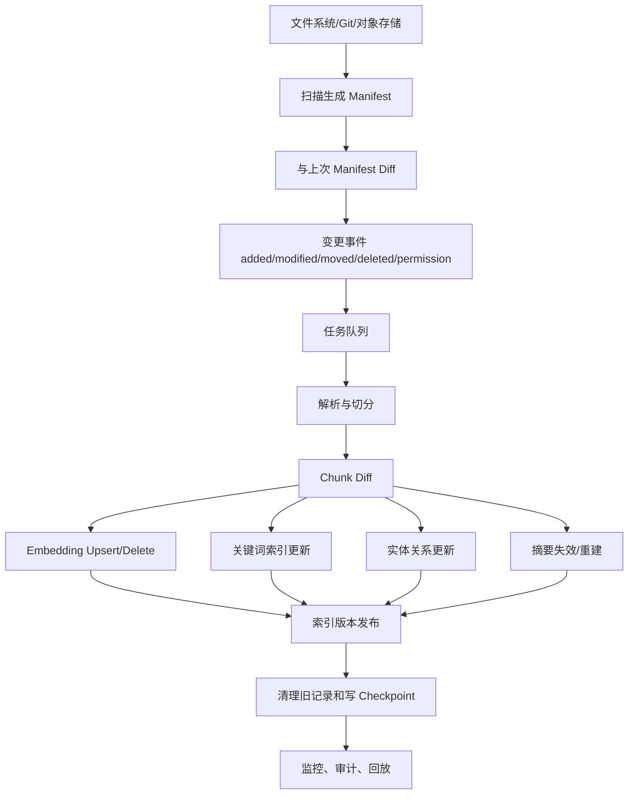

# 增量索引与知识更新

## 问题背景

很多 RAG 演示都是一次性导入：准备一批文档，跑切分，算 embedding，写入向量库，然后开始问答。这个流程适合原型，却不适合真实知识库。真实知识库每天都在变化：新文章发布，旧文档修改，标题重命名，附件替换，权限调整，项目归档，方案废弃，网页抓取失败，PDF 重新 OCR，某些资料被删除。索引如果不能跟上这些变化，答案就会慢慢偏离事实。

增量索引难的地方，不只是“发现新增文件”。更麻烦的是识别什么变了、哪些派生数据需要重建、哪些旧数据应该删除、哪些引用需要保留、哪些摘要要失效、哪些任务可以重试、哪些错误不能反复污染索引。一次小改动如果导致整篇文档的 chunk id 全部变化，历史引用、用户反馈和评测样本都会断掉。一次删除如果只删了文件而没删向量库里的旧 chunk，系统会继续引用不存在的内容。一次权限变更如果没有同步到索引，可能造成信息泄漏。

我更愿意把增量索引看成知识系统的变更传播机制。原始文档是事实来源，索引、embedding、图谱关系、社区摘要、关键词表、缓存和评测快照都是派生物。任何派生物都要知道自己来自哪个 source version，也要能在 source 变化后被重建、失效或删除。这样系统才能回答一个简单但关键的问题：当前答案使用的是不是当前有效知识？

增量索引也是成本问题。全量重建最简单，但文档多了以后成本高、耗时长，还会让线上召回结果大幅抖动。真正稳定的系统应该做到局部变化局部更新：一个段落修改，只重算相关 chunk 的 embedding；一个标题改名，尽量保留内容相同 chunk 的身份；一个文档删除，写 tombstone 并清理派生索引；一个权限变更，只更新访问控制和受影响摘要，不重新抽所有实体。增量不是为了显得高级，而是为了让知识库能长期运转。

个人知识库和团队知识库都需要这套能力。个人场景里，用户每天写笔记、移动文件、重命名目录，如果索引经常落后，工具很快失去信任。团队场景里，知识更新牵涉审计和权限，错误成本更高。无论规模大小，增量索引都应该从第一版就考虑数据契约，哪怕实现先简单。

## 核心概念

增量索引的核心对象包括 source、manifest、version、chunk、derived record、job、tombstone 和 checkpoint。source 是原始资料身份。manifest 是系统对资料库当前状态的清单。version 表示 source 某个时间点的内容。chunk 是可检索和可引用的片段。derived record 是 embedding、关键词索引、实体关系、摘要等派生数据。job 是异步更新任务。tombstone 表示删除或废弃。checkpoint 记录索引器已经处理到哪里。

| 对象 | 作用 | 常见字段 | 设计要求 |
| --- | --- | --- | --- |
| Source | 稳定标识资料 | source_id、path、type、owner | 路径变化不改变身份 |
| Manifest | 描述当前文件状态 | path、mtime、size、hash、visibility | 可 diff、可审计 |
| Version | 固定内容快照 | version_id、content_hash、created_at | 支持历史回放 |
| Chunk | 检索和引用单元 | chunk_id、heading_path、hash、offset | 局部修改尽量稳定 |
| DerivedRecord | 派生索引记录 | record_id、source_version、builder_version | 可重建、可失效 |
| Job | 增量任务 | job_id、kind、idempotency_key、status | 可重试、可去重 |
| Tombstone | 删除标记 | target_id、deleted_at、reason | 防止旧数据复活 |
| Checkpoint | 处理进度 | cursor、snapshot_hash、processed_at | 崩溃后可恢复 |

source id 是第一块地基。不要用文件路径当唯一身份，因为用户会移动文件、改目录、调整命名。可以在 sidecar metadata 里保存 source_id，也可以用内容初始 hash 加路径历史生成身份。路径只是 source 的一个属性。这样 `notes/rag/citations.md` 移到 `articles/rag/citations.md` 时，系统知道这是同一份资料，而不是删除旧文档再新增一篇完全无关的新文档。

manifest 是第二块地基。索引器每次运行时先扫描资料库，得到当前 manifest，再和上一次 manifest 做 diff。diff 结果不应该只有 added、modified、deleted，还要尽量识别 moved、metadata_changed、permission_changed、content_changed、type_changed。不同变化触发不同任务。比如权限变更不一定需要重算 embedding，但必须更新访问控制索引，并让缓存答案失效。

版本化是第三块地基。每次内容 hash 变化，source 产生新 version。chunk、embedding、实体关系、摘要都绑定到 source version。当前查询默认使用最新有效 version，历史审计可以回放旧 version。没有版本化，文档更新后旧引用会漂，评测结果也难以解释。

chunk 稳定性是增量索引的难点。固定序号很脆弱，文档开头加一段，后面所有 chunk 序号都变。更稳的做法是用标题路径、局部内容 hash、块类型和相邻上下文生成 chunk identity。内容完全相同但位置变化时尽量保留 chunk_id；内容轻微修改时保留 logical chunk id，生成新的 chunk version；结构大改时再创建新 chunk。这样可以减少不必要的 embedding 重算和引用失效。

tombstone 是很多系统忽略的对象。删除不是简单从数据库删掉一行。你需要记录“这个 source 或 chunk 被删除了”，这样异步任务重试、旧队列消息、备份恢复时不会把它重新写回索引。tombstone 还用于历史审计：旧答案引用了一个后来删除的文档，系统应该能说明该来源已删除，而不是返回 404。

## 架构/流程图解说明

一条完整的增量索引链路可以分成变更检测、差异分析、任务编排、派生构建、原子发布、清理和观测。核心原则是：先把变化记录下来，再异步构建派生数据，最后以可回滚的方式发布到在线索引。



变更检测可以来自不同来源。个人本地工具可以用文件系统 watcher 加定期全量扫描，避免漏事件。Git 管理的知识库可以用 `git diff --name-status` 获得更准确的移动和删除信息。对象存储可以依赖事件通知，但仍要定期扫描校验。不要完全相信 watcher，因为系统休眠、崩溃、网络抖动都会丢事件。定期 manifest diff 是兜底。

差异分析要尽量细。文件 mtime 变化不一定代表内容变化，可能只是同步工具触碰了文件；内容 hash 变化也不一定需要全量重建，可能只有 front matter 的 tags 改了；权限字段变化必须立即传播，哪怕正文没变。可以把文档拆成 metadata_hash、content_hash、acl_hash、parser_input_hash。不同 hash 变化触发不同 job。

任务编排要幂等。一个 modified 事件可能被重复投递，索引器可能在 embedding 写入后崩溃，队列可能重试。每个 job 都要有 idempotency_key，例如 `source_id + version_id + builder_kind + builder_version`。重复执行同一个 job 不应产生重复记录。写入派生索引时使用 upsert，并在成功后记录 job 状态和构建摘要。

原子发布很关键。不要一边删除旧 chunk，一边慢慢写新 chunk，让在线查询看到半新半旧状态。可以为每个 source version 构建一组派生记录，构建完成后更新 active_version 指针。查询只读取 active records。旧记录延迟清理，保留一段时间用于回滚和历史引用。对小系统，可以用数据库事务；对多存储系统，则需要一个发布表或索引别名。

## 工程实现

先定义 manifest 表。它记录索引器眼中每个 source 的当前状态。下面是简化字段：

```sql
create table source_manifest (
  source_id text primary key,
  path text not null,
  source_type text not null,
  content_hash text not null,
  metadata_hash text not null,
  acl_hash text not null,
  current_version_id text not null,
  state text not null,
  updated_at timestamptz not null
);
```

再定义派生记录表。所有派生数据都要能追溯到 source version 和 builder version。builder version 包括 splitter 版本、embedding 模型版本、实体抽取 prompt 版本、摘要 prompt 版本。没有这些字段，后续升级模型时很难判断哪些记录需要重建。

```go
type DerivedRecord struct {
    RecordID       string
    SourceID       string
    SourceVersion  string
    ChunkID        string
    Kind           string // embedding, keyword, relation, summary
    BuilderVersion string
    State          string // active, stale, deleted
    PayloadHash    string
    BuiltAt        time.Time
}
```

增量流程可以按事件类型分支。新增 source：解析、切分、生成 chunks、写 embedding、写关键词索引、抽实体关系、生成摘要。修改 source：生成新 version，做 chunk diff，只重建 changed chunks 的 embedding 和关键词；如果关系抽取窗口受影响，则重建相关关系；如果社区成员或摘要引用受影响，标记摘要 stale。移动 source：更新 path 和引用显示，不必重算内容派生数据。删除 source：写 tombstone，撤销 active records，从在线索引删除向量和关键词，但保留历史版本用于审计。权限变更：更新 acl 索引，清理缓存，必要时重建聚合摘要。

chunk diff 是实现核心。可以先把旧版本和新版本都解析成 block 列表，每个 block 有 heading_path、block_type、normalized_text_hash、raw_text_hash。先用 normalized_text_hash 匹配完全相同块，再用标题路径和文本相似度匹配轻微修改块。完全相同块保留 chunk_id，不重算 embedding；轻微修改块保留 logical_id，但生成新 chunk_version 并重算 embedding；无法匹配的块创建新 chunk；旧版本未匹配块标记 deleted。

一个具体例子：用户在一篇 RAG 文章开头新增一段背景，并把“引用链”小节改名为“可验证引用链”，小节正文只改了两句话。粗暴序号切分会让后面所有 chunk id 变化。稳定 diff 则会发现大部分 block 内容 hash 没变，只是 offset 后移；这些 block 保留 chunk_id。标题改名的小节 heading_path 变化，但正文相似度高，可以保留 logical chunk，更新显示标题和 offset。只有改了两句话的 chunk 需要重算 embedding。历史引用仍能通过 quote_hash 找回，新回答则使用新版本。

删除语义要认真处理。删除 source 后，向量库里的向量必须删除或标记 inactive，关键词索引要删除，实体关系要失效，社区摘要要重建或标记 stale。不要只从 manifest 删除记录。更稳的流程是写 source tombstone，然后发出 delete jobs，等待各个派生索引确认删除，最后把 source 状态设为 deleted。线上查询在任何时候都要检查 active 状态，即使某个向量漏删，也不能被召回。

权限变更是另一类高风险增量。假设一篇公开笔记改成 private，内容 hash 不变，但所有派生数据的可见性都变了。如果只在 source 表更新权限，而向量检索没有权限过滤，旧 chunk 仍可能被召回。正确做法是 acl_hash 变化触发 acl propagation job，更新向量 metadata、关键词过滤表、图谱边可见性和摘要可见性。使用这篇私有文档生成过的聚合摘要，也要重新评估是否还能对公开用户可见。

任务队列要支持重试和死信。embedding 服务可能临时失败，PDF 解析可能卡住，某个文档格式可能不受支持。失败不能阻塞整个知识库。每个 job 记录 retry_count、last_error、next_retry_at。多次失败后进入 dead_letter，并在管理界面显示。source 可以处于 partial_indexed 状态，查询时降低权重或提示某些派生数据不可用。

缓存也要纳入增量。很多 RAG 系统会缓存检索结果、答案、摘要或 rerank 分数。source version 变化后，相关缓存必须失效。缓存 key 应包含索引版本或 source version 集合，不能只按 query 文本缓存。否则用户改了文档，系统仍然返回旧答案，看起来像索引没有更新。

## 一致性策略和回滚

增量索引会遇到一致性取舍。强一致最简单理解：文档一保存，所有索引立即更新，查询一定看到最新内容。但这通常成本高、延迟大，尤其 embedding 和实体抽取需要异步服务。最终一致更实际：文档保存后先记录变更，在线查询在短时间内可能仍看到旧版本，等派生数据构建完成后切换。关键是让这个窗口可观测、可解释，不要让用户以为系统已经更新但其实还没完成。

可以给每个 source 暴露 index_state：current、building、partial、failed、deleted。用户刚保存文件后，状态从 current 变成 building；embedding 完成但关系抽取失败时是 partial；多次失败后是 failed。查询结果如果使用了 partial source，可以在调试模式显示。对个人工具，这个状态能减少困惑；对团队系统，它是运维和审计需要。

索引发布建议使用版本指针。每个 source 有 active_version_id，派生记录先写入 staging，全部必要任务完成后再把 active_version_id 指向新版本。旧版本保留一段时间。若发现新 splitter 有 bug，可以把指针切回旧版本，或者让查询层避开某个 builder_version。没有版本指针，回滚会变成手工删除和重建，风险很高。

多索引之间也要有一致性。向量索引已经更新，关键词索引还没更新，图谱关系仍是旧版本，这时融合检索可能拿到矛盾候选。可以为一次发布生成 index_epoch，查询时尽量读取同一 epoch 的派生数据。小系统可以接受短暂不一致，但 trace 里要记录每个候选来自哪个 epoch。排查“为什么答案引用旧内容”时，这个字段很有用。

## 数据修复和重建策略

增量索引跑久以后，一定会遇到历史包袱：早期 splitter 质量不好，某批 embedding 用了旧模型，部分 PDF 的 OCR 错误很多，某次权限同步漏了图谱边，某个摘要 builder 生成了过期结论。系统不能假设所有旧数据都是干净的。除了正常增量链路，还要有数据修复和定向重建能力。

重建策略要有粒度。最粗的是全库重建，适合重大 schema 变更或灾难恢复，但成本高、风险大。中等粒度是按 source type、目录、标签、时间范围重建，例如只重建 `notes/rag/` 下的 Markdown。更细的是按 builder 重建，例如只重算 embedding，不动关键词和引用锚点；只重建关系，不重算 chunk；只刷新摘要，不动底层 evidence。最细的是按失败记录重建，只处理 dead_letter 或质量评分低的 source。

| 重建粒度 | 适用场景 | 风险控制 |
| --- | --- | --- |
| 全库重建 | schema 大改、灾难恢复 | 先影子索引，后切换 |
| 目录重建 | 某类文档策略变化 | 限制范围，抽样验收 |
| Builder 重建 | embedding 或 prompt 升级 | builder_version 隔离 |
| Source 重建 | 单篇解析错误 | 保留旧版本可回滚 |
| Record 重建 | 个别失败任务 | 幂等执行，记录原因 |

影子索引是很实用的手段。升级 splitter 或 embedding 模型时，不要直接覆盖线上索引。可以构建一个 shadow epoch，把同一批文档用新策略建一份派生记录，然后在评测集上比较召回、引用、延迟和成本。只有当 shadow epoch 通过验收，才把查询流量切过去。切换后旧 epoch 保留一段时间，发现问题可以回滚。这个做法比“改完配置全量跑一遍”稳得多。

数据修复还需要审计日志。每次重建要记录谁触发、触发原因、范围、builder 版本、开始结束时间、影响记录数量、失败数量和回滚方式。个人工具里这个日志可以很简单，但团队系统必须能回答“为什么今天同一个问题答案变了”。很多时候答案变化不是模型随机，而是索引重建、权限变更或文档版本切换造成的。没有审计，用户只会觉得系统不稳定。

重复内容也是增量索引里的长期问题。一个网页被保存多次，一篇文章既有 Markdown 又有 PDF，项目文档从旧目录复制到新目录，都会造成重复证据。重复不是简单坏事，因为不同副本可能有不同批注和权限；但如果系统不知道它们重复，重排会被同一来源淹没。可以在 source 层保存 duplicate_group，用内容 hash、标题相似度、canonical URL 和人工确认来识别。查询时同组重复来源只保留最可信或最新的版本，其他作为备选。

数据质量评分也值得加入。每个 source 可以有 parse_quality、ocr_quality、metadata_quality、citation_quality、freshness_quality。质量分低的来源仍可检索，但不应高权重支撑关键结论。比如 OCR 错误率高的 PDF 可以作为背景材料，但不用于抽强关系；缺少日期的网页可以被召回，但回答时间敏感问题时要降权。增量索引不是只传播变化，也要传播质量信号。

## 多人协作中的增量冲突

团队知识库里，增量索引还会遇到多人协作冲突。两个人同时编辑同一篇文档，一个改正文，一个改权限；一个分支删除旧文档，另一个分支在旧文档上新增小节；某个目录从公开空间迁到受限空间，但历史链接仍然存在。索引器不能只按最终文件状态盲目处理，它要理解提交顺序、来源分支和权限策略。

如果知识库使用 Git，最可靠的触发单位是 commit。每个 commit 产生一个 change set，记录新增、修改、删除、重命名和权限文件变化。索引器按 commit 顺序处理，并保存 commit hash 到 checkpoint。遇到 force push 或历史重写时，需要重新计算受影响范围。对普通文档库，也可以模拟 change set：一次同步任务扫描到的 diff 作为一个批次，批次内原子发布。

冲突处理的原则是保守。若文档内容更新成功但权限解析失败，不要把新内容按旧权限发布。若删除事件和修改事件顺序不确定，优先 tombstone，等待下一次 manifest 扫描确认。若同一 source 出现两个不同路径且内容高度相似，不要自动合并高权限和低权限副本。权限相关的不确定性，应该进入人工检查，而不是用模型或启发式猜。

多人协作还要求更清晰的通知。索引器发现某篇文档长期 failed，应该通知 owner；发现某个目录重建导致大量答案变化，应该通知维护者；发现某次权限变更影响很多摘要，应该要求确认。增量索引不是后台静默任务，它影响用户看到的知识状态。关键变更要被合适的人知道。

最后，协作系统要允许局部冻结。发布前夕、事故复盘期间、合规审计期间，某些知识范围可能需要暂时冻结索引版本，避免文档还在编辑时被 RAG 用作事实。冻结不等于停止收集变化，而是把新变化放入 staging，待 owner 确认后发布。这个能力在企业场景很有用，在个人场景也可以用于长文写作：草稿没定稿前不进入高可信索引。

## 测试评测

增量索引的测试不能只跑“新增一篇文档能检索到”。至少要覆盖新增、修改、移动、重命名、删除、权限变更、解析失败、任务重试、模型版本升级和回滚。每个测试都要检查在线检索结果、引用回跳、派生记录状态和 tombstone。否则系统看起来能更新，实际会在删除和权限场景出问题。

可以准备一组 fixture 文档，手工标注每次变更后应该发生什么。比如文档 A 新增一段，期望只新增一个 chunk；文档 B 修改标题，期望 chunk id 保持稳定；文档 C 删除，期望向量和关键词都不再召回；文档 D 权限从 public 改为 private，期望普通用户检索不到；文档 E 解析失败，期望进入 dead_letter 且不影响其他文档。

| 测试场景 | 关键断言 | 风险 |
| --- | --- | --- |
| 局部修改 | 未改 chunk_id 保持，改动 chunk 重建 | 全量抖动 |
| 文件移动 | source_id 不变，引用路径更新 | 被当成删除加新增 |
| 删除文档 | 在线检索不再返回，历史引用可审计 | 旧向量残留 |
| 权限收紧 | 无权用户不能召回任何派生内容 | 元数据过滤漏掉 |
| 任务失败 | source 状态可见，队列可重试 | 半成品污染线上 |
| 版本升级 | 只重建受影响 builder 的记录 | 成本失控 |
| 回滚 | active_version 可切回旧版本 | 新旧索引混乱 |

评测指标也要增量化。chunk 稳定率衡量未修改区域的 chunk_id 保持比例；索引滞后时间衡量 source 变化到 active_version 发布的耗时；删除残留率衡量被删除 source 是否仍能被召回；权限传播延迟衡量 acl 变化到所有索引生效的时间；重建放大倍数衡量一次小改动触发了多少派生任务。重建放大倍数很有用，它能暴露系统是否动不动全量重算。

线上观测要有队列维度。每种 job 的积压数量、失败率、平均耗时、P95 耗时、dead_letter 数量都要监控。还要抽样检查索引一致性：随机选 source，比对 manifest、active version、向量 metadata、关键词记录、图谱关系和摘要引用是否一致。增量索引的错误常常静悄悄积累，直到用户问到旧知识才暴露。

回归测试最好包含真实查询。每次增量变更后，用固定问题集检查答案是否随知识变化而变化。比如删除某个旧方案后，系统不应再把它当成当前推荐；新增一篇修正文档后，系统应优先引用新文档；权限收紧后，普通用户答案应拒答或使用公开来源。只测索引记录不测答案，容易漏掉上下文组装层的缓存和排序问题。

## 失败模式

第一种失败模式是小改触发全量重建。用户改了一个错别字，系统重建整库 embedding，成本高，结果抖动大。根因通常是 source identity 和 chunk identity 不稳定。解决方式是引入 manifest diff、chunk diff 和 builder version，只重建真正受影响的派生记录。

第二种失败模式是旧向量残留。文档删除或 chunk 改写后，旧向量没有从向量库删除，系统继续召回过期内容。这类问题很隐蔽，因为文档系统里已经看不到旧文件。解决方式是 tombstone、active 状态过滤和定期一致性扫描三者都要有。

第三种失败模式是权限变更不同步。内容没变，索引器以为不用处理，但权限已经从公开变成私有。向量 metadata、关键词索引、图谱边、摘要缓存都可能泄漏。acl_hash 必须独立参与 diff，权限变更要走高优先级任务。

第四种失败模式是队列重复导致重复记录。watcher 连续发出多个 modified 事件，索引器重复写 embedding，候选里出现多份相同 chunk。幂等 key 和 upsert 是基本要求。所有异步 job 都要假设会重复执行。

第五种失败模式是半成品上线。解析完成了，embedding 还没完成，旧 chunk 已经删除，新 chunk 还没写入，用户查询出现空窗。解决方式是 staging 构建和 active_version 原子切换。不要先删旧，再慢慢建新。

第六种失败模式是摘要没有失效。底层文档改了，社区摘要或主题摘要仍然使用旧内容，模型引用摘要给出过期结论。摘要属于派生记录，也要绑定 source version 和成员集合。相关 source 变化后，摘要要标记 stale，不能继续高权重使用。

第七种失败模式是过度依赖 mtime。同步工具、备份恢复、跨平台文件系统都会让 mtime 不可靠。内容 hash 和 manifest snapshot 才是判断变化的核心。mtime 可以用于快速筛选，但不能作为最终依据。

## 上线 checklist

- 每个 source 有稳定 source_id，路径变化不会导致身份丢失。
- manifest 记录 content_hash、metadata_hash、acl_hash，并能与上一版做 diff。
- 文档内容变化会生成 source version，派生记录绑定 source_version 和 builder_version。
- chunk diff 能识别未变、轻微修改、新增和删除，避免无意义全量重建。
- 删除使用 tombstone，旧队列消息和备份恢复不会让删除内容重新进入在线索引。
- 权限变更有独立高优先级任务，向量、关键词、图谱、摘要和缓存都会同步更新。
- 所有异步 job 有 idempotency_key、重试策略、死信队列和可见错误状态。
- 派生数据先写 staging，完成后通过 active_version 或 index_epoch 原子发布。
- 查询层默认只读取 active records，并在调试 trace 中展示 source_version 和 index_epoch。
- 缓存 key 包含索引版本或相关 source version，知识更新后能正确失效。
- 监控覆盖队列积压、失败率、索引滞后、删除残留、权限传播延迟和重建放大倍数。
- 回归测试覆盖新增、修改、移动、删除、权限、失败、重试、升级和回滚。

## 总结

增量索引是 RAG 从演示走向日常使用的分水岭。一次性导入能证明系统会回答，增量更新才能证明系统能长期可信。知识库不是静态语料，而是一组持续变化的来源、版本、权限和派生索引。系统必须知道什么变了，如何局部重建，如何删除旧数据，如何保留历史引用，如何把错误暴露出来。

工程上不要一开始追求复杂平台，但要把关键契约定好：稳定 source id、manifest diff、source version、chunk diff、tombstone、幂等 job、active 发布、索引状态和回归评测。有了这些基础，后续无论接向量库、图数据库、摘要服务还是本地文件系统，都能保持清晰边界。

最实用的策略是从小规模开始，把增量链路跑扎实。先让新增、修改、删除、移动和权限变更都能被正确处理，再谈更智能的实体抽取和社区摘要。一个知识系统最怕的不是暂时没有高级推理，而是悄悄使用过期、无权或已删除的材料。增量索引要解决的正是这个底层信任问题。
