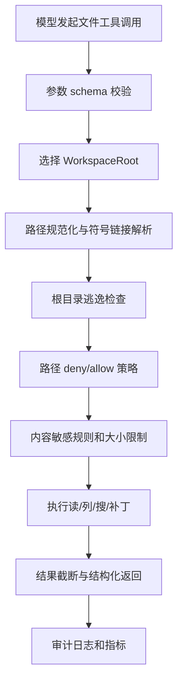

## 问题背景

文件系统 MCP 工具看起来很基础：读文件、列目录、写文件、搜索文本、打补丁。可是一旦把它交给模型使用，它就从“方便的本地 API”变成了高风险执行面。模型可能读到密钥、覆盖用户改动、把临时文件写进仓库、跟随符号链接越过根目录，或者在大仓库里做一次不受控搜索把机器拖慢。文件工具的难点不是会不会调用 `os.ReadFile`，而是如何把文件访问限制在明确的工作区、如何表达读写意图、如何保护用户未提交的修改、如何在失败时给模型足够信息继续修正。

在传统软件里，文件系统通常由人类开发者直接操作。开发者知道当前目录、知道哪些文件不能碰、知道 `.env` 里可能有秘密。模型没有这些常识，或者说它的常识不能作为安全边界。它会根据任务上下文推断路径，但推断可能错；它会尝试修复问题，但修复可能扩大影响面；它会觉得“写一个配置文件”很自然，但那个文件可能是生产凭据。因此，文件系统 MCP 工具必须先定义边界，再谈能力。

边界包含四层。第一是根目录边界：工具只能访问允许的 workspace root，不能通过 `../`、绝对路径、符号链接、挂载点绕出去。第二是操作边界：读、写、删除、执行脚本、改变权限应该是不同能力，不应混成一个万能工具。第三是内容边界：密钥、证书、浏览器 cookie、SSH 私钥、云凭据和用户隐私文件需要特殊处理，不能因为路径在根目录里就默认可读。第四是协作边界：仓库里可能已经有用户修改，工具不能随意覆盖；写操作要能展示 diff、检测冲突、保留审计记录。

很多事故来自“过于信任路径字符串”。例如用户让模型修改项目里的 `config.yaml`，模型传入 `../../.ssh/config`，如果工具只是简单拼接路径并读取，就会越权。再如根目录下有一个符号链接 `secrets -> /Users/alice/.aws`，工具如果只检查字符串前缀，就会以为 `workspace/secrets/credentials` 在允许范围内。还有大小写不敏感文件系统、Unicode 归一化、硬链接、路径中隐藏控制字符等问题。文件工具要以操作系统真实解析结果为准，而不是以输入字符串看起来像什么为准。

文件系统工具还承载一个很特别的工程责任：它经常是模型实现代码修改的主要手段。读文件影响上下文质量，搜索影响定位速度，写文件影响用户信任。一个好的文件工具应该让模型能高效完成任务，同时把破坏面限制得很小。它不应该每次读文件都返回几十万行，也不应该允许模型用一次写入替换整个仓库。读要支持范围，搜索要支持过滤，写要支持补丁，删除要默认禁止或要求确认。工具接口越贴近“工程协作”的真实工作流，模型越不容易做出粗糙操作。

因此，生产级文件系统 MCP 工具的目标不是最大权限，而是最小充分能力。它应当能回答：当前允许访问哪些根目录；每个根目录有哪些读写策略；路径如何规范化；敏感文件如何识别；大文件如何截断；写入如何避免覆盖；搜索如何限流；错误如何分类；日志如何审计。只要这些问题没有回答清楚，文件工具就只能用于受控 demo，不适合进入长期使用的开发环境。

## 核心概念

第一个概念是 `WorkspaceRoot`。它不是一个普通字符串，而是一个经过解析、规范化、授权的目录对象。工具启动时应明确拿到允许根目录列表，每个根目录带有权限策略。例如某个根目录只读，某个根目录允许写 `content/articles`，某个根目录允许搜索但不允许读取二进制文件。不要让模型在调用时临时指定任意根目录；根目录应该来自宿主应用、用户选择或受信配置。

```go
type WorkspaceRoot struct {
    ID          string
    DisplayName string
    RealPath    string
    ReadOnly    bool
    WriteRules  []PathRule
    DenyRules   []PathRule
    MaxFileBytes int64
}

type PathRule struct {
    Pattern string
    Kind    RuleKind
    Reason  string
}
```

第二个概念是路径解析。输入路径必须先按根目录解释，再转换为绝对路径，清理 `.` 和 `..`，解析符号链接，最后确认真实路径仍在根目录内。这个过程不能只靠 `strings.HasPrefix`。正确做法是使用 `filepath.Abs`、`filepath.Clean`、`filepath.EvalSymlinks`，并用 `filepath.Rel` 判断是否逃逸。还要注意目标文件不存在时，`EvalSymlinks` 不能直接解析完整路径，此时应解析已存在的父目录，再检查即将创建的文件名是否安全。

第三个概念是操作分级。文件工具至少应拆成这些能力：

| 能力 | 典型接口 | 风险 | 默认策略 |
| --- | --- | --- | --- |
| 列目录 | `list_directory` | 暴露文件名和结构 | 允许，但限制深度和条数 |
| 读文件 | `read_file` | 泄露敏感内容或读超大文件 | 限制大小、范围和敏感路径 |
| 搜索 | `search_files` | 大量扫描、泄露片段 | 限制 glob、目录、结果数和超时 |
| 写文件 | `write_file` | 覆盖用户修改 | 优先补丁，要求基线校验 |
| 创建目录 | `create_directory` | 污染仓库结构 | 仅允许写规则覆盖范围 |
| 删除 | `delete_path` | 数据丢失 | 默认禁用或强确认 |
| 改权限 | `chmod` | 提升执行风险 | 通常不提供 |

第四个概念是内容策略。路径规则只能挡住一部分风险。很多秘密文件的名字并不固定，内容里可能出现 token、私钥、连接串。读工具可以在返回前做轻量扫描：如果检测到私钥头、云访问密钥、长随机 token、数据库 URL，就返回红acted 版本或拒绝读取。写工具也应该防止模型把明文密钥写进仓库，至少对常见模式给出警告。这里不能追求百分百识别，但可以把最常见事故挡在工具层。

第五个概念是补丁优先。对代码仓库而言，整文件写入风险很高。模型读到旧版本文件，用户同时改了几行，模型再整文件写回，就会覆盖用户改动。更好的接口是 `apply_patch` 或 `replace_range`：要求模型说明基线片段，工具在写入前检查当前文件是否仍匹配。匹配失败就返回冲突，让模型重新读取。这样文件工具从“盲写”变成“带并发控制的协作编辑”。

第六个概念是可观测性。文件工具的调用日志不能只写“read ok”。它要记录 root、相对路径、操作类型、结果大小、耗时、是否命中敏感规则、是否写入、写入 diff 摘要、调用主体和会话 ID。敏感内容本身不应进入日志，但路径和策略结果必须可审计。出了问题以后，你需要知道模型到底读过哪些文件、为什么允许写入、写入前基线是什么。

## 架构/流程图解说明

文件系统 MCP 工具可以按“请求解析、策略判断、执行、结果整形、审计”五段设计。每段都应该有明确输入输出，避免把安全逻辑散在各个 handler 里。



这条链路里的关键是顺序。必须先做 schema 校验，避免奇怪参数进入路径解析。必须先解析真实路径，再判断是否在根目录内，避免符号链接逃逸。必须在执行前做策略判断，不能等读完敏感文件再决定不返回。写操作还要在执行前读取当前文件状态，计算基线校验；执行后再生成 diff 摘要和审计事件。

读文件流程可以更细：

1. 校验 `root_id`、`path`、`offset`、`limit` 等参数。
2. 将相对路径解析到 root 下的真实路径。
3. 判断真实路径是否仍在 root 内，并检查 deny 规则。
4. 读取文件元数据，拒绝目录、设备文件、过大文件和不支持的二进制类型。
5. 对内容做范围读取，必要时按行边界截断。
6. 扫描敏感内容，命中时拒绝或脱敏。
7. 返回内容、截断标记、文件大小、修改时间和编码信息。

写文件流程更严格：

1. 校验写权限和路径规则。
2. 禁止写入敏感路径、生成文件目录、依赖缓存和版本控制内部目录。
3. 如果文件已存在，要求请求携带 `expected_hash` 或基线片段。
4. 计算当前文件 hash，发现不一致则返回冲突。
5. 应用补丁到临时文件，做格式和大小检查。
6. 原子替换目标文件，保留必要的备份或依赖版本控制恢复。
7. 返回 diff 摘要、变更行数、最终 hash 和审计 ID。

搜索工具也需要单独限制。不要让模型默认从根目录递归扫所有文件。搜索请求应包含目录、glob、排除规则、最大结果数和超时。工具内部应默认排除 `.git`、`node_modules`、`vendor`、`dist`、`build`、大二进制目录和隐藏敏感目录。搜索结果返回文件路径、行号和小片段，不要直接返回整文件。模型需要更多上下文时再调用读文件。

## 工程实现

下面是一个路径解析函数的核心形态。重点不是代码多复杂，而是每一步都在处理真实风险。

```go
func ResolvePath(root WorkspaceRoot, userPath string, mustExist bool) (string, error) {
    if filepath.IsAbs(userPath) {
        return "", ErrAbsolutePathNotAllowed
    }
    cleaned := filepath.Clean(userPath)
    if cleaned == "." || strings.HasPrefix(cleaned, ".."+string(os.PathSeparator)) || cleaned == ".." {
        return "", ErrPathEscapesRoot
    }
    joined := filepath.Join(root.RealPath, cleaned)

    var real string
    if mustExist {
        p, err := filepath.EvalSymlinks(joined)
        if err != nil {
            return "", err
        }
        real = p
    } else {
        parent := filepath.Dir(joined)
        realParent, err := filepath.EvalSymlinks(parent)
        if err != nil {
            return "", err
        }
        real = filepath.Join(realParent, filepath.Base(joined))
    }

    rel, err := filepath.Rel(root.RealPath, real)
    if err != nil {
        return "", err
    }
    if rel == ".." || strings.HasPrefix(rel, ".."+string(os.PathSeparator)) {
        return "", ErrPathEscapesRoot
    }
    return real, nil
}
```

真实系统还要补上大小写归一化和平台差异。在 macOS 上，默认文件系统可能大小写不敏感；在 Linux 容器里通常大小写敏感。跨平台工具不要假设路径比较一定简单。最稳妥的方式是尽量使用 `filepath.Rel` 基于真实路径判断，并在根目录初始化时保存解析后的真实路径。对 Unicode 文件名，如果系统和语言运行时存在不同归一化形式，日志和策略匹配要避免出现同一个文件多种表示。

参数 schema 也要收紧。一个读文件工具的输入可以这样定义：

```json
{
  "type": "object",
  "required": ["root_id", "path"],
  "properties": {
    "root_id": {"type": "string"},
    "path": {
      "type": "string",
      "minLength": 1,
      "maxLength": 500,
      "pattern": "^[^\\u0000]+$"
    },
    "offset": {"type": "integer", "minimum": 0},
    "limit": {"type": "integer", "minimum": 1, "maximum": 20000}
  },
  "additionalProperties": false
}
```

`additionalProperties: false` 很重要，它能阻止模型塞进无意义参数。`limit` 不应无限大，读取长文件应该用分段。`path` 禁止空字节，避免底层系统或库出现截断歧义。schema 不是唯一防线，但它可以把很多错误挡在入口。

写操作建议使用补丁数据结构，而不是简单的 `{path, content}`。例如：

```json
{
  "root_id": "repo",
  "path": "internal/config/config.go",
  "expected_hash": "sha256:9a0c...",
  "edits": [
    {
      "old": "Timeout: 5 * time.Second,",
      "new": "Timeout: 3 * time.Second,"
    }
  ]
}
```

工具执行时先读取当前文件，校验 hash。如果 hash 不匹配，但 `old` 片段仍唯一存在，可以根据策略允许继续；如果 `old` 不存在或出现多次，就返回冲突。返回冲突不是失败，而是协作信号：模型应该重新读取文件，理解用户或其他进程的最新修改，再生成更精确补丁。

敏感路径规则应同时支持固定目录和模式匹配。默认 deny 清单可以包括：

| 规则 | 原因 | 处理 |
| --- | --- | --- |
| `.git/**` | 版本控制内部结构，误写会破坏仓库 | 禁止写，读取受限 |
| `**/.env*` | 常见密钥配置 | 默认拒绝读取内容 |
| `**/*id_rsa*` | SSH 私钥 | 拒绝读取和写入 |
| `**/*.pem` | 证书或私钥 | 读取需显式授权 |
| `node_modules/**` | 依赖缓存，体量大 | 默认不搜索不写 |
| `dist/**`, `build/**` | 构建产物 | 默认不写，搜索排除 |

这些规则不能写死到每个 handler。应当由策略引擎统一判断，handler 只接收已经授权的真实路径。策略引擎可以返回 `allow`、`deny`、`redact`、`confirm` 四种结果。只读工具遇到 `redact` 可以返回脱敏内容；写工具遇到 `confirm` 可以要求用户确认；高风险路径直接 `deny`。这样工具行为稳定，审计也清楚。

文件读取的返回格式也值得设计。直接返回纯文本虽然简单，但缺少上下文。更好的结构是：

```json
{
  "path": "cmd/server/main.go",
  "language": "go",
  "size_bytes": 18420,
  "mtime": "2026-04-03T10:12:00Z",
  "offset": 0,
  "truncated": true,
  "content": "package main\n...",
  "next_offset": 12000
}
```

模型看到 `truncated` 和 `next_offset` 后，可以决定是否继续读取。对代码文件，工具可以补充语言类型；对二进制文件，工具应返回元数据而不是内容。对超大日志文件，可以提供尾部读取或按关键字定位，而不是把整份日志塞进上下文。

搜索实现上，优先复用成熟工具或库，例如 ripgrep 的行为模型，而不是自己递归读取所有文件。若在服务内实现，也要使用可取消 context、最大文件数、最大字节数、最大结果数和超时。搜索结果应稳定排序，通常按路径和行号，或者按匹配质量加路径排序。非稳定排序会让模型在多轮对话里难以复现判断。

写入时要考虑原子性。对单文件修改，可以写到同目录临时文件，`fsync` 后 rename。这样即使进程中断，也不容易留下半个文件。对跨文件修改，文件系统本身没有天然事务，工具应该返回每个文件的结果，并在高层要求分步提交。不要承诺“多文件原子修改”，除非你真的实现了事务或有版本控制回滚。

还有一个容易被忽视的实现细节是“预览模式”。写工具可以支持 `dry_run`，在不落盘的情况下返回将要修改的 diff、命中的策略、预计变更文件数和风险标签。模型在复杂任务里先调用预览，再把摘要展示给用户或继续细化补丁，可以明显降低误写概率。预览结果不能代替最终校验，因为预览之后文件还可能变化；真正写入时仍然要重新计算 hash、重新检查 deny 规则、重新生成审计事件。它的价值在于把高风险写入拆成可检查的中间状态，让模型和用户都有机会在破坏发生前停下来。

## 测试评测

文件系统工具必须有攻击性测试。普通单元测试只验证“能读到文件”，远远不够。测试要覆盖路径逃逸、符号链接、敏感文件、并发写入、大文件、二进制、权限不足和平台差异。每个曾经出过事故的路径样式都应该进入回归测试。

路径测试可以构造临时目录：根目录下放普通文件、子目录、指向根外的符号链接、指向根内的符号链接、名字包含空格和 Unicode 的文件。然后分别请求 `../outside`、`sub/../../outside`、`link_to_outside/secret`、绝对路径、空路径、超长路径。期望结果不是“操作系统报错就行”，而是工具返回明确错误分类，例如 `path_escapes_root` 或 `path_denied`。

写入测试要模拟用户并发修改。流程是：读取文件 hash；测试代码在工具写入前改动文件；工具尝试按旧 hash 写入；断言返回冲突且文件内容没有被覆盖。再测试基线片段重复出现的情况，工具应该拒绝模糊替换。最后测试正常补丁，断言只改目标片段，换行风格保持合理，最终 hash 返回正确。

敏感内容测试要避免真的放入真实密钥，可以使用假私钥头和测试 token。目标是确认工具识别模式、脱敏结果和审计字段，而不是确认某个正则万能。对 `.env` 这类路径命中，默认应拒绝读取；对普通文件里出现疑似 token，可以返回带遮罩的片段，并提醒需要显式授权才能查看完整内容。这个策略会偶尔误报，但比默认泄露好。

性能评测也很现实。大仓库里搜索一次可能触达几十万个文件。需要准备包含依赖目录和构建产物的测试样本，确认默认排除规则生效。指标包括搜索耗时、扫描文件数、返回结果数、取消是否及时、内存峰值。工具应该能在 context 取消后快速停止，而不是继续后台扫描。

模型层评测关注工具接口是否引导正确行为。准备一组任务：读取指定文件片段、查找函数定义、修改配置值、创建新文档、避免读取 `.env`、遇到冲突后重新读取。观察模型是否倾向于整文件写入、是否会请求过大范围、是否能理解冲突错误。文件工具的返回消息要为模型下一步提供清楚路径，而不是只说“失败”。

下面是我会放进 CI 或定期评测的样例矩阵：

| 场景 | 输入 | 期望结果 | 关注点 |
| --- | --- | --- | --- |
| 路径逃逸 | `../../etc/passwd` | 拒绝 | 不能依赖字符串前缀 |
| 符号链接逃逸 | `secrets/aws` | 拒绝 | 真实路径检查 |
| 大文件读取 | `logs/big.log` limit 20000 | 截断返回 | 上下文控制 |
| 敏感路径 | `.env` | 拒绝或脱敏 | 密钥保护 |
| 并发写入 | 旧 hash 写文件 | 冲突 | 不覆盖用户修改 |
| 搜索依赖目录 | `node_modules` 命中很多 | 默认排除 | 性能和噪声 |
| 二进制文件 | `image.png` | 返回元数据 | 不污染上下文 |

上线后还要看真实指标。读文件失败率过高，可能是模型路径推断差或工具错误过于模糊；写入冲突率过高，可能是任务过程中用户频繁修改，也可能是模型读写间隔太长；搜索超时率高，说明默认范围太宽；敏感拒绝频繁，说明工具候选集或任务提示需要更清楚地告诉模型不要碰这些路径。

## 失败模式

第一类失败是根目录逃逸。常见原因包括 `../`、绝对路径、符号链接、大小写差异、挂载点和不存在文件的父目录解析不完整。修复思路是建立统一路径解析函数，所有操作必须经过它；根目录初始化时保存真实路径；目标不存在时解析父目录；最终用相对路径判断是否逃逸。不要让各个工具自己拼路径。

第二类失败是敏感内容泄露。路径规则不全、内容扫描缺失、日志记录过细都会导致泄露。尤其是审计日志，如果把完整文件内容或参数原文写进去，工具即使拒绝返回给模型，也可能在日志系统里留下秘密。解决方法是日志只记录摘要，敏感命中时记录规则 ID 和脱敏样本，不记录原文。

第三类失败是覆盖用户修改。模型最容易在长任务中读取旧文件，然后用旧上下文写回。整文件写入尤其危险。解决方法是默认使用补丁，要求 hash 或基线片段，写入前检查当前状态。工具返回冲突时，要把冲突解释得足够清楚，让模型知道应该重新读取，而不是反复提交同一个补丁。

第四类失败是上下文污染。工具把大文件、压缩后的 minified 文件、依赖目录结果或二进制乱码返回给模型，导致模型上下文被无用内容占满。解决方法是限制读取大小、识别二进制、默认排除生成目录、搜索只返回片段。文件工具要帮助模型聚焦，而不是把文件系统原样倒进对话。

第五类失败是删除和权限修改过度开放。删除文件、递归删除目录、修改可执行权限都可能造成不可恢复影响。很多任务其实不需要这些能力。默认不要提供删除工具；确实需要时，也应该要求明确路径、展示影响范围、禁止匹配宽泛 glob，并要求用户确认。权限修改通常可以通过补丁或构建脚本解决，不应成为模型随手调用的工具。

第六类失败是错误信息对模型不可用。比如路径不存在时只返回 `ENOENT`，模型可能不知道当前 root 是什么，也不知道该先列目录。更好的错误包含错误种类、相对路径、是否可重试、建议下一步。例如 `path_not_found` 可以提示“先调用 list_directory 查看父目录”；`write_conflict` 可以提示“重新读取目标文件后再生成补丁”；`sensitive_path_denied` 则不应建议绕过。

第七类失败是工具和版本控制关系不清。文件工具本身不是 Git，但它运行在仓库里时必须尊重工作树状态。写前可以检查目标文件是否有未提交修改，至少把这个状态返回给模型或审计日志。对用户未提交的文件，工具更应该依赖 hash 冲突检测。不要自动 `git checkout` 或清理工作树，除非用户明确要求。

## 上线 checklist

- 所有文件操作都必须经过统一路径解析函数，禁止 handler 自己拼接和检查路径。
- 工具启动时只接受受信来源提供的 `WorkspaceRoot`，不允许模型临时指定任意根目录。
- 根目录真实路径已解析，符号链接逃逸、`../`、绝对路径、空字节和超长路径都有测试。
- 读、写、列目录、搜索、删除被拆成不同工具或不同权限，删除和改权限默认不开放。
- 默认 deny 清单覆盖 `.git`、`.env*`、私钥、证书、依赖缓存、构建产物和其他项目敏感目录。
- 读取有大小限制、范围参数、二进制检测、截断标记和敏感内容脱敏策略。
- 搜索有 glob 限制、默认排除目录、最大结果数、最大扫描量、超时和 context 取消。
- 写入默认使用补丁或范围替换，要求 `expected_hash` 或唯一基线片段，冲突时不覆盖。
- 写操作生成 diff 摘要、最终 hash 和审计 ID；日志不记录完整敏感内容。
- 错误模型区分路径不存在、越权、敏感拒绝、参数错误、冲突、超时和系统错误。
- 单元测试覆盖路径逃逸、符号链接、敏感路径、大文件、二进制、并发写入和策略匹配。
- 模型评测覆盖读取、搜索、补丁、冲突恢复和敏感路径拒绝，确认返回消息能引导正确下一步。
- 生产指标包含读写次数、拒绝次数、冲突率、搜索耗时、截断率、敏感命中率和写入失败率。

## 总结

文件系统 MCP 工具是模型进入工程世界的一扇门。门开得太小，模型只能做玩具任务；门开得太大，用户的代码、秘密和工作成果都会暴露在不可控风险里。好的设计不是简单地允许或禁止，而是把文件系统能力拆成清晰的、可审计的、带边界的操作：根目录受控，路径真实解析，读写分级，敏感内容保护，补丁优先，冲突可恢复，日志不泄密。

实现文件工具时，最值得坚持的是几个朴素原则。路径检查必须基于真实路径，不能基于字符串感觉；写入必须尊重当前文件状态，不能覆盖用户修改；搜索和读取必须控制规模，不能污染上下文；敏感内容必须默认保护，不能指望模型自觉避开；错误必须可解释，不能只把系统错误抛给模型。做到这些以后，文件系统 MCP 工具就不只是“能读写文件”的接口，而是一个能和模型安全协作的工程边界。它让模型有能力处理真实仓库，也让用户仍然掌握最终控制权。
