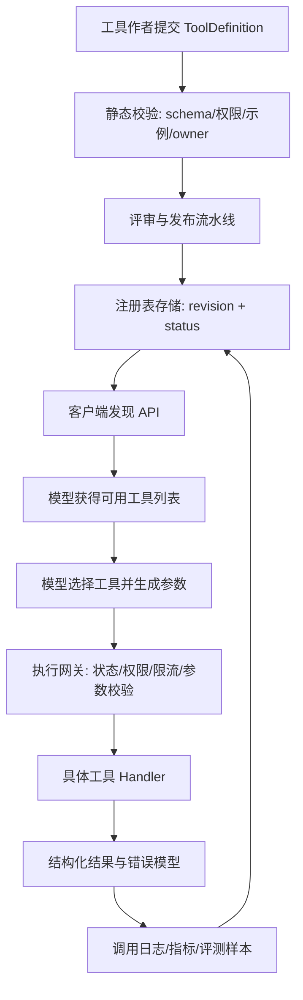

## 问题背景

MCP 让模型可以调用外部工具，但真正把一个工具接到生产系统里，困难往往不在“能不能调用”，而在“能不能稳定地知道有哪些工具、每个工具允许做什么、参数应该怎么传、失败以后如何解释”。早期团队会把工具列表写在代码里：一个 `map[string]Handler`，再配几段自然语言说明。这个方式在 demo 阶段很快，到了多人协作、多个客户端、多个环境并存时，就会变成隐性耦合。模型看到的工具说明、服务端实际校验逻辑、权限系统里的策略、监控系统里的维度，可能来自四个地方。任何一个地方忘记改，线上就会出现“模型以为可以调用，服务端拒绝”“服务端升级了参数，老客户端还按旧格式传”“安全团队审计不到某个高危工具”的问题。

工具注册表的价值，是把工具从“散落在代码里的函数”提升为“有生命周期、有契约、有治理边界的能力”。它不是一个简单的目录页，也不是把 schema 拼起来返回给客户端那么单薄。一个可用的 MCP 工具注册表至少要回答七类问题：这个工具解决什么任务；它当前有哪些版本；输入输出结构是什么；调用前需要哪些权限和上下文；调用过程会访问哪些外部资源；失败时如何分类；何时可以下线或替换。对模型而言，注册表提供清晰的可发现能力。对工程系统而言，注册表提供稳定的合约、灰度开关、审计入口和回滚锚点。

我更倾向于把 MCP 工具注册表看作一个“能力控制平面”。数据平面是具体工具执行，例如查数据库、读文档、发请求、改文件。控制平面负责描述、授权、选择、路由和观测。没有控制平面时，每个工具都必须自己处理版本、权限、日志、文档和测试样例，最后会形成一堆风格不同的实现。控制平面建立之后，新增工具需要遵循统一登记流程，客户端可以稳定拉取可用能力，运维可以从同一个位置关闭有风险的版本，测试系统也可以根据注册信息自动生成契约测试。

在 AI 应用里，工具注册表还有一个更特殊的挑战：调用方不是传统意义上的人类开发者，而是一个会根据自然语言说明规划行动的模型。传统 API 文档可以默认读者理解幂等、分页、权限、错误码；MCP 工具说明则必须同时服务模型规划、前端展示、后端校验和安全审计。描述太短，模型无法区分相似工具；描述太长，又会挤占上下文，增加误选概率。参数 schema 太宽，模型容易传入模糊数据；schema 太窄，又会导致真实场景覆盖不足。所以注册表设计不是“字段越多越好”，而是要把影响调用正确性的语义明确放到契约里。

一个典型事故是这样的：团队有 `search_docs` 和 `search_tickets` 两个工具，说明都写成“搜索相关内容”。模型在用户问“上次发布失败的原因是什么”时选了文档搜索，结果返回发布手册，而不是工单记录。工程师试图在 prompt 里补一句“遇到故障问题优先查工单”，但另一个模型入口没有同步这段 prompt。后来又新增 `search_incidents`，混乱扩大。根因不是模型“不聪明”，而是能力目录没有表达清楚适用场景、数据来源、排序策略和结果可信度。注册表应该让工具以结构化方式声明：面向什么对象、覆盖什么时间范围、返回结果是否来自事实库、是否需要用户授权、是否会产生副作用。

因此，一套生产级 MCP 工具注册表应当服务四个目标。第一是发现：客户端能够按用户、租户、模型、环境过滤可用工具。第二是契约：每个工具的输入输出、错误、权限和副作用都可验证。第三是演进：版本升级、弃用、灰度和回滚都有明确流程。第四是治理：安全、审计、观测和成本控制能围绕工具维度展开。如果一个注册表只解决了发现，却没有解决契约和治理，它迟早会退化成一份漂亮但不可信的清单。

## 核心概念

工具注册表的核心对象不是“函数名”，而是“工具定义”。工具定义需要包含机器可读字段，也需要包含给模型阅读的行为语义。下面是一份我在 Go 服务里常用的抽象，字段名可以因项目而异，但信息边界不应该缺失：

```go
type ToolDefinition struct {
    Name        string            `json:"name"`
    Version     string            `json:"version"`
    Title       string            `json:"title"`
    Description string            `json:"description"`
    Status      ToolStatus        `json:"status"`
    Capability  CapabilitySpec    `json:"capability"`
    InputSchema  json.RawMessage  `json:"inputSchema"`
    OutputSchema json.RawMessage  `json:"outputSchema,omitempty"`
    Auth         AuthSpec         `json:"auth"`
    Effects      EffectSpec       `json:"effects"`
    Examples     []ToolExample    `json:"examples"`
    Limits       ToolLimits       `json:"limits"`
    Observability ObservabilitySpec `json:"observability"`
    Owners       []string         `json:"owners"`
    UpdatedAt    time.Time        `json:"updatedAt"`
}
```

`Name` 是稳定标识，不应频繁改变；`Version` 是合约版本，不等同于代码发布版本；`Status` 用于表达 `experimental`、`active`、`deprecated`、`disabled` 等状态；`Capability` 描述工具属于搜索、读取、写入、计算、通知还是外部动作；`Auth` 说明调用需要什么权限；`Effects` 说明是否有副作用；`Limits` 表示超时、并发、成本和返回大小限制；`Examples` 则是模型选择工具的重要锚点。很多团队会忽略 `OutputSchema`，认为模型能读懂返回文本就行。这个想法在单工具场景还勉强可行，一旦工具结果要被另一个工具消费，或者要进入自动评测，就必须有输出契约。

版本要分三层看。第一层是注册表记录版本，也就是工具定义本身的版本。第二层是工具协议版本，例如 MCP SDK 或服务端支持的协议能力。第三层是业务能力版本，例如搜索索引从关键词升级到混合检索。不要把三层塞进一个字符串，否则你无法回答“客户端协议没变，但搜索排序变了，是否需要重新评测”这种问题。实践上，我会让 `name + contractVersion` 唯一定位调用契约，让 `implementationRevision` 指向部署包或镜像，让 `capabilityVersion` 描述业务能力演进。

权限也要避免只写一个布尔值。一个读取型工具可能需要租户权限、资源权限、字段脱敏权限和模型级别权限。一个写入型工具还需要确认用户意图、幂等键和审批策略。注册表里的权限声明不负责做最终授权，但它必须能驱动授权网关知道该检查什么。也就是说，注册表声明“这个工具需要 `repo.read` 和 `issue.write`”，执行层再结合用户身份、租户策略和资源实例做决策。

下面这个表格概括了注册表里最容易被低估的字段：

| 字段 | 解决的问题 | 缺失后的表现 | 工程建议 |
| --- | --- | --- | --- |
| `status` | 控制实验、启用、弃用、禁用 | 老工具被继续调用，危险工具无法快速下线 | 状态变更必须进入审计日志 |
| `effects` | 区分只读和有副作用动作 | 模型把写操作当查询使用 | 写操作默认需要确认或更高权限 |
| `examples` | 帮助模型理解适用场景 | 相似工具误选率高 | 示例要覆盖正例和反例 |
| `limits` | 控制超时、大小、成本 | 单次调用拖垮服务或上下文 | 注册表限制和执行层限制保持一致 |
| `owners` | 建立维护责任 | 工具坏了没人认领 | 至少写团队、告警频道和代码仓库 |
| `errorModel` | 让失败可解释 | 所有错误都变成“调用失败” | 区分参数、权限、资源、下游和系统错误 |

工具说明文本也应当结构化。给模型的 `description` 不宜只写“查询知识库”，应该包含适用场景、不要使用的场景、结果来源和排序语义。例如：“在用户询问内部工程文档、设计记录或运行手册时使用；不要用于查询线上事故、实时工单或个人权限数据；返回结果按语义相关度排序，并包含文档路径和更新时间。”这段话比华丽的营销句子更有价值，因为它直接影响模型选择。

另一个概念是注册表快照。客户端不应该在每一次工具调用前都重新拉完整注册表，也不应该永远缓存。合理做法是注册表服务返回 `etag` 或 `revision`，客户端按会话缓存可用工具集合。工具被禁用时，控制面可以通过短 TTL、事件推送或网关拒绝实现收敛。对高风险工具，我会让执行层每次都检查状态；对低风险只读工具，可以接受几分钟缓存。这里没有绝对答案，关键是注册表快照要可追踪，日志里要能看到某次模型决策基于哪一个工具集合。

## 架构/流程图解说明

一个可维护的 MCP 工具注册表可以拆成四层：定义层、发布层、发现层、执行层。定义层靠代码或配置描述工具；发布层做校验、评审、签名和灰度；发现层给客户端返回可用工具；执行层根据注册信息路由到具体 handler，并补齐授权、限流、日志和错误转换。



这张图里最重要的闭环是最后一条：调用日志和评测样本会反哺注册表。注册表不是发布后就静止的文档，它应当不断吸收真实调用里的误选、参数错误、权限拒绝、超时和用户纠正。比如某个工具经常因为 `query` 参数太短导致无结果，说明 schema 里可能需要最小长度，或者说明文本里应该提醒模型补齐上下文。某个工具在移动端入口误选率很高，可能是客户端场景不同，需要按入口过滤工具，而不是把所有工具都塞给模型。

在执行路径上，我建议把注册表放在工具调用网关之前，而不是让每个 handler 自己读注册表。调用流程可以这样分解：

1. 会话初始化时，客户端向注册表请求当前用户和模型可见的工具集合。
2. 注册表根据租户、环境、模型能力、实验开关和权限粗筛工具。
3. 模型基于工具说明和 schema 选择工具，生成参数。
4. 执行网关读取注册表快照，检查工具状态、版本、权限声明、限流策略和输入 schema。
5. 网关把请求转给 handler，handler 只关注业务逻辑和资源访问。
6. handler 返回结构化结果，网关转换为 MCP 响应并记录观测事件。

注册表存储可以用数据库、Git 仓库或服务发现系统。我的偏好是“定义在代码仓库，发布后进入数据库或 KV 存储”。纯数据库编辑虽然灵活，但评审和回滚弱；纯代码仓库虽然可审计，但动态开关和租户过滤不方便。两者结合后，工具定义通过 PR 管理，发布流水线把定义写入注册表服务，运行时状态如灰度比例、禁用原因、租户 allowlist 可以存到控制面数据库。

对多环境系统，还要明确注册表的环境边界。开发环境可以暴露实验工具，预发环境用于契约测试，生产环境只暴露 `active` 或灰度中的版本。不要让客户端用一个 URL 拉所有环境的工具，再在本地过滤；那会把未发布工具暴露到不该出现的地方。注册表 API 应该天然带环境上下文，并且每条记录都带来源和发布批次。

## 工程实现

落地时，我通常从“代码注册 + 构建期校验 + 运行时快照”开始。每个工具提供一个定义函数和一个 handler，注册表包负责收集定义并暴露查询接口。关键是让定义成为编译期可见的对象，而不是埋在 prompt 字符串里。

```go
type Handler func(ctx context.Context, req ToolRequest) (ToolResult, error)

type RegisteredTool struct {
    Definition ToolDefinition
    Handler    Handler
}

type Registry struct {
    mu       sync.RWMutex
    tools    map[string]RegisteredTool
    revision string
}

func (r *Registry) Register(tool RegisteredTool) error {
    key := tool.Definition.Name + "@" + tool.Definition.Version
    if err := ValidateDefinition(tool.Definition); err != nil {
        return fmt.Errorf("invalid tool %s: %w", key, err)
    }
    r.mu.Lock()
    defer r.mu.Unlock()
    if _, ok := r.tools[key]; ok {
        return fmt.Errorf("duplicate tool %s", key)
    }
    r.tools[key] = tool
    r.revision = computeRevision(r.tools)
    return nil
}
```

`ValidateDefinition` 不应该只检查字段非空。它至少要做这些事：验证 `name` 是否符合稳定命名规范；验证 `version` 是否是语义版本或内部约定格式；验证输入输出 schema 是否能被 JSON Schema 解析；验证示例参数是否能通过输入 schema；验证权限声明是否来自已知权限字典；验证有副作用工具是否声明确认策略；验证超时和返回大小是否在平台上限内；验证 owner 是否存在。这样做的收益很实际：大部分工具问题会在合并前暴露，而不是等模型第一次调用时暴露。

一个工具定义可以长这样：

```json
{
  "name": "incident.search",
  "version": "1.2.0",
  "title": "搜索事故记录",
  "description": "在用户询问线上故障、发布失败、告警原因、事故复盘时使用；不要用于查询设计文档或普通知识库。返回结果按发生时间和相关度综合排序。",
  "status": "active",
  "capability": {
    "kind": "search",
    "domain": "incident",
    "freshness": "near_real_time"
  },
  "inputSchema": {
    "type": "object",
    "required": ["query"],
    "properties": {
      "query": {"type": "string", "minLength": 4, "maxLength": 200},
      "service": {"type": "string"},
      "from": {"type": "string", "format": "date-time"},
      "limit": {"type": "integer", "minimum": 1, "maximum": 10}
    },
    "additionalProperties": false
  },
  "auth": {
    "permissions": ["incident.read"],
    "resourceScoped": true
  },
  "effects": {
    "readOnly": true,
    "externalNetwork": false
  },
  "examples": [
    {
      "user": "昨晚支付服务为什么报警",
      "args": {"query": "支付服务 昨晚 报警", "service": "payment", "limit": 5}
    }
  ],
  "limits": {
    "timeoutMs": 3000,
    "maxOutputBytes": 16000,
    "rateLimitKey": "tenant+user+tool"
  }
}
```

这里有几个设计点。`name` 使用领域前缀，避免所有工具都叫 `search`。`description` 明确“何时使用”和“不要何时使用”。`additionalProperties: false` 限制模型胡乱添加参数。`limit` 的最大值由注册表声明，执行层也要重复校验。示例不是装饰，它会成为模型选择和自动评测的样本。对于常见工具，我会至少放三类示例：正例、边界例、反例。反例可以不进入 MCP 暴露给模型，但应进入评测集，用来检查模型是否把工具用错场景。

注册表 API 可以分成内部管理 API 和运行时发现 API。管理 API 面向发布流水线，支持创建版本、更新状态、记录审核人。运行时发现 API 面向 MCP server 或客户端，只返回当前上下文可见字段。不要把内部字段全部暴露给模型，例如 owner 邮箱、内部仓库路径、风险评分细节可能没有必要进入上下文。一个发现响应可以包含 `revision`、工具列表、过期时间和策略摘要：

```json
{
  "revision": "reg_20260404_1842_8fd2",
  "expiresAt": "2026-04-04T18:47:00Z",
  "tools": [
    {
      "name": "incident.search",
      "version": "1.2.0",
      "title": "搜索事故记录",
      "description": "...",
      "inputSchema": {},
      "readOnly": true
    }
  ]
}
```

执行网关需要把注册表数据转化为硬约束。伪代码如下：

```go
func (g *Gateway) Call(ctx context.Context, req CallRequest) (ToolResult, error) {
    tool, ok := g.registry.Lookup(req.Name, req.Version)
    if !ok {
        return ToolResult{}, ErrToolNotFound
    }
    if tool.Definition.Status != StatusActive {
        return ToolResult{}, ErrToolDisabled
    }
    if err := g.authorizer.Check(ctx, tool.Definition.Auth, req.Subject, req.Resource); err != nil {
        return ToolResult{}, err
    }
    if err := g.schemaValidator.Validate(tool.Definition.InputSchema, req.Arguments); err != nil {
        return ToolResult{}, ErrInvalidArguments.WithCause(err)
    }
    if err := g.limiter.Allow(ctx, tool.Definition.Limits, req.Subject); err != nil {
        return ToolResult{}, err
    }
    started := time.Now()
    result, err := tool.Handler(ctx, ToolRequest{Arguments: req.Arguments})
    g.observe(ctx, tool.Definition, req, result, err, time.Since(started))
    return result, err
}
```

注意这里没有相信模型，也没有相信客户端。注册表给模型的是能力说明，给网关的是约束依据。两边使用同一份定义，但作用不同。如果模型绕过说明传了超大 `limit`，schema 会挡住；如果客户端缓存了已禁用工具，状态检查会挡住；如果用户没有权限，授权器会挡住。好的工具注册表不依赖“大家都按文档来”，而是把文档变成可执行规则。

在数据结构上，注册表应当保存历史版本。不要原地覆盖工具定义，否则你很难复盘事故。推荐使用 append-only 的 `tool_versions` 表，再用 `tool_runtime_state` 表记录当前状态：

| 表 | 关键字段 | 说明 |
| --- | --- | --- |
| `tool_versions` | `name`, `version`, `definition_json`, `created_by`, `created_at`, `definition_hash` | 不可变定义，便于审计和回滚 |
| `tool_runtime_state` | `name`, `version`, `status`, `rollout`, `disabled_reason`, `updated_at` | 可变运行状态 |
| `tool_visibility` | `name`, `version`, `tenant`, `model`, `environment` | 灰度和可见性 |
| `tool_call_events` | `call_id`, `revision`, `tool`, `status`, `latency_ms`, `error_kind` | 调用观测和评测样本 |

工程实现里还要处理排序。模型上下文有限，不能把一百个工具全塞进去。注册表需要支持按场景和能力裁剪。例如客服入口只暴露工单、知识库、订单查询；研发入口暴露代码搜索、CI、事故记录；写操作默认不出现在匿名会话。裁剪不是为了节省 token 这么简单，而是减少相似工具竞争，提高选择正确率。注册表可以返回一个候选集，也可以结合路由模型先做工具召回，再把小集合交给主模型。

## 测试评测

工具注册表的测试分三类：定义测试、执行测试和模型选择评测。定义测试关注每条记录是否合法；执行测试关注网关是否按定义执行约束；模型选择评测关注工具说明是否能引导模型选对工具。这三类测试缺一不可。只做 schema 校验会漏掉语义误选；只做端到端评测又很难定位到底是工具说明、模型能力还是后端行为的问题。

定义测试可以在 CI 里运行。每次新增或修改工具定义时，测试应检查字段完整性、schema 可解析、示例可通过、权限字典有效、状态迁移合法。状态迁移特别容易被忽略。比如 `deprecated` 可以回到 `active` 吗？`disabled` 是否必须填写原因？`experimental` 能否对所有租户可见？这些规则如果不编码，就会在紧急发布时被人为绕过。

执行测试应覆盖网关路径。构造一个假 handler，分别传入正常参数、未知工具、禁用工具、无权限用户、超限参数、限流触发、handler 超时等场景。每个场景不仅要断言错误，还要断言错误分类和观测事件。因为模型拿到错误后需要决定下一步，如果所有错误都长得一样，就无法区分“应该请用户授权”“应该改参数重试”“应该稍后再试”。

模型选择评测更像产品实验。准备一批用户问题，标注期望工具和不应调用的工具，然后让当前模型在当前注册表说明下选择。评测指标不只看准确率，也要看误调用高风险工具的比例、需要澄清却直接调用的比例、参数一次通过率。下面是一个简单评测表：

| 用户问题 | 期望行为 | 常见错误 | 注册表改进点 |
| --- | --- | --- | --- |
| “昨晚支付报警是什么原因” | 调用 `incident.search` | 调用文档搜索 | 在文档搜索说明里排除事故查询 |
| “把这个 issue 标成已修复” | 调用写工具前确认 | 直接写入 | 写工具声明 `requiresConfirmation` |
| “我们服务的限流配置在哪” | 搜索工程文档 | 调用配置读取工具 | 配置工具说明限定为已知 key |
| “查一下我有没有权限看工资表” | 拒绝或澄清 | 调用文件搜索 | 敏感域工具默认不可见 |

评测要固定注册表 revision。否则今天的工具说明和明天不同，结果不可复现。每次工具说明改动都应触发一组小评测，尤其是相似工具之间的竞争评测。对高风险工具，还应做“攻击性提示评测”，例如用户诱导模型绕过权限、要求调用不存在版本、要求扩大查询范围。注册表本身不解决所有安全问题，但它能让安全评测围绕能力边界展开。

线上观测指标同样重要。我会至少记录这些维度：工具曝光次数、模型选择次数、实际执行次数、参数校验失败率、权限拒绝率、下游错误率、超时率、平均输出大小、用户纠正率、同会话重试率。曝光到选择的转化异常低，可能说明工具说明不清楚或候选集太大；选择到执行失败高，可能说明 schema 和说明不一致；权限拒绝高，可能说明工具被暴露给了不该看到的人群。

## 失败模式

第一类失败是注册表和执行层漂移。注册表说 `limit` 最大 10，handler 实际允许 100；注册表说只读，handler 实际触发外部写入；注册表说需要 `ticket.write`，执行层只检查登录。漂移会破坏信任。解决方法是让网关成为唯一入口，并且在 handler 里保留关键防线。注册表定义进入发布前做静态校验，运行时再通过合约测试和观测发现偏差。

第二类失败是工具说明过度相似。多个工具都叫“搜索”“查询”“获取信息”，模型无法根据用户意图区分。解决方法不是在系统 prompt 里不断补丁，而是重写工具定义：名称带领域，描述写清适用和不适用场景，示例覆盖真实问题，候选集按入口裁剪。模型选错工具时，先看注册表是否给了足够信号，再讨论模型能力。

第三类失败是版本治理混乱。有些客户端缓存旧版本，有些工具只改实现不改契约，有些废弃版本永远不下线。解决方法是建立版本规则：破坏性 schema 修改必须升主版本；只改描述可以升定义 revision；实现优化但契约不变不改变工具版本；弃用要有时间窗、替代工具和监控指标。注册表应能返回“此工具将于某日期下线，替代工具是什么”，而不是突然消失。

第四类失败是权限声明太粗。只写 `requiresAuth: true` 没有意义，因为登录用户之间差异巨大。权限必须能表达资源域、动作、租户和敏感级别。写操作尤其要声明确认策略和幂等策略。模型可以建议动作，但最终执行必须经过授权和确认。

第五类失败是注册表变成垃圾场。每个团队都往里加工具，没人删，没人评测，候选集越来越大。这个问题要靠治理：工具必须有 owner、使用指标、最近评测结果和下线策略。长期无人调用的工具进入审查；高失败率工具暂停曝光；没有 owner 的工具不能发布生产。

第六类失败是错误模型不可用。工具失败只返回“failed”，模型就会盲目重试，用户也不知道下一步。注册表应定义错误分类，例如 `invalid_arguments`、`permission_denied`、`not_found`、`rate_limited`、`downstream_unavailable`、`unsafe_request`。不同错误对应不同恢复策略。参数错误可以让模型修正；权限错误需要用户授权；下游不可用不应无限重试。

## 上线 checklist

- 工具定义已包含稳定 `name`、契约 `version`、清晰 `description`、输入 schema、输出 schema、权限、限制、owner 和示例。
- 所有示例参数都能通过 schema 校验，并覆盖至少一个正例、一个边界例和一个不适用场景说明。
- 权限声明已映射到平台权限字典，执行网关会在运行时强制检查。
- 有副作用工具已声明确认策略、幂等键、审计字段和回滚说明。
- 注册表发布流水线会校验重复名称、状态迁移、schema 兼容性、权限合法性和 owner 有效性。
- 客户端发现 API 会按用户、租户、环境、模型和入口裁剪工具集合。
- 执行层会记录注册表 revision、工具版本、调用参数摘要、错误分类、延迟、输出大小和调用主体。
- 新工具已通过模型选择评测，重点覆盖相似工具竞争和高风险误调用。
- 已配置看板和告警，包括参数失败率、权限拒绝率、超时率、下游错误率和用户纠正率。
- 已定义弃用策略：替代工具、迁移窗口、通知渠道、最终禁用日期和回滚方案。
- 生产发布支持灰度，可按租户或入口逐步扩大曝光，异常时能在控制面快速禁用。
- 文档和代码仓库中能找到 owner、变更历史、评测记录和示例调用。

## 总结

MCP 工具注册表的本质，是把模型可调用能力变成可治理的工程资产。它需要同时照顾模型选择、客户端发现、后端校验、安全授权、观测评测和版本演进。只把工具名和 JSON Schema 拼给模型，无法支撑长期生产；只把权限写在 handler 里，也无法让模型知道哪些能力适合当前任务。好的注册表应该既是说明书，也是控制面；既能帮助模型做正确规划，也能在模型出错时提供硬边界。

落地时不要一开始就追求庞大平台。先把工具定义结构化，把 schema、权限、示例、限制和 owner 收拢到一处；再让执行网关基于定义做强校验；随后引入 revision、灰度、评测和观测。每一步都能独立产生收益。等工具数量从十个增长到一百个时，你会发现真正救命的不是某个复杂算法，而是那些朴素但严格的工程纪律：契约不可漂移，权限不可含糊，状态可回滚，错误可解释，调用可追踪。MCP 让工具调用变得容易，注册表让工具调用变得可持续。
