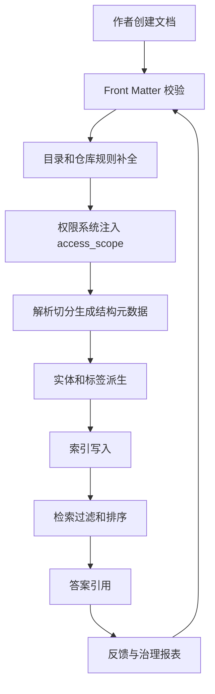

# 元数据和标签体系

## 问题背景

很多知识库项目一开始把注意力放在正文内容上，元数据只是顺手加几个字段：标题、作者、日期、标签。等 RAG 系统上线后，团队才发现真正控制质量和边界的往往不是正文，而是元数据。用户问“当前项目的上线流程”，系统必须知道哪些文档属于当前项目；用户问“最近一次决策”，系统必须知道文档时间和状态；用户没有某个团队权限，系统必须在召回、摘要、引用和图关系里都避开相关材料。这些能力都依赖元数据。

元数据不是装饰字段，而是 RAG 的控制平面。正文解决“内容是什么”，元数据解决“内容属于谁、什么时候有效、谁能看、是否可信、处在什么生命周期、适合回答什么问题”。没有元数据，检索系统只能做相似度搜索，无法可靠过滤项目、版本、权限、状态和时间。结果就是旧文档污染当前答案，草案压过正式决策，内部材料泄漏给无权用户，或者同一概念在不同团队下混在一起。

标签体系也经常被误用。许多团队让所有人自由打标签，最后出现 `rag`、`RAG`、`retrieval`、`检索`、`知识库`、`知识管理` 一堆相近词。标签看起来很多，实际没有过滤价值。自由标签适合探索和个人组织，不适合直接作为生产检索的强约束。生产系统需要受控分类法：哪些字段是枚举，哪些字段可多选，哪些字段来自权限系统，哪些字段由索引器自动生成，哪些字段允许作者手工维护。

好的元数据体系要服务工程问题，而不是追求“分类漂亮”。如果系统需要按项目隔离，就必须有 project_id；如果需要回答当前状态，就必须有 status 和 valid_time；如果需要处理权限，就必须有 visibility 和 access_scope；如果需要排除旧文档，就必须有 lifecycle；如果需要做 GraphRAG，就必须有 entity_type、relation_type、source_confidence 和 evidence 链接。先从检索、权限、更新和评测这些使用场景倒推字段，比开会讨论抽象本体更有效。

## 核心概念

元数据可以分成六类：身份元数据、结构元数据、业务元数据、生命周期元数据、权限元数据和派生元数据。身份元数据保证对象稳定，例如 document_id、chunk_id、source_path。结构元数据描述文档位置，例如标题路径、段落 offset、表格行列。业务元数据描述内容归属，例如项目、团队、产品、客户、模块。生命周期元数据描述状态，例如 draft、active、deprecated、deleted。权限元数据决定谁能看。派生元数据由系统生成，例如实体、摘要、embedding 版本、质量分。

这几类字段的维护方式不同。身份和结构字段应由索引器自动生成，人工不应该手填 chunk_id。业务字段可以由文档 front matter、目录规则和人工补充共同决定。生命周期字段需要和文档发布流程绑定，不能只靠作者记得改。权限字段应该来自组织权限系统或仓库权限，而不是靠标签模拟。派生字段可以重建，必须记录生成版本。

| 类别 | 典型字段 | 维护者 | 用途 |
| --- | --- | --- | --- |
| 身份元数据 | document_id、source_path、content_hash | 索引器 | 增量更新、引用回跳 |
| 结构元数据 | heading_path、offset、token_count | 解析器 | chunk 组装、邻接扩展 |
| 业务元数据 | project_id、team、domain、module | 作者和规则 | 项目过滤、主题聚合 |
| 生命周期 | status、valid_from、valid_to | 发布流程 | 排除草案和旧版本 |
| 权限元数据 | visibility、access_scope、owner | 权限系统 | 安全过滤、审计 |
| 派生元数据 | entities、summary_version、quality_score | 索引任务 | 图谱、评测、排序 |

标签和字段也要区分。字段适合表达强约束，例如 project_id 必须来自项目表，status 必须来自枚举。标签适合表达弱主题，例如 “GraphRAG”“Agent”“评测”。强约束字段可以参与过滤，弱主题标签更适合召回加权和浏览导航。把弱标签用于权限过滤非常危险；把强字段做成自由标签则会导致数据不可治理。

分类法需要层级，但不要过度复杂。一个实用的知识库分类可以有三层：domain、topic、facet。domain 表示大领域，例如 RAG、Agent、工程效率。topic 表示具体主题，例如实体消歧、增量索引、评测样本。facet 表示视角或材料类型，例如 design、runbook、incident、checklist、decision。这样用户可以问“RAG 领域里的评测 checklist”，系统也能按字段组合过滤，而不是依赖全文相似。

## 架构/流程图解说明

元数据体系应该贯穿文档从创建到回答的整个生命周期。下面是一个可落地的流程：



作者只负责少量高价值字段，例如标题、摘要、项目、主题、状态。目录和仓库规则可以补充 source、team、domain。权限系统注入 access_scope，确保不依赖作者手工填写敏感边界。解析器生成 heading_path、offset、chunk_id。派生任务抽取实体、生成摘要、打质量分。检索时先用权限和状态做硬过滤，再用业务字段和标签做召回加权，最后在答案里展示来源和时间。

这个流程里最重要的是“校验前移”。不要等用户问答失败后才发现文档缺 project_id 或 status。文档进入知识库时就应该校验 front matter，缺字段不能进入生产索引，或者只能进入隔离区。校验规则要和业务约束一致：内部 runbook 必须有 owner，决策文档必须有 status 和 valid_from，事故复盘必须有 incident_id，公开文章必须确认 visibility。

治理报表也很关键。元数据质量不是一次设计完就结束，它会随着文档增长而退化。报表应该显示缺字段文档、自由标签膨胀、低频标签、过期但仍活跃文档、没有 owner 的材料、权限范围过宽的文档、派生摘要过期的社区。没有报表，分类法会慢慢变成没人敢改的历史包袱。

## 工程实现

实现上，先定义元数据契约。契约可以用 JSON Schema、YAML schema 或代码结构体表达，但要让索引器、编辑器、CI 和检索服务共享同一套规则。不要让前端有一份枚举、后端有一份枚举、文档模板又有一份枚举。

```yaml
required:
  - title
  - summary
  - domain
  - status
  - visibility
fields:
  domain:
    type: enum
    values: [rag, agent, engineering, product]
  status:
    type: enum
    values: [draft, active, deprecated, archived]
  visibility:
    type: enum
    values: [public, internal, restricted]
  project_id:
    type: reference
    source: projects
  tags:
    type: list
    controlled: true
```

文档 front matter 不应该承载所有字段。它适合放作者知道的内容，例如标题、摘要、领域、主题、状态。source_path、content_hash、heading_path、chunk_id、embedding_version 由系统生成。access_scope 来自权限系统。entities 和 relations 来自抽取任务。这样可以减少人工错误，也能明确字段责任。

索引数据结构可以分文档级和片段级。文档级字段用于过滤和展示，片段级字段用于召回和引用。不要只在文档级保存状态和权限，然后切分后忘记复制到 chunk。线上检索通常查 chunk，如果 chunk 没有权限字段，过滤就会变复杂甚至失效。

```json
{
  "chunk_id": "doc_42_h2_03_p05",
  "document_id": "doc_42",
  "text": "增量索引需要处理删除、移动和权限变化……",
  "heading_path": ["RAG", "增量索引", "删除处理"],
  "metadata": {
    "domain": "rag",
    "topics": ["indexing", "permissions"],
    "status": "active",
    "visibility": "internal",
    "access_scope": ["team:ai-tools"],
    "valid_from": "2026-05-01",
    "source_authority": "runbook",
    "updated_at": "2026-05-10"
  }
}
```

检索时，元数据过滤要分硬过滤和软加权。硬过滤包括权限、删除状态、明确时间范围和项目边界。软加权包括主题标签、来源权威、更新时间、文档质量。硬过滤不应该被相似度覆盖，用户无权访问的材料即使语义最相关也必须排除。软加权可以参与排序，例如当前状态问题提升 active 文档和最近更新时间，背景问题提升 ADR 和总结文章。

权限过滤要尽早发生，并且贯穿派生数据。很多系统只过滤原文 chunk，却忘了实体节点、关系路径和社区摘要可能泄漏敏感内容。正确做法是派生对象也带 access_scope，或者在生成派生对象时按权限边界分层。比如一个社区摘要如果包含 restricted 文档信息，它本身也应该是 restricted，不能给 public 用户使用。

标签治理需要工具支持。新增标签要经过规范化，大小写、同义词、中英文别名要映射到 canonical tag。低频标签要定期合并。标签删除要有迁移计划，因为历史文档和评测样本可能依赖它。可以维护一张 tag_registry：

| 字段 | 含义 |
| --- | --- |
| tag_id | 稳定 ID，例如 rag.graphrag |
| label | 展示名称，例如 GraphRAG |
| aliases | 别名，例如 graph-rag、图谱检索 |
| parent | 上级标签 |
| status | active、deprecated |
| owner | 维护人或团队 |

对于 Markdown 知识库，可以在 CI 里做三类检查。第一，front matter 必填字段和枚举值。第二，标签是否在 registry 中。第三，文档状态和目录是否一致，例如 archived 目录下不能标 active。检查失败时给出具体修复建议，而不是只报 schema error。作者体验越好，元数据质量越能长期维持。

## 一个具体设计例子

假设要为 RAG 文章库设计元数据。第一版不要追求复杂本体，可以从用户真实过滤需求开始：按领域浏览，按主题检索，按文章状态过滤，按发布时间排序，按是否适合上线实践筛选。对应字段可以是 categoryKey、tags、status、date、source、audience、difficulty、artifact_type。

一篇文章的 front matter 可以这样：

```yaml
title: 检索失败如何定位
categoryKey: rag
source: NOTES/RAG
status: active
audience: builder
difficulty: intermediate
artifact_type: guide
tags:
  - Debugging
  - RAG
```

进入索引后，系统补充 document_id、content_hash、heading_path、han_count、quality_checks、entities。检索时，如果用户问“有没有适合上线前检查的 RAG 文章”，系统可以用 artifact_type 和 tags 找到 checklist 相关内容，再用 status 排除草案。用户问“最近关于 GraphRAG 的评测内容”，系统用 categoryKey、tags 和 date 组合过滤。这个例子里，元数据不多，但每个字段都服务明确用例。

如果后续要支持 GraphRAG，再逐步加入 entity_type、relation_type、evidence_count、community_id。不要一开始就把所有可能字段放进模板。字段越多，作者越不愿意维护，缺失和乱填越多。元数据体系要从最小可用字段开始，通过失败案例和真实检索需求演进。

## 字段演进和迁移

元数据字段一旦进入索引和评测，就不能随意改名。比如 `project` 改成 `project_id`，前端筛选、评测样本、索引任务、权限规则都可能依赖旧字段。字段演进需要迁移计划：先在 schema 里新增新字段，索引器同时写新旧字段，检索服务优先读新字段但兼容旧字段，报表统计旧字段残留，最后在一个明确版本删除旧字段。这个过程看起来繁琐，但比线上突然失去项目过滤要便宜。

枚举值也需要生命周期。一个标签或状态不再使用时，不要直接删除，可以标为 deprecated，并提供 replacement。索引器遇到旧值时给出告警，CI 提醒作者迁移。历史文档如果为了保持原貌不能改，也要在检索时映射到新的 canonical 值。这样既保留历史，又不让旧分类继续污染新内容。

迁移要配合回归样本。每次改 taxonomy，都应该跑一组专门样本：项目过滤、权限过滤、旧标签别名、状态排序、时间范围。字段迁移最容易出现的错误不是程序崩溃，而是静默过滤失效。比如 project_id 写入新字段了，但某个召回器还读旧字段，结果跨项目材料混进候选。只有端到端检索测试能发现这种问题。

## 元数据质量评分

当文档规模变大后，可以给每篇文档计算 metadata_quality_score。这个分数不是给作者排名，而是帮助系统判断材料是否适合进入高置信回答。一个文档如果缺 owner、没有更新时间、标签不规范、状态不明，即使正文相似，也应该在排序中降权，或者只作为补充背景。

质量分可以由几部分组成：必填字段完整度、标签规范度、生命周期清晰度、权限范围明确度、引用回跳可用性、最近审查时间。分数不需要复杂，关键是可解释。报表应该告诉 owner 为什么分低，例如“缺少 valid_from”“使用了 deprecated tag”“超过九十天未审查”。只有能修，分数才有意义。

| 质量项 | 检查方式 | 对检索的影响 |
| --- | --- | --- |
| 字段完整 | 必填字段是否为空 | 缺失时不进生产索引 |
| 标签规范 | 是否命中 tag_registry | 不规范时降低主题权重 |
| 状态明确 | status 是否 active 或 deprecated | 状态不明时不回答当前问题 |
| 权限明确 | access_scope 是否存在 | 缺失时默认最小可见 |
| 引用可用 | source_path 和 offset 是否有效 | 无法引用时不做关键证据 |

质量分不能替代权限和状态硬过滤。无权限材料分数再高也不能用，deleted 文档分数再高也不能进答案。质量分只用于软排序和治理优先级。这个边界要写进代码和文档，避免后来的人为了提高召回率把质量分当成万能开关。

## 作者体验和维护流程

元数据治理如果只靠规则压作者，很难长期成功。作者需要好的模板、自动补全和错误提示。比如新建 RAG 文章时，编辑器可以根据目录自动填 categoryKey，根据标题建议 tags，根据仓库权限填 visibility。CI 报错时不要只说“schema invalid”，而要指出“tags 中的 Graph-RAG 未注册，是否改为 GraphRAG”。工具越贴近写作流程，元数据越稳定。

维护流程也要轻。新增标签如果要开长会，作者会绕过流程；如果完全自由，又会失控。可以设一个轻量规则：新增一级 domain 需要评审，新增 topic 需要 owner 批准，新增 alias 可以通过 PR 直接合入。每月自动生成低频标签和重复标签报告，由 owner 批量处理。治理不是一次大清理，而是小步持续修。

对 AI 自动补充的元数据，要明确置信度和审核状态。模型可以建议 tags、摘要、实体，但不应该静默覆盖作者字段。建议字段可以标成 proposed，经过确认后变成 accepted。对于权限、状态、owner 这类强字段，不应由模型自动决定。模型适合辅助分类，不适合承担责任边界。

## 测试评测

元数据体系的测试分为静态校验、索引校验、检索校验和安全校验。静态校验检查源文件 front matter，确保必填字段存在、枚举合法、标签在 registry 中。索引校验检查文档切分后元数据是否正确继承到 chunk，派生字段是否带版本，删除文档是否从索引移除。检索校验检查过滤和排序是否按预期工作。安全校验检查无权用户是否看不到原文、摘要、实体和引用。

| 测试类型 | 示例 | 失败影响 |
| --- | --- | --- |
| 静态校验 | status 不在枚举中 | 文档无法进入生产索引 |
| 继承校验 | chunk 缺 access_scope | 权限过滤失效 |
| 时间校验 | deprecated 文档排在 active 前 | 当前状态回答错误 |
| 标签校验 | `Graph-RAG` 未映射 canonical | 主题召回分裂 |
| 安全校验 | restricted 摘要对 public 可见 | 信息泄漏 |

检索评测样本要专门覆盖元数据。比如同一个关键词在两个项目里都有文档，用户带 project_id 提问时只能返回当前项目；同一流程有旧 runbook 和新 runbook，当前状态问题必须采用 active；用户无权限访问某事故复盘，系统不能通过社区摘要间接泄漏事故细节；用户问历史原因时，旧文档可以被引用，但必须标明时间和状态。

自动化测试可以构造一个小型 fixture 知识库。里面放几篇内容相似但元数据不同的文档：public 与 restricted、active 与 deprecated、project A 与 project B、draft 与 decision。每次改索引或检索逻辑，都跑这些样本。这样能快速发现“相似度压过过滤条件”“chunk 没继承权限”“标签别名没展开”等问题。

线上观测也要看元数据使用情况。指标包括：按字段过滤的请求比例、过滤后候选数量、因权限被过滤的候选数量、deprecated 文档被召回次数、无 owner 文档访问次数、低质量元数据导致的失败反馈。元数据质量如果只在后台默默存在，很难获得维护优先级；把它和检索失败、用户反馈、上线风险关联起来，团队才会重视。

## 失败模式

第一个失败模式是自由标签失控。每个人按自己习惯打标签，标签数量迅速膨胀，检索时同一主题被拆散。解决方式是建立 tag_registry，新增标签走轻量评审，常见别名自动映射，低频标签定期合并。

第二个失败模式是把权限当标签。用 `private`、`internal` 这类标签模拟权限，迟早出事。权限必须来自可信系统，并在检索、派生摘要、图关系和引用阶段生效。标签可以描述内容，不能承担安全边界。

第三个失败模式是状态字段没人维护。文档上线时是 active，半年后流程变了却没人改 deprecated。系统继续引用旧文档，用户得到错误答案。状态要和发布流程、归档流程、文档 owner 绑定，并定期提示 owner 审查。

第四个失败模式是字段太多。模板里塞满几十个字段，作者不知道怎么填，最后大量空值和乱值。字段设计要从检索需求倒推，先保留少量高价值字段。派生字段交给系统，人工字段越少越好。

第五个失败模式是文档级过滤、片段级丢失。索引时只在 document 表存 project_id 和 access_scope，chunk 表没有复制或关联，检索服务为了性能直接查 chunk，结果过滤不完整。片段级索引必须具备足够过滤字段，或者查询时强制 join 文档权限。

第六个失败模式是派生数据没有权限继承。实体、关系、社区摘要由多个文档生成，如果其中一个文档 restricted，派生对象也可能包含敏感信息。派生数据必须记录来源集合和合成后的 access_scope，不能默认公开。

第七个失败模式是分类法不随业务演进。团队新增产品线、项目合并、组织调整，旧 taxonomy 没更新，作者只能用错误字段凑合。分类法要有 owner 和变更流程，允许废弃、迁移和别名映射。

## 上线 checklist

- 定义统一元数据契约，前端、索引器、CI 和检索服务共享同一份枚举和字段说明。
- 区分强字段和弱标签，权限、项目、状态、时间使用字段，不依赖自由标签。
- 文档进入生产索引前执行 front matter 校验，缺必填字段或枚举错误时阻断。
- chunk 继承必要文档级元数据，至少包括 document_id、status、visibility、access_scope、updated_at。
- 权限过滤在召回前或召回中执行，派生实体、关系、摘要同样带权限范围。
- tag_registry 记录 canonical tag、别名、父级、状态和 owner，低频与重复标签定期治理。
- 生命周期字段与发布和归档流程绑定，deprecated、archived 文档有降权或排除策略。
- 索引版本记录 schema_version、metadata_version 和派生字段版本，支持回放和回滚。
- 评测样本覆盖项目过滤、时间状态、权限边界、标签别名和旧文档污染。
- 治理报表展示缺字段、过期文档、无 owner、权限过宽、标签膨胀和派生摘要过期。

## 总结

元数据和标签体系决定 RAG 能否从“语义搜索”升级为“可控知识系统”。正文提供答案材料，元数据提供边界、归属、时间、状态和权限。没有这些控制面，系统很难回答当前状态问题，也很难保证安全和可复盘。

落地时要少谈抽象分类，多从工程用例倒推字段。项目隔离需要 project_id，当前状态需要 status 和 valid_time，权限边界需要 access_scope，主题浏览需要受控标签，GraphRAG 需要实体和关系来源。每个字段都要有维护者和使用场景，不要把模板变成填表负担。

元数据治理是一项持续工程。schema 校验、标签注册、权限继承、生命周期审查、索引版本和评测样本都要配套。只要这些基础扎实，检索、重排、GraphRAG 和生成层才有可靠输入。否则再强的模型，也会被错误边界、旧材料和混乱标签拖回不可控状态。
