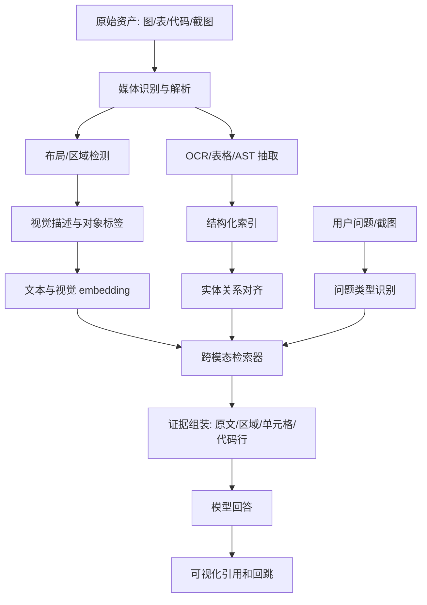

# 多模态 RAG 入门

## 问题背景

传统 RAG 默认知识是文本。把 Markdown、PDF、网页、Issue 切成 chunk，做 embedding，召回后交给模型回答。这个路线在文字材料上有效，但真实知识库里有大量关键信息不只存在于段落里：产品截图展示按钮位置，架构图表达服务依赖，表格保存参数矩阵，白板照片记录讨论结构，日志截图包含错误码，代码片段展示调用方式，幻灯片用布局和箭头表达优先级。把这些材料粗暴 OCR 成一串文字，会丢掉空间关系、视觉层级和数据结构。

多模态 RAG 的难点不是“模型能看图”这么简单。真正的问题是：图片和表格如何被切分，视觉对象如何变成可检索的证据，截图里的按钮和文字如何定位，表格单元格如何引用，代码块如何既参与语义检索又保留语法结构，最终答案如何让用户回到原图、页码、区域或单元格检查。没有这些工程设计，多模态模型只能在回答时看一张大图，然后给出难以验证的描述。

很多团队第一次尝试多模态 RAG，会把图片送给视觉模型生成 caption，再把 caption 当成文本 chunk 入库。这是一个可用起点，但不是完整方案。caption 通常是压缩叙述，它会遗漏小字、图例、坐标轴、颜色含义、按钮状态和表格行列。用户问“截图右上角红色提示旁边的按钮是什么”，caption 可能根本没有这个细节。用户问“这个架构图里哪个服务同时依赖 Redis 和向量库”，只有 caption 很难稳定回答。

更可靠的方式是把多模态材料拆成多层证据：原始资产、布局区域、OCR 文本、视觉对象、表格结构、代码 AST、模型生成的描述、人工维护的元数据。在线检索时，不同问题使用不同层。问大意，可以用摘要；问按钮位置，要用区域和 OCR；问表格数值，要用结构化单元格；问代码调用，要用符号和类型；问图中关系，要用视觉对象和边。多模态 RAG 的核心，是让非文本知识进入可检索、可引用、可评测的证据系统。

## 核心概念

第一类对象是 asset，也就是原始材料：图片、截图、PDF 页面、幻灯片、表格文件、代码文件、视频帧。asset 要有稳定 ID、来源、权限、时间、媒体类型、尺寸、页码或帧号。不要只保存 OCR 文本，原始资产必须可回跳。多模态回答的可信度很大程度取决于用户能否看到系统引用的是哪张图、哪一页、哪个区域。

第二类对象是 region。图片和页面需要被拆成有坐标的区域：标题、正文块、图表、按钮、表格、代码块、图例、箭头、节点、截图控件。region 不一定完美，但它让系统可以引用局部，而不是整张图。一个 region 至少包含 asset_id、bbox、type、text、confidence、parent_region。对于架构图，节点和边也可以是 region 的一种扩展。

第三类对象是 structured extraction。表格要解析成行、列、单元格和表头层级；代码要解析成函数、类型、导入、调用关系；图表要解析坐标轴、系列、图例和数据点；流程图要解析节点和连接。这些结构化结果不只是为了检索，也为了回答时避免模型重新猜。比如表格问题应该优先查 cell，而不是让模型读整张截图。

| 材料类型 | 关键抽取 | 检索入口 | 引用方式 | 常见损失 |
| --- | --- | --- | --- | --- |
| 截图 | OCR、控件、区域坐标 | 文本和视觉区域 | 图片加 bbox | 按钮状态、层级 |
| 架构图 | 节点、边、标签 | 实体和关系 | 图中节点/路径 | 箭头方向 |
| 表格 | 表头、单元格、类型 | 行列和字段 | 单元格坐标 | 合并单元格 |
| 代码 | AST、符号、调用 | 函数名和语义 | 文件行号 | 注释语境 |
| 幻灯片 | 页面布局、标题、图注 | 页标题和对象 | 页码加区域 | 视觉强调 |

第四类对象是 derived description。视觉模型生成的 caption、图表解释、截图说明、代码摘要都属于派生描述。它们有用，但必须绑定来源和版本。caption 不能取代原始证据，也不能无限期不更新。图片更新后 caption 要失效；OCR 版本变化后区域文本可能变化；表格修正后相关摘要要重建。多模态 RAG 里，派生描述是索引入口，不是最终事实本身。

第五类概念是 cross-modal alignment。用户用文本提问，证据可能在图片区域；用户截图提问，答案可能来自文档段落；用户问代码行为，证据可能同时来自 README、函数定义和运行截图。系统需要把文本、视觉、结构化数据映射到同一组实体和来源上。没有对齐，多模态只是多个独立检索器，回答时很难组合。

## 架构/流程图解说明

多模态 RAG 可以看成一条资产处理流水线加一个跨模态检索编排层。离线阶段为每种媒体生成多层索引；在线阶段根据问题类型选择合适检索器，并把结果组装成可引用上下文。



媒体识别阶段要尽量保留资产原貌。PDF 不应该直接转成纯文本，而要按页保存图像、文本块、表格和坐标。截图不应该只做 OCR，还要保留分辨率、窗口标题、时间、应用来源。代码文件不应该只按 token 切分，还要跑语言解析器，得到符号索引。表格文件不要转成 Markdown 后丢掉单元格类型，数字、日期、公式、合并单元格和工作表名称都是检索线索。

区域检测可以先用规则和现成工具，不必一上来训练模型。PDF 有文本层和坐标；HTML 截图可以从 DOM 获取元素；Markdown 图片可以配合 alt text 和附近段落；代码块天然有行号；表格有行列结构。对纯图片或扫描件，再使用 OCR 和视觉检测。工程上优先使用确定性结构，再用模型补齐不确定部分，质量会更稳定。

在线问题类型识别很重要。用户问“这张图讲什么”是全局理解；问“红色节点连到哪里”是视觉定位；问“表格里 local RAG 的风险等级是多少”是结构化查询；问“这个错误堆栈对应哪段代码”是代码和日志对齐。不同问题的召回策略不同。如果所有问题都走 caption 向量检索，细粒度问题会失败。

## 工程实现

数据模型要能同时表达原始资产、区域和派生文本。一个简化版本可以有 assets、regions、extractions、embeddings、citations 五张表。assets 保存文件级信息；regions 保存坐标和类型；extractions 保存 OCR、caption、table cell、code symbol 等结果；embeddings 对不同粒度做向量；citations 保存答案引用需要的回跳信息。不要让 chunk 成为唯一对象，多模态里 chunk 只是 text extraction 的一种。

```go
type Asset struct {
    AssetID    string
    SourceURI  string
    MediaType  string
    Width      int
    Height     int
    Page       int
    Checksum   string
    CreatedAt  time.Time
}

type Region struct {
    RegionID   string
    AssetID    string
    Type       string // text, table, chart, node, edge, code, control
    BBox       [4]float64
    Text       string
    Confidence float64
    ParentID   string
}

type Extraction struct {
    ExtractionID string
    RegionID     string
    Kind         string // ocr, caption, cell, ast_symbol, chart_series
    Payload      map[string]any
    ModelVersion string
}
```

索引时要按粒度建立多路入口。asset 级摘要适合全局问题；region 级文本适合定位问题；table cell 适合精确数值；code symbol 适合开发问题；视觉 embedding 适合用户上传截图找相似界面。每个入口都要保存引用路径。比如一个表格单元格的引用不是普通 URL，而是 asset_id、sheet、row、column、bbox；一个代码符号引用是 repo、file、start_line、end_line、symbol；一个架构图节点引用是 asset_id、region_id、bbox。

表格处理要避免“Markdown 化损失”。把表格转成 Markdown 后再切分，简单但会丢掉类型、公式、隐藏列、合并单元格和多级表头。更稳的做法是把每行转成结构化 record，同时保存单元格原文和类型。对于宽表，可以为每行生成一个可读文本：“在工作表 CostModel，第 12 行，provider=local，latency_p95=180ms，risk=medium”。这个文本用于 embedding，但答案引用仍然指向具体单元格。

代码处理也要双轨。语义检索需要注释、README、函数摘要；精确回答需要 AST、符号表、调用图和行号。比如用户问“索引重建时哪里更新 lifecycle_version”，向量检索可能找到相关说明，但最终证据应回到函数定义和调用点。代码 chunk 不应跨函数随意切，至少要保留 package、imports、receiver、function signature、注释和相关测试。对于 Go、TypeScript、Python 等语言，可以使用 tree-sitter 或语言自带工具生成符号索引。

视觉区域处理要建立坐标引用。OCR 结果里每个文本块都要有 bbox；视觉对象检测出的按钮、图例、节点也要有 bbox。答案中提到“右上角红色提示”时，界面可以高亮相应区域。没有坐标，用户只能自己在整张图里找。多模态 RAG 的引用体验应该像代码行号一样精确：点一下看到证据区域，而不是打开整张大图。

一个具体实现流程：用户上传一张“RAG 系统架构图”。系统先保存 asset，计算 checksum；OCR 抽出节点文字“parser”“vector index”“policy gate”“model”；视觉检测识别矩形节点和箭头；布局解析生成 node 和 edge region；LLM 基于区域列表生成图摘要；实体对齐把 “policy gate” 连到文档里的隐私策略实体。用户问“哪些模块会接触原文 chunk”，系统不是只看 caption，而是查图中与 “chunk” 标签相连的节点，再结合文档段落回答，并引用图中相关节点 bbox。

## 跨模态上下文组装

多模态检索的召回结果不能简单拼成文本。模型需要看到结构化证据和必要的视觉材料，但上下文预算有限。我的做法是把上下文分成四层：任务说明、结构化事实、局部原文或区域描述、可选图片输入。对于支持视觉输入的模型，可以附上裁剪后的区域图；对于只支持文本的模型，则提供 OCR、caption、坐标和来源。无论哪种方式，都要保留 citation metadata，答案才能回跳。

上下文组装需要按问题类型控制证据粒度。全局解释问题可以给 asset 摘要和少量代表性区域；定位问题应该给裁剪区域和邻近区域；表格问题给相关行列，不给整张表；代码问题给函数签名、关键行和测试引用；图表问题给轴、单位、数据点和图例。多模态 RAG 的一个常见浪费，是把整页截图发给模型，结果模型花大量上下文读无关区域，还可能被视觉噪声干扰。

```json
{
  "question_type": "table_lookup",
  "evidence": [
    {
      "kind": "cell",
      "asset_id": "cost-model-2026-05",
      "sheet": "RAG",
      "row": 12,
      "column": "risk",
      "value": "medium",
      "headers": {
        "provider": "local embedding",
        "metric": "privacy risk"
      }
    }
  ],
  "citation": {
    "type": "spreadsheet_cell",
    "target": "RAG!F12"
  }
}
```

对视觉模型要警惕“看图过度自信”。如果截图里文字很小、分辨率低、裁剪区域不完整，模型可能仍然给出确定答案。上下文里应该包含 OCR confidence、region confidence 和抽取版本。生成层也要被允许说“不确定，需要更高分辨率截图”。评测时要专门覆盖低质量图片，避免系统在糊图上编答案。

跨模态对齐还需要处理同名对象。图里一个节点叫 “Index”，代码里也有 `Index` 类型，文档里还有“首页索引”。实体对齐要看上下文、资产来源和关系，不要只按名称合并。可以给视觉实体加 namespace，例如 architecture_diagram:index_service，代码符号加 repo path，文档实体加 category。只有证据足够时再合并到同一 canonical entity。

## 媒体类型的落地顺序

多模态 RAG 最容易做成一个大而全项目，最后每种媒体都只有半成品。更务实的落地方式，是按问题价值和可验证性排序。第一批通常不应该选“任意图片理解”，而应该选结构最清楚、引用最容易检查的材料。比如代码仓库、表格、带文本层的 PDF、产品截图，比手写白板和低清照片更适合作为起点。先做可评测的媒体，系统才能快速建立质量闭环。

代码是很多工程团队的第一选择，因为它有文件路径、行号、语法树和测试。实现符号级索引后，用户可以问“这个配置在哪里生效”“哪个函数调用了重排器”“失败时返回什么错误”。答案能回到具体行，评测也能用程序检查。代码 RAG 还能和文本设计文档对齐，形成“文档说的”和“代码做的”之间的证据链。它的风险是上下文过大和依赖关系复杂，所以第一版要限制语言和仓库范围。

表格是第二个好入口。很多业务规则、评测结果、成本模型和功能矩阵都在表格里。表格天然结构化，问题也容易标注：某行某列是什么，某指标最大值在哪里，某条件下推荐哪个方案。只要保留行列、表头、单位和类型，回答质量会比把表格当文本高很多。表格的挑战是合并单元格、多级表头、公式和隐藏列，这些需要在解析报告里暴露，不要静默丢失。

截图适合产品、客服和运维场景，但要控制范围。第一版可以只支持清晰 UI 截图，依赖 OCR、控件检测和区域高亮；暂时不要承诺理解所有照片。截图问题常常需要空间描述，例如“右上角”“红色提示下方”“弹窗里的第二个按钮”。这要求系统保留坐标，并在前端展示高亮。否则答案说得再准确，用户也很难确认。

架构图和流程图价值很高，但抽取难度更大。箭头方向、节点边界、图例、颜色和线型都可能有含义。第一版可以要求图作者提供辅助文本或使用可解析格式，例如 Mermaid、PlantUML、Draw.io XML，而不是只上传 PNG。这样系统可以从结构源生成节点和边，再把渲染图作为引用。等结构化流程跑通后，再处理纯图片架构图。

| 阶段 | 推荐媒体 | 原因 | 先不做什么 |
| --- | --- | --- | --- |
| 第一阶段 | 代码、表格 | 引用精确，评测容易 | 任意图片问答 |
| 第二阶段 | PDF、产品截图 | 需求高，区域可视化 | 低清扫描件 |
| 第三阶段 | 架构图、流程图 | 关系价值高 | 无结构源复杂图 |
| 第四阶段 | 白板、视频帧 | 信息丰富 | 实时全量视频理解 |

这个顺序不是保守，而是让系统尽早形成可信证据链。多模态能力如果不能评测，就很难调优；不能引用，就很难被用户信任；不能降级，就很难稳定上线。每接入一种新媒体，都应该先回答三个问题：它的最小证据单元是什么，用户如何回跳检查，失败时如何定位。回答不清楚，就先不要把它放进默认问答链路。

资产更新策略也要提前设计。多模态材料经常不是纯文本 diff：截图重新截了一张，文件名没变但分辨率变了；表格单元格改了公式但显示值暂时相同；设计图导出后节点坐标整体移动；代码文件格式化后行号变化。系统如果只看文件路径，会误以为证据稳定；如果只看 checksum，又会在微小视觉变化后重建所有派生数据。更好的做法是分层 hash：asset hash 判断原始文件是否变化，region hash 判断局部区域是否变化，structured hash 判断表格行列或代码符号是否变化。这样可以只重建受影响的 OCR、caption、cell embedding 或符号索引，也能保留仍然有效的引用。

多模态材料还需要人工校正入口。OCR 把“local”识别成“1ocal”，表格合并单元格解析错，架构图箭头方向识别反，这些错误靠模型自我修正并不可靠。用户在引用界面里应该能修正区域文本、调整 bbox、标记箭头方向、确认表格表头。校正结果要写回 extraction 层，并记录来源是 human_verified。后续重排时，人工确认的区域可以获得更高权重。这样多模态 RAG 不只是一次性抽取，而是逐步积累高质量视觉证据。

还有一个上线前必须决定的边界：哪些媒体可以自动入库，哪些必须人工确认。公开 Markdown 中的图片可以自动处理，生产事故截图、客户界面截图和白板照片则可能包含敏感或临时信息，应该先进入待审核队列。多模态资产一旦被 caption 和 embedding 化，影响范围会扩大，所以入库策略要和权限策略一起设计。

## 测试评测

多模态 RAG 的评测必须分媒体类型。文本问答的指标不能直接套用。截图类评测要看区域定位是否正确，OCR 是否漏字，答案引用 bbox 是否覆盖目标。表格类评测要看单元格准确率、表头解析、数值单位和合并单元格。代码类评测要看符号召回、行号准确、测试引用。架构图评测要看节点识别、边方向和关系回答。

| 场景 | 样本设计 | 指标 | 失败分析入口 |
| --- | --- | --- | --- |
| 截图问答 | 按钮、提示、状态栏 | bbox IoU、OCR recall | 区域检测、裁剪 |
| 表格查询 | 单元格、汇总、筛选 | cell accuracy、unit match | 表头和类型解析 |
| 架构图 | 节点依赖、箭头方向 | edge accuracy | 视觉对象和实体对齐 |
| 代码问答 | 函数行为、调用链 | symbol recall、line accuracy | AST 和切分 |
| 图表解释 | 趋势、峰值、异常 | data point accuracy | 坐标轴和图例 |

评测样本要包含可引用标注。比如截图问题不仅标答案，还标目标区域 bbox；表格问题标工作表、行列和期望值；代码问题标文件和行号；架构图问题标节点和边。这样系统失败时能判断是召回错、区域错、抽取错还是生成错。只给自然语言标准答案，无法定位多模态链路中的错误。

自动评测可以把回答拆成两部分：答案内容和 citation。答案内容用规则或 LLM judge 检查语义，citation 用程序检查是否指向正确区域。比如表格问题，如果答案值正确但引用了错误单元格，不能算完全通过；截图问题，如果答案说“点击右上角保存”，但 bbox 高亮在左下角，也必须失败。多模态系统的可信度依赖可视化引用，不只是文本正确。

还要做降级评测。模型不支持视觉输入时，系统是否能基于 OCR 和结构化抽取回答一部分问题？图片质量低时，系统是否拒绝精确判断？表格解析失败时，是否回退到原图区域而不是编造单元格？代码解析器不支持某语言时，是否按文本检索并明确引用粒度较粗？降级路径决定了真实环境中的稳定性。

线上观测建议记录媒体类型分布、区域检测失败率、OCR 低置信比例、表格解析异常、代码符号索引覆盖率、视觉引用点击率。用户经常点击引用后放大图片，可能说明 bbox 太粗；用户反馈“答案找不到位置”，可能是引用区域不准；表格问题回答耗时高，可能是没有结构化索引，系统在整表扫描。

## 失败模式

第一个失败模式是 caption 单点依赖。caption 可以提供全局语义，但它不是事实数据库。只存 caption 会漏掉细节，也会把视觉模型的误读固化进索引。解决方式是保留原始资产、区域、OCR、结构化抽取和 caption，多层召回，多层引用。

第二个失败模式是坐标丢失。图片 OCR 后只保存文本，没有 bbox；PDF 抽取后只保存段落，没有页码；表格转文本后没有行列。答案即使正确，也无法让用户验证。多模态 RAG 的证据必须带位置。没有位置的抽取结果只能作为辅助摘要，不能作为强引用。

第三个失败模式是表格被当成长文本。表格里的语义来自行列交叉和表头层级。把它线性化后，模型可能把单位和数值配错，把相邻行混在一起。表格应优先结构化，再生成用于检索的文本视图。回答数值问题时，以 cell record 为准，而不是以 caption 为准。

第四个失败模式是视觉和文本实体误合并。同名节点、缩写和通用词很多。一个截图里的 “Admin” 可能是按钮标签，代码里的 Admin 可能是权限类型，文档里的 admin 可能是用户角色。实体对齐要保留来源上下文和类型，不要为了图谱漂亮而过度合并。

第五个失败模式是忽略分辨率和质量。低清截图、压缩图片、倾斜扫描件、遮挡表格都会降低抽取质量。如果系统不记录 quality score，回答层就不知道何时该保守。OCR confidence、图像尺寸、裁剪完整性、解析错误都应该进入重排和答案策略。

第六个失败模式是引用界面跟不上。后端能返回 bbox 和 cell，但前端只展示一条普通链接，用户仍然无法验证。多模态 RAG 需要引用 UI：图片高亮区域、PDF 跳页、表格定位单元格、代码跳行。没有 UI 支持，很多后端证据能力发挥不出来。

## 上线 checklist

- 原始 asset、region、extraction、embedding、citation 分层建模，不只保存 caption。
- 图片和 PDF 抽取结果保留 bbox、页码、置信度和模型版本。
- 表格保留工作表、行列、表头、类型、单位、公式和合并单元格信息。
- 代码使用符号级索引，至少保存文件、函数、行号、签名、调用关系和测试引用。
- 在线问题识别区分全局说明、视觉定位、表格查询、代码问答、图表解释。
- 上下文组装按问题类型选择粒度，避免整图整表无差别塞入模型。
- 派生 caption、摘要、实体关系记录来源和版本，原始资产变化后能失效。
- 引用 UI 支持图片区域高亮、PDF 页内定位、表格单元格定位和代码行跳转。
- 评测集包含 bbox、cell、line、edge 等可程序校验的引用标注。
- 低质量媒体有 quality score，回答层允许拒绝或请求更清晰材料。

## 总结

多模态 RAG 不是给文本 RAG 加一个图片 caption 字段，而是把图片、截图、表格、代码和图表变成可检索、可定位、可引用的证据。它需要资产层、区域层、结构化抽取层、派生描述层和跨模态对齐层共同工作。用户最终需要的不只是“模型看懂了图”，而是能点回具体区域、单元格、代码行或图中节点，确认答案从哪里来。

落地时可以从最有价值的媒体类型开始。产品团队先做截图区域和 OCR，数据团队先做表格结构化，工程团队先做代码符号索引，架构知识库先做图中节点和边。不要一开始追求全媒体统一神奇模型，而要先把证据对象、引用路径和评测标注做扎实。多模态 RAG 的难点在工程细节：保留结构，保留位置，保留来源，保留质量信号。做到这些，模型才有机会在复杂材料上给出可信答案。
