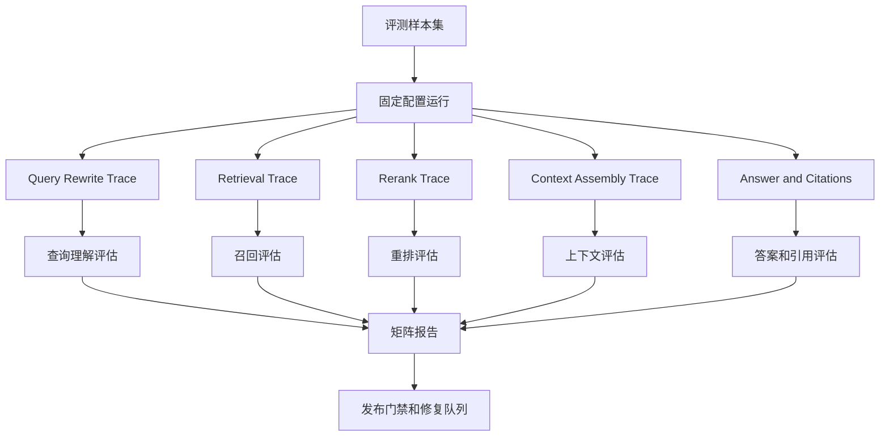
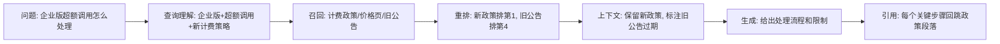

# RAG 评测矩阵

## 问题背景

RAG 系统上线后最容易陷入一种错觉：只要用户觉得答案还行，就认为检索和生成都还行。等真正出现问题时，团队才发现“答案不好”这个描述太粗。可能是 query 改写把意图改歪了，可能是召回没有拿到关键文档，可能是 rerank 把正确片段排到后面，可能是上下文组装时丢了限制条件，也可能是模型拿到了证据却没有按证据回答。每一层都能让最终答案变差，但修复动作完全不同。

很多团队的第一版 RAG 评测只看两个指标：答案相似度和人工满意度。它们有价值，但不足以指导工程。答案相似度依赖标准答案，而真实业务问题经常有多个合理表达；人工满意度能反映用户体验，但主观、昂贵、滞后。更麻烦的是，最终答案分数高不代表 RAG 链路健康。模型可能凭通用知识答对，检索却没有命中内部文档；也可能答案正确但引用错了，用户点开链接后发现证据不支持结论。

RAG 的质量应该被看成一个矩阵，而不是一个总分。矩阵的一边是链路阶段：查询理解、召回、重排、上下文组装、生成、引用、任务完成、成本延迟。另一边是样本类型：事实查找、流程解释、对比决策、故障排查、多文档综合、权限边界、证据不足、版本冲突。只有把二者交叉起来看，才能知道系统在哪些场景、哪一层薄弱。

举个例子，用户问“新计费策略下企业版超额调用怎么处理”。如果答案错了，至少有五种可能。第一，系统把“企业版”改写成“专业版”，查询理解失败。第二，向量召回只找到旧计费文档，召回失败。第三，正确文档召回了但被 rerank 排到第八名，没有进入上下文。第四，上下文里同时有旧策略和新策略，模型没有处理版本冲突。第五，模型回答了处理流程，但引用的是价格页而不是政策原文。一个答案分数无法区分这些问题，评测矩阵可以。

RAG 评测还要承认业务目标。内部知识助手、客服机器人、研发文档搜索、合规问答和个人知识库的指标权重不同。客服场景里错答赔付政策很严重；研发场景里漏掉限制条件会导致错误实现；个人知识库里引用完整性可能比语气更重要。评测矩阵不是固定模板，而是一套把质量拆开讨论的方法。团队要根据业务风险给不同单元格配置权重。

另一个常见问题是只评离线样本，不看线上任务。离线样本能保护关键路径，但真实用户会带着上下文、错别字、简称、权限差异和临时目标来问。RAG 的最终目标不是让答案像标准答案，而是帮助用户完成任务。用户是否点击引用、是否继续追问、是否转人工、是否采纳建议、是否在工具里完成下一步，都是任务完成信号。它们不能替代离线评测，但能补上离线评测看不到的体验维度。

所以，RAG 评测矩阵的目标是让质量讨论从“好不好”变成“哪一类问题、哪一层链路、哪一个版本、哪一种风险正在变化”。有了这个结构，模型升级、embedding 切换、chunk 策略调整、文档更新、reranker 改造都可以被同一套指标观察，而不是每次靠人工感受重新判断。

## 核心概念

RAG 评测矩阵至少包含四组指标：检索指标、证据指标、答案指标、任务指标。检索指标看系统有没有找到正确材料；证据指标看材料是否进入上下文并被正确引用；答案指标看最终输出是否忠实、完整、可用；任务指标看用户是否解决了问题。成本、延迟和稳定性贯穿所有指标，不应该放到最后才看。

检索指标的核心不是 top-k 命中率，而是“关键证据是否在可用位置”。很多系统会报告 recall@20，但模型上下文只放 top 5。正确片段出现在第 17 位，对最终回答没有帮助。更实际的指标是 evidence_recall@context，也就是黄金证据是否进入最终上下文；另一个是 first_relevant_rank，它能反映 rerank 是否把正确材料提前。对于多文档问题，还要看 evidence_coverage，不是命中一篇就算通过。

证据指标关注引用和上下文质量。一个好的 RAG 答案不只是“参考了文档”，而是每个关键结论都能回跳到正确片段。引用完整性看答案中的关键声明是否有引用；引用精确度看引用片段是否支持对应声明；上下文污染率看进入上下文的无关或过期材料比例；冲突暴露率看系统是否把版本冲突、政策冲突或权限冲突显式处理。

答案指标关注最终文本。它包括 factuality、completeness、instruction following、format validity、abstention behavior。这里要特别强调拒答行为。证据不足时硬答，是 RAG 的典型失败；证据充足时过度拒答，也会伤害用户。评测矩阵需要同时看 answerability 和 abstention，不能只奖励“看起来谨慎”。

任务指标更贴近产品。用户问一个接口限制，不一定只是要知道一句话，可能是要继续写代码；用户问一条故障原因，可能是要决定是否回滚。任务完成可以通过人工标注、会话后反馈、点击行为、后续问题数量、工单转人工率、引用打开率和业务系统操作来估计。它比答案指标更慢、更噪，但能防止团队把评测优化成漂亮文本。

| 维度 | 关键问题 | 示例指标 | 常见误区 |
| --- | --- | --- | --- |
| 查询理解 | 系统是否保留用户意图和约束 | intent accuracy、rewrite drift | 改写后更像搜索词但丢了条件 |
| 召回 | 正确材料是否被找到 | recall@k、gold chunk hit | 只看 top20，不看上下文可见性 |
| 重排 | 正确材料是否排在可用位置 | MRR、first relevant rank | rerank 追求相关性，忽略版本 |
| 上下文 | 进入模型的材料是否干净 | context coverage、pollution rate | 把相邻主题塞满上下文 |
| 引用 | 结论是否能回跳证据 | citation precision、claim coverage | 有链接就算有依据 |
| 答案 | 输出是否正确完整 | groundedness、completeness | 只按标准答案相似度打分 |
| 任务 | 用户是否解决问题 | task success、handoff rate | 用点赞代替所有质量判断 |
| 运行 | 是否可接受 | latency、cost、stability | 质量提升但成本不可上线 |

样本类型也要分层。事实查找样本测试基础召回；多文档综合样本测试证据覆盖；版本冲突样本测试时间和状态；权限边界样本测试安全；证据不足样本测试拒答；流程执行样本测试答案能否转成行动。不同样本类型的通过标准不同，不应该混在一个平均分里。

我建议每条样本都显式声明 answerability：answerable、partially_answerable、unanswerable。answerable 表示证据足够，系统应给出明确答案；partially_answerable 表示只能回答一部分，系统要说明缺口；unanswerable 表示当前证据不足或用户无权限，系统应拒答或引导补充。这个字段能把 RAG 从“永远尽量回答”拉回到证据驱动。

## 架构/流程图解说明

RAG 评测矩阵需要贯穿从样本到报告的完整链路。评测 Runner 不能只调用应用接口拿答案，还要保存中间 trace，并把 trace 拆成矩阵单元。推荐流程如下：



固定配置运行很重要。一次评测必须记录模型、embedding、索引版本、chunk 策略、reranker、prompt、知识库快照和权限身份。否则两个版本的分数不能比较。RAG 系统的输入不是只有用户问题，还包括知识库状态和运行配置。没有这些元数据，评测报告只能说明“这一次看起来如何”，不能说明变化来自哪里。

矩阵报告应该能从两个方向阅读。按链路看，可以发现系统性问题：比如所有样本的 first_relevant_rank 变差，说明 reranker 或索引出问题；引用精确度下降，说明答案生成或引用绑定有问题。按样本类型看，可以发现场景问题：比如事实查找稳定，但版本冲突样本失败，说明文档版本和时间过滤需要治理。



这条图不是为了展示理想状态，而是为了定义每一层的评测点。查询理解层检查“企业版”“超额调用”“新计费策略”是否都保留；召回层检查新政策是否命中；重排层检查新政策是否进入上下文预算；上下文层检查旧公告是否被过滤或标注过期；生成层检查是否回答流程、条件和例外；引用层检查引用是否指向政策原文。

评测矩阵还应该输出失败阶段。一个样本最终失败时，不要只标 answer_wrong，而要尽量标到最早失败阶段。最早失败阶段能帮助分工：query_rewrite_failure 给应用链路，retrieval_miss 给索引和 embedding，rerank_drop 给重排，context_loss 给上下文组装，generation_error 给提示词和模型，citation_error 给引用绑定，policy_error 给拒答和权限。

## 工程实现

工程实现从样本结构开始。样本不要只写 question 和 answer，至少要包含意图、权限、黄金证据、期望答案要点、拒答规则和矩阵权重。下面是一个可以落地的 JSONL 样本例子：

```json
{
  "id": "rag_billing_enterprise_overage_001",
  "type": "version_conflict",
  "risk_level": "high",
  "query": "新计费策略下企业版超额调用怎么处理？",
  "user_scope": ["customer-success", "billing-docs"],
  "answerability": "answerable",
  "expected_intent": {
    "topic": "billing_overage",
    "product_tier": "enterprise",
    "policy_version": "2026-03"
  },
  "gold_evidence": [
    {
      "doc_id": "billing-policy-2026-03",
      "chunk_id": "enterprise-overage",
      "must_be_in_context": true
    }
  ],
  "forbidden_evidence": [
    {
      "doc_id": "billing-policy-2025-11",
      "reason": "old policy"
    }
  ],
  "expected_points": [
    "企业版超额调用先进入宽限额度",
    "超过宽限额度后需要客户成功经理确认扩容或限流",
    "答案需要说明旧政策不再适用"
  ],
  "weights": {
    "retrieval": 0.25,
    "context": 0.2,
    "citation": 0.2,
    "answer": 0.25,
    "task": 0.1
  }
}
```

这个样本把“正确答案”拆成证据和要点。gold_evidence 用于检索和上下文评估，forbidden_evidence 用于检查旧材料污染，expected_points 用于答案评估，weights 用于聚合。answerability 明确系统应该回答，不应该因为存在旧政策就拒答；如果样本是 unanswerable，expected_points 应该变成拒答理由和下一步引导。

Trace 数据结构也要服务矩阵。只保存最终 prompt 不够，因为 prompt 已经丢失了很多中间排序信息。可以用下面的结构：

```go
type RAGTrace struct {
    SampleID        string
    Config          RAGConfig
    QueryRewrite    QueryRewriteTrace
    Retrieval       []RetrievedChunk
    Reranked        []RankedChunk
    ContextChunks   []ContextChunk
    Answer          string
    Citations       []Citation
    LatencyMS       int
    CostUSD         float64
}

type RetrievedChunk struct {
    DocID     string
    ChunkID   string
    Rank      int
    Score     float64
    Retriever string
}

type ContextChunk struct {
    DocID        string
    ChunkID      string
    TokenCount   int
    Version      string
    VisibleToUser bool
}
```

Config 要包含所有会影响结果的版本。Embedding 模型变了、chunk 大小变了、过滤器变了，都会影响召回。评测报告如果不记录这些配置，后续无法解释波动。ContextChunk 里保留 VisibleToUser，是为了检查权限过滤是否在最终上下文仍然成立。很多泄漏不是召回阶段发生的，而是在缓存、摘要或拼接阶段绕过了过滤。

指标计算可以按层写成独立 evaluator。查询理解 evaluator 检查改写后的 query 是否保留 expected_intent。召回 evaluator 检查 gold_evidence 是否出现在 Retrieval。重排 evaluator 检查黄金片段的 rank 是否进入上下文预算。上下文 evaluator 检查 gold_evidence 是否在 ContextChunks，forbidden_evidence 是否缺席。引用 evaluator 检查 Citation 是否指向支持声明的 chunk。答案 evaluator 用规则和 judge 混合检查 expected_points。

一个矩阵结果可以这样保存：

```json
{
  "sample_id": "rag_billing_enterprise_overage_001",
  "passed": false,
  "stage": {
    "query": {"score": 1.0, "passed": true},
    "retrieval": {"score": 1.0, "passed": true},
    "rerank": {"score": 0.8, "passed": true},
    "context": {"score": 0.4, "passed": false, "reason": "old policy entered context"},
    "citation": {"score": 0.5, "passed": false, "reason": "answer cites price page for overage rule"},
    "answer": {"score": 0.7, "passed": false, "missing": ["说明旧政策不再适用"]},
    "task": {"score": 0.6, "passed": false}
  },
  "first_failure_stage": "context",
  "blocking": true
}
```

first_failure_stage 很关键。上面这个例子里，答案确实缺了一个要点，引用也不精确，但最早的问题是上下文污染：旧政策进入了上下文且没有被标注过期。如果只改 prompt，让模型“注意版本”，可能短期通过，长期仍会被旧材料干扰。矩阵报告把修复焦点放回上下文过滤。

聚合时不要直接把所有 stage 分数加权平均后得一个总分。总分可以给管理看，但工程看板应该显示热力图。行是样本类型，列是链路阶段，格子里是通过率、回归数、严重失败数和趋势。比如：

| 样本类型 | 查询 | 召回 | 重排 | 上下文 | 引用 | 答案 | 任务 |
| --- | --- | --- | --- | --- | --- | --- | --- |
| 事实查找 | 99% | 96% | 94% | 93% | 91% | 90% | 88% |
| 多文档综合 | 95% | 88% | 82% | 78% | 74% | 70% | 66% |
| 版本冲突 | 93% | 84% | 79% | 61% | 58% | 55% | 50% |
| 权限边界 | 98% | 92% | 90% | 86% | 82% | 80% | 76% |
| 证据不足 | 97% | 89% | 87% | 85% | 83% | 72% | 69% |

这张表比一个 82 分更有用。它告诉我们版本冲突的上下文和引用是当前短板，多文档综合也有明显衰减。团队可以据此决定先做文档版本过滤、冲突提示和引用绑定，而不是盲目换模型。

权重设计也要工程化，不要在会议上凭感觉拍一个数字。我的做法是先列出业务风险，再把风险映射到矩阵单元。比如客服赔付政策里，答案错误和引用错误都很重，因为用户会据此行动；研发文档助手里，召回和上下文覆盖更重，因为工程师通常会继续读引用；合规问答里，权限和拒答比流畅度重要。权重不是为了算出漂亮总分，而是为了让发布门禁符合真实风险。

一个具体流程是：先让产品、工程和运营各自给样本类型打 risk_level；再由工程 owner 给每个失败阶段估计修复成本；最后把风险和成本合在一起决定阻断策略。高风险低修复成本的单元格应该优先做严格门禁，例如错误引用、旧版本污染、权限泄漏。高风险高修复成本的单元格可以先做告警和人工复核，但必须设定下降预算，不能长期挂在看板上。低风险单元格更多看趋势，不要因为一个边缘样本让发布流程停摆。

```yaml
matrix_policy:
  version_conflict:
    context:
      gate: blocking
      reason: "旧政策进入上下文会直接导致错误承诺"
    citation:
      gate: blocking
      reason: "用户需要点击原文确认政策"
  factual_lookup:
    answer:
      gate: warning
      max_regression: 0.03
  permission_boundary:
    context:
      gate: blocking
      reason: "不可见材料不得进入模型上下文"
```

任务指标的实现也要避免太粗。不要把“点赞”当成唯一真值，因为很多用户不点赞也完成了任务，很多用户点赞只是觉得语气友好。更稳定的做法是为每类任务定义可观察的后续行为：文档问答看引用打开和停留，故障排查看是否进入 runbook 或创建排障记录，客服问答看是否减少转人工和重复追问，研发助手看用户是否复制代码片段后继续查看相关 API。线上行为不是黄金答案，但它能告诉你离线矩阵是否漏了真实问题。

评测报告应该把这些行为信号和离线阶段并排展示。比如某次改动让 citation precision 提高，但引用打开率下降，说明引用可能更精确却不够有用；某次改动让 answer score 提高，但重复追问增加，说明答案看起来完整却没有解决用户任务。矩阵的价值就在这里：它不会把离线指标和线上体验混成一个不可解释的分数，而是保留足够多的维度，让团队看到质量变化的方向。

在 CI 中，矩阵可以分三档运行。第一档是 smoke set，几十条高风险样本，每次提交跑，要求快且稳定。第二档是 regression set，几百条关键路径样本，合并前或每日跑。第三档是 full set，包含线上采样和长尾问题，夜间跑。不要把全量评测塞进每个 PR，否则团队会因为慢而关闭它。

```yaml
eval_suites:
  smoke:
    max_cases: 50
    timeout_minutes: 10
    blocking: true
  regression:
    max_cases: 500
    timeout_minutes: 60
    blocking: true
  full:
    max_cases: 5000
    timeout_minutes: 360
    blocking: false
```

发布门禁也要矩阵化。高风险样本的检索、上下文、引用和答案失败可以直接阻断；低风险样本允许小幅波动，但不能出现新的权限泄漏和事实冲突。成本和延迟不能只做观察指标。一个 RAG 改动如果让多文档综合质量提高 2%，但 p95 延迟从 3 秒变 12 秒，客服场景可能无法接受。矩阵里必须有运行维度。

## 测试评测

测试 RAG 矩阵时，先测试样本质量。每条样本的 gold_evidence 必须真实存在，chunk_id 必须能在当前索引快照找到，forbidden_evidence 必须有明确原因。expected_points 不能写成完整作文，而要写成可检查要点。样本如果依赖某个时间点，必须记录 as_of。样本如果涉及权限，必须提供至少一个可回答身份和一个不可回答身份。

然后测试每个 evaluator。召回 evaluator 要能识别 doc_id 和 chunk_id 的精确命中，也要处理文档重切分后的映射。重排 evaluator 要测试黄金片段在不同 rank 下的得分。上下文 evaluator 要测试 token 截断、重复 chunk、过期版本、权限不可见材料。引用 evaluator 要测试引用缺失、引用错段、引用相关但不支持结论。答案 evaluator 要测试同义表达、要点遗漏、错误范围和错误拒答。

| Evaluator | 最小正例 | 最小反例 | 边界例 |
| --- | --- | --- | --- |
| Query | 改写保留产品、版本、动作 | 改写丢掉企业版 | 同义词替换但约束保留 |
| Retrieval | gold chunk 在 top-k | 只命中同主题旧文档 | 命中文档标题但未命中关键段 |
| Rerank | gold chunk 进入上下文预算 | gold chunk 被排到预算外 | 多个 gold chunk 只进入一半 |
| Context | 新政策进入，旧政策缺席 | 旧政策和新政策混放 | 旧政策进入但被明确标注过期 |
| Citation | 引用支持关键声明 | 引用价格页支持不了规则 | 引用上级段落但包含足够证据 |
| Answer | 覆盖要点且不扩张 | 漏掉限制条件 | 表达不同但事实等价 |

评测本身还要做稳定性测试。同一套样本、同一套配置，重复跑三次，关键指标不应该大幅波动。如果波动明显，要检查是否有非确定性排序、索引更新、工具实时返回、模型温度、缓存穿透。RAG 评测如果不稳定，就不能作为发布门禁。对生成部分可以允许轻微表达差异，但检索和上下文指标应该基本确定。

线上评测要和离线矩阵对齐。线上不能要求每个问题都有黄金证据，但可以用弱标签和行为信号。比如用户点击第一个引用并停留较久，可能说明引用有用；用户连续追问“依据是什么”“你确定吗”，可能说明答案不够可信；转人工率升高可能说明任务失败。把这些信号按样本类型回流，可以发现离线集缺少的场景。

A/B 测试也要看矩阵，而不是只看总体满意度。一个新 reranker 可能让热门问题满意度提高，但让长尾多文档问题召回下降。总体满意度可能仍然上涨，因为热门问题占比大；但对高价值客户的复杂问题，系统变差了。矩阵能把 A/B 结果拆到场景和阶段，避免平均数掩盖风险。

最后要做人工复核。自动指标适合规模化，但 RAG 质量里有很多业务语义。每周抽取失败样本、边界通过样本和高风险线上样本，让业务 owner 和工程 owner 一起复核。复核结论不是写在会议纪要里，而是更新样本、标签、权重或 evaluator。评测矩阵只有持续吸收真实反馈，才不会变成陈旧仪表盘。

## 失败模式

第一种失败模式是把检索评测做成搜索引擎评测。RAG 不是只要 top-k 相关，而是要把可支持答案的证据放进模型可见上下文。只看 recall@20，会让团队忽略上下文预算、重排和组装。

第二种失败模式是样本只有标准答案，没有黄金证据。这样只能评最终文本，无法判断检索链路。RAG 样本必须标注 gold_evidence，否则矩阵少了一半。

第三种失败模式是忽略版本和时间。知识库里经常同时存在草案、旧政策、新政策、迁移说明和事故复盘。系统如果没有 as_of、valid_from、valid_to 和版本过滤，答案会在旧材料和新材料之间摇摆。

第四种失败模式是引用和声明没有绑定。答案末尾列出三个参考链接，不等于每个关键结论都有证据。引用评测要做到 claim 级，否则错引用会大量漏掉。

第五种失败模式是把拒答当失败。证据不足或用户无权限时，正确行为就是拒答或要求补充信息。矩阵需要 answerability 字段，才能判断拒答是谨慎还是无能。

第六种失败模式是忽略权限。离线评测常用管理员视角跑，结果上线后普通用户看到的证据完全不同。每个涉及敏感材料的样本都应该至少跑两个身份，检查可见证据和答案是否匹配。

第七种失败模式是过度追求自动 judge。LLM judge 能评答案覆盖和忠实度，但不应该替代检索、重排、权限和版本检查。能从 trace 算出来的指标，优先用确定性算法。

第八种失败模式是没有把评测连接到修复流程。报告显示版本冲突样本通过率 55%，但没有 owner、没有失败阶段、没有样本链接、没有 trace，工程上仍然不会动。矩阵输出必须能生成修复队列。

## 上线 checklist

- [ ] 每条评测样本包含 query、type、risk_level、answerability、gold_evidence、expected_points。
- [ ] 评测运行记录模型、embedding、索引、chunk、reranker、prompt、知识库快照和权限身份。
- [ ] Trace 中保留 query rewrite、retrieval、rerank、context、answer、citation、latency、cost。
- [ ] 检索指标区分召回候选和最终上下文，不用 recall@20 代替可见证据命中。
- [ ] 引用评测检查关键声明到具体 chunk 的支持关系，不只检查链接存在。
- [ ] 版本冲突样本包含 forbidden_evidence 或 valid_time，旧材料污染会被捕获。
- [ ] 权限边界样本用不同 user_scope 运行，确认不可见材料不会进入上下文或引用。
- [ ] 发布门禁按风险和阶段配置，严重引用错误、权限泄漏和高风险答案错误直接阻断。
- [ ] 看板使用样本类型乘链路阶段的热力图，同时展示成本、延迟和稳定性。
- [ ] 线上反馈、人工复核和事故复盘会回流到样本集和 evaluator。

## 总结

RAG 评测不能只问答案像不像标准答案。一个生产 RAG 系统的质量来自查询理解、召回、重排、上下文、引用、生成和任务完成的组合。评测矩阵把这些组合拆开，让团队能看到具体薄弱点，而不是围绕一个总分争论。

好的矩阵有三个特点。第一，它有结构化样本，记录黄金证据、拒答规则、权限和版本。第二，它有完整 trace，能把失败定位到最早阶段。第三，它有分层门禁，高风险问题严格阻断，低风险问题看趋势和回归。这样做会比简单打分麻烦，但它能换来真正可修的质量反馈。

RAG 的工程本质是证据管理。评测矩阵也是证据管理：证明系统找到了正确材料，证明材料进入了上下文，证明答案按材料生成，证明用户最终能完成任务。只要这条链路清楚，模型、索引和知识库怎么演进，都能有一套稳定的方法判断是否真的变好。
