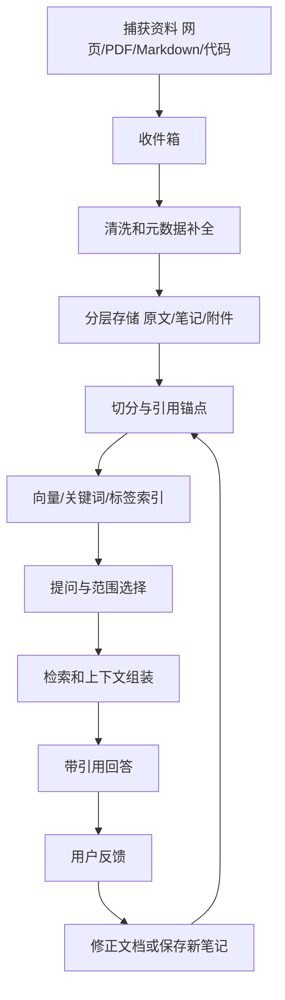

# 个人知识库里的 RAG 工作流

## 问题背景

个人知识库的 RAG 和企业知识库不太一样。企业场景常常先讨论权限、组织结构、知识治理和多人协作；个人场景的问题更朴素：我读过很多文章，写过很多笔记，保存过很多链接，也做过很多项目复盘，真正需要的时候却想不起它们在哪里。搜索文件名不够，全文搜索太依赖关键词，浏览目录又太慢。RAG 看起来像一个自然的补充：把自己的资料接入检索和模型，让系统帮我找证据、整理脉络、回答问题。

但个人知识库很容易做成“会聊天的垃圾桶”。把所有网页剪藏、PDF、会议记录、草稿、代码片段、聊天摘要一股脑塞进向量库，短期很有成就感，长期却会遇到几个问题。第一，材料质量参差不齐，模型会把临时想法、未验证摘录和正式结论混在一起。第二，资料持续变化，旧笔记没有标记过期，新资料没有及时入库。第三，答案没有引用链，用户只能相信模型，而不能回到原文检查。第四，工作流没有嵌入日常写作，索引很快落后于真实知识状态。

个人知识库 RAG 的关键不是一次性导入多少资料，而是把“收集、整理、索引、提问、引用、修正”变成一个可持续工作流。这个工作流要尽量轻，不应该让每次写笔记都像填数据库表；它也要足够严格，至少能区分原始资料、个人理解、稳定结论和待验证假设。否则模型回答得越流畅，越容易把不同可信度的内容揉在一起。

我更倾向于把个人 RAG 做成本地优先的知识工作台。文档仍然以 Markdown、PDF、网页快照、代码仓库这些普通形态存在，RAG 索引只是一个辅助层。用户能随时打开原文，能看到答案引用，能把错误答案转成修正任务，能在写新文章时复用已有材料。系统不应该替代写作和判断，而应该减少寻找、回忆、比对和引用的成本。

这个目标决定了工程取舍。个人知识库不一定需要复杂的企业权限系统，但需要清楚的资料状态；不一定需要亿级向量库，但需要增量更新和稳定引用；不一定需要高级 Agent，但需要可解释的检索结果；不一定需要全自动摘要，但需要在用户确认后把好答案沉淀成新笔记。它更像一个长期陪伴写作者和工程师的工作流系统，而不是一个炫技问答机器人。

## 核心概念

个人知识库 RAG 可以拆成七个核心对象：收件箱、资料源、笔记、证据片段、索引、问题和反馈。收件箱是未处理材料的缓冲区，比如刚保存的网页和 PDF。资料源是原始材料，应该保留来源、作者、时间和许可。笔记是你自己的理解，可能引用多个资料源。证据片段是可回跳的原文窗口。索引是面向检索的派生数据。问题是用户真实任务，不只是随口问答。反馈是对答案和资料质量的修正。

| 对象 | 作用 | 建议字段 | 设计边界 |
| --- | --- | --- | --- |
| InboxItem | 暂存新材料 | path、captured_at、source_url、status | 不直接进入高置信回答 |
| SourceDoc | 保存原始资料 | title、author、published_at、license、hash | 不随摘要丢失 |
| Note | 记录个人理解 | topic、confidence、references、updated_at | 必须区分观点和摘录 |
| EvidenceChunk | 支撑引用 | chunk_id、offset、heading、text | 尽量稳定可回跳 |
| IndexRecord | 检索派生数据 | embedding_version、splitter_version、state | 可以重建，不当原文 |
| QuerySession | 一次提问过程 | query、scope、citations、trace | 便于回放失败 |
| Feedback | 改进信号 | rating、reason、patch_target | 能转成行动 |

这里最重要的边界是“原文”和“解释”。原文是资料源和证据片段，代表某篇文章、某个项目记录、某份文档确实这样写过。解释是你自己的笔记、模型生成的总结、主题标签和关联关系。解释可以帮助检索，但不能伪装成原文。个人知识库里很多幻觉不是模型凭空编出来，而是系统把旧总结、新摘录和未确认想法混成同一种证据。

第二个概念是可信度。个人笔记里会有很多不同阶段的内容：刚读完文章留下的摘录，半夜写下的想法，项目复盘后的结论，已经发布的长文，过期的方案草案。它们都可以进入知识库，但不能在回答中拥有同样权重。可以用 `status` 和 `confidence` 两个字段控制：raw、processed、evergreen、deprecated 表示生命周期；low、medium、high 表示你对内容的信任程度。模型回答时应该优先使用 evergreen 和 high，引用 raw 材料时要提醒它只是原始摘录。

第三个概念是任务上下文。个人知识库不是公共百科，用户的问题经常和当前任务有关。比如“我之前怎么理解 GraphRAG 的社区摘要”可能是在写文章；“上次我为什么没采用某个向量库”可能是在做技术选型；“帮我找隐私相关的引用”可能是在准备演讲。查询时应该允许用户指定范围：某个项目、某个目录、某个时间段、某类资料。范围越明确，答案越容易可靠。

第四个概念是沉淀。RAG 回答如果只是一次性输出，很快就会消失在聊天记录里。好的个人知识工作流应该支持把一次高质量回答转成笔记草稿、任务清单、引用列表或待修正文档。比如系统回答完“我过去写过哪些 RAG 评测原则”，用户确认后，可以把这次回答保存为一篇 `notes/rag-evaluation-principles.md` 的草稿，并保留所有引用。这样 RAG 不只是消费知识，也参与知识增长。

## 架构/流程图解说明

个人知识库 RAG 的架构可以保持简单，但流程要闭环。下面这条链路把资料进入、整理、索引、提问、反馈和沉淀放在同一个循环里。它强调一个事实：索引是派生物，真正长期保存的是原文、笔记和修正记录。



捕获阶段要低摩擦。用户看到一篇有价值的文章，不应该先填写十个字段才能保存。可以只保存 URL、标题、抓取时间和原文快照，状态标记为 inbox。后续每天或每周清理 inbox，把值得长期保留的内容转为 source doc，给它加主题、可信度和用途。没有清理的材料也可以检索，但默认权重低，并且在答案中标记为未整理来源。

整理阶段要轻量结构化。Markdown 笔记可以用 front matter 保存 title、source、status、confidence、tags、created_at、updated_at。PDF 和网页快照可以旁挂一个同名 metadata 文件，不必强行改原文件。代码仓库可以用路径规则和 README 提取元数据。关键是让系统知道材料的身份和状态，而不是只看到一堆文本。

索引阶段应该把不同用途的数据分开。向量索引用于语义召回，关键词索引用于专有名词和错误码，标签索引用于用户显式范围，引用锚点用于回跳，摘要索引用于快速浏览。索引失败不应该破坏原文；删除索引也不应删除资料。对个人知识库来说，可重建性比追求复杂索引更重要。

提问阶段最好给用户一个范围选择。默认范围可以是全部高可信资料，但用户应该能切到“只看某个项目”“只看最近一年”“包括 inbox”“排除过期草稿”“只看已发布文章”。很多错误答案来自范围不清。比如用户问“我对本地优先有什么结论”，如果系统把临时摘录和最终文章混在一起，答案会摇摆；如果只看 evergreen 笔记，回答会更像当前立场。

反馈阶段要转成行动。用户发现引用不支持答案，可以标记 citation_bad；发现资料过期，可以把 source doc 标为 deprecated；发现缺少一篇文章，可以加到 inbox；发现模型总结不错，可以保存为 processed note。反馈如果只存在聊天会话里，系统不会变好。反馈必须能修改文档状态、补元数据、创建任务或更新评测样本。

## 工程实现

个人知识库的存储可以直接使用文件系统，不必一开始上数据库。一个稳定的目录结构比复杂后台更重要。例如：

```text
knowledge/
  inbox/
  sources/
    web/
    pdf/
    books/
  notes/
    ai/
    engineering/
    writing/
  projects/
  index/
    chunks.jsonl
    embeddings/
    keyword.sqlite
  feedback/
```

原文和笔记放在人能读懂的位置，索引放在 `index/` 作为派生物，反馈放在独立目录方便审计。这样即使 RAG 服务坏了，知识库仍然可用。对个人长期资料来说，这是很重要的心理安全感：你不是把知识交给一个黑盒系统，而是在普通文件上加了一层可重建的检索能力。

Markdown 笔记的 front matter 可以保持克制：

```yaml
---
title: GraphRAG 社区摘要实践
status: evergreen
confidence: high
source_type: note
created_at: 2026-05-16
updated_at: 2026-05-16
tags:
  - RAG
  - GraphRAG
references:
  - sources/web/graphrag-paper.md
  - projects/rag-eval/incident-2026-05.md
---
```

索引记录则可以更偏工程化。下面这个结构把原文身份、切分版本、引用位置和检索状态放在一起。它不要求用户手写，应该由索引器生成。

```go
type IndexRecord struct {
    SourceID        string
    ChunkID         string
    Path            string
    HeadingPath     []string
    StartOffset     int
    EndOffset       int
    TextHash        string
    Status          string
    Confidence      string
    SplitterVersion string
    EmbeddingModel  string
    IndexedAt       time.Time
}
```

切分策略要服务个人工作流。对已发布长文，可以按标题和段落切，引用要精确；对读书摘录，可以让每条摘录和自己的批注成为相邻 chunk；对项目复盘，要保留时间线和结论；对 inbox 网页，可以先粗切，等用户整理后再精切。不要把所有材料都切成固定 token。个人知识库的文档类型变化很大，切分器应该读元数据。

检索服务可以分三步。第一步解析问题和范围，判断是否需要包括 inbox、是否只看高可信资料、是否限制目录。第二步多路召回：向量召回语义相近片段，关键词召回专有名词，标签过滤缩小范围，最近使用记录提高当前项目材料权重。第三步上下文组装：按来源分组，优先给原文证据，再给个人笔记解释，最后提示可能过期或低可信材料。

一个具体使用例子：我在准备一篇关于“RAG 引用链”的文章，提问“我以前怎么定义可验证回答？”系统先把范围缩到 `notes/ai/` 和已发布文章，排除 inbox 和 deprecated。向量召回到几篇 RAG 笔记，关键词命中“引用链”“可回跳”“证据片段”，标签索引命中 `Citation`。上下文组装时，系统把已发布文章的段落放在前面，把未整理摘录放在后面并标记。回答不是泛泛解释可验证性，而是总结出我自己的三个原则：答案句要能回到原文，引用要指向最小证据窗口，证据不足要拒答。每条原则后面都有本地文件引用。

生成后的沉淀也要有工程路径。用户可以把答案保存为一篇 draft note，系统在 front matter 里写入 references，把每条引用转成 Markdown 链接。用户改完草稿后，索引器再把这篇新笔记纳入知识库。这样一次问答变成了知识生产的中间步骤，而不是聊天窗口里的消耗品。

本地优先还涉及隐私。个人知识库可能有客户材料、私人日记、财务记录、未公开项目。即使用外部模型，也要在发送前做范围控制和脱敏。更保守的做法是默认只索引用户明确放入知识库的目录，不扫描全盘；默认不把 private 标签的材料发送给远端模型；默认记录每次外发的 chunk id 和模型供应商。个人工具不能因为方便而偷走边界感。

## 日常使用流程例子

工程系统最终要落到日常动作里。一个可持续的个人 RAG 工作流，可以按“捕获、整理、提问、写作、回填”五步运行。捕获时只求快：看到值得保留的资料，保存到 inbox，附上来源链接。整理时只处理少量高价值材料：给标题、状态、标签和一句自己的判断。提问时带范围：不要总问全库。写作时把回答变成草稿：保留引用，删掉不确定句。回填时把最终文章和修正后的观点重新入库。

假设我读到一篇关于检索重排的论文。第一天我只把 PDF 放入 `inbox/`，索引器粗切后标记为 raw。第二天我读完，摘出三段和自己的批注，放到 `notes/ai/reranking-notes.md`，状态是 processed，可信度 medium。一个月后我在项目里实际评测了 reranker，把结果写成项目复盘，状态 high。再后来我写公开文章，只引用项目复盘和论文原文，不再引用第一天的 raw 摘录。RAG 系统在回答“我对 reranking 的立场是什么”时，应该优先使用后两个来源。

这个例子说明个人知识库的时间性很强。同一个主题会经历原始阅读、初步理解、实践验证、公开表达几个阶段。RAG 如果不知道阶段，就会把早期猜测和后期结论平权。工程实现上不需要复杂本体，只要让状态、可信度、更新时间和引用关系参与排序，就能显著改善答案质量。

还有一个常见流程是“查旧账”。做技术选型时，我经常需要知道“我之前为什么没有采用某个方案”。这类问题不适合普通搜索，因为理由可能散在会议纪要、个人日记和项目复盘里。RAG 可以先召回方案名称，再按时间排列相关材料，展示当时的限制、后续验证和当前状态。回答里要明确区分“当时的理由”和“今天是否仍然成立”。这比直接给一个结论更有价值。

对于写作者，个人 RAG 的另一个价值是找素材而不是代写。比如准备一篇长文时，可以问“帮我找过去关于引用、证据、可回跳的所有材料，按观点分组”。系统输出的是素材清单、引用位置和可能的论点冲突。用户仍然要组织文章，但不用在目录里翻半天。这种场景下，答案越短越好，引用越准越好。

## 知识分层和写作集成

个人知识库要长期有用，必须承认“知识不是同一种东西”。我会把内容分成四层：原始材料、工作笔记、稳定观点和发布内容。原始材料包括论文、网页、PDF、会议记录、代码片段，它们代表外部世界或项目现场。工作笔记是读完或做完一件事后的即时理解，里面可以有不成熟判断。稳定观点是经过实践或多次复盘后仍然成立的结论。发布内容是对外输出，通常经过更严格组织和校对。RAG 回答如果不区分这四层，就会把一条随手摘录和一篇正式文章平权。

这种分层可以直接写进元数据。`source_type` 表示材料类型，`status` 表示生命周期，`confidence` 表示可信度，`audience` 表示面向自己还是面向外部。检索排序时，系统可以优先使用稳定观点和发布内容；需要追溯过程时，再把工作笔记和原始材料放进上下文。这样用户问“我现在怎么看这个问题”，系统会引用当前观点；问“这个观点怎么形成的”，系统才展开早期摘录和项目过程。

| 知识层 | 典型内容 | 检索权重 | 回答方式 |
| --- | --- | --- | --- |
| 原始材料 | 网页、论文、PDF、会议原文 | 中低，按任务提高 | 标明外部来源，不代表个人结论 |
| 工作笔记 | 摘录、批注、临时判断 | 中等 | 提醒可能未验证 |
| 稳定观点 | 复盘结论、技术原则、长期清单 | 高 | 可作为当前立场 |
| 发布内容 | 博客、演讲稿、公开文档 | 高，但受时间影响 | 适合引用和复用 |

写作集成是个人 RAG 的核心场景之一。一个工程师写长文时，真正耗时的不是让模型生成段落，而是找旧材料、确认事实、整理引用、比较自己前后观点是否一致。RAG 可以在写作侧栏里提供三类能力：素材检索、观点回顾和引用校验。素材检索返回相关片段和来源；观点回顾总结自己过去的判断；引用校验检查草稿里的事实是否能被知识库支撑。这样模型成为写作过程的工具，而不是替代作者。

举个具体流程。用户正在写一篇关于“引用链”的文章，在草稿里写下“答案中的每个关键 claim 都应该能回到原文”。侧栏可以根据当前段落检索知识库，找到以前关于 claim、evidence span、source version 的笔记，并展示三条最相关引用。用户选择其中两条插入草稿。随后引用校验器扫描段落，发现“每个关键 claim”这个说法在旧笔记里叫“事实性 claim”，建议统一术语。这个建议比让模型重写整段更有价值，因为它维护的是作者自己的概念系统。

写作集成还要支持“反向提问”。不是用户先问问题，而是用户正在写的段落触发系统检查：这个概念以前怎么定义过？有没有相反观点？有没有更新资料？有没有已经废弃的来源？如果草稿引用了 raw inbox 材料，系统提醒“这条来源尚未整理”。如果草稿引用了三年前的结论，系统提示“同主题下有一篇更新复盘”。这些提醒能减少长文里的知识漂移。

个人知识库也可以服务代码和工程决策。比如在写 ADR 时，用户可以让系统找过去类似决策，按“当时背景、采用方案、放弃方案、后续结果”分组。系统不需要替用户做最终决定，但可以把历史教训摆出来。很多个人经验本来散落在 issue、commit message、周报和博客草稿里，RAG 的价值就是把它们重新放到当前决策面前。

## 维护节奏和治理

个人知识库不能只靠工具自动维护，还需要适合个人节奏的治理。治理不是企业式审批，而是一些小习惯：每天捕获， 每周整理， 每月复盘， 每季度淘汰。每天捕获保证材料不丢；每周整理把 inbox 里真正有价值的内容转成笔记；每月复盘把项目经验沉淀成稳定观点；每季度淘汰或降权过期材料。RAG 系统应该配合这个节奏，而不是要求用户随时保持完美元数据。

每周整理可以很简单。系统列出 inbox 中最近保存且被检索过的材料，按使用频率和主题聚类。用户只需要做三件事：保留、归档、删除。保留的材料补一个标题和标签，归档的材料留在低权重来源，删除的材料写 tombstone。不要让整理过程变成大规模编辑，否则用户很快放弃。个人知识库的维护原则是“少量高价值整理”，不是“所有东西都结构化”。

每月复盘更适合沉淀观点。系统可以提出几个问题：这个月哪些主题被频繁检索？哪些答案经常没有足够证据？哪些 raw 材料多次被引用却还没整理？哪些旧观点和新材料冲突？用户根据这些提示写一两篇复盘笔记。这样 RAG 的使用记录反过来指导知识建设，而不是只做被动搜索。

淘汰机制同样重要。很多人不愿删除资料，担心以后用得上。可以不删除，但要降权。过期资料标记 deprecated，未验证想法标记 low confidence，重复网页标记 duplicate，项目结束材料标记 archived。检索时默认不让这些材料支撑当前结论，但用户可以显式包含。这样既保留历史，又不污染日常回答。

| 维护动作 | 频率 | 系统辅助 | 产出 |
| --- | --- | --- | --- |
| 捕获 | 随时 | 快速保存、自动抓标题和来源 | inbox item |
| 整理 | 每周 | 聚类、去重、提示缺元数据 | processed source |
| 复盘 | 每月 | 汇总高频问题和失败回答 | evergreen note |
| 淘汰 | 每季度 | 找旧资料、冲突资料、低使用资料 | deprecated 或 archived |
| 回归 | 改系统后 | 固定问题集自动检查 | 质量报告 |

治理还包括命名。个人知识库最容易出现同义词分裂：同一个概念一会儿叫“引用链”，一会儿叫“证据链”，一会儿叫“可验证回答”。这不是错误，但系统需要知道它们的关系。可以维护一个轻量术语表，记录 canonical term、aliases、definition、related notes。RAG 检索时用术语表扩展查询，写作校验时提醒用词一致。术语表不需要很大，几十个核心概念就能显著提高个人知识库的一致性。

最后，个人知识库需要备份和可迁移性。索引可以重建，原文和笔记不能丢。所有关键内容应该是普通文件，元数据尽量是文本格式，引用尽量不要绑定某个云服务的私有 id。embedding 文件、SQLite 索引、缓存都可以放在派生目录。这样未来换工具、换模型、换电脑时，知识仍然在自己手里。RAG 工具的寿命可能只有几年，但个人知识会跨越更长时间。

## 协作和公开输出

虽然这里讨论的是个人知识库，但个人知识经常会流向团队和社区。写博客、做分享、提交 ADR、回复 issue，都是把个人知识转成公共材料的过程。RAG 工作流应该支持这种流动：从私人笔记中找素材，生成带引用的草稿，检查哪些引用不能公开，最后把公开版本作为新 source 回到知识库。这样个人知识和公开输出不是两套系统，而是同一条链路的不同可见性。

可见性字段在这里很重要。某条项目复盘可以是 private，里面有客户名和内部指标；同一主题下的公开文章可以是 public，只保留抽象经验。系统帮用户写公开稿时，不能把 private 证据直接插入。更好的做法是提示“这个观点有私有来源支撑，但需要你改写为可公开表述，或寻找公开来源”。这比简单过滤掉私有材料更有帮助，因为它告诉用户知识存在，但边界需要处理。

公开输出后，系统还可以做回收。博客发布后，它往往比草稿更稳定，应该成为高可信 source。演讲结束后，问答记录可能暴露读者真正关心的问题，也可以进入 inbox。社区反馈里指出的错误应该变成修正任务。个人知识库如果能吸收外部反馈，就不会只停留在自我循环。

这套协作机制同样适用于小团队。每个人维护自己的工作笔记，团队共享已确认的 ADR、复盘和规范。个人 RAG 可以在本地使用私人材料，团队 RAG 只使用共享材料。两者通过明确可见性和引用边界连接，而不是把所有人的私人笔记都强行汇总。知识共享需要信任，信任来自边界清楚。

## 检索入口和操作界面

个人知识库的入口不一定是一个完整聊天应用。更实用的是多个轻入口：编辑器侧栏、命令行、浏览器扩展、全局快捷键和写作预览。编辑器侧栏适合边写边查，命令行适合工程师快速定位文件，浏览器扩展适合保存网页并查看是否已有相关笔记，全局快捷键适合临时提问。不同入口共享同一套检索服务和引用格式，避免每个界面各做一套逻辑。

命令行入口可以非常朴素。例如 `kb ask --scope notes/ai "我怎么定义引用链"` 返回简短答案和引用；`kb search --tag RAG --status evergreen "增量索引"` 只列证据片段；`kb stale --topic GraphRAG` 找可能过期的材料；`kb inbox review` 打开本周待整理资料。命令行的优势是可组合，可以和编辑器、Git、静态站点生成流程放在一起。对长期写作的人来说，这比一个只能聊天的网页更贴近日常。

编辑器侧栏则要克制。它不应该不停弹出大段建议，而应该在用户需要时提供三种视图：相关材料、引用候选、冲突提醒。相关材料用于找旧笔记；引用候选用于给当前段落补来源；冲突提醒用于发现旧观点和新草稿不一致。每条结果都要有路径、标题、状态、更新时间和一小段高亮。用户点击后打开原文，而不是只把答案复制进草稿。

浏览器扩展适合处理输入端。当用户保存网页时，扩展可以提示“知识库里已有三条相似材料”，避免重复收藏；也可以让用户快速标记用途：待读、引用、项目资料、灵感、丢弃。保存时不要求完整整理，只收集来源和意图。后续每周整理时，系统根据这些意图排序。这样捕获和整理分离，用户不会因为保存成本太高而放弃，也不会让 inbox 永远失控。

无论入口是什么，都要提供“打开原文”和“保存反馈”两个动作。没有打开原文，RAG 会变成黑盒摘要；没有保存反馈，错误不会沉淀。个人知识库的界面可以简单，但这两个动作不能省。

## 测试评测

个人知识库也需要评测，只是形式可以更轻。不要等资料有几万篇才开始评估。前二十篇笔记时，就可以准备一组真实问题：我以前怎么定义某个概念，我在某个项目里做过什么取舍，某篇文章引用了哪些来源，某个想法是否已经过期。这些问题来自真实工作，比公开 benchmark 更能反映系统价值。

评测可以分为四类。第一类是找得到：关键资料是否被召回。第二类是说得准：回答是否忠于资料。第三类是能回跳：引用是否能打开到正确文件和段落。第四类是会更新：资料状态改变后答案是否变化。个人知识库最容易忽略第四类，因为很多工具只演示第一次导入，实际长期使用时，过期内容才是最大风险。

| 评测问题 | 目标 | 通过标准 |
| --- | --- | --- |
| “我对 GraphRAG 的核心判断是什么？” | 综合已整理笔记 | 优先引用 evergreen，而不是 inbox |
| “某个方案为什么被放弃？” | 时间线和决策理由 | 区分当时理由和当前状态 |
| “哪些文章能支撑这个观点？” | 找引用素材 | 返回文件、标题、段落和可信度 |
| “这条旧结论还成立吗？” | 过期检测 | 提示 newer note 或 deprecated |
| “请只看项目 A 的记录回答” | 范围控制 | 不混入其他项目材料 |

可以用一个小脚本跑固定问题，但人工检查仍然必要。自动指标可以看引用有效率、正确文档命中率、过期材料使用率、拒答率。人工检查则看回答是否像“我的知识库”而不是像通用百科。个人 RAG 的独特价值在于带有个人上下文，若答案变成互联网上随处可见的泛泛解释，就说明检索范围、可信度排序或提示词出了问题。

评测还要覆盖负例。比如问一个知识库里没有的问题，系统应该说没有足够证据，而不是用常识回答。问一个只在 inbox 里出现的主题，系统应该说明来源未整理。问一个过期方案，系统应该引用新笔记并提示旧方案已废弃。负例能防止个人知识库变成“永远给答案”的幻觉机器。

## 失败模式

第一种失败模式是收集上瘾。用户不断保存网页、PDF 和链接，以为资料越多 RAG 越强，但没有整理、标注和淘汰。结果索引越来越大，答案越来越像摘要搜索，真正的个人判断反而被淹没。解决方式是让 inbox 默认低权重，并设置定期清理流程。没有经过处理的材料可以被找到，但不应轻易支撑强结论。

第二种失败模式是摘录和观点混淆。很多笔记里同时有原文摘录、自己的评论和模型生成摘要。如果没有明确标记，系统可能把作者观点当成你的观点，也可能把你的猜测当成原文事实。建议在写作规范里区分 quote、comment、summary、decision，至少让索引器能识别这些块。

第三种失败模式是引用断裂。文件移动、标题修改、PDF 重新 OCR、网页快照更新，都可能让旧引用失效。个人知识库要有稳定 chunk id 和路径迁移记录。即使没有复杂数据库，也可以用内容 hash、标题路径和偏移组合生成引用锚点，并在文件移动后维护 source id。

第四种失败模式是过期内容没有降权。个人成长会改变观点，项目状态也会变化。三年前的笔记可能仍有历史价值，但不能代表当前结论。状态字段、更新时间和引用链要参与排序。回答涉及时间敏感问题时，系统应主动说明资料时间，而不是给出无时间背景的判断。

第五种失败模式是把 RAG 当成写作替代。模型可以帮助找材料、整理结构、发现冲突，但如果它直接生成整篇文章，用户很容易失去自己的判断。个人知识库最有价值的部分是长期积累的实践和立场，RAG 应该把这些东西托出来，而不是用通用语言抹平。

第六种失败模式是隐私边界模糊。个人资料里常有不适合外发的内容。不要默认全库都能发送给远端模型。要给目录、标签或文件加 privacy 字段，模型调用层严格执行。日志里也不要保存完整敏感文本，至少要能关闭或脱敏。

## 上线 checklist

- 知识库以普通文件为主，索引是可重建派生物，删除索引不会丢失原文。
- 收件箱、原始资料、个人笔记、项目记录和索引目录有清楚边界。
- 每篇资料至少有 title、status、confidence、updated_at、source_type 和 tags。
- raw、processed、evergreen、deprecated 的语义明确，并参与检索排序。
- 答案默认带引用，引用能回到本地文件、标题路径和具体片段。
- 用户提问时可以选择范围，包括目录、标签、时间、状态和是否包含 inbox。
- 反馈能转成文档修正、状态变更、新笔记草稿或评测样本。
- 过期资料不会被静默当成当前事实，回答会展示时间和状态。
- private 材料默认不发送给远端模型，外发请求有审计记录。
- 固定问题集能定期回放，覆盖找资料、找理由、找引用、拒答和更新场景。

## 总结

个人知识库里的 RAG，重点不是把所有资料塞进向量库，而是建立一条能长期运转的知识工作流。材料要能快速捕获，也要能被整理；索引要能帮助检索，也要能被重建；答案要能总结，也要能回到原文；反馈要能留在系统里，而不是消失在聊天窗口。

真正有价值的个人 RAG，会尊重原文、尊重时间、尊重可信度，也尊重用户自己的判断。它能告诉你过去读过什么、做过什么选择、哪些观点已经验证、哪些材料还只是摘录。它不会替你思考，但会把思考所需的证据更快地放到面前。

从工程上看，可以从一个很小的本地优先版本开始：普通文件目录、简洁 front matter、结构化切分、向量和关键词索引、带引用回答、反馈回填。等这个闭环真正嵌入日常阅读和写作，再逐步加入图谱、自动摘要、跨设备同步和更复杂的评测。个人知识库是长期系统，跑得久比第一天看起来高级更重要。
