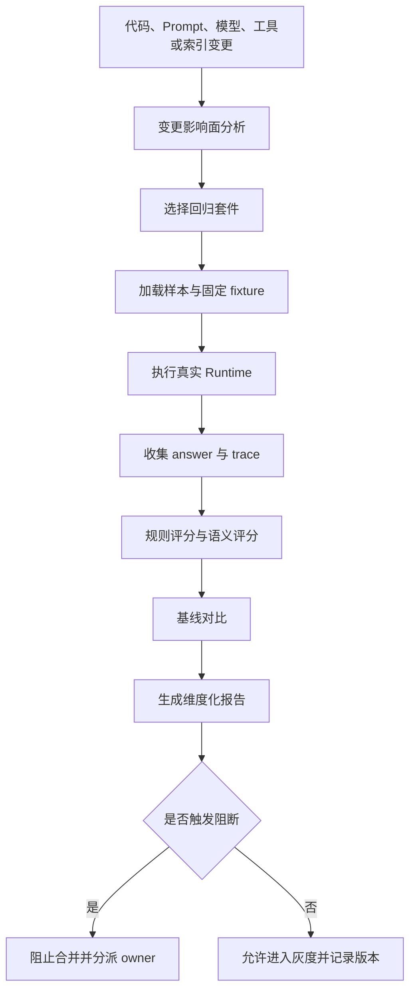
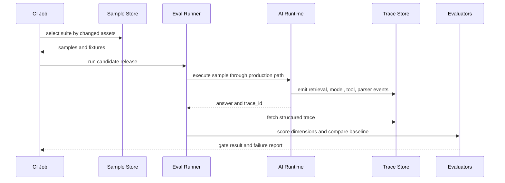

# 回归评测怎么跑

## 问题背景

AI 应用的回归问题，比普通后端服务更隐蔽。普通代码改坏了，通常会表现为接口报错、数据库约束失败、状态机走错分支。LLM 应用改坏了，很多时候接口还是二百，回答也依然流畅，只是少引用了一条证据、把工具参数传错了一个时间窗口、把拒答边界放宽了一点，或者在低频场景里把旧事故重新复现。用户看到的是“好像不太靠谱”，工程师看到的是“日志没有异常”，这就是必须跑回归评测的原因。

很多团队早期会用人工体验来替代回归。改完 prompt 后，找几个常见问题问一遍，感觉答案更自然，就上线。换模型后，挑十条样本看一下，觉得整体更聪明，就合并。工具 schema 改了，自己调用一次能跑通，就认为兼容。这个流程在原型阶段可以接受，在生产系统里很危险。因为 AI 应用的质量不是单个回答的主观印象，而是一组行为契约：该引用时要引用，该拒答时要拒答，该调用工具时要按顺序调用工具，该保守时不能胡乱补全，该省钱时不能无限扩展上下文。

回归评测要解决的核心问题，是让每次变更都能回答三个问题：有没有把以前修过的问题又弄坏，关键路径有没有变差，风险边界有没有被悄悄移动。这里的变更不只是代码提交，也包括 prompt 修改、模型版本切换、检索参数调整、索引重建、工具描述改写、系统策略更新、输出 schema 变更、缓存策略变化、温度参数调整，甚至是文档内容更新。只要它会影响模型看到什么、能做什么、怎么判断、怎么输出，就应该触发对应范围的回归。

AI 系统的回归还有一个特点：改动收益和损害经常同时出现。一个新 prompt 可能让复杂推理更好，却让结构化输出更容易带解释文字；一个新模型可能事实性更强，却更喜欢调用工具，导致成本和延迟上涨；一次检索重排优化可能提升长文档命中，却降低短问题的精确召回。没有回归评测，团队只会看到自己关心的那个指标变好，看不到其他维度被牺牲。上线后用户会替你发现，但那时已经进入事故处理。

回归评测不是为了追求百分百自动化，也不是为了制造一个漂亮分数。它是一套工程刹车系统：在变更进入主干、灰度和全量之前，用已经沉淀的真实风险样本去拦截明显退化；在无法自动判断的场景里，把样本送到人工 review；在允许上线的变更里，保留可比较的报告，方便后续复盘。它的价值不在于一次评测跑了多少题，而在于每次失败都能定位到责任维度，每次通过都能给团队一个可解释的信心边界。

我更倾向把回归评测看成发布流水线的一部分，而不是评测团队的独立活动。只要一个 PR 改了 prompt、工具、模型路由或检索配置，就应该自动选择相关样本跑一遍；如果改动触碰高风险场景，就算样本数量少，也要阻断；如果只是低风险文案调整，可以跑轻量冒烟集。这样回归才不会变成上线前临时补课，而是日常开发的一种肌肉记忆。

## 核心概念

第一个概念是“回归样本”。它和普通评测样本有重叠，但目的不同。普通评测可能用于比较两个方案谁更好，回归样本用于防止已经承诺的行为被破坏。回归样本通常来自真实失败、事故复盘、关键客户场景、安全边界和历史修复。它要记录输入、上下文、期望行为、必须证据、禁止行为、判定方式和风险等级。没有明确期望的样本不能作为阻断回归，只能放在探索集里观察。

第二个概念是“变更影响面”。不是每次改动都要跑全量样本。一个大型系统里全量回归可能成本高、耗时长、还容易因为外部依赖波动产生噪声。更稳的做法是把样本和系统资产建立映射：哪些样本依赖某个 prompt，哪些样本覆盖某类工具，哪些样本关注某个检索索引，哪些样本属于某个安全策略。变更发生后，先跑影响面样本，再补一小组核心冒烟样本，重大版本再跑全量。

第三个概念是“基线”。回归评测不是只看当前输出是否像标准答案，还要看它相对上一个可发布版本是否退化。对于完全确定的契约，例如 JSON schema、引用 ID、工具调用参数，可以直接用规则判定。对于开放回答，可以记录基线输出和人工评审结论，在候选版本和基线之间做对比。这样能够区分“和标准答案措辞不同但仍然正确”和“相对已发布版本丢了关键信息”。

第四个概念是“维度化判定”。一个样本不应该只有 pass 或 fail。至少要拆成事实正确、证据覆盖、引用准确、工具行为、格式结构、拒答策略、延迟、成本、稳定性几个维度。维度化以后，失败报告才有修复价值。比如证据覆盖失败，优先看检索和索引；工具行为失败，优先看工具描述、参数抽取和策略；格式失败，优先看 schema、输出解析和模型选择。

| 概念 | 工程含义 | 如果缺失会怎样 | 建议做法 |
| --- | --- | --- | --- |
| 回归样本 | 已知风险的可重放场景 | 历史事故反复出现 | 从线上失败和复盘中持续补样本 |
| 影响面 | 变更和样本之间的映射 | 小改动也要跑昂贵全量，最后没人愿意跑 | 给样本打资产标签，按 diff 选择套件 |
| 基线 | 上一个可信版本的行为记录 | 不知道当前是变好还是变坏 | 保存 release_id、trace、输出和评分 |
| 维度评分 | 对失败进行可修复归因 | 只看到总分下降，找不到责任链路 | 规则判定优先，语义裁判补充 |
| 阻断阈值 | 发布门禁 | 高风险退化仍然上线 | 高风险样本零容忍，低风险看趋势 |

第五个概念是“可复现环境”。回归评测如果每次依赖实时数据库、实时搜索结果、当天日期和随机模型参数，就很难判断失败来自变更还是环境。阻断型回归要尽量固定输入、工具 fixture、文档快照、索引版本、模型参数和时间。线上影子评测可以使用真实依赖，用来观察分布变化，但 CI 里的阻断回归必须先保证可复现。

第六个概念是“样本分层”。我通常把回归样本分成四层：核心冒烟集、高风险阻断集、功能专项集、长尾探索集。核心冒烟集数量少，任何 AI 相关改动都跑；高风险阻断集保护权限、安全、财务、医疗、生产操作等场景；功能专项集按检索、工具、结构化输出、长上下文、多轮会话等能力划分；长尾探索集用于趋势观察，不一定阻断。分层以后，团队能在速度和覆盖之间做有意识的取舍。

## 架构/流程图解说明

一个可用的回归评测架构，不需要一开始很复杂，但边界要清楚。它至少包含变更检测、样本选择、评测执行、评分器、基线对比、报告和门禁六个部分。变更检测负责判断这次改动碰到了哪些 AI 资产；样本选择负责从样本库挑出对应套件；评测执行负责用固定上下文调用真实应用链路；评分器负责维度化判定；基线对比负责找出退化；报告负责给工程师可操作信息；门禁负责决定是否允许合并或发布。



这张图里最容易被低估的是“执行真实 Runtime”。有些团队为了评测方便，直接把问题拼进 prompt 调模型，这样只能测 prompt，测不到权限过滤、上下文装配、工具网关、缓存、重试、引用映射和输出解析。生产事故往往就发生在这些胶水层里。回归评测要尽量走和线上一致的代码路径，只把外部世界替换成 fixture。比如数据库工具可以返回固定结果，搜索工具可以返回固定候选，当前时间可以冻结，用户权限可以从样本里注入。

回归套件的选择可以用资产标签驱动。每个样本声明自己覆盖哪些资产，变更检测根据 diff 计算受影响标签。下面是一个简单映射：

| 变更类型 | 必跑套件 | 追加套件 | 阻断策略 |
| --- | --- | --- | --- |
| system prompt | 核心冒烟、高风险阻断 | 相关任务类型专项 | 高风险样本失败即阻断 |
| 工具 schema | 工具调用专项、核心冒烟 | 使用该工具的历史失败 | 参数错误和越权调用阻断 |
| 检索参数 | 检索召回、引用质量 | 相关知识域样本 | 必须证据未命中阻断 |
| 模型版本 | 全部核心、高风险、格式专项 | 成本和延迟套件 | 质量退化或成本超预算阻断 |
| 文档索引 | 受影响文档样本 | 冲突知识和过期引用 | 引用缺失阻断，高层摘要观察 |

评测报告不要只输出一张总表。最有用的报告应该先回答“这次不能上线的原因是什么”，再展示“哪些维度变好或变差”，最后提供“到哪里看 trace”。我会把报告分成四层：发布结论、阻断失败、非阻断退化、成本和延迟变化。每条失败都要能点到样本、期望、实际输出、关键 trace 事件、最近通过版本和建议 owner。



这个流程还有一个重要输出：失败样本的归因标签。归因标签不是为了甩锅，而是为了让长期趋势可见。连续几周失败都集中在 `missing_evidence`，说明检索和上下文策略有系统问题；失败集中在 `schema_invalid`，说明输出约束和解析器需要治理；失败集中在 `tool_loop`，说明工具计划器或停止条件有问题。没有归因标签，团队每次都在单点修补，看不到结构性问题。

## 工程实现

工程实现可以从一个仓库化样本库开始。样本用 YAML 或 JSONL 都可以，关键是字段要支持可重放和可判定。下面是一个回归样本例子，它覆盖工具调用、引用和拒答边界：

```yaml
id: reg_support_refund_042
title: 退款政策变更后的高价值客户查询
risk_level: high
assets:
  prompts:
    - support_answer_v5
  tools:
    - order_lookup
    - policy_search
  indexes:
    - help_center_2026_03
triggered_by:
  - incident: inc_2026_02_21_wrong_refund_window
input:
  query: "这个企业客户三月十号买的年付套餐，现在要退，按新规则能退多少？"
  user:
    role: support_agent
    tenant: cn_enterprise
  frozen_time: "2026-03-18T09:30:00+08:00"
fixtures:
  order_lookup:
    request:
      customer_type: enterprise
      purchase_date: "2026-03-10"
    response:
      plan: annual
      paid_amount_cny: 120000
      refund_status: eligible
expected:
  must_call:
    - tool: order_lookup
    - tool: policy_search
  must_cite:
    - doc_id: refund-policy-2026-03
      section: enterprise-annual-plan
  must_include:
    - "按企业年付套餐的新规则计算"
    - "需要客服主管确认后执行"
  must_not_include:
    - "七天无理由全额退款"
    - "无需审批"
evaluation:
  max_latency_ms: 6000
  max_cost_usd: 0.05
  evaluators:
    - tool_sequence
    - citation_coverage
    - forbidden_claims
    - factual_judge_v3
owner:
  team: ai-support
  slack: support-ai-oncall
```

这个样本里，`assets` 用于影响面分析，`fixtures` 用于固定工具返回，`expected` 用于规则和语义评分，`owner` 用于失败分派。`triggered_by` 很有价值，它记录这条样本来自哪次事故。半年后有人想删除或放宽这条样本时，可以知道它保护的历史风险，不会因为“现在看起来有点严格”就随手移除。

Runner 的职责不要写成一个巨大脚本。比较清晰的边界是：loader 读取样本并解析 fixture，executor 调用真实 runtime，trace collector 拉取事件，evaluator 按维度评分，comparator 和基线比较，reporter 输出门禁结果。每一层都可以独立测试。尤其是 evaluator，一定不要和 runner 混在一起，否则评分口径很难演进。

```go
type RegressionSample struct {
    ID         string            `json:"id"`
    RiskLevel  string            `json:"risk_level"`
    Assets     AssetRefs         `json:"assets"`
    Input      SampleInput       `json:"input"`
    Fixtures   map[string]any    `json:"fixtures"`
    Expected   ExpectedBehavior  `json:"expected"`
    Evaluation EvaluationConfig  `json:"evaluation"`
    Owner      Owner             `json:"owner"`
}

type EvalResult struct {
    SampleID     string                     `json:"sample_id"`
    ReleaseID    string                     `json:"release_id"`
    Passed       bool                       `json:"passed"`
    GateBlocking bool                       `json:"gate_blocking"`
    Dimensions   map[string]DimensionResult `json:"dimensions"`
    FailureLabel string                     `json:"failure_label,omitempty"`
    TraceID      string                     `json:"trace_id"`
    BaselineID   string                     `json:"baseline_id"`
}
```

基线存储也要认真设计。不要只保存最终答案，因为未来排查时需要知道当时的检索结果、工具输出、上下文长度、模型版本和评分器版本。一个可用的基线记录至少包含：release_id、sample_id、runtime_version、prompt_version、model_version、tool_schema_version、index_version、answer_hash、trace_id、dimension_scores、approved_by、approved_at。对于高风险样本，基线变更应该要求人工批准。

变更影响面可以先做得简单。CI 中读取 git diff，匹配路径和标签：`prompts/support_answer.md` 变了，就选 `support_answer_v5` 相关样本；`tools/order_lookup.schema.json` 变了，就选 `order_lookup` 样本；`retrieval/rerank.yaml` 变了，就选检索专项。等系统成熟后，再把 prompt、工具和样本的依赖关系写入注册表，由平台统一维护。

回归评测还需要处理随机性。模型采样参数应该在阻断评测中固定，能设 seed 就设 seed，不能设 seed 就用多次运行和稳定性阈值。对于高风险样本，我会要求连续两次通过，或者一次失败就进入人工 review。对于低风险开放问答，可以用三次运行取最差维度，观察答案是否稳定。这样可以避免一次偶然通过掩盖不稳定行为。

评分器的顺序也有讲究。先跑便宜且确定的规则：schema、必填字段、工具调用、引用 ID、禁止词、成本和延迟。规则失败后，如果已经足以阻断，就不必再调用昂贵的 LLM judge。只有在规则通过但语义仍需判断时，才调用裁判模型。这样既省钱，也减少裁判漂移对结果的影响。

一个具体执行例子可以这样走：工程师改了客服助手的系统 prompt，CI 识别到 `support_answer_v5` 变更，选择二十条核心冒烟、三十五条客服高风险、十五条历史退款事故样本。Runner 冻结时间，注入订单查询 fixture，通过真实 runtime 执行。某条退款样本里，候选版本调用了订单工具，也引用了政策文档，但最终答案写成“可直接退款，无需审批”。规则评分器发现 `must_not_include` 命中，语义裁判确认审批约束被丢失，门禁阻断。报告指出上一个通过版本是 `rel_2026_03_14`，失败维度是 `forbidden_claims`，建议 owner 是 `ai-support`。工程师不用猜模型哪里坏了，直接看 trace 和 prompt 差异。

## 测试评测

回归评测系统本身也要被测试。首先是样本 schema 测试：每个样本必须有 id、risk_level、input、expected、evaluation、owner；风险等级必须在枚举里；must_cite 指向的文档和片段必须存在；tool fixture 必须符合工具 schema；时间必须是明确时区；成本阈值不能缺省成无限。这个校验应该在样本 PR 中先跑，避免坏样本进入主干。

其次是评分器单测。每个 evaluator 都要有正例、反例和边界例。工具顺序评分器要区分“没调用”“调用错工具”“工具参数错”“顺序错但业务等价”；引用评分器要区分“引用不存在”“引用存在但不支持结论”“引用支持部分结论”；禁止声明评分器要处理同义表达，不能只靠简单字符串。LLM judge 要有固定校准集，每次改裁判 prompt 都要跑校准，观察误判率。

第三是端到端回放测试。选一小组稳定样本，用固定 fixture 跑 runtime，确保 trace 事件完整、评分器能读取、报告能生成。这个测试不是为了证明模型质量，而是为了证明评测管线没有断。很多团队会遇到这样的尴尬：真正要发布时，才发现评测 runner 跑不起来，原因是工具 schema 改了但样本 fixture 没更新。端到端回放可以提前暴露这种问题。

第四是基线对比测试。你需要故意构造一个候选结果：事实变好、成本变差；引用变差、格式不变；工具调用多一次但答案正确。确认 comparator 能正确标记退化和非退化。没有 comparator 测试，报告很容易把所有差异都当成失败，或者把关键退化当成正常变化。

| 测试对象 | 测试重点 | 通过标准 | 失败后的处理 |
| --- | --- | --- | --- |
| 样本 schema | 字段完整、引用存在、fixture 合法 | 样本可被 runner 加载 | 修样本，不进入 active |
| 规则评分器 | 确定性和边界条件 | 正反例全部通过 | 修 evaluator 并补回归例 |
| 语义裁判 | 裁判一致性和漂移 | 校准集误判率低于阈值 | 调整 rubric 或转人工 |
| Runtime 回放 | 真实链路可执行 | trace 完整且结果可评分 | 修夹具或适配器 |
| 基线对比 | 退化识别 | 维度变化解释正确 | 修 comparator |

评测结果还要做趋势验证。一次失败很重要，但连续趋势更有价值。建议按天或按 release 记录每个维度的通过率、阻断次数、平均成本、P95 延迟和不稳定样本数量。如果 schema 失败率慢慢上升，说明格式约束正在失效；如果成本在模型未变的情况下上涨，可能是上下文装配变长；如果同一批样本偶发失败增多，说明随机性或外部 fixture 有问题。趋势可以让团队在事故前看到苗头。

人工复核是测试评测中不可缺的一环。不是所有样本都应该全自动阻断。对于开放答案、策略权衡和业务口径变化，自动评分器可以先给建议，再由 reviewer 确认。人工复核的结果要反过来更新样本、评分器和基线。如果 reviewer 经常推翻某个 LLM judge，说明裁判提示词或 rubric 有问题；如果 reviewer 经常发现样本期望过时，说明样本生命周期治理有问题。

## 失败模式

第一个失败模式是 flaky eval。样本有时通过有时失败，团队就会失去对评测的信任。原因可能是模型随机性、实时依赖、时间未冻结、检索索引漂移、工具 fixture 不完整、裁判模型不稳定。解决办法不是简单重跑直到通过，而是给样本打 `unstable` 标签，隔离到诊断队列，找出波动来源。阻断集必须保持高稳定性，否则门禁会被绕过。

第二个失败模式是过拟合回归集。工程师为了让 CI 过，把 prompt 写得只适配已知样本，甚至在系统里硬编码某些问法。短期分数提高，真实泛化下降。避免过拟合的方法是保留隐藏样本、定期从线上失败补充新样本、检查 prompt 中是否出现样本特有措辞，并把 variants 设计成真实问法簇，而不是固定题面。

第三个失败模式是只看总分。一个版本从九十二分涨到九十四分，但高风险权限样本失败了一条，这个版本不能上线。AI 应用的风险不是平均分游戏。门禁应该优先看高风险样本、硬契约和重大退化，再看总体趋势。总分可以用于观察，不应该单独决定发布。

第四个失败模式是评测和生产链路脱节。评测直接调用模型，线上经过检索、权限、工具、缓存和解析器。最后评测通过，生产仍然失败。解决方式是共享 runtime，外部依赖用 fixture 替换，评测 trace 和生产 trace 用同一种事件模型。这样失败才有可比性。

第五个失败模式是裁判漂移。LLM judge 本身升级、prompt 修改或采样参数变化，会改变判定口径。裁判漂移会让质量趋势失真。裁判也要版本化，也要有校准集。高风险样本尽量用规则和人工确认，不要把安全边界完全交给语义裁判。

第六个失败模式是样本无人维护。业务规则变了，文档迁移了，工具废弃了，样本还在阻断，工程师只能绕过。每条 active 样本都要有 owner 和 review 周期。过时样本不要直接删除，先 quarantined，说明原因和替代样本，再 retired。这样既保护历史，也不让评测集变成负担。

第七个失败模式是成本失控。回归越做越大，如果没有分层和缓存，一次 PR 就调用大量模型，团队最后会关闭 CI。要按风险分层，先跑便宜规则，语义裁判按需调用，对低风险样本做抽样，对全量回归安排在夜间或发布候选阶段。评测成本也是生产成本的一部分，必须被预算管理。

## 上线 checklist

- 变更影响面已经识别，涉及的 prompt、模型、工具、索引、策略和 schema 都有对应样本套件。
- 核心冒烟集全部通过，高风险阻断集零失败，非阻断退化已经有 owner 确认。
- 失败报告包含 sample_id、risk_level、失败维度、实际输出、期望行为、trace_id、最近通过版本。
- 评测运行使用固定时间、固定 fixture、固定模型参数和明确的 release_id。
- 新增或修改的样本通过 schema 校验，must_cite 指向有效文档，tool fixture 符合当前工具 schema。
- LLM judge 的版本和 prompt 已记录，裁判校准集没有明显漂移。
- 成本和延迟在预算内，P95 没有超过发布阈值，重试次数没有异常增加。
- 基线变更经过 review，高风险样本的基线更新有人类批准记录。
- 灰度阶段的线上 trace 会按同一套维度采集，方便和离线回归对照。
- 如果有 quarantined 样本，已经说明隔离原因、负责人和恢复条件。

## 总结

回归评测的目标不是把 AI 应用变成完全确定的传统程序，而是在不确定行为外面建立可执行的工程边界。每一次 prompt、模型、工具和索引变更，都可能同时带来收益和退化。没有回归，团队只能靠感觉上线；有了回归，至少能知道哪些历史风险仍然被守住，哪些关键契约已经破坏，哪些变化需要人工判断。

真正有用的回归评测，依赖四件事：来自真实失败的样本，和生产一致的执行链路，维度化且可解释的评分，以及能进入发布流程的门禁。样本库不必一开始很大，但每条都要有明确风险和维护责任。评测平台不必一开始很重，但必须能复现、能归因、能对比基线。这样回归评测才不会变成形式化报表，而会成为 AI 应用持续迭代时最重要的安全网。
