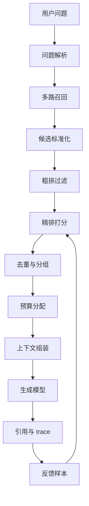

# 检索重排与上下文组装

## 问题背景

很多 RAG 系统第一次上线时，检索部分通常长得很简单：用户问题进来，向量库取 top-k，拼成 prompt，然后让模型回答。这个版本可以很快证明“知识库问答能工作”，但它很快会遇到一个稳定的问题：召回数量上去了，答案质量未必上去；上下文塞得更满了，模型反而更容易忽略关键证据。根因不是向量检索没价值，而是 top-k 只解决了“可能相关”的问题，没有解决“哪个证据更应该被读、怎样组织才容易被模型理解”的问题。

上下文窗口不是一个垃圾桶，而是回答生成阶段最昂贵、最脆弱的输入界面。即使今天模型窗口很大，把一百段材料全塞进去也不是好工程。第一，长上下文会增加延迟和成本，线上负载一高就会变成真实账单。第二，模型对长上下文的注意力不是均匀分配，关键证据如果夹在重复段落和噪声材料之间，常常被稀释。第三，召回材料之间会互相矛盾，模型如果看不到证据的时间、来源和优先级，就会把旧决策当成现状，把草案当成结论。

重排和上下文组装解决的是同一个链路里的两个阶段。重排负责从候选证据里挑出更有价值的材料，并给它们排序；上下文组装负责把这些材料编排成模型能够稳定消费的结构。重排像是编辑台，决定哪些片段值得进入正文；上下文组装像是排版和导读，决定先给背景还是先给结论，哪些片段要合并，哪些片段只放引用，哪些片段因为预算不足被压缩。

在工程实践里，这个问题经常被低估。团队会把精力放在 embedding 模型、向量库参数、chunk 大小上，却把最终 prompt 拼接写成几行字符串。结果是检索层做了很多努力，最后在上下文阶段丢掉了。比如一个问题问“上个月权限策略调整为什么影响了浏览器自动化回放”，向量检索可能召回权限策略、浏览器自动化、回放测试、某次会议纪要四类材料。如果只是按相似度排序，会议纪要里真正解释因果关系的段落可能排在第八位，最终没有进入 prompt。模型看到前几段后只会泛泛谈权限，而回答不出“为什么影响回放”。

好的上下文不是“最多材料”，而是“最少但足够的证据链”。它应该让模型看到问题中的实体、相关决策、关键证据、约束条件、冲突信息和引用来源，并且顺序上符合人类阅读习惯。我们做重排和组装，不是为了把模型变笨后再教它阅读，而是为了尊重生成模型的输入特性：它擅长在明确结构中综合信息，不擅长在无序噪声里替我们完成信息架构。

## 核心概念

重排之前要先明确候选对象是什么。候选不一定只是 chunk。一个成熟 RAG 系统里，候选可能包括原文片段、标题路径、实体卡片、关系路径、社区摘要、表格行、代码符号、FAQ 条目、历史回答和人工精选说明。不同候选的证据强度不同，适合进入上下文的位置也不同。原文片段适合作为事实依据，实体卡片适合澄清对象，关系路径适合解释连接，摘要适合提供全局背景，表格行适合回答枚举和对比问题。

重排器的输入是候选集合，输出不只是一个分数列表。工程上更有用的输出应该包含理由、特征、去重结果和分组信息。一个候选为什么高分，是因为文本语义相似、标题命中、实体匹配、时间新、来自权威来源，还是因为它连接了两个关键实体？这些信息会直接影响上下文组装。如果一个片段高分只是因为词面相似，但没有证据句，它不应该压过包含明确决策的低相似度片段。

上下文组装要处理三类约束：预算约束、结构约束和忠实约束。预算约束是 token、延迟和成本；结构约束是模型阅读顺序和段落格式；忠实约束是每个关键事实必须能回到证据。很多失败答案不是检索不到，而是组装时没有保留证据边界。模型看到一堆拼在一起的文字，不知道哪句话来自哪个文档，也不知道哪个材料更新。回答一旦出错，调试人员也无法判断是召回错、重排错，还是组装错。

| 概念 | 工程含义 | 常见实现 | 风险 |
| --- | --- | --- | --- |
| 候选证据 | 可进入上下文的最小单元 | chunk、entity、path、summary | 粒度太粗会浪费预算 |
| 重排特征 | 判断候选价值的信号 | 相似度、实体覆盖、来源权重、时间 | 单一特征会放大偏差 |
| 去重折叠 | 合并语义重复材料 | 文档邻接、hash、标题路径 | 折叠过度会丢细节 |
| 多样性控制 | 保证不同证据面进入上下文 | MMR、配额、分组采样 | 多样性过强会牺牲相关性 |
| 组装策略 | 把候选排成可读 prompt | 分段、引用、摘要、证据清单 | 顺序混乱会诱发误读 |

重排不等于简单替换向量相似度。向量相似度解决“这段文本和问题像不像”，重排要进一步判断“这段文本对回答有没有用”。例如用户问“上线前 checklist 漏了什么”，某段文档大量出现“上线 checklist”这个词，向量分很高，但内容只是模板说明；另一段事故复盘只出现一次 checklist，却指出“缺少权限回归样本导致线上错误”。后一段对回答更关键。重排器需要从问题意图、证据类型和历史失败样本里学会这种差别。

上下文组装也不是把重排后的 top-n 直接拼接。它要考虑问题类型。定义类问题可以先放术语解释，再放证据；排障类问题应该先放当前现象和链路 trace，再放可能原因；决策类问题应该先列出候选方案和约束，再放证据；对比类问题要保证两个对象都有材料，不能只因为其中一个对象材料更多就把另一个挤掉。组装策略越贴近任务类型，模型输出越稳定。

## 架构/流程图解说明

一个可维护的检索重排与上下文组装链路，应该把“召回多一点”和“最终塞进去”之间的过程显式化。下面是我在项目里更愿意采用的结构：



问题解析阶段会输出实体、时间范围、回答类型和约束词。多路召回阶段不要只依赖向量，可以同时做关键词、标题、实体、图路径和历史案例召回。候选标准化阶段把不同来源的结果统一成 EvidenceCandidate，这样后面的排序和组装不必关心底层存储。粗排过滤先处理权限、时间、文档状态和明显低质量材料，避免精排浪费资源。精排可以是 cross-encoder、LLM judge、小模型分类器，也可以先从规则分数组合开始。

去重与分组是很多系统缺失的一环。知识库里同一事实常常出现在 ADR、会议纪要和总结文章里。三个片段都相关，但它们不应该无脑占用三份上下文预算。更稳的做法是按事实、文档、标题路径和实体覆盖做折叠：保留最权威或最新的一段作为主证据，其他材料作为补充引用。分组还可以确保一个回答里同时有背景、决策、实现、风险和测试证据，而不是全被某一类材料占满。

预算分配阶段要明确配额。比如 8000 token 的上下文预算，可以预留 700 token 给系统指令和输出格式，800 token 给问题解析和实体卡片，4500 token 给原文证据，1000 token 给关系路径或摘要，1000 token 给冲突和补充材料。配额不是死规则，但它能防止某个阶段把预算吃光。尤其是 GraphRAG 场景，关系路径很多，看起来都很有用，如果不设上限，原文证据很容易被挤出去。

## 工程实现

工程实现的第一步是定义统一候选结构。不要让组装器直接接收向量库返回值、数据库行、图查询结果和摘要字符串。统一结构能让排序、去重、调试和评测共享同一套字段。

```go
type EvidenceCandidate struct {
    ID           string
    Kind         string // chunk, entity, relation_path, summary
    Text         string
    SourceID     string
    SourceTitle  string
    SectionPath  []string
    URL          string
    UpdatedAt    time.Time
    TokenCount   int
    Entities     []string
    Tags         []string
    Scores       map[string]float64
    Citation     Citation
    Permissions  []string
}

type RerankDecision struct {
    CandidateID string
    FinalScore  float64
    GroupKey    string
    KeepReason  string
    DropReason  string
}
```

这个结构有几个细节值得注意。Kind 表示候选类型，组装器可以根据类型安排位置。SectionPath 保存标题路径，最终引用时比单独文件名更可读。Scores 是一个分数包，至少包含 vector、keyword、entity、freshness、authority、diversity、reranker。DropReason 不是为了好看，而是为了调试：当用户问为什么没引用某篇文档时，系统可以回答“被权限过滤”“时间过旧”“与主证据重复”或“精排分低”。

第一版重排不一定要上复杂模型。我建议从可解释加权开始，把分数写清楚，再用失败样本推动升级。一个实际可用的打分公式可以这样设计：

| 特征 | 含义 | 初始权重 | 说明 |
| --- | --- | --- | --- |
| vector_score | 语义相似度 | 0.30 | 解决基本相关性 |
| keyword_score | 关键词和标题命中 | 0.15 | 对专有名词很重要 |
| entity_coverage | 覆盖问题实体比例 | 0.20 | 防止只答到一半对象 |
| evidence_strength | 是否包含明确证据句 | 0.15 | 优先原文事实 |
| source_authority | 来源可信度 | 0.10 | ADR 高于聊天记录 |
| freshness | 时间新鲜度 | 0.05 | 状态类问题加权更高 |
| diversity_bonus | 分组多样性 | 0.05 | 防止同类材料霸屏 |

这个公式不是最终答案，但它能让团队开始讨论真实取舍。比如对“历史原因”问题，freshness 权重不能太高；对“当前接口怎么用”问题，旧文档应该降权；对“为什么发生事故”问题，事故复盘和时间线应高于泛泛总结。真正成熟的系统会根据 query intent 调整权重，而不是全站一个排序公式。

精排模型可以分两层。第一层用轻量模型或规则把候选从一百条压到二十条，第二层用 cross-encoder 或 LLM 对二十条做更细判断。直接让 LLM 给一百条候选打分成本太高，也不稳定。LLM 精排提示词要要求它输出结构化 JSON，包括是否可回答问题、关键证据句、缺失信息和排序理由。不要只让它返回一个数字，因为数字很难调试。

上下文组装器可以按 section 生成最终 prompt。下面是一个适合工程问答的结构：

```text
问题理解：
- 用户问题：
- 识别实体：
- 时间范围：
- 回答类型：

优先证据：
[S1] 来源、标题路径、更新时间
原文片段……

补充证据：
[S2] 来源、标题路径、更新时间
原文片段……

关系和背景：
- 实体 A 与实体 B 的关系，证据来自 S1、S3

冲突或限制：
- 某旧文档与新决策冲突，优先采用新决策

回答要求：
- 只基于上述证据回答
- 关键结论带引用编号
```

这个结构看起来朴素，但线上很有用。它把证据边界、来源、时间和冲突显式给模型，模型更容易给出带引用的回答。注意“冲突或限制”不要省略。许多知识库问题不是没有答案，而是有多个版本的答案。把冲突提前告诉模型，比事后希望模型自己识别可靠得多。

组装时还要处理邻接扩展。向量检索命中的 chunk 往往只是一小段，回答需要前后文。做法是对高分 chunk 拉取同一标题下的前一段和后一段，但要设置限制。邻接扩展适合补充定义、条件和例外，不适合无限扩大上下文。一个实用规则是：只有主证据分数超过阈值，且相邻 chunk 与主 chunk 共享标题路径，才扩展；扩展内容分数不能超过主证据，只能作为附属材料。

去重可以分三层。第一层是完全重复，例如同一 chunk 被多个召回器命中。第二层是近重复，例如同一文档相邻片段内容高度重合。第三层是事实重复，例如 ADR 和总结文章都说明“采用方案 B 替代方案 A”。第一层用 ID 去重，第二层用文本 hash 或 embedding 相似度，第三层需要根据实体、谓词和证据句做聚合。事实重复不要简单删除，应该保留权威来源，附带次要来源引用。

## 一个具体例子

假设用户问：“为什么检索失败定位时不能只看最终答案？”多路召回得到以下候选：

| 候选 | 来源 | 初始相似度 | 实体覆盖 | 证据强度 | 说明 |
| --- | --- | --- | --- | --- | --- |
| C1 | 检索失败排障文章 | 0.88 | 高 | 高 | 解释解析、召回、重排、生成四段 |
| C2 | RAG 入门文章 | 0.84 | 中 | 中 | 泛谈 RAG 流程 |
| C3 | 事故复盘 | 0.72 | 高 | 高 | 记录一次只看答案导致误判的案例 |
| C4 | Prompt 模板 | 0.79 | 低 | 低 | 出现“最终答案”词汇 |
| C5 | 观测日志设计 | 0.69 | 高 | 高 | 描述 trace 字段和阶段耗时 |

如果只按相似度，C2 可能排在 C3 和 C5 前面，最终回答会比较基础。重排后，C1、C3、C5 应该进入优先证据，C2 作为背景，C4 被丢弃。上下文组装时，顺序也不应该是 C1、C3、C5 原样拼接，而是先给出排障链路框架，再给事故例子，最后给 trace 字段。这样模型能回答出“只看最终答案无法判断错误发生在哪个阶段”，并且能引用具体例子和观测方案。

这个例子也说明，重排不是单纯追求更高相关度，而是追求答案所需证据的完整性。一个好答案可能需要一段框架材料、一段案例材料、一段实现材料。三段分别看都不是最高相似度，但组合起来才完整。上下文组装的职责就是把这种组合显式化。

## 组装策略的工程细节

上下文组装最好不要写成一个巨大函数。它可以拆成若干稳定步骤：先按权限和状态清理候选，再按问题类型选择模板，然后做证据分组，接着分配 token 预算，最后生成带引用编号的上下文。每一步都应该可单独测试。比如预算分配函数输入候选 token 数和配额，输出保留、压缩、丢弃三类结果；引用渲染函数输入候选和编号，输出稳定引用标签。这样出现“引用编号错乱”时，不需要从整条链路里猜。

压缩策略也要谨慎。不是所有材料都适合压缩。定义、背景、重复案例可以压缩；接口字段、配置项、错误日志、命令、时间线不应该被随意改写。工程上可以给候选加 `compressible` 字段，默认原文片段不可压缩，摘要和背景材料可压缩。压缩后的内容必须保留来源 ID，并在 trace 中记录压缩前后 token 数。否则压缩层会变成另一个不可解释的生成层。

在多轮对话里，上下文组装还要处理会话记忆。用户追问“那上线前怎么办”，系统需要知道上一轮讨论的是哪次权限变更，但不能把上一轮完整上下文全部复制过来。更好的方式是把上一轮答案提炼成结构化状态：当前主题、已确认实体、已引用证据、未解决问题。新一轮检索以这些状态作为辅助条件，再重新拉取证据。不要让会话摘要替代证据，因为摘要可能已经丢掉关键限制。

最后，组装器应该支持“证据不足”的输出路径。当重排后没有足够证据覆盖关键实体，或者候选之间冲突但没有权威来源，组装器可以把 `answerability` 标成 low，生成层据此拒答或要求补充资料。很多系统把拒答逻辑放在模型提示词里，效果不稳定。把可答性作为组装阶段的结构化判断，模型就更容易保持克制。

## 测试评测

重排和上下文组装的评测要分开看。只看最终回答质量会把问题混在一起，模型写得好可能掩盖上下文缺陷，模型写得差也可能冤枉检索。建议至少建立四类指标：候选保留、排序质量、上下文质量、答案质量。

候选保留看黄金证据有没有进入精排前候选集。如果黄金证据在多路召回阶段就没出现，后面重排再强也没用。排序质量看黄金证据在重排后的位置，例如 MRR、nDCG、Recall@K。上下文质量看最终 prompt 是否包含必要证据、是否有重复、是否有冲突说明、引用是否完整。答案质量再看忠实度、覆盖度和可读性。

| 评测问题 | 应检查的中间产物 | 合格标准 | 失败后动作 |
| --- | --- | --- | --- |
| 黄金证据是否被召回 | raw candidates | Recall@50 达标 | 调召回器和切分 |
| 黄金证据是否被排前 | reranked candidates | nDCG@10 达标 | 调特征和精排模型 |
| 上下文是否可读 | assembled context | 重复率低，证据齐 | 调配额和组装策略 |
| 答案是否忠实 | final answer | 关键句有引用 | 调提示词和拒答策略 |

评测样本要覆盖不同问题类型。定义类问题、对比类问题、排障类问题、决策类问题、时间敏感问题、权限敏感问题都要有。每个样本不只标最终答案，还要标“必须出现的证据”和“不能引用的材料”。例如当前状态问题不能引用过期草案；权限问题不能引用用户无权访问的内部文档；对比问题必须同时覆盖两个对象。只有这样才能评估组装策略是不是稳。

自动化评测可以做两层。第一层是确定性检查：黄金 chunk 是否在最终上下文、引用 URL 是否有效、上下文 token 是否超限、重复片段比例、权限过滤是否生效。第二层是 LLM judge：判断上下文是否足以回答问题、答案是否遗漏关键点、是否有无来源推断。LLM judge 的提示词和模型版本要固定，评测结果要保存原始输入，否则后续很难比较。

线上反馈也要接入评测。用户点踩时，系统应保存 query、候选、重排分数、最终上下文、答案和用户权限范围。人工复盘时把失败归因到召回缺失、重排误排、组装丢证据、模型过度推断或知识过期。每周从真实失败里挑样本进入回归集，比凭空造评测题更有价值。

## 失败模式

第一个失败模式是相似度迷信。团队以为向量分高就是答案材料，结果词面相关的模板、目录、摘要压过真正证据。解决方式是引入证据强度、实体覆盖和来源权重，并在评测中标注黄金证据，而不是只看检索分数。

第二个失败模式是上下文重复。多路召回会从不同入口命中同一事实，最终 prompt 里出现三四段意思相同的文字。模型看到重复内容会误以为这是最重要事实，忽略少数但关键的限制条件。需要在组装前做重复检测，并把重复来源折叠成引用列表。

第三个失败模式是顺序错误。模型先看到旧方案，再看到新方案，但没有明确说明新旧关系，回答时可能采用旧方案。组装器应该按时间、权威度或决策状态排序，并显式标注“已废弃”“草案”“当前采用”。不要指望模型从日期里自动推理状态。

第四个失败模式是只放摘要不放原文。摘要能省 token，但摘要也是生成物，可能遗漏条件。关键事实必须有原文 chunk 支撑。摘要适合作为导读和背景，不适合作为唯一证据。尤其是合规、权限、接口行为、上线步骤这类问题，原文引用不可省。

第五个失败模式是重排黑箱化。上了 cross-encoder 或 LLM 精排后，如果没有保存分数、输入和理由，失败时只能盲调。每次重排都应写入 trace，至少包括候选 ID、各特征分、最终分、保留或丢弃原因。模型精排也要保存结构化解释，便于人工复盘。

第六个失败模式是预算被背景吃光。团队喜欢在上下文开头放长背景、长规则和长格式要求，留给证据的空间变少。上下文预算要分配给回答需要的事实，而不是让提示词越来越厚。系统指令应短而稳定，业务背景应来自证据本身。

## 上线 checklist

- 多路召回结果统一成 EvidenceCandidate，字段包含来源、标题路径、时间、权限、实体和引用。
- 粗排阶段先做权限、文档状态、时间范围和低质量过滤，过滤原因写入 trace。
- 重排分数由多个特征组成，至少覆盖语义、关键词、实体、来源、时间和证据强度。
- 精排输入候选数量有上限，模型版本、提示词和输出 JSON 都可追溯。
- 去重逻辑覆盖同 ID、近重复和事实重复，保留权威主证据和补充引用。
- 上下文组装有明确预算配额，原文证据预算不能被摘要和路径挤空。
- 组装结果包含来源、更新时间、引用编号和冲突说明，关键事实能回跳原文。
- 不同问题类型有不同组装策略，至少区分定义、对比、排障、决策和状态查询。
- 评测集标注黄金证据、禁止证据、必要实体和期望答案要点。
- 用户反馈保存完整检索链路，失败样本能进入回归评测。

## 总结

检索重排与上下文组装是 RAG 从 demo 走向工程系统的关键分界线。向量 top-k 只能告诉我们哪些片段可能相关，不能自动决定哪些证据最该被读，也不能保证材料以模型容易理解的方式出现。重排负责选择和排序，上下文组装负责结构和边界，二者共同决定生成模型实际看到什么。

落地时不要一开始追求复杂模型。先把候选结构、分数特征、去重、配额、引用和 trace 做清楚，用真实失败样本推动权重和模型升级。一个可解释的朴素重排器，往往比一个不可调试的高级模型更适合早期系统。等评测集和观测数据积累起来，再引入 cross-encoder、LLM 精排或学习排序，收益会更确定。

好的上下文应该像一份给工程师看的案卷：有问题理解，有关键证据，有来源和时间，有冲突说明，有必要背景，也有明确边界。模型不是资料管理员，它是最后的写作者。我们把案卷整理好，它才更可能写出可信、可引用、可复盘的答案。
