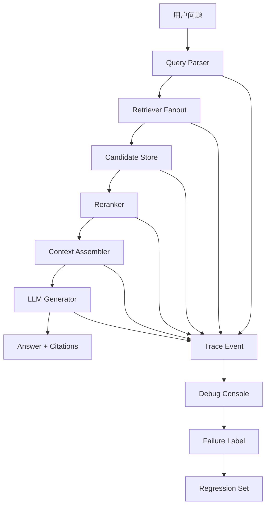

# 检索失败如何定位

## 问题背景

RAG 系统最难排查的事故，往往不是服务直接报错，而是“答案看起来有道理，但就是不对”。用户问一个项目决策，系统回答了一段通顺的背景；用户问当前接口行为，系统引用了旧文档；用户问影响范围，系统只列出一个服务，漏掉真正受影响的批处理任务。这类问题如果只看最终答案，很容易把责任推给模型。实际工程里，错误可能发生在查询解析、权限过滤、向量召回、关键词召回、实体消歧、图扩展、重排、上下文组装、生成提示词、引用渲染中的任意一段。

把所有失败都叫“模型幻觉”是一种逃避。模型当然会犯错，但 RAG 的核心价值就是让模型基于证据回答。证据没进来，顺序错了，旧材料没被过滤，引用 ID 丢了，模型都可能输出错误。排障时如果没有链路观测，只能不断试 prompt、调 top-k、换 embedding。这样的调试像在黑箱外敲壳，偶尔有效，但无法积累工程能力。

检索失败定位的第一原则是分段。不要先问“为什么答案错”，先问“错误第一次出现在哪个阶段”。问题解析有没有理解用户意图？召回阶段有没有拿到包含答案的材料？重排有没有把关键材料放到前面？上下文组装有没有保留引用和冲突？生成阶段有没有忠实使用上下文？这几个问题一层层排下来，很多看似复杂的事故会变成清楚的修复任务。

第二原则是可复现。用户反馈“这个答案不对”时，系统必须保存当时的 query、用户权限、索引版本、模型版本、候选列表、分数、上下文和最终输出。没有这些信息，第二天知识库更新、索引重建、模型路由变化后，你再问同一个问题可能得到另一个结果，原事故就消失了。不能复现的 RAG 失败很难修，只能靠猜。

第三原则是不要只优化通过样例。排障过程中很容易为某个失败问题加特殊规则，短期看修好了，长期会伤害其他问题。每次修复都应该归因到一个稳定类别，例如别名缺失、chunk 粒度错误、权限过滤位置错误、重排特征偏置、上下文预算不足。类别稳定，修复才可复用。

## 核心概念

检索链路可以拆成四个主阶段：解析、召回、重排、生成。解析阶段把自然语言问题转成结构化意图，包括实体、时间范围、回答类型、权限上下文、过滤条件。召回阶段从多个索引里取候选材料，包括向量、关键词、标题、实体、图路径和人工精选。重排阶段筛选和排序候选，并决定哪些材料进入上下文。生成阶段基于上下文输出答案和引用。

这四段不是抽象分层，而是排障边界。解析错了，后面再强也会找错方向；召回漏了，重排没有机会补救；重排错了，模型看不到关键证据；生成错了，说明上下文正确但模型没有按证据回答。每段都要有可检查的输入、输出和指标。没有边界，就没有定位。

| 阶段 | 输入 | 输出 | 典型故障 | 关键观测 |
| --- | --- | --- | --- | --- |
| 解析 | 用户问题、会话上下文 | 实体、意图、过滤条件 | 实体漏识别、时间误解 | parsed_query |
| 召回 | parsed_query、权限范围 | 候选证据集合 | 黄金材料没出现 | raw_candidates |
| 重排 | 候选证据、特征 | 排序列表、丢弃原因 | 关键证据被压后 | rerank_scores |
| 组装生成 | 排序材料、预算 | 上下文、答案、引用 | 丢引用、过度推断 | assembled_context |

还有一个容易忽略的概念：索引视图。线上问答看到的不是仓库里的原始文档，而是某个时间点的索引快照。文档可能已经提交，但索引没更新；索引可能更新了向量，但图关系还没重建；权限表可能变了，但派生摘要仍旧缓存旧权限。排障时必须记录 index_version、document_version、embedding_version、graph_version 和 permission_version。否则“我明明改了文档，为什么系统还答错”会成为常态。

另一个核心概念是黄金证据。排障时不要一开始争论最终答案措辞，先人工找出这个问题应该引用哪些材料。只要黄金证据确定，就能沿链路反查：召回里有没有它，重排位置是多少，上下文里有没有它，生成是否引用它。黄金证据是排障的锚点，没有锚点就容易陷入主观评价。

## 架构/流程图解说明

下面这张图是我建议给 RAG 系统补的排障视图。它不是业务主链路，而是围绕主链路收集可复现信息。



每个阶段都写 trace event。trace 不是打印几行日志，而是结构化记录。解析阶段记录识别出的实体和意图，同时记录不确定项。召回阶段记录每个召回器返回的候选、分数、过滤原因。重排阶段记录特征分、最终分、分组、保留或丢弃原因。组装阶段记录 token 预算、证据顺序、引用编号。生成阶段记录模型、参数、输入上下文 hash、输出和引用映射。

Debug Console 的作用是让工程师和内容维护者一起看同一份事实。内容同学可以看到“文档没有被索引”或“旧文档权重更高”；工程师可以看到“实体别名没配”或“重排分数异常”。如果所有信息只在后端日志里，非工程成员很难参与修复；如果只在前端显示最终答案，工程师也无法定位。

Failure Label 是排障闭环的一部分。每个失败反馈都应该被标成明确类别，并带上修复状态。常见类别包括 query_parse_missing_entity、retrieval_miss、permission_over_filter、permission_leak、rerank_bad_order、context_budget_drop、stale_index、citation_broken、generation_unsupported_claim。标签稳定后，团队才能统计本月主要失败来自哪里，而不是只收集一堆“答案不准”。

## 工程实现

第一步是设计 trace 数据结构。trace 必须能在不暴露敏感正文的情况下定位问题，也必须能在授权环境里回放。一个可用结构如下：

```json
{
  "trace_id": "rag-2026-05-11-001",
  "query": "为什么权限调整影响了回放测试？",
  "user_scope": ["team:ai-tools", "project:local-rag"],
  "versions": {
    "index": "idx_20260511_0900",
    "embedding": "embed_v3",
    "graph": "graph_20260510",
    "reranker": "ranker_rules_12"
  },
  "parsed_query": {
    "intent": "impact_analysis",
    "entities": ["权限调整", "回放测试"],
    "time_range": null
  },
  "stages": []
}
```

stages 里按阶段追加事件。不要把所有信息塞到一条日志字符串里。结构化 trace 可以被前端展示、被脚本分析、被评测系统复用。每个 stage 至少包含 started_at、duration_ms、input_summary、output_summary、warnings。候选材料可以保存 ID、标题、分数、摘要和引用，不一定在普通日志里保存全文。需要全文回放时，再根据权限从内容存储读取。

第二步是给候选证据加生命周期状态。很多失败来自“材料存在但不该用”或“材料该用但还没索引”。候选应该包含 status 字段，例如 active、draft、deprecated、deleted、permission_denied、index_pending。召回器返回后先做状态过滤，过滤原因写入 trace。这样当用户说“怎么没引用这篇文档”时，系统能说明它是草案、过期、无权限，还是根本没进索引。

第三步是实现一个 replay 命令或调试接口。输入 trace_id，系统用当时记录的 query、权限和版本重新跑链路。如果索引快照还在，就做完全复现；如果快照已清理，就提示只能做近似复现。replay 支持覆盖某个阶段，例如固定召回候选只重跑重排，或者固定上下文只重跑生成。这样可以快速判断修复点。

```go
type ReplayOptions struct {
    TraceID          string
    FreezeRetriever  bool
    FreezeReranker   bool
    FreezeContext    bool
    OverrideQuery    string
    OverrideUserID   string
}
```

冻结阶段非常有用。假设一个回答错了，你怀疑是生成模型没有听上下文。可以冻结 assembled_context，只换生成提示词和模型，看看是否修复。如果修复了，问题在生成；如果仍然错，再回到上下文。反过来，如果你怀疑召回漏证据，可以固定生成模型和提示词，只调召回器和重排，比较黄金证据是否进入上下文。

第四步是给排障建立固定顺序。我通常按以下流程看问题：

1. 先人工确认期望答案和黄金证据，避免把用户误解当系统错误。
2. 看权限和索引版本，确认系统有机会看到正确材料。
3. 看 query parse，确认关键实体、意图、时间是否识别。
4. 看 raw candidates，确认黄金证据是否被任一召回器取到。
5. 看 rerank list，确认黄金证据是否被排前或为何被丢弃。
6. 看 assembled context，确认关键证据、冲突和引用是否保留。
7. 看 final answer，确认模型是否有无来源推断或漏用证据。

这个顺序看似简单，但能避免很多无效讨论。比如黄金证据根本没被召回，就不要先改生成 prompt；query parse 把实体识别错了，就不要先调重排权重；上下文里没有引用 ID，就不要怪前端渲染引用失败。排障的价值在于缩小问题范围。

## 具体排障例子

假设用户问：“为什么本周同步任务失败和权限改造有关？”系统回答：“可能是同步任务依赖的数据源不可用。”这句话听起来合理，但用户认为错误，因为真正原因是服务账号权限被收紧。我们按链路排查。

人工确认黄金证据有两份：权限改造 ADR 的“服务账号收紧”小节，同步任务复盘的“失败原因”小节。检查 trace 后发现 query parse 识别了“同步任务”，但没有识别“权限改造”，只把“权限”当普通关键词。召回阶段向量检索拿到了同步任务复盘，但关键词检索没有命中 ADR，因为文档标题叫“访问控制调整”。重排阶段复盘排第一，ADR 不在候选。最终上下文只包含“数据源不可用”的表象，没有服务账号证据。

这个问题的修复点不是改模型，而是补实体别名和标题词表：权限改造、访问控制调整、服务账号收紧都应该映射到同一组主题。修复后，召回阶段 ADR 进入候选；重排因为实体覆盖和证据强度把它排到前面；上下文同时包含复盘和 ADR。模型才能回答：“同步任务失败不是数据源本身不可用，而是服务账号在权限改造后缺少访问范围，复盘中的错误表现是下游症状。”

再看一个不同类型的失败。用户问：“现在还需要手工刷新索引吗？”系统回答引用了旧 runbook，说“需要每天手工刷新”。人工查证当前自动增量索引已经上线。trace 显示 query parse 正确，召回也同时拿到了旧 runbook 和新发布说明，但重排把旧 runbook 排前，因为它标题精确命中“手工刷新索引”。上下文组装没有标注旧 runbook 已 deprecated，模型采用了旧材料。修复点是文档状态权重和冲突说明，不是召回。

这两个例子说明，同样是最终答案错误，根因完全不同。第一个是解析和召回问题，第二个是重排和组装问题。如果团队只看最终文本，可能都去调 prompt；如果看 trace，就能修到正确层。

## 调试控制台应该展示什么

排障工具的界面不需要复杂，但要把关键事实放在一起。第一屏应该显示用户问题、答案、引用、用户权限、索引版本和失败标签。第二屏展示阶段瀑布图：解析耗时、召回耗时、重排耗时、组装耗时、生成耗时。第三屏展示候选证据表，可以按召回器、文档状态、权限过滤、分数排序。第四屏展示最终上下文，让排障人员看到模型实际读到了什么。很多团队只展示答案和引用，结果排障还要去日志里翻候选。

候选证据表要有几个关键列：candidate_id、source_title、section_path、retriever、raw_score、rerank_score、status、filter_reason、in_context。这样一眼能看出黄金证据是没召回、被过滤、被重排压后，还是进入候选但没进上下文。filter_reason 必须是结构化枚举，不能是一段随意日志。常见值包括 permission_denied、deprecated、duplicate、budget_exceeded、low_score、outside_time_range。

最终上下文视图也要带 token 统计。每个区块占多少 token，来自哪些候选，引用编号是什么，是否被压缩。一次失败如果是上下文预算不足，肉眼读答案很难发现；但看到“背景摘要占了三千 token，关键证据被预算丢弃”，修复方向就很明确。调试控制台不是为了好看，而是为了减少从反馈到定位的时间。

对敏感系统，调试控制台必须遵守权限。工程师不一定有权看所有用户可见材料，支持人员也不一定能看 restricted 文档。可以展示候选 ID、标题和过滤原因，但原文正文需要二次授权。排障系统本身如果绕过权限，会成为新的泄漏通道。尤其是 trace 里可能包含用户问题和模型上下文，要按照知识库同等级别保护。

## 根因分类和修复策略

把失败分类做细，修复策略才不会混乱。实体相关问题通常通过别名表、实体消歧规则和 schema 约束修；召回问题通过索引字段、切分策略、召回器组合修；重排问题通过特征权重、来源权威、状态降权修；组装问题通过预算、去重、冲突说明和引用边界修；生成问题通过提示词、输出格式和拒答策略修。每类问题都有自己的 owner，不应该全部堆给“模型效果”。

下面是一张我会放进团队 runbook 的映射表：

| 失败标签 | 快速判断 | 常用修复 |
| --- | --- | --- |
| missing_alias | query parse 没识别旧名或缩写 | 补别名、增加标题词典 |
| stale_source | 答案引用旧文档 | 生命周期降权、冲突段落 |
| over_filter | 有权限材料被过滤 | 检查权限继承和 scope 解析 |
| graph_gap | 实体存在但路径缺失 | 补关系抽取或人工边 |
| context_overflow | 候选有证据但上下文没有 | 调预算和压缩策略 |
| unsupported_answer | 上下文正确但答案扩写 | 加强引用约束和拒答 |

修复后要验证两件事。第一，原失败样本是否通过；第二，同类场景是否改善。比如补一个别名后，不只跑原 query，还要跑该实体的几个常见问法。调一个状态降权后，要确认历史类问题不会因此丢掉旧文档。很多修复会改变排序分布，所以必须看回归集，而不是只看单点问题。

## 数据和隐私边界

排障需要保存大量中间信息，但不是所有信息都应该永久保存。用户问题可能包含客户名、代码片段、内部路径；上下文可能包含敏感文档；模型输出可能暴露派生结论。工程上要给 trace 设置保留周期和脱敏策略。普通请求保存摘要和候选 ID，用户反馈或评测请求保存完整上下文，安全事件另走审计流程。

脱敏不能破坏排障价值。简单把所有实体替换成星号，会让问题无法定位。更好的做法是按字段脱敏：保留 document_id、section_path、分数、过滤原因，隐藏正文；对用户 query 中的敏感实体做一致化占位，例如 CUSTOMER_1、SERVICE_2。这样仍然能看出实体是否被识别、候选是否被召回，同时降低泄漏风险。

trace 存储也要有容量计划。一次完整 RAG 请求的候选和上下文可能很大，如果全量保存所有请求，成本会迅速上升。可以按采样率保存普通请求，按用户反馈和异常指标提升采样，评测和灰度强制全量保存。存储层最好支持按 trace_id、query_hash、failure_stage、版本号检索，方便做批量分析。

批量分析能发现单次排障看不到的规律。比如一周内所有 retrieval_miss 失败里，七成来自同一个目录没有进入索引；所有 stale_source 失败里，旧 runbook 都缺少 deprecated 状态；所有 unsupported_answer 失败都集中在某个生成模板。单个样本只能推动点状修复，批量统计才能推动系统修复。排障平台最好能按失败标签、召回器、文档状态、项目和时间聚合。

还有一种有用方法是对比成功样本和失败样本。选择同一主题下回答正确的问题和回答错误的问题，比较解析实体、候选分布、重排特征和上下文预算，常常能发现隐蔽差异。例如正确样本命中了标题索引，失败样本只命中向量索引；正确样本有两个引用来源，失败样本只有摘要；正确样本的实体置信度很高，失败样本处于消歧边界。这样的对比比单独看失败更容易找到修复点。

## 测试评测

检索排障能力本身需要被测试。不要等线上事故发生才发现 trace 缺字段。可以为每个阶段构造小型测试样本，检查系统是否能暴露必要信息。

| 测试场景 | 构造方式 | 期望观测 |
| --- | --- | --- |
| 实体别名缺失 | 用旧名提问，新名在文档中 | parsed_query 标出低置信或候选别名 |
| 召回漏证据 | 降低某召回器权重 | raw_candidates 显示黄金证据未出现 |
| 权限过滤 | 不同用户问同一问题 | filtered_candidates 有明确原因 |
| 旧文档污染 | 新旧文档并存 | rerank 显示状态和时间权重 |
| 上下文预算不足 | 候选材料很多 | assembler 显示被预算丢弃的证据 |
| 生成过度推断 | 上下文缺少结论 | answer judge 标出 unsupported claim |

回归评测样本要带失败标签。每修一个线上问题，就把它变成一个最小可复现样本：原问题、用户范围、期望证据、期望答案要点、历史失败阶段。后续改系统时，评测不仅看答案是否正确，还看原来的 failure_stage 是否真的消失。比如之前是 retrieval_miss，修复后黄金证据进入召回但生成仍错，说明进步了一层，但问题没有完全解决。

观测指标要按阶段统计。解析阶段看实体识别置信度分布、未识别实体比例。召回阶段看各召回器命中率、候选数量、过滤数量、黄金证据覆盖。重排阶段看分数分布、重复率、被丢弃主因。组装阶段看上下文 token 分配、引用数量、冲突说明出现率。生成阶段看无引用句比例、拒答率、用户追问率。只有阶段指标清楚，线上趋势才有解释。

压测也不能只压生成模型吞吐。召回 fanout、图扩展、精排模型、trace 写入都会影响延迟。排障字段越多，存储和隐私成本越高。工程上要区分 sampled trace 和 full trace：普通请求保存摘要，用户反馈、灰度实验和评测请求保存完整信息。这样既能控制成本，又能在需要时保留足够证据。

## 失败模式

第一个失败模式是没有保存版本。索引、模型、文档、权限任一变化都会改变结果。没有版本的 trace 只能说明“现在系统怎样”，不能说明“当时为什么错”。修复方式是每个请求写入版本包，并保留关键索引快照或候选快照。

第二个失败模式是日志太散。解析日志在一个服务，召回日志在另一个服务，重排分数在本地调试输出，最终答案在前端。排障时需要人工拼图，效率极低。应该用 trace_id 串起所有阶段，并提供一个统一调试视图。

第三个失败模式是只记录成功候选，不记录过滤原因。很多问题来自候选被过滤掉。权限、状态、时间、重复、预算都会导致材料消失。如果 trace 只显示最终留下的材料，就无法解释为什么某篇文档没被使用。

第四个失败模式是把用户反馈保存成纯文本。用户点踩时如果只保存“答案不对”，后续无法复盘。反馈记录至少要绑定 trace_id，并允许人工补充黄金证据和失败标签。

第五个失败模式是调试环境和线上环境不同。开发机用最新索引，线上用昨天索引；本地关闭权限过滤，线上开启；评测用小模型，线上路由大模型。这样的排障会制造假结论。replay 必须尽量复用线上配置。

第六个失败模式是盲目扩大 top-k。召回漏证据时，把 top-k 从 10 调到 50 看似简单，但会增加噪声、成本和重排压力。正确做法是先看漏在哪个召回器和哪个字段，可能只需要补标题索引、别名表或 chunk 邻接扩展。

第七个失败模式是没有拒答分支。证据不足时，系统硬答会制造幻觉。排障时如果发现黄金证据不存在，修复不一定是让模型更会猜，而是让它承认缺材料，并提示需要补充哪些文档。

## 上线 checklist

- 每次请求生成 trace_id，并贯穿解析、召回、重排、组装、生成、引用渲染。
- trace 记录 index、document、embedding、graph、reranker、prompt 和 model 版本。
- parsed_query 保存实体、意图、时间范围、过滤条件和低置信候选。
- raw_candidates 按召回器分组，保存候选 ID、分数、来源、状态和过滤原因。
- rerank 阶段保存特征分、最终分、排序位置、分组、保留或丢弃理由。
- assembled_context 保存证据顺序、token 预算、引用编号、冲突说明和上下文 hash。
- 用户反馈绑定 trace_id，并支持人工标注黄金证据、失败阶段和修复状态。
- 提供 replay 能力，至少支持固定候选、固定上下文和替换生成模型。
- 评测集按 failure_stage 组织回归样本，修复后跑同一批问题。
- 调试控制台遵守权限，只向有权用户展示原文，普通日志避免泄漏敏感正文。

## 总结

检索失败定位的关键不是更聪明地猜，而是更清楚地看。RAG 链路足够长，最终答案错误只是表象。把链路拆成解析、召回、重排、组装和生成，给每段记录结构化 trace，错误就能被定位到具体阶段。定位清楚后，修复才会落在正确位置。

一个成熟的 RAG 系统应该能回答三类问题：为什么这段材料被选中，为什么那段材料没进来，为什么模型这样回答。为了做到这一点，需要版本化索引、候选快照、重排分数、上下文快照、引用映射和可复现 replay。它们看起来像工程成本，但没有这些成本，线上质量就只能靠感觉维护。

排障能力本身也会反过来改进系统设计。每个失败样本都进入回归集，每个失败标签都沉淀成统计，每次修复都验证阶段指标。这样 RAG 不再是一条黑箱生成链路，而是一套可以诊断、可以回放、可以持续变好的知识系统。
