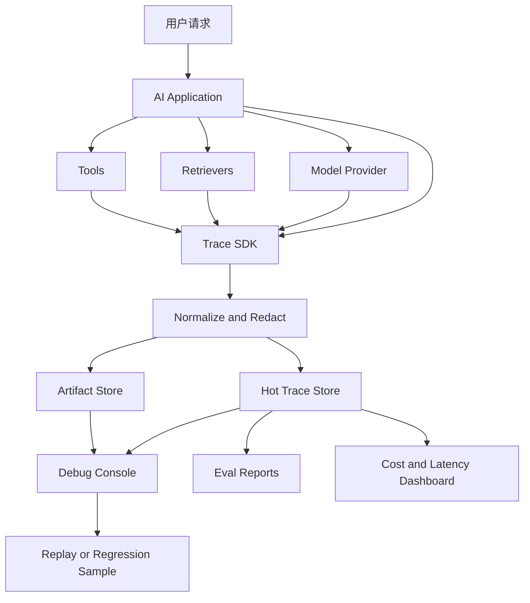

# Trace 设计入门

## 问题背景

AI 应用上线后，最难处理的反馈通常不是“服务挂了”，而是“这次回答为什么这样”。用户看到的是一句答案、一个引用、一次工具执行结果，工程师面对的却是一条很长的链路：前端组装了会话，后端做了权限过滤，检索器查了多个索引，重排器改变了候选顺序，提示词拼了上下文，模型生成了内容，后处理器解析了 JSON，工具层可能又写了外部系统。任何一个环节出现偏差，最终都会表现成一个看似简单的错误。

传统日志在这里不够用。日志擅长记录离散事件，比如请求开始、数据库耗时、接口报错。但 AI 应用需要回答的是跨阶段问题：模型看到的上下文到底是什么？为什么选择这个工具而不是另一个？检索候选里有没有正确文档？引用编号在哪里丢失？同一个用户问题为什么昨天和今天答案不同？如果只有分散日志，排查时就要在多个服务、多个时间戳、多个请求 ID 之间手工拼图，效率很低，也容易漏掉关键事实。

Trace 的价值是把一次 AI 交互还原成可阅读、可比较、可回放的时间线。它不是为了把所有 token 都存下来，也不是为了制造一个漂亮瀑布图，而是为了让团队能在事故发生后快速定位：输入是什么，系统做了哪些决策，哪些证据参与了生成，哪些工具被调用，成本和延迟花在哪里，最终输出和中间状态是否一致。

很多团队一开始只记录 prompt 和 answer，认为这就是 AI trace。这个粒度太粗。对于简单聊天，它可能勉强够用；对于 RAG 和 Agent，它远远不够。RAG 需要看到 query parse、候选召回、重排、上下文组装和引用映射。Agent 需要看到计划、工具选择、参数、工具结果、重试和终止原因。结构化输出需要看到 schema、解析错误、修复尝试和最终对象。没有这些阶段信息，就无法区分“模型没能力”和“系统没给对材料”。

Trace 设计还有一个容易被低估的约束：隐私和成本。AI 输入输出里经常包含用户数据、内部文档、访问令牌、业务配置和客户信息。把完整 prompt、完整上下文、完整工具返回都长期保存，排障会方便，但合规和安全风险很高，存储成本也会膨胀。好的 trace 不是“全量记录一切”，而是在可观测、可复现和最小化暴露之间取平衡。

所以 Trace 设计的入门问题不是选哪个可观测平台，而是定义事件模型。你要决定一次交互如何分段，每个阶段记录哪些输入输出摘要，哪些内容只存 hash 或引用，哪些内容需要脱敏，哪些指标必须可聚合，哪些字段用于关联评测样本和用户反馈。事件模型稳定，后面的 UI、查询、告警、回放和评测才能长出来。

## 核心概念

Trace 的基本单元可以分成 trace、span、event 和 artifact。trace 表示一次用户可感知的交互，比如一次问答、一次 Agent 任务、一次批量摘要。span 表示其中一个有开始和结束时间的阶段，比如检索、模型调用、工具调用、后处理。event 表示某个瞬时事实，比如解析失败、命中缓存、触发重试、用户取消。artifact 表示可引用的大对象，比如上下文片段、工具返回、生成结果、评测报告。

这几个概念不要混在一起。很多系统把所有东西都塞进 span attributes，短期省事，长期查询困难。比如检索候选列表可能很长，应该作为 artifact 或压缩后的 candidates 字段；模型调用的 token 计量适合放在 span attributes；一次安全策略拒绝适合作为 event；完整 prompt 如果需要保存，应该有独立 artifact_id，并且受权限控制。

Trace 还需要明确父子关系。一次 Agent 任务可能包含多个模型调用和多个工具调用；一次 RAG 请求可能并行调用向量检索、关键词检索和图检索；一次生成可能触发 JSON 修复重试。父子关系能让我们看到时间线，也能计算每个阶段的耗时占比。没有父子关系，trace 只是按时间排序的日志，无法表达系统结构。

| 概念 | 粒度 | 必备字段 | 典型用途 |
| --- | --- | --- | --- |
| trace | 一次用户任务 | trace_id、user_scope、entrypoint、status | 串联全链路 |
| span | 一个阶段 | span_id、parent_id、name、start、duration、status | 分析耗时和失败点 |
| event | 一个瞬时事实 | event_name、timestamp、severity、message | 记录重试、降级、拦截 |
| artifact | 大对象或敏感对象 | artifact_id、kind、hash、storage_ref、redaction | 保存 prompt、上下文、结果 |
| metric | 可聚合数值 | token、cost、latency、candidate_count | 看趋势和告警 |

另一个核心概念是 correlation。AI 应用里的一个用户动作经常跨越前端请求、后端服务、异步任务、模型供应商和工具服务。trace_id 必须从入口开始传递，不能每个服务自己生成一套。对于外部模型调用，至少要记录 provider_request_id；对于工具调用，要记录 tool_call_id；对于评测样本，要记录 eval_run_id 和 sample_id；对于用户反馈，要记录 feedback_id。关联字段越稳定，排障越少靠猜。

Trace 还要区分可观察性和可审计性。可观察性关注工程排障和性能分析，常常需要采样、聚合和趋势；可审计性关注关键决策的证据链，要求完整、不可篡改、可追溯。一个普通问答 trace 可以采样保存详细内容，但一个写入生产系统的 Agent 操作，必须完整记录工具参数、权限判断、确认动作和结果。两类需求可以共用事件模型，但保留策略和权限策略不同。

最后要理解“可回放”不是天然存在的。记录 trace 不等于能 replay。要回放一次 AI 交互，需要固定模型版本、prompt 版本、索引版本、工具响应、时间、权限、随机参数和后处理代码。很多 trace 只能支持近似复现，但这并不表示没有价值。设计时应该明确每个 trace 的 replay_level：none、partial、deterministic。这样排障人员知道能相信到什么程度。

## 架构/流程图解说明

一套实用的 AI Trace 架构通常包含四层：采集层、规范化层、存储层和消费层。采集层在应用代码里埋点，记录 span、event、artifact 引用和指标。规范化层负责脱敏、字段校验、采样、关联和版本补齐。存储层把热数据放在可查询存储，把大 artifact 放在对象存储或受控内容库。消费层包括调试控制台、评测报告、告警、成本分析和回放工具。



采集层要尽量贴近业务代码，而不是只在网关层抓请求。网关能看到请求和响应，看不到中间决策。AI 链路里的关键事实往往发生在业务代码内部：检索器返回了什么，候选为什么被过滤，工具参数怎么构造，模型输出为什么需要修复。Trace SDK 应该让工程师用很低成本创建 span 和 event，否则大家会回到随手打日志。

规范化层的价值是把“能记录”变成“能长期使用”。应用代码里很难保证每个团队都遵守字段规范，也很难在每个埋点处写完整脱敏逻辑。规范化层可以统一做 schema 校验、敏感字段识别、内容截断、hash 计算、采样决策和版本补齐。比如 prompt artifact 可以只在高风险请求和失败请求保存全文，普通请求只保存 hash、token 数和模板版本。

存储层不要只选一个数据库。trace 元数据需要按 trace_id、时间、用户、服务、状态、样本 ID 查询，适合放在文档库、列式库或可观测平台。artifact 可能很大，且权限敏感，适合放对象存储或内部内容库。指标要进入时序系统，方便做成本和延迟趋势。把所有内容塞进日志平台，早期简单，后期会遇到查询慢、费用高、权限粗的问题。

消费层决定 trace 是否被团队真正使用。一个好的 Debug Console 不应该只是显示 JSON，而是按 AI 链路组织信息：输入、解析、检索、上下文、模型、工具、后处理、输出、评测。每个阶段都显示状态、耗时、成本、关键字段和异常。排障人员可以从最终错误跳到对应阶段，也可以把某个 trace 保存成回归样本。Trace 和 Golden Dataset 之间应该是互通的：线上失败可以沉淀成样本，评测失败可以打开 trace 定位。

## 工程实现

实现 Trace 的第一步是定义统一 envelope。无论是检索、模型调用还是工具调用，都用同一个外壳承载关联字段、时间、状态、版本和安全级别。不同阶段的细节放在 payload 里。这样查询系统可以先按统一字段过滤，再按阶段解析 payload。

```json
{
  "trace_id": "tr_20260311_9f02",
  "span_id": "sp_rerank_01",
  "parent_span_id": "sp_request",
  "name": "rerank.candidates",
  "kind": "reranker",
  "status": "ok",
  "started_at": "2026-03-11T14:20:31.120+08:00",
  "duration_ms": 48,
  "service": "knowledge-assistant",
  "versions": {
    "prompt": "answer_v17",
    "index": "idx_20260311_0900",
    "reranker": "bge-reranker-v4"
  },
  "security": {
    "data_class": "internal",
    "redaction": "summary_only"
  },
  "metrics": {
    "candidate_count": 32,
    "kept_count": 8
  },
  "payload": {
    "top_candidates": [
      {"doc_id": "adr-trace-001", "chunk_id": "event-model", "score": 0.91},
      {"doc_id": "runbook-eval-002", "chunk_id": "trace-replay", "score": 0.84}
    ],
    "dropped_reasons": {
      "permission_denied": 3,
      "low_score": 21
    }
  }
}
```

这里的 payload 只保存摘要，不保存完整正文。完整候选片段可以作为 artifact，用 artifact_id 关联。这样普通排障能看到排序和原因，授权人员需要检查正文时再打开 artifact。这个设计比全量保存更稳，也比完全不保存更可用。

第二步是做上下文传播。在 Go 服务里可以把 trace writer 放进 context，让每个阶段追加 span。不要让业务函数依赖全局变量，也不要让 trace 失败影响主链路。Trace 写入应该异步或缓冲，写入失败最多产生本地告警，不能让用户请求失败。

```go
type TraceWriter interface {
    StartSpan(ctx context.Context, name string, attrs map[string]any) (context.Context, Span)
    AddEvent(ctx context.Context, name string, attrs map[string]any)
    PutArtifact(ctx context.Context, kind string, data []byte, policy ArtifactPolicy) (ArtifactRef, error)
}

type Span interface {
    SetMetric(name string, value float64)
    SetPayload(payload any)
    End(status string, err error)
}
```

接口要保持小。StartSpan、AddEvent、PutArtifact 基本够覆盖大多数场景。业务代码不应该知道后端存储是 OpenTelemetry、ClickHouse、对象存储还是自研服务。未来如果要换平台，只换 TraceWriter 实现。Span.End 接收 err，但写入时要把错误分类，而不是直接存一段错误字符串。比如 model_rate_limited、schema_parse_failed、tool_timeout、permission_denied，这些错误类别后续可以聚合。

第三步是定义阶段命名。命名不统一，trace 很快会失控。建议用领域前缀加动作：query.parse、retrieval.vector、retrieval.keyword、retrieval.merge、rerank.candidates、context.assemble、model.generate、tool.call、output.parse、safety.check。命名一旦进入看板和告警，就不要随意改。确实要改时，保留兼容映射。

第四步是处理敏感数据。不要指望每个工程师手动记得脱敏。Trace SDK 应该提供字段级策略，例如 secret、pii、internal_doc、public_summary、hash_only。对于模型输入，可以把 prompt 分成模板、变量和上下文三块。模板版本可以明文保存，变量按字段策略处理，上下文保存 doc_id、chunk_id、hash 和摘要。工具参数也要分类，写操作尤其要记录权限判断，但不能泄漏凭证。

```yaml
redaction_policy:
  user.email: hash_only
  user.name: pii
  auth.token: secret
  prompt.template: plain
  prompt.variables.customer_id: hash_only
  context.chunk_text: artifact_restricted
  tool.args.api_key: secret
```

第五步是把 trace 和评测打通。评测 runner 每次执行样本时写入 eval_run_id、sample_id、dataset_version 和 baseline_version。这样评测失败时，报告可以直接打开对应 trace。线上用户反馈也应该绑定 trace_id。如果用户在前端点“答案不对”，反馈对象里至少要有 trace_id、用户选择的失败类型、自由文本和当前答案版本。后续把反馈转成 Golden Dataset 时，trace 就是原始证据。

第六步是做采样策略。全量保存所有 artifact 很贵，也不安全。常见策略是元数据全量保存，敏感 artifact 按条件保存：失败请求保存、低置信请求保存、高风险操作保存、评测请求保存、普通成功请求采样保存。采样决策要写进 trace，否则排障时不知道为什么某个请求没有完整上下文。对于高风险工具调用，建议不采样，完整记录审计所需字段。

再看一个具体链路例子。用户问：“上周那个导出任务为什么慢，能不能帮我调大并发？”系统应该先检索事故复盘和运行手册，再读取当前任务配置，最后如果要修改并发，需要走确认流程。一次完整 trace 里，query.parse span 识别出两个意图：原因分析和配置变更；retrieval.merge span 返回事故复盘、运行手册和容量限制文档；tool.call span 先调用只读配置接口；safety.check span 判断“调大并发”属于写操作，需要用户确认；model.generate span 输出原因解释和待确认变更摘要。这样的 trace 能同时解释答案质量和操作安全。

如果系统直接调用写接口，把并发从 8 调到 32，最终回答可能只有一句“已调整”。没有 trace 时，事后只能从业务系统审计里找是谁改了配置，很难知道模型为什么认为可以改。好的 trace 会显示：是否检索到容量限制文档，是否看到运行手册里的最大并发，是否检查了用户权限，是否拿到了明确确认，工具参数是谁生成的，写入结果是什么。对于 Agent 系统，这些信息不是调试附属品，而是责任边界。

这个例子还说明 trace 不能只围绕模型。真正需要观测的是决策链：模型提出意图，策略层判断风险，工具层执行动作，后处理层把结果转成用户可读输出。每一层都要留下结构化事实。如果只记录模型输入输出，看不到策略层是否拦截；如果只记录工具调用，看不到模型为什么发起这个调用；如果只记录安全检查，看不到用户最初的问题和上下文。Trace 的时间线要把这些事实串起来。

第七步是给 trace 增加比较能力。单条 trace 能排查事故，两条 trace 的 diff 能解释回归。模型升级前后，同一个 Golden Dataset 样本可能都给出看似正确的答案，但新版多调用了一次工具，成本翻倍，或者新版把关键证据从第一引用挪到第三引用。Trace diff 可以按阶段比较：query parse 的实体是否变化，候选集合是否变化，top evidence 是否变化，prompt token 是否变化，工具参数是否变化，输出声明是否变化。很多质量退化只有在 diff 里才清楚。

```json
{
  "trace_diff": {
    "sample_id": "gd_export_latency_002",
    "baseline_trace": "tr_old",
    "candidate_trace": "tr_new",
    "changes": [
      {"stage": "retrieval.merge", "field": "top_doc", "from": "incident-export-0310", "to": "runbook-export"},
      {"stage": "model.generate", "field": "input_tokens", "from": 4200, "to": 7600},
      {"stage": "tool.call", "field": "call_count", "from": 1, "to": 3}
    ]
  }
}
```

有了 diff，评测报告就不只是说“通过”或“失败”。它能提示新版虽然通过，但成本风险上升；或者新版失败的直接原因是检索排序变化，而不是模型表达问题。对于需要频繁调模型和索引的团队，trace diff 往往比单次 trace 更有价值。

## 测试评测

Trace 系统的测试不能只测“有没有写入”。它要验证三个方面：字段完整、关联正确、排障可用。字段完整测试检查必备字段是否存在，比如 trace_id、span_id、name、status、duration、service、versions。关联正确测试检查父子 span 是否能组成树，并发阶段是否能正确归属。排障可用测试则用真实失败场景验证：工程师能否从 trace 看出错误发生在哪一段。

一个简单但有效的测试方法是构造固定 AI 请求，让它故意经历检索命中、重排丢弃、模型输出、JSON 修复四个阶段，然后断言 trace 树包含这些 span，并且每个 span 有关键 payload。这个测试不关心模型答案多漂亮，只关心观测链路是否完整。

```json
{
  "expected_spans": [
    "query.parse",
    "retrieval.vector",
    "retrieval.keyword",
    "retrieval.merge",
    "rerank.candidates",
    "context.assemble",
    "model.generate",
    "output.parse",
    "output.repair"
  ],
  "expected_events": [
    "candidate.filtered",
    "json.parse_failed",
    "repair.succeeded"
  ]
}
```

还要测试脱敏。给 SDK 输入包含邮箱、手机号、token、客户 ID、内部文档正文的请求，检查写入后的 trace 是否符合策略。脱敏测试要包含负例：字段名伪装、嵌套 JSON、工具返回里的 secret、模型输出复述的敏感信息。很多泄漏不是发生在输入，而是模型把上下文里的敏感内容带到了输出或错误日志里。

性能测试也重要。Trace 不能明显拖慢主链路。可以给每个阶段设定开销预算，比如同步埋点开销小于 5ms，异步队列满时降级丢弃非关键 artifact，写入失败不影响主请求。压测时要看高并发下 trace buffer 是否积压，是否造成内存增长，是否因为对象存储慢而阻塞请求。

| 测试类型 | 关注点 | 通过标准 |
| --- | --- | --- |
| schema 测试 | 字段和枚举 | 无未知必填缺失，payload 可解析 |
| 关联测试 | 父子 span 和 trace_id | 能构建完整树，无孤儿关键 span |
| 脱敏测试 | PII、secret、内部正文 | 敏感字段不明文落热存储 |
| 采样测试 | 保存策略 | 失败和高风险请求保留必要 artifact |
| 性能测试 | 延迟、内存、队列 | 埋点开销在预算内 |
| 回放测试 | 版本和 fixture | partial 或 deterministic replay 符合声明 |

Trace 的评测还可以借助 Golden Dataset。选一批代表性样本，要求每次运行不仅答案通过，trace 也通过。比如 RAG 样本必须有 retrieval 和 context span，Agent 样本必须有 tool.call span，结构化输出样本必须有 output.parse span。这样可以防止业务代码重构时把观测埋点弄丢。

Trace 还需要一组稳定的运营指标。不要只看平均延迟，因为 AI 链路里长尾很重要；不要只看总 token，因为 token 分布会掩盖某些 prompt 模板失控。更实用的看板会按入口、模型、用户角色、样本标签和阶段拆分，分别展示 p50、p95、错误率、重试率、上下文 token、输出 token、工具调用次数、artifact 保存比例和脱敏命中次数。这样当成本突然上涨时，可以判断是检索召回变多、上下文组装变长、模型重试变多，还是某个工具超时导致 Agent 反复规划。指标命名也要稳定，和 span name 对齐，否则 trace 能查到原因，看板却聚合不出来。

告警要谨慎。AI 应用的质量波动比传统接口更复杂，不能因为单次 judge 低分就半夜叫醒工程师。适合告警的是结构性问题：高风险工具调用缺失 safety.check，评测请求没有 trace，模型调用错误率持续升高，artifact 脱敏失败，某个入口 p95 延迟连续越过预算，或者高风险样本在发布前失败。普通质量下降可以进入日报和周报，让 owner 有节奏地处理。Trace 的目标是让问题可见，不是制造一堆无法行动的噪声。

指标看板还要保留基线。没有基线，团队只会看到今天的数字，却不知道它是否异常。每次发布、模型切换、索引重建都应该生成一条基线记录，后续 trace 聚合结果和它比较。这样问题出现时，大家讨论的是具体变化，而不是凭感觉争论系统是不是变慢、变贵、变不稳。

最后要做人工可用性评审。让一个没有参与开发的工程师拿到失败 trace，限定十分钟，看他能否回答：用户问了什么，系统看到哪些证据，哪个阶段最可能出错，下一步该找谁修。如果回答不了，说明 trace UI 或事件模型还有问题。可观测性不是写给机器看的，也要让人读得懂。

## 失败模式

第一种失败模式是只存最终 prompt。最终 prompt 确实重要，但它已经是多个阶段加工后的结果。看到 prompt 里没有关键证据，你还需要知道是检索没召回、重排丢了、预算截断了，还是上下文组装过滤了。只存 prompt 会把所有上游错误压缩成一个现象，定位效率很低。

第二种失败模式是 trace 过度详细。有人会把完整文档、完整工具返回、完整模型流式 token 全部保存。短期排障很爽，长期会被存储费用、查询性能和数据权限拖垮。更稳的方式是元数据全量、正文受控、失败优先、按风险保留。Trace 应该支持打开证据，而不是默认泄漏证据。

第三种失败模式是没有版本字段。AI 应用的行为受 prompt、模型、索引、工具、规则、代码版本共同影响。如果 trace 里没有这些版本，几天后同样问题就无法解释。特别是模型路由和索引快照，经常在后台变化，必须记录实际使用版本，而不是记录配置文件里“应该使用”的版本。

第四种失败模式是 span 命名随意。一个服务叫 llm_call，另一个叫 model.generate，第三个叫 openai_request，最后看板无法聚合，告警也写不出来。命名规范看起来是小事，但它决定 trace 能不能跨团队使用。早期就要定一份短命名表，并在 SDK 或 schema 校验里限制。

第五种失败模式是 trace 写入耦合主链路。可观测系统偶尔会慢、会满、会挂。如果应用请求必须等 trace 写入成功才能返回，观测系统就变成新的故障源。正确做法是关键审计事件有可靠队列，普通调试事件可丢弃或降级。对于真正不能丢的写操作审计，要走独立可靠通道，并明确失败策略。

第六种失败模式是缺少用户反馈入口。没有 feedback_id，trace 只能被工程师主动查；有了用户反馈，trace 才能和真实质量问题连接。前端反馈按钮不需要复杂，但必须把 trace_id 带回来。否则用户说“刚才那个答案不对”，后台很难知道是哪一次模型调用。

第七种失败模式是把 LLM judge 结果当 trace。评测结论只是消费 trace 的一个结果，不等于 trace 本身。judge 说“事实不一致”，工程师还需要看到证据、上下文和输出才能修。Trace 记录事实，评测解释事实，两者要连接但不能互相替代。

## 上线 checklist

Trace 上线前，我会逐项检查下面这些内容：

1. 入口请求生成 trace_id，并能贯穿前端、后端、异步任务、模型调用和工具调用。
2. 核心阶段都有 span：query.parse、retrieval、rerank、context.assemble、model.generate、tool.call、output.parse。
3. span envelope 字段稳定：trace_id、span_id、parent_span_id、name、status、duration、service、versions。
4. 大对象通过 artifact 管理，正文、prompt、工具返回有 hash、引用和权限策略。
5. 脱敏策略经过测试，PII、secret、客户数据、内部正文不会无控制进入热存储。
6. 模型版本、prompt 版本、索引版本、工具版本、代码版本能在 trace 中看到实际值。
7. 失败请求、高风险工具调用、评测请求的采样策略明确，普通成功请求有预算控制。
8. Trace 写入失败不会拖垮主链路，关键审计事件有可靠队列或补偿机制。
9. Debug Console 能按阶段展示输入、输出摘要、耗时、成本、错误和关联 artifact。
10. 用户反馈能携带 trace_id，评测报告能跳转到 trace。
11. 回放能力有明确等级，deterministic、partial、none 不混用。
12. 保留周期和访问权限经过安全评审，高风险 artifact 有审计日志。

这份 checklist 的重点是先把可用的骨架搭起来。早期系统可以不做复杂 UI，但不能没有 trace_id、阶段 span、版本字段和脱敏策略。没有这些基础，再高级的可观测平台也只能显示一些漂亮但不够解释问题的图。

## 总结

Trace 设计的核心，是把一次 AI 交互从黑箱输出变成可追溯的工程过程。模型、检索、工具和后处理不是孤立日志，而应该串成一条带父子关系、版本信息、成本指标和安全策略的时间线。这样团队才能在答案错误、引用缺失、工具误用、成本上涨时快速定位，而不是靠猜测调 prompt。

好的 trace 不追求无脑全量，也不满足于最终 prompt。它会记录足够的结构化事实，给敏感内容加权限和保留策略，把线上反馈、离线评测和回归样本连接起来。它既服务排障，也服务成本治理、质量评测和审计。

AI 应用越接近生产，trace 越不是锦上添花。没有 trace，系统出错时只能看最终答案；有了 trace，团队能看到每个阶段的选择和代价。把这条时间线设计好，后续的 Golden Dataset、失败分析、模型升级和上线门禁才有可靠依据。
