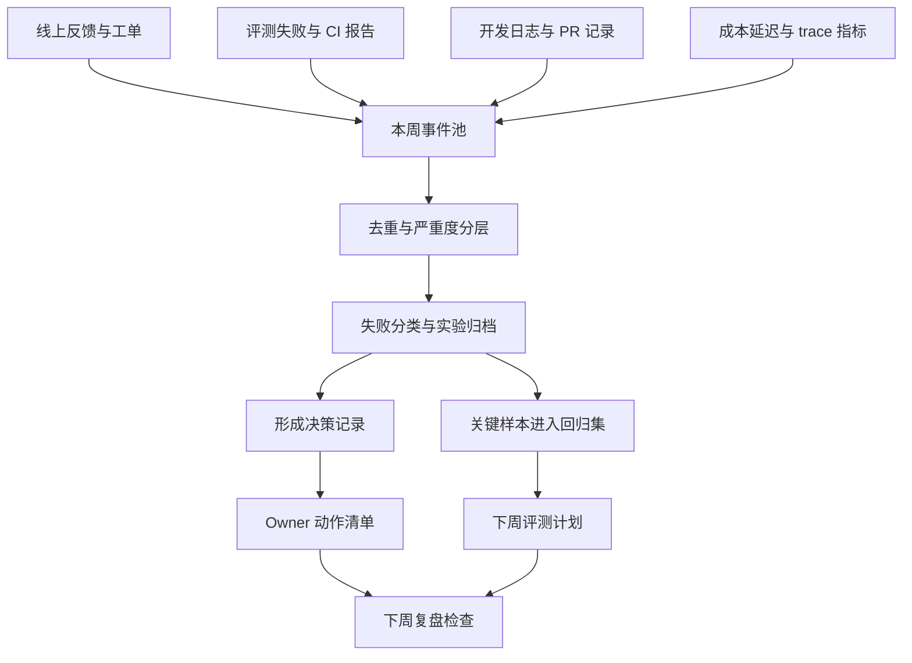

# 每周 AI 技术复盘怎么写

## 问题背景

AI 工程团队最容易低估的一件事，是把每周发生的试验、失败和判断记录下来。很多人愿意写 prompt，愿意调模型，愿意在半夜追一个偶发错误，却不愿意写一份像样的周复盘。原因也简单：复盘看起来不像生产代码，不能直接提升接口吞吐，也不会立刻让模型更聪明。但在真实项目里，缺少复盘会让团队反复踩同一个坑，今天因为检索召回不足修 prompt，明天因为工具权限太宽改策略，后天因为模型升级导致格式漂移，再过一周没人记得当时为什么选这个参数。

每周 AI 技术复盘不是周报。周报常常写“本周完成了什么”，复盘要回答“系统学到了什么”。它关心的不是忙碌程度，而是可复用的工程知识：哪类问题被证明适合交给 Agent，哪类任务必须保留人工确认，哪些指标能提前暴露质量退化，哪些样本应该进入回归集，哪些提示词、检索策略、工具边界只是一次性补丁。写清楚这些内容，团队才不会把经验留在某个人的聊天记录、终端历史和脑子里。

AI 应用的一个麻烦点是变化太多。模型版本会变，供应商策略会变，向量索引会变，知识库会变，用户问法会变，业务边界也会变。传统软件里，一次代码变更通常能被测试、类型系统、日志和监控框住；AI 系统里，很多变化是概率性的、语义性的、链路性的。一个模型升级可能让答案更流畅，但引用变少；一个 chunk 策略优化可能提升召回，但让上下文更长；一个工具 schema 收紧可能减少误调用，却让某些复杂任务失败。没有周复盘，这些变化只会变成零散体感。

我更愿意把周复盘看成小型的工程账本。它记录输入、动作、证据、结果和下一步。输入来自线上反馈、评测失败、开发过程、成本报表和用户访谈；动作包括 prompt 改动、检索参数调整、模型路由、工具权限收紧、缓存策略变化；证据包括 trace、指标、样本、截图、日志和人工评审；结果要写清楚有效、无效、待观察，不能只写“优化了”；下一步要落到 owner、验收标准和时间窗口。这样复盘才不是叙事，而是工程资产。

每周这个节奏也很重要。按天写，成本太高，容易沉迷细节；按月写，记忆已经模糊，很多失败现场丢失。周粒度刚好能覆盖一个完整的小循环：发现问题、做实验、跑评测、上线观察、沉淀样本。对于一个两三人的 AI 工具项目，周复盘可以是一篇 Markdown；对于一个有多个业务线的团队，可以拆成模块复盘再汇总；对于开源项目，还可以把部分内容整理成公开笔记，让社区知道项目如何取舍。

这篇文章讨论的不是写作技巧，而是工程化写法。目标是让复盘能服务后续决策：下周要不要升级模型，某个失败能不能进入 Golden Dataset，某个 Agent 是否可以扩大权限，某个功能是否值得继续投入，某个成本异常是不是质量问题的影子。写得好的周复盘，三个月后仍然能回答“当时为什么这么做”。写得差的复盘，三天后只剩一堆漂亮形容词。

## 核心概念

第一个概念是 `experiment ledger`，实验账本。AI 项目里的很多改动不应该被描述成“优化”，而应该被描述成一次实验。实验必须有假设、改动、样本、指标和结论。比如“把 topK 从 8 调到 12”不是结论，它只是改动；真正的实验记录应该写：“假设复杂问题缺少跨段证据，增加 topK 能提升多跳问题引用覆盖；在 80 条多跳样本上，证据覆盖率从 71% 到 79%，平均上下文 token 增加 18%，延迟 p95 增加 240ms；结论是对专家模式开启，对普通问答保持原值。”这种写法能让下周的人知道为什么不是全局打开。

第二个概念是 `failure taxonomy`，失败分类。AI 失败不能只写“回答不好”。回答不好可能来自知识缺失、召回失败、排序失败、上下文组装错误、模型推理错误、工具调用错误、权限判断错误、格式解析错误、交互设计错误，也可能来自用户问题本身不完整。复盘里必须把失败分到可行动的类别，否则团队只会继续调 prompt。失败分类不是为了统计好看，而是为了把修复责任分配到正确位置。

第三个概念是 `signal over story`。复盘可以有叙事，但结论要有信号。信号可以是定量指标，也可以是结构化证据。定量指标包括通过率、拒答准确率、引用覆盖率、工具成功率、成本、延迟、人工接管率；结构化证据包括典型 trace、失败样本 ID、变更 diff、用户反馈原文、标注结论。没有信号的复盘容易变成“感觉这周模型好多了”。工程团队不能靠感觉管理系统。

第四个概念是 `decision log`。一周里通常会做很多选择：是否接受一个模型升级，是否扩大 Agent 写权限，是否把某类样本列入阻断，是否继续维护一个旧 prompt，是否把某个复杂工作流产品化。复盘要把这些选择写成决策，而不是埋在段落里。每个决策至少包含背景、选项、取舍、风险和回看日期。尤其是 AI 系统，今天合理的决策很可能因为模型能力变化而过期，所以回看日期比传统项目更重要。

第五个概念是 `next action contract`。复盘最后不能只写“下周继续优化”。可执行动作应该有对象、动作、验收方式和截止时间。例如“为权限越界类失败补 30 条样本，进入 `agent_permission_regression`，要求现有策略通过率达到 100% 后再开放批量写入工具”。这就是契约。契约不一定复杂，但它必须能在下周复盘时被检查。

| 复盘元素 | 要回答的问题 | 好记录 | 坏记录 |
| --- | --- | --- | --- |
| 尝试 | 本周具体改了什么 | 调整重排阈值、收紧工具 schema、增加引用校验 | 做了一些优化 |
| 假设 | 为什么认为它有用 | 失败集中在长文档跨段引用，怀疑召回广度不足 | 模型需要更多上下文 |
| 样本 | 用什么验证 | 80 条真实失败样本加 20 条边界样本 | 手动问了几个问题 |
| 指标 | 如何判断变化 | 证据覆盖率、格式通过率、p95 延迟、成本 | 答案看起来更自然 |
| 结论 | 是否继续推进 | 专家模式启用，普通模式保守观察 | 效果不错 |
| 动作 | 下周谁做什么 | Owner、PR、数据集、阈值、截止日期 | 持续跟进 |

这张表背后的原则是：复盘要让未来的人能复现实验，而不是只能相信作者。当系统出现回退时，团队应该能从复盘中找到最近一次相关改动、当时的证据、没有覆盖的风险和负责的人。这样复盘就从“写给老板看”变成“写给工程系统看”。

## 架构/流程图解说明

一份有用的周复盘可以被看成一条数据管线。它从一周内的各种原始事件开始，经过筛选、归类、评测、决策和动作分发，最后进入知识库、评测集和下周计划。这个流程不需要复杂平台，关键是每一步都有清楚的输入输出。



这条流程里有三个容易被忽略的关口。第一个关口是事件池。很多团队只记录成功上线的事情，不记录失败的尝试。AI 工程里，失败尝试非常值钱，因为它告诉你哪些方向已经被证据否定。比如“给模型更多系统提示并没有减少工具误调用，真正原因是工具描述里缺少副作用边界”，这类信息如果不写下来，下周很可能有人再试一次。

第二个关口是失败分类。分类时不要把问题按“前端、后端、模型”粗暴分开，而要按链路责任分开。一个前端显示的错误可能来自结构化输出缺字段，一个模型答案的问题可能来自检索没有召回，一个工具调用失败可能来自权限模型没有表达租户范围。复盘分类要能指导修复路径，而不是指导组织架构。

第三个关口是样本入库。不是所有失败都应该进入回归集。高频、关键路径、曾经造成事故、容易复发、代表一类边界的样本应该入库；一次性数据脏、需求已经废弃、用户输入无法澄清的样本可以只记录。否则评测集会越来越臃肿，最后跑一次成本高，失败却不可解释。

一次实际周复盘的会议或异步流程可以这样走：

```text
周五上午：自动收集一周内的 trace 摘要、评测报告、成本报表、用户反馈。
周五中午：工程 owner 对事件做初步去重，挑出高风险和高学习价值条目。
周五下午：围绕失败分类、实验结论和下周动作写复盘草稿。
周一上午：团队异步评论，补充遗漏证据，确认 owner 和验收标准。
周一下午：把样本、决策和任务分别落到评测仓库、ADR 或 issue。
下周五：检查上周动作是否完成，未完成的要说明阻塞和是否继续保留。
```

我不建议把周复盘做成大型会议。AI 项目里很多证据都在日志、评测结果和代码 diff 里，现场口头讨论容易失真。更好的方式是先写草稿，把证据链接和样本 ID 放进去，再开短会处理争议。复盘不是头脑风暴，它是把已经发生的事实整理成下一轮工程动作。

从信息架构上看，复盘文档最好分成四层：本周摘要、证据详情、决策记录、下周动作。摘要给所有人看，证据给工程师定位，决策给未来回看，动作给项目推进。不要把所有内容混成流水账。流水账的阅读成本很低，但检索和复用价值也很低。

## 工程实现

工程实现的第一步，是定义复盘数据结构。哪怕最终写成 Markdown，脑子里也要有结构。下面是一个适合 AI 应用团队的 Go 结构示例，它可以对应到 YAML、JSON 或数据库表。重点不是字段多少，而是每个字段都能服务后续查询和回归。

```go
type WeeklyAIRetrospective struct {
    WeekID      string
    StartDate   string
    EndDate     string
    Owners      []string
    Summary     string
    Experiments []ExperimentRecord
    Failures    []FailureRecord
    Decisions   []DecisionRecord
    Metrics     MetricSnapshot
    Actions     []NextAction
}

type ExperimentRecord struct {
    ID          string
    Hypothesis  string
    Change      string
    SampleSet   string
    Metrics     map[string]float64
    Result      string // adopted, rejected, partial, observing
    EvidenceRef []string
}

type FailureRecord struct {
    ID          string
    Category    string
    Severity    string
    UserImpact  string
    TraceID     string
    RootCause   string
    FixPath     string
    AddToEvals  bool
}

type DecisionRecord struct {
    ID          string
    Context     string
    Options     []string
    Decision    string
    Tradeoff    string
    ReviewAfter string
}

type NextAction struct {
    Owner       string
    Task        string
    DoneWhen    string
    DueDate     string
    Links       []string
}
```

这个结构里有几个故意保留的设计。`ExperimentRecord.Result` 不只有成功和失败，而是包含 `partial` 和 `observing`。AI 实验经常出现局部收益：某个改动对长问题有益，对短问题有害；某个模型在中文摘要上更好，在结构化输出上更差。复盘必须能表达局部结论。`FailureRecord.AddToEvals` 用来提醒团队把真实失败沉淀到评测集。`DecisionRecord.ReviewAfter` 则避免临时决策永久化。

如果团队先用 Markdown，模板可以写得很轻，但字段要稳定。一个实用模板如下：

```markdown
---
week: 2026-W07
owners:
  - platform
  - eval
system_version: app@1.18.3
model_routes:
  default: model-a
  expert: model-b
---

# 2026-W07 AI 技术复盘

## 本周摘要
- 一句话说明本周系统最大的变化。
- 一句话说明最大的风险或失败。
- 一句话说明下周最重要动作。

## 指标快照
| 指标 | 上周 | 本周 | 变化 | 解释 |
| --- | --- | --- | --- | --- |

## 实验记录
### EXP-001
- 假设：
- 改动：
- 样本：
- 结果：
- 结论：

## 失败记录
### FAIL-001
- 分类：
- 影响：
- trace：
- 根因：
- 是否进入评测：

## 决策记录
### DEC-001
- 背景：
- 选项：
- 决策：
- 取舍：
- 回看日期：

## 下周动作
| Owner | 动作 | 验收标准 | 截止 |
| --- | --- | --- | --- |
```

注意，模板只是骨架，不是正文生成器。真正有价值的是每周手工填进去的判断和证据。不要把复盘自动生成成一堆指标图，然后以为工作完成了。自动化适合采集事实，不适合替你做工程判断。可以让系统自动拉取成本、延迟、评测通过率、失败样本列表，但“为什么变了”“是否接受这个取舍”“下周优先修什么”必须由工程 owner 写清楚。

指标快照建议固定几类，不要每周随意换，否则无法看趋势。对于 RAG 或 Agent 系统，我通常会记录这些指标：

| 指标组 | 指标 | 解释 | 复盘时要问 |
| --- | --- | --- | --- |
| 质量 | golden pass rate | 阻断评测通过率 | 失败是否集中在某个场景 |
| 证据 | citation coverage | 答案引用覆盖 | 是否出现无证据回答 |
| 工具 | tool success rate | 工具调用成功率 | schema、权限、重试是否合理 |
| 安全 | refusal precision | 拒答准确率 | 是否过度拒答或漏拒 |
| 成本 | cost per successful task | 成功任务平均成本 | 成本上涨是否换来质量收益 |
| 延迟 | p50/p95 end-to-end latency | 端到端延迟 | 慢在模型、检索还是工具 |
| 运营 | human takeover rate | 人工接管率 | 接管原因是否可产品化 |

一个具体流程例子：假设本周团队做了“把文档问答从单路向量检索改成混合检索”的实验。复盘不能只写“混合检索效果更好”。应该写成下面这样：

```text
EXP-2026W07-002
假设：用户问题中大量包含接口名和错误码，纯向量检索会稀释精确 token，混合检索能提升这类问题召回。
改动：向量 topK=10，BM25 topK=20，RRF 合并后取 12 个片段；接口名命中额外加 0.08 排序分。
样本：42 条错误码问题、38 条概念解释问题、20 条跨文档排障问题。
结果：错误码问题证据命中从 64% 到 86%，概念解释无明显变化，跨文档排障从 70% 到 73%；p95 延迟增加 120ms。
失败：两个样本召回了旧版本 API 文档，原因是 metadata 里的 version 权重不足。
结论：对带错误码和接口名的问题启用混合检索；下周补 version-aware rerank，不全局推广。
```

这个例子能留下很多后续可用信息。它说明了适用场景、参数、样本构成、收益、成本、失败和下一步。三个月后如果有人想继续调检索，不需要从零开始问“当时为什么这么做”。同样，如果模型升级后错误码问题退化，也能快速找到相关实验和样本。

复盘文档还应该和仓库工作流连接。最简单的做法是在每个实验、失败和决策后面放链接：PR、commit、eval run、trace、dashboard、issue。更进一步，可以约定 ID 命名，例如 `EXP-2026W07-001`、`FAIL-2026W07-003`、`DEC-2026W07-002`，并在 PR 描述里引用这些 ID。这样复盘就能反向索引代码变更，代码也能反向索引复盘判断。

## 测试评测

周复盘本身也需要评测。不是说用模型给复盘打分，而是检查这份复盘是否能支撑工程行动。我建议从四个层面评测：完整性、可追溯性、可行动性和预测性。

完整性检查很直接：是否覆盖本周关键变更、关键失败、关键指标和下周动作；是否包含至少一个被否定的尝试；是否记录高风险问题；是否说明成本和延迟变化。很多复盘只写成功项，读起来很积极，但对工程没帮助。真正的系统学习来自成功和失败的对照。

可追溯性检查关注证据链。每个重要结论是否能找到样本、trace、评测 run、PR 或 dashboard。比如复盘写“新模型在结构化输出上更稳定”，那必须能看到结构化输出评测的通过率、样本规模和失败例子。没有证据链接的结论可以保留为观察，但不能作为上线决策依据。

可行动性检查关注下周动作是否能验收。动作如果写“优化检索体验”，就是不可验收；写“为版本混淆失败补 25 条样本，并把 rerank 加入 version_weight，要求旧版本误召回率低于 2%”，就可验收。AI 项目的动作尤其要避免“继续观察”这种软目标。可以观察，但要说观察什么指标，观察多久，触发什么动作。

预测性检查更有意思。每周复盘应该提出一些风险预测，例如“混合检索引入更多旧文档，可能导致版本引用错误”“工具重试增加会抬高成本”“模型升级后拒答边界可能变宽”。下周再看这些预测是否发生。预测不一定都对，但它能训练团队对系统行为的因果敏感度。

| 评测维度 | 通过标准 | 失败信号 | 修复方式 |
| --- | --- | --- | --- |
| 完整性 | 关键变更、失败、指标、动作都有记录 | 只有完成事项，没有失败和指标 | 补事件池和指标快照 |
| 可追溯性 | 结论能链接到证据 | 大量“感觉”“应该”“明显” | 补 trace、样本 ID、PR 链接 |
| 可行动性 | 下周动作有 owner 和验收标准 | 动作都是“持续优化” | 改成具体任务和阻断条件 |
| 预测性 | 记录风险和回看日期 | 没有残余风险 | 补上线后观察窗口 |

如果团队已经有评测平台，可以把复盘和评测 run 关联。每次评测报告不只显示总分，还要生成“本周新增失败”“历史失败重现”“已修复样本”“新增高成本样本”。复盘引用这些分组，比引用一个总分更有用。总分适合看趋势，分组适合修问题。

还可以做一个很朴素的复盘审阅清单。每周由另一个工程师读一遍，回答五个问题：

- 我能否根据文档复现实验的大致设置？
- 我能否看出哪个结论已经被证据支持，哪个还只是观察？
- 我能否知道下周最重要的三个动作是什么？
- 我能否找到每个高风险失败的 owner？
- 如果两个月后系统回退，我能否用这份复盘定位相关改动？

这五个问题比“写得好不好”更客观。复盘不是文学作品，它要能被使用。一个文风普通但证据完整的复盘，远好过一篇漂亮但不可追溯的总结。

## 失败模式

第一类失败模式是流水账。文档从周一写到周五，每天列一堆做过的事情，看似详尽，实际没有判断。流水账最大的问题是缺少归纳：哪些尝试代表同一个问题，哪些失败暴露同一个根因，哪些动作应该合并，哪些结论可以沉淀成模式。解决办法是在流水记录之后强制写“本周系统性发现”，最多三到五条，每条都要能连接到证据。

第二类失败模式是成功偏差。团队只写上线了什么、通过了什么、提升了什么，不写被否定的实验和仍然存在的风险。这会让复盘失去学习价值。AI 工程里，被否定的方向非常重要。比如“增加上下文长度没有提升答案正确率，反而增加模型忽略关键引用的概率”，这条记录能节省很多后续成本。复盘应该固定一个小节叫“无效尝试”，并允许它存在。

第三类失败模式是指标孤岛。复盘里有很多图表，但没有解释。通过率下降了三个百分点，是样本变难、系统退化、标注变严，还是流量结构变化？成本上涨了二十个百分点，是模型变贵、重试增多、上下文变长，还是工具失败导致重复调用？指标只告诉你现象，不自动告诉你原因。复盘必须把指标变化和具体事件连接起来。

第四类失败模式是 prompt 中心主义。所有失败最后都归结为“提示词需要优化”。这在早期很常见，因为 prompt 最容易改，也最容易产生短期效果。但生产 AI 系统的问题往往在数据、检索、权限、工具、评测、交互和运营。复盘应该要求每个失败先归类到链路，再决定是否改 prompt。否则 prompt 会越来越长，系统行为越来越难预测。

第五类失败模式是没有残余风险。任何一周的工程改动都不可能把风险清零。复盘如果没有写残余风险，通常说明团队没有认真想上线后的观察。比如启用新模型后，可能残留小语种质量风险；开放写入工具后，可能残留批量误操作风险；加缓存后，可能残留权限变更后旧答案泄露风险。把风险写出来不是示弱，而是给监控和回滚提供边界。

第六类失败模式是动作没有关闭。上周写了五个行动项，本周复盘没有检查，新的行动项又加上来。几周之后，复盘变成愿望清单。解决办法是每篇复盘开头先检查上周动作：完成、延期、取消、变更范围。取消也是有效结论，但要说明原因。持续延期的动作要么拆小，要么降级，要么承认它不是当前优先级。

第七类失败模式是复盘和代码脱节。文档里写了一堆经验，但 PR、测试和监控没有任何变化。这种复盘会慢慢变成知识库垃圾。每个重要发现都应该至少落到一个地方：测试样本、代码改动、监控指标、产品规则、用户文档或 issue。不能落地的发现可以记录，但不能反复占据复盘主线。

| 失败模式 | 表面现象 | 深层原因 | 纠偏动作 |
| --- | --- | --- | --- |
| 流水账 | 内容很多但没有结论 | 没有抽象和分类 | 增加系统性发现小节 |
| 成功偏差 | 只写好消息 | 害怕暴露不确定性 | 固定记录无效尝试 |
| 指标孤岛 | 图表很多但不解释 | 指标和事件未关联 | 为每个异常写原因假设 |
| prompt 中心主义 | 所有修复都改提示词 | 链路责任不清 | 先做失败分类 |
| 无残余风险 | 上线描述过于确定 | 没有观察窗口 | 写风险、指标和回滚条件 |
| 动作不关闭 | 行动项越积越多 | 没有复盘上周承诺 | 开头检查旧动作 |

这些失败模式不需要一次全部解决。团队可以先从两条硬规则开始：所有结论必须有证据，所有动作必须可验收。只要守住这两条，复盘质量就会明显提升。

## 上线 checklist

当周复盘不只是内部笔记，而要成为团队固定流程时，可以按下面的 checklist 上线。这里的“上线”指把复盘纳入工程节奏，而不是发布一个功能。

- 文档位置固定：复盘放在仓库、知识库或项目管理系统的稳定目录，命名包含年份和周数，便于检索和链接。
- 字段结构固定：至少包含本周摘要、指标快照、实验记录、失败记录、决策记录、下周动作、残余风险。
- 数据来源固定：评测报告、trace、成本报表、PR 列表、用户反馈、事故记录都有明确入口，不靠人工回忆。
- 失败分类固定：团队维护一份失败 taxonomy，分类不宜太多，但必须能指导修复责任。
- 指标口径固定：通过率、成本、延迟、人工接管率等指标的计算方式稳定，口径变化要在复盘里说明。
- 样本入库规则固定：哪些失败必须进入回归集，哪些只记录，哪些需要人工复核，要有明确标准。
- 决策记录固定：重要取舍必须写背景、选项、决策、风险和回看日期。
- 行动项固定验收：每个行动项有 owner、验收标准、截止时间；下周复盘第一件事是检查它。
- 证据链接固定：重要结论必须链接到 PR、eval run、trace、dashboard、issue 或用户反馈。
- 公开边界固定：如果复盘对外发布，要清理敏感数据、客户信息、内部密钥、未公开模型策略和安全细节。
- 回滚条件固定：涉及生产行为的决策，要写清楚观察窗口、触发回滚的指标和负责人。
- 维护责任固定：至少有一个工程 owner 负责最终合稿，不能让复盘变成无人拥有的协作文档。

上线前可以做一次试运行。选最近一周，不追求完美，把所有原始材料拉出来，按模板写一版。写完后让一个没有参与本周工作的工程师阅读，看他能不能复述本周关键变化、最大风险和下周动作。如果不能，说明复盘还在自言自语；如果可以，说明结构基本成立。

上线后前四周不要急着加工具。很多团队会马上想做自动化 dashboard、自动摘要、机器人提醒。工具有用，但太早做会固化错误流程。先用手工复盘跑四周，观察哪些字段每次都需要、哪些字段没人看、哪些指标解释不了、哪些动作总是延期。等流程稳定后，再自动化采集和提醒。AI 工具可以帮助整理材料，但不要替代 owner 的判断。

还有一个容易忽略的上线条件：复盘必须允许写“不知道”。例如“本周成本上涨原因未完全确认，已排除模型单价变化和流量增长，怀疑工具重试增加，下周通过 trace 增加 retry_reason 验证”。这比强行给出一个不可靠结论更诚实。工程复盘的目标不是显得全知，而是把不确定性变成下一步可验证的问题。

## 总结

每周 AI 技术复盘的价值，不在于多写一篇文档，而在于建立团队的学习回路。AI 系统的变化太快，失败太隐蔽，单靠代码和测试很难保留全部上下文。复盘把一周里的实验、失败、指标、决策和动作连接起来，让经验可以被检索、被质疑、被复用，也能让未来的工程师理解今天的取舍。

写好复盘有几个朴素原则。第一，少写形容词，多写证据。第二，把改动写成实验，把失败写成分类，把结论写成决策，把下周计划写成契约。第三，记录无效尝试和残余风险，不要只保留成功叙事。第四，让复盘和评测集、PR、trace、监控、issue 发生连接，否则它很快会变成孤立文档。

如果只能从一个动作开始，我建议先固定一份 Markdown 模板，并坚持四周。每周只问五件事：本周最重要的系统变化是什么，哪些实验被证据支持，哪些失败值得沉淀，哪些决策需要未来回看，下周哪些动作可以被验收。把这五件事写清楚，团队就已经比大多数只靠聊天记录推进 AI 项目的团队稳得多。

长期看，周复盘会变成项目的技术记忆。模型升级为什么接受，检索策略为什么分场景，工具权限为什么收紧，某个指标为什么被纳入阻断，某类失败为什么暂时不修，这些问题都能在复盘里找到答案。这样的记忆不是额外负担，它是 AI 工程从试试看走向可运营的基础设施。
